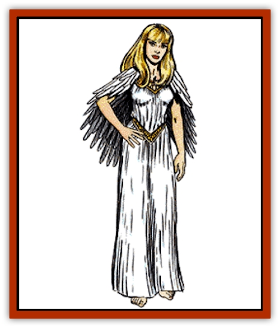

# Swanmay

| Statistic | **Bird Maiden** | **Swan** | **Swanmay** |
| --- | --- | --- | --- |
| **Activity Cycle:** | Day | Day | Any |
| **Alignment:** | Any | Neutral | As ranger |
| **Armor Class:** | 7 | 7 | 7 |
| **Climate/Terrain:** | Tropical mountains | Temperate wetlands | Temperate wetlands |
| **Damage/Attack:** | 1/1-3 or by weapon | 1/1/1-2 | As swan or by weapon |
| **Diet:** | Omnivore | Omnivore | Omnivore |
| **Frequency:** | Very rare | Uncommon | Very rare |
| **Hit Dice:** | 2 to 8 | 1+2 | 2 to 12 |
| **Intelligence:** | Average to Genius (8-18) | Animal (1) | Highly to Genius (13-18) |
| **Magic Resistance:** | 5% per HD | Nil | 2% per HD |
| **Morale:** | Elite (13) | Unsteady (6) | Champion (15) |
| **Movement:** | 12, or 3, Fl 36 (C) | 3, Fl 18 (D) | 3 or 15, Fl 19 (D) |
| **No. Appearing:** | 1 | 1 or 2-16 | 1 or 2-5 |
| **No. of Attacks:** | 2 or as kahina | 3 | As swan or ranger |
| **Organization:** | Solitary | Flock | Flock |
| **Size:** | M | M | M |
| **Special Attacks:** | Spells | See below | See below |
| **Special Defenses:** | +2 or better weapon to hit | See below | +1 or better weapon to hit |
| **THAC0:** | As kahina | 19 | As ranger |
| **Treasure:** | See below | Nil | See below |
| **XP Value:** | 420 to 3,000 | 65 | 120 to 3,000 |

Swanmays are human females who can assume swan form. In human form, swanmays are indistinguishable from other people. They normally wear light armor and carry rangers' gear, as well as a sword, dagger, bow, and arrows. These items are unaffected by a swanmay's shapeshifting, so they must be hidden. Swanmays may be recognized by a feather token, feathered garment, or signet ring. Such items are transformed into part of the swans' plumage or worn on a leg.

**Combat:** In human form, the swanmay functions as a ranger. To determine the level and Hit Dice of a swanmay, 2d6 are rolled. She attacks with whatever weapons she possesses.

In swan form, a swanmay is harmed only by +1 or better weapons. She attacks with buffeting wings, a flying leap, and a bite.

**Habitat/Society:** Swanmays are members of a special sorority of [[Lycanthrope_General_Information|lycanthrope]] rangers. Unlike other lycanthropes, their shapeshifting ability is gained voluntarily from a special token: a feather token, a feather garment, or a signet ring. Such items reveal their magical auras when exposed to a *detect magic* spell. Without the item, she is forced to remain in her current form. Tokens only function for swanmays.

Swanmays are extremely secretive about their sorority. Only human women are admitted; the other requirements are unknown. It is suspected that women are invited to join when they unknowingly perform a great service for another swanmay. If a PC is invited to join, it is 50% likely that she will retire from casual adventuring to devote herself full time to her new responsibilities.

Swanmays are guided by their swan personalities. They dislike noisy, brash creatures, ferocious beasts, and anything of an evil alignment. They are friendly with forest folk, such as sylvan [[Elf|elves]] and [[Dryad|dryads]]. They tend to avoid normal humanoids. Only nature priests are known to regularly associate with swanmays; such alliances are generally initiated by swanmays when they need help against a common evil.

Swanmays build communal lodgings near bodies of water, deep in the forest. Such lodgings are lightly fortified against land attack. They usually contain two means of escape - a secret tunnel to the lake and a ceiling hatch. Swanmays in swan form can use either route. Swanmay lodgings may be recognized by the number of waterfowl living nearby. The remains of poachers may also be left here as a warning to others.

**Ecology:** Swanmays are independent protectors of the forests and wildlife. They actively oppose evil races or monsters that might otherwise decimate wildlife and the countryside. They protect swans more out of sympathy for their similarity than out of any kinship.

**Swan**

These aquatic [[Bird|birds]] tend to inhabit areas frequented by similar waterfowl. Such areas include rivers, ponds, lakes, and marshes.

There is a 10% chance that any swan encounter includes one or more swanmays in avian form. Twenty-five percent of swan encounters are with a solitary swan; if it is a normal swan, it is always male (a "cob"). Otherwise, such encounters are mated pairs of cobs and pens (females) with their cygnet offspring. There are 1-2 cygnets or 1-3 eggs per mated pair. If the swans' territory is invaded, both adults forcefully attack the intruder by a flying leap, bite, and blows from both wings. Such an attack is 50% likely to blind or confuse an opponent; in this case, the for is unable to make any attack the following melee round.

Swans possess acute senses. They are 90% likely to detect intruders. When detection occurs, all swans join in a loud warning chorus. If there are no eggs, the swans swim or fly away.

**Bird Maidens**

In the mountains and cool valleys of the lands of Zakhara lives a race of bird maidens, related to the swanmays. Just like their sisters, they depend on a token to change forms: a colorful shawl or veil of feathers. They can assume many bird shapes, including [[Hawk|falcons]], swallows, parrots, and even (at 8th level) [[Eagle|giant eagles]].

Though they have no sorority, bird maidens are loosely united by their faith. All bird maidens are kahina, idol priestesses who believe in the divinity of all things. They live as wandering teachers, protecting the land from those who despoil it. They get along best with those who respect the land: desert riders, mystics, and fisherfolk. In the fertile river valleys, they preach the faith and maintain the fertility of the land and livestock. Some tribesmen believe bird maidens are [[Hama|hama]], spirits of the departed, who return to help the living. Bird maidens deny this and may cut themselves to prove that they are flesh and blood.

Bird maidens' Hit Dice are equal to their priestly level, from 2-8. They have major access to the All, Animal, Divination, Elemental, Healing, Plant and Weather spheres and minor access to the Creation, Protection, and Sun spheres. They carry spears, darts, and slings, but may not wear armor or shields (even magical) heavier than hide. If they do, they cannot use spells. Bird maidens cannot turn undead.

In bird form, bird maidens can peck and claw, but most don't fight as birds. Only a bird maiden's shawl or veil changes with her when she shifts form. All other equipment is unchanged and must be hidden or cared for by others until the bird maiden again changes her form.

Bird maidens are sometimes forced to marry men who steal their shawls; if they ever recover them, they leave their husbands, killing their sons and taking the daughters with them to become bird maidens. If the feathered garment is destroyed, the bird maiden dies as well.

Rumors tell of a great wooden fortress among the clouds of the high hills, called the Crown of All Feathers, where young bird maidens are taught the rituals and duties of kahinas by the [[Aarakocra|Aarakocra]].

---
## Discovery & Documentation

**Source Publication:** MC2 Volume II (1993)
**Campaign Setting:** Advanced Dungeons & Dragons 2nd Edition
**Author(s):** Jay Batista, Scott Bennie, Grant Boucher, William W. Connors, Steve Gilbert, Heike Kubasch, James Lowder, David Edward Martin, Bruce Nesmith, Jean Rabe, Rick Swan, John J. Terra, Gary L. Thomas

### Other Creatures Found in This Source Book
   * [[Ant|Ant]]
   * [[Ant_Lion_Giant|Ant Lion, Giant]]
   * [[Ape_Carnivorous|Ape, Carnivorous]]
   * [[Baboon|Baboon]]
   * [[Badger|Badger]]
   * [[Barracuda|Barracuda]]
   * [[Beetle_Giant|Beetle, Giant]]
   * [[Bulette|Bulette]]
   * [[Bullywug|Bullywug]]
   * [[Dwarf_Duergar|Dwarf, Duergar]]
   * [[Dwarf_Gully|Dwarf, Gully]]
   * [[Eagle|Eagle]]
   * [[Eel|Eel]]
   * [[Elemental_Air_Kin|Elemental, Air Kin]]
   * [[Elemental_Water_Kin|Elemental, Water Kin]]
   * [[Elemental_Water_Kin_Water_Weird|Elemental, Water Kin, Water Weird]]
   * [[Firestar|Firestar]]
   * [[Firetail|Firetail]]
   * [[Fish_Giant|Fish, Giant]]
   * [[Frog|Frog]]
   * [[Gorgon|Gorgon]]
   * [[Hawk|Hawk]]
   * [[Heucuva|Heucuva]]
   * [[Hippocampus|Hippocampus]]
   * [[Hippogriff|Hippogriff]]
   * [[Kelpie|Kelpie]]
   * [[Kenku|Kenku]]
   * [[Killmoulis|Killmoulis]]
   * [[Kuo-Toa|Kuo-Toa]]
   * [[Lamia|Lamia]]
   * [[Lammasu|Lammasu]]
   * [[Lamprey|Lamprey]]
   * [[Leech|Leech]]
   * [[Leprechaun|Leprechaun]]
   * [[Leucrotta|Leucrotta]]
   * [[Locathah|Locathah]]
   * [[Lycanthrope_Wereboar|Lycanthrope, Wereboar]]
   * [[Lycanthrope_Werefox|Lycanthrope, Werefox]]
   * [[Mammal_Minimal|Mammal, Minimal]]
   * [[Mammal_Small|Mammal, Small]]
   * [[Mimic|Mimic]]
   * [[Morkoth|Morkoth]]
   * [[Muckdweller|Muckdweller]]
   * [[Myconid|Myconid]]
   * [[Naga|Naga]]
   * [[Obliviax|Obliviax]]
   * [[Octopus_Giant|Octopus, Giant]]
   * [[Otyugh|Otyugh]]
   * [[Piranha|Piranha]]
   * [[Plant_Dangerous_I|Plant, Dangerous I]]
   * [[Plant_Intelligent|Plant, Intelligent]]
   * [[Poltergeist|Poltergeist]]
   * [[Porcupine|Porcupine]]
   * [[Rat_Osquip|Rat, Osquip]]
   * [[Roc|Roc]]
   * [[Roper|Roper]]
   * [[Rot_Grub|Rot Grub]]
   * [[Rust_Monster|Rust Monster]]
   * [[Sahuagin|Sahuagin]]
   * [[Sea_Lion|Sea Lion]]
   * [[Sea_Horse_Giant|Sea Horse, Giant]]
   * [[Shambling_Mound|Shambling Mound]]
   * [[Shark|Shark]]
   * [[Sphinx|Sphinx]]
   * [[Squid_Giant|Squid, Giant]]
   * [[Stirge|Stirge]]
   * [[Tarrasque|Tarrasque]]
   * [[Tasloi|Tasloi]]
   * [[Triton|Triton]]
   * [[Troglodyte|Troglodyte]]
   * [[Urchin|Urchin]]
   * [[Urd|Urd]]
   * [[Weasel|Weasel]]
   * [[Wolverine|Wolverine]]
   * [[Yellow_Musk_Creeper|Yellow Musk Creeper]]
