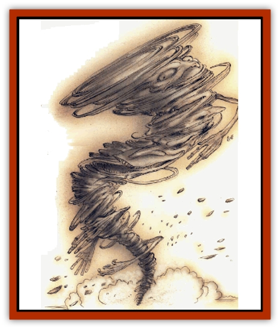

# Sword Spirit

| Statistic | **Sword Spirit** |
| --- | --- |
| **Activity Cycle:** | Any |
| **Alignment:** | Lawful evil |
| **Armor Class:** | 0 |
| **Climate/Terrain:** | Acheron, any battlefield |
| **Damage/Attack:** | By weapon |
| **Diet:** | Special |
| **Frequency:** | Very rare |
| **Hit Dice:** | 9 |
| **Intelligence:** | Very (11-12) |
| **Magic Resistance:** | 30% |
| **Morale:** | Fanatic (17-18) |
| **Movement:** | 18 |
| **No. Appearing:** | 1-3 |
| **No. of Attacks:** | 2-7 |
| **Organization:** | Solitary |
| **Size:** | L (10' tall) |
| **Special Attacks:** | Dust storm |
| **Special Defenses:** | Struck only by +1 or better weapons |
| **THAC0:** | 11 |
| **Treasure:** | C,V |
| **XP Value:** | 8,000 |

Sword spirits are a form of undead found on the ironclad plains of Acheron, and on rare occasions on other great battlefields. A sword spirit is normally invisible and intangible, having no true physical existence. In this form it can be detected only as an unexplained chill in the air or a feeling of wretched despair and anger that comes upon a cutter unexpectedly. These're danger signs that a peery cutter ought to take note of; it'll take the sword spirit 1 to 4 rounds to form a body suitable for combat, and a sharp body'll leave before the sword spirit finishes its preparations.

When the sword spirit finally shows itself, it takes the form of a dark whirlwind or zephyr of flying rust, dust, and metal flakes. Anywhere from 2 to 7 (1d6+1) nearby weapons're picked up and suspended in the whirlwind. The sword spirit attacks with these dancing blades, wielding them clumsily but with boundless fury and blinding speed. The sword spirit has no true body, but while it's in its whirlwind it can be injured by physical or magical attacks.

The sword spirit's manifestation is accompanied by a wild, howling wind and stinging clouds of dust and debris.

**Combat:** The zephyr of a sword spirit is normally about 10 to 20 feet tall and about 5 feet in diameter at its base. Anywhere from 2 to 7 (1d6+1) random weapons're picked up by the formation of the zephyr and used by the spirit to attack any living creatures it encounters. An individual weapon can be knocked down, restrained, or destroyed by a successful attack versus AC -4, but this causes no damage to the sword spirit.

The spirit itself exists in the center of the zephyr, but it is invisible and ectoplasmic. No nonmagical attacks can harm it, but magical weapons or pure magical energy (*magic missiles*, but not spells that cause damage through fire, cold, lightning, etc.) inflict normal damage on the spirit. It's only necessary to strike at the whirlwind itself, since the spirit's ectoplasmic tendrils are spread throughout the manifestation, wielding weapons and driving the winds. If the spirit can be seen and attacked, it suffers double damage from physical weapon blows.

The raging winds created by a sword spirit's manifestation deflect all nonmagical missile attacks, and create a blinding, stinging storm of metal and dust. Creatures engaged in melee with the spirit must successfully save versus spell each round or suffer a -2 penalty to attack rolls and Armor Class. In addition, any creature attempting to cast a spell within 20 feet of the sword spirit has to make a successful save versus spell in order to complete the casting without being disrupted by wind-blown grit and noise.

The sword spirit gains strength with each victim it slays. If it kills a character with its whirling weapons, it moves over the fallen body and feeds, gaining 1 hp for each level the victim possessed in life. This process requires 1 round, during which the sword spirit can still attack anyone standing nearby. The sword spirit's appetite is insatiable, and it continues to attack as long as living creatures are present.

Sword spirits are undead, and have the standard undead resistances to *sleep*, *charm*, and other mind-affecting magics. They can be struck only by +1 or better weapons, and are turned as vampires except when encountered on Acheron itself, where they're turned as special undead. A full vial of holy water inflicts 2 to 8 points of damage to a sword spirit, and the creature can be destroyed utterly by a *raise dead* or *dispel evil* spell if it fails a saving throw versus spell.

**Habitat/Society:** Sword spirits are the undead spirits of powerful warriors who perished in useless battles. They're most commonly found in or near the battlefields where they perished, and they're reluctant io stray far from the place of their death. The only purpose of a sword spirit is to slay any living creatures that cross its path, although cases've been recorded where sword spirits appeared to defend the place where their body was interred.

Sword spirits do not normally communicate. Even if a way could be found to contact one of these creatures, its mind would he revealed as a hateful cesspool of violence, bloodlust, and resentment of the livmg, Sword spirits are trapped in a perpetual cycle of rage and understand no other emotion.

A character killed and fed upon by a sword spirit is doomed to rise within 1 to 3 days as a [[Ghoul|ghoul]] (90% chance) or a [[Spectre|spectre]] (10% chance) - unless the corpse has been blessed by a priest of at least 5th level.

**Ecology:** Sword spirits have no place among the living; in many respects, the iron wastes of Acheron're the only place they belong. Even then, they exist outside of nature and contribute nothing to the ecology of the land around them.

---
## Discovery & Documentation

**Source Publication:** Planescape II (1996)
**Campaign Setting:** Planescape
**Author(s):** Rich Baker, Karen S. Boomgarden

### Other Creatures Found in This Source Book
   * [[Aasimar|Aasimar]]
   * [[Abrian|Abrian]]
   * [[Arcane|Arcane]]
   * [[Balaena|Balaena]]
   * [[Beholder-kin_Observer|Beholder-kin, Observer]]
   * [[Bloodthorn|Bloodthorn]]
   * [[Bonespear|Bonespear]]
   * [[Darkweaver|Darkweaver]]
   * [[Demarax|Demarax]]
   * [[Dhour|Dhour]]
   * [[Eater_of_Knowledge|Eater of Knowledge]]
   * [[Eladrin_Greater_Firre|Eladrin, Greater, Firre]]
   * [[Eladrin_Greater_Ghaele|Eladrin, Greater, Ghaele]]
   * [[Eladrin_Greater_Tulani|Eladrin, Greater, Tulani]]
   * [[Eladrin_Lesser_Bralani|Eladrin, Lesser, Bralani]]
   * [[Eladrin_Lesser_Coure|Eladrin, Lesser, Coure]]
   * [[Eladrin_Lesser_Noviere|Eladrin, Lesser, Noviere]]
   * [[Eladrin_Lesser_Shiere|Eladrin, Lesser, Shiere]]
   * [[Fhorge|Fhorge]]
   * [[Ghostlight|Ghostlight]]
   * [[Guardinal_Avoral|Guardinal, Avoral]]
   * [[Guardinal_Cervidal|Guardinal, Cervidal]]
   * [[Guardinal_General_Information|Guardinal, General Information]]
   * [[Guardinal_Equinal|Guardinal, Equinal]]
   * [[Guardinal_Leonal|Guardinal, Leonal]]
   * [[Guardinal_Lupinal|Guardinal, Lupinal]]
   * [[Guardinal_Ursinal|Guardinal, Ursinal]]
   * [[Hollyphant|Hollyphant]]
   * [[Incantifer|Incantifer]]
   * [[Ironmaw|Ironmaw]]
   * [[Keeper|Keeper]]
   * [[Khaasta|Khaasta]]
   * [[Leomarh|Leomarh]]
   * [[Monster_of_Legend|Monster of Legend]]
   * [[Mortai|Mortai]]
   * [[Noctral|Noctral]]
   * [[Quill|Quill]]
   * [[Razorvine|Razorvine]]
   * [[Reave|Reave]]
   * [[Retriever|Retriever]]
   * [[Rilmani_Abiorach|Rilmani, Abiorach]]
   * [[Rilmani_General_Information|Rilmani, General Information]]
   * [[Rilmani_Argenach|Rilmani, Argenach]]
   * [[Rilmani_Aurumach|Rilmani, Aurumach]]
   * [[Rilmani_Cuprilach|Rilmani, Cuprilach]]
   * [[Rilmani_Ferrumach|Rilmani, Ferrumach]]
   * [[Rilmani_Plumach|Rilmani, Plumach]]
   * [[Shadowdrake|Shadowdrake]]
   * [[Spellhaunt|Spellhaunt]]
   * [[Spider_Hook|Spider, Hook]]
   * [[Sunfly|Sunfly]]
   * [[Tanar'ri_Lesser_Bulezau|Tanar'ri, Lesser, Bulezau]]
   * [[Tanar'ri_Lesser_Maurezhi|Tanar'ri, Lesser, Maurezhi]]
   * [[Tanar'ri_Lesser_Yochlol|Tanar'ri, Lesser, Yochlol]]
   * [[Tanar'ri_General_Information|Tanar'ri, General Information]]
   * [[Tanar'ri_True_Alkilith|Tanar'ri, True, Alkilith]]
   * [[Terlen|Terlen]]
   * [[Tso|Tso]]
   * [[T'uen-rin|T'uen-rin]]
   * [[Vaporighu|Vaporighu]]
   * [[Vorr|Vorr]]
   * [[Wastrel|Wastrel]]
   * [[Wraithworm|Wraithworm]]
   * [[Yugoloth_Lesser_Canoloth|Yugoloth, Lesser, Canoloth]]
   * [[Zoveri|Zoveri]]
