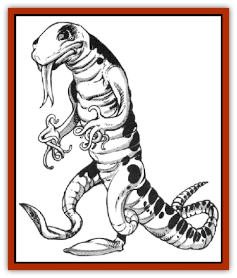

# Syllix

| Statistic | **Syllix** |
| --- | --- |
| **Activity Cycle:** | Any |
| **Alignment:** | Lawful evil |
| **Armor Class:** | 7 |
| **Climate/Terrain:** | Any space |
| **Damage/Attack:** | 1-8 (weapon) |
| **Diet:** | Carnivore |
| **Frequency:** | Uncommon |
| **Hit Dice:** | 3+1 |
| **Intelligence:** | Average (8-10) |
| **Magic Resistance:** | Nil |
| **Morale:** | Elite (13) |
| **Movement:** | 12 |
| **No. Appearing:** | 2-12 |
| **No. of Attacks:** | 1 |
| **Organization:** | Hive/platoon |
| **Size:** | M (7' long/tall) |
| **Special Attacks:** | Nil |
| **Special Defenses:** | Nil |
| **THAC0:** | 17 |
| **Treasure:** | D |
| **XP Value:** | 175 |

The syllix is a highly developed invertebrate, resembling a cross between a [[Worm|worm]] and a salamander. The syllix's body is segmented, tapering to a pointed tail and a worm-like head with a pair of wide, unblinking eyes. It has a long, forked tongue that is often slipping in and out of its mouth.

Unlike a worm, however, the syllix also has a two pairs of limbs. These are rubbery, tentacle-like appendages. Each of the lower limbs ends in a flat pad. The upper limbs end in six smaller tentacles that, because of their boneless nature. are even more dextrous than fingers.

A syllix can move by crawling or slithering along the ground, or by walking upright on its two rear limbs. In the latter mode its movement is reduced to half that listed above. When crawling, however, the syllix cannot use a weapon.

Syllix speak their own tongue. Some of them have learned the common language, but their speech is very sibilant, unpleasant for most other creatures to listen to. Also, their war-like nature is well known, so these creatures do not engage in a lot of pleasant chit-chat with creatures of other races.

**Combat:** Syllix use a variety of weapons well. They are particularly fond of specially modified light crossbows and short swords. Syllix attack aggressively and make good use of terrain, ship features, or anything else that might provide a tactical advantage.

In normal times, the syllix fight tenaciously, with a morale of 13. However, during the outbreaks of the Eruption (see "Habitat/Society"), the morale of a band of syllix improves to 15.

Syllix are eager to capture prisoners when they engage in battle with other races. Often they stage a boarding raid to acquire prisoners, then retire to their own vessel and leave.

The fate of the prisoners is not known to creatures of other races, though it is rumored to be horrible beyond belief. The common belief is that syllix require enzymes from the living brains of intelligent creatures in order to breed the mage-stars (see "Habitat/Society") that they need for space travel. Prisoners are kept immobilized, but conscious and alive, for months, often in excruciating pain. During this time, their brains are literally sucked out of their skulls by a developing mage-star.

In space, the syllix employ vessels with spelliamming helms powered by the mage-stars. They have been encountered on several types of vessels, including squidships, hammerships, and galleons.

**Habitat/Society:** The syllix develop in a very small area, such as an asteroid or an island on a planet. They breed and feed until the population of their land, fleet, or asteroid reaches explosive proportions. Hermaphroditic, each syllix gives birth after it has eaten enough food. Eventtlally, the syllix start to give birth to a generation of blind, white young. These are called the mage-stars.

The mage-stars are syllix in every way, except that they are blind - and thus do not study nor practice conabat - and they have the innate ability to activate a spelljammer helm. When these mage stars reach maturity (after about three years), the syllix suddenly go through the great convulsion their society, and the rest of the worlds, call the Eruption.

An erupting band of syllix has one mage-starred helm of SR 6, two of SR 5, three of SR 4, and so on through six of SR 1.

Guided by their mage-stars, the syllix break out of their homeworld and spread across space in an orgy of attacking, looting, and killing. No prisoners are taken when the syllix are in the midst of an Eruption. Each individual attacks with a +1 bonus to all attack rolls. Their morale is increased to the champion level.

**Ecology:** The syllix is a meat-eating scavenger. It can live in most climates, but it prefers those that serve as habitat for a lot of potential food. Many an island, asteroid, or small continent has been ravaged by a growing host of syllix during their breeding stage.

---
## Discovery & Documentation

**Source Publication:** MC7 Spelljammer Appendix I (1990)
**Campaign Setting:** Advanced Dungeons & Dragons 2nd Edition
**Author(s):** various

### Other Creatures Found in This Source Book
   * [[Aartuk|Aartuk]]
   * [[Albari|Albari]]
   * [[Ancient_Mariner|Ancient Mariner]]
   * [[Argos|Argos]]
   * [[Beholder_Abomination_Astereater|Beholder (Abomination), Astereater]]
   * [[Blazozoid|Blazozoid]]
   * [[Chattur|Chattur]]
   * [[Chevall|Chevall]]
   * [[Clockwork_Horror|Clockwork Horror]]
   * [[Colossus|Colossus]]
   * [[Delphinid|Delphinid]]
   * [[Dizantar|Dizantar]]
   * [[Dog|Dog]]
   * [[Dog_Bog_Hound|Dog, Bog Hound]]
   * [[Esthetic|Esthetic]]
   * [[Focoid|Focoid]]
   * [[Fractine|Fractine]]
   * [[Giant_Spacesea|Giant, Spacesea]]
   * [[Golem_Furnace|Golem, Furnace]]
   * [[Golem_Radiant|Golem, Radiant]]
   * [[Gravislayer|Gravislayer]]
   * [[Grommam|Grommam]]
   * [[Hadozee|Hadozee]]
   * [[Hamster_Giant_Space|Hamster, Giant Space]]
   * [[Jammer_Leech|Jammer Leech]]
   * [[Lakshu|Lakshu]]
   * [[Lumineaux|Lumineaux]]
   * [[Lutum|Lutum]]
   * [[Mimic_Space|Mimic, Space]]
   * [[Misi|Misi]]
   * [[Moon_Rogue|Moon, Rogue]]
   * [[Mortiss|Mortiss]]
   * [[Murderoid|Murderoid]]
   * [[Nay-Churr|Nay-Churr]]
   * [[Phlog-Crawler|Phlog-Crawler]]
   * [[Plasman|Plasman]]
   * [[Plasmoid_DeGleash|Plasmoid, DeGleash]]
   * [[Plasmoid_DelNoric|Plasmoid, DelNoric]]
   * [[Plasmoid_General_Information|Plasmoid, General Information]]
   * [[Plasmoid_Ontalak|Plasmoid, Ontalak]]
   * [[Puffer|Puffer]]
   * [[Q'nidar|Q'nidar]]
   * [[Rastipede|Rastipede]]
   * [[Reigar|Reigar]]
   * [[Rock_Hopper|Rock Hopper]]
   * [[Slinker|Slinker]]
   * [[Spider_Asteroid|Spider, Asteroid]]
   * [[Spiritjam|Spiritjam]]
   * [[Survivor|Survivor]]
   * [[Symbiont_Power|Symbiont, Power]]
   * [[Vine_Infinity|Vine, Infinity]]
   * [[Wiggle|Wiggle]]
   * [[Wizshade|Wizshade]]
   * [[Wryback|Wryback]]
   * [[Zard|Zard]]
   * [[Zodar|Zodar]]
