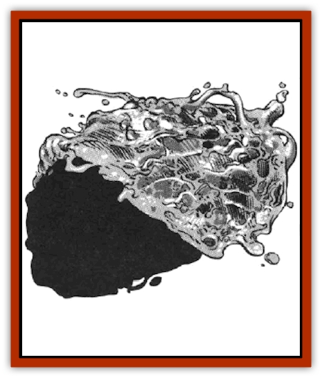

# Symbiont - Power

| Statistic | **Symbiont, Power** |
| --- | --- |
| **Activity Cycle:** | Any |
| **Alignment:** | Neutral |
| **Armor Class:** | 9 |
| **Climate/Terrain:** | Any non-cold |
| **Damage/Attack:** | Nil |
| **Diet:** | Magical emanations |
| **Frequency:** | Rare |
| **Hit Dice:** | 1 |
| **Intelligence:** | Animal (1) |
| **Magic Resistance:** | Nil |
| **Morale:** | Nil |
| **Movement:** | � |
| **No. Appearing:** | 1-40 |
| **No. of Attacks:** | 0 |
| **Organization:** | Colony |
| **Size:** | T (�&rdquo; diameter) |
| **Special Attacks:** | See below |
| **Special Defenses:** | See below |
| **THAC0:** | N/A |
| **Treasure:** | None |
| **XP Value:** | 175 |

Power symbionts are the bane of all spelljamming farers. They do nothing but rob the power from various magical items on the ship. These creatures have been found on various planets, as well. This has created a dislike for spelljamming in some areas.

A power symbiont is a creature that looks very much like swamp fungus. It is dark brown in color, unless it is currently feeding on magical emanations (during which process it is rust colored). They breed asexually once they have grown to twice their standard size of � inch in diameter.

**Combat:** These creatures reflect spells cast at them back to the source, with no diminution of strength. This can be an advantage to a ship infested by power symbionts. If a ship is magically attacked and a symbiont is in the spell effect, the spell is reflected back to the attacking ship. In a case like this, neither the caster nor the attacking ship receive any Dexterity or SR bonus to the saving throws.

**Habitat/Society:** These creatures do not purposefully create a society. They may be found together only where there are sufficient magical emanations to warrant their numbers. Once the magical properties of the item have been drained, they abandon it.

**Ecology:** Power symbionts are attracted to the magical auras that they sense through wildspace. They are unable to move quickly. and can only hope that the ship actually scoops them up with its gravitational pull.

Once on the ship, they begin to move about at a movement rate of �, in search of magical auras. Once one is found, the symbionts head straight for it. They can sense the auras of magical items from 20 feet away. If they sense another aura as they travel toward the first, it is ignored, unless it is a stronger aura. They continue this way until they find the most appetizing item. They then attach themselves to the item and begin feeding.

Once the item has lost all charges (a power symbiont drains one charge per round; see the list below for figuring the number of charges in an item), the power symbiont dispatches 1d8 �" symbionts to search for another source of magical energy. The rest of the symbiont dies, hardening in one day to a hard, brown lump.

If the symbionts that have been dispatched from the drained item cannot find another magical source within one week, they traverse the gravity plane of the ship and throw themselves back into wildspace. If they happen to enter the phlogiston, they die immediately.

The total number of charges in a magical item can be computed from the following list:

<ul><li>1 charge per plus of a weapon</li><li>1 charge per charge of a rod, staff or wand</li><li>1 charge for semi-empalhy</li><li>1 charge per Intelligence point</li><li>1 charge per language known</li><li>2 charges per Ego point</li><li>2 charges per primary ability</li><li>2 charges for empathy</li><li>3 charges for speech</li><li>4 charges for telepathy</li><li>6 charges per extraordinary power</li><li>10 charges per special purpose</li><li>12 charges per special purpose power</li></ul>

---
## Discovery & Documentation

**Source Publication:** MC7 Spelljammer Appendix I (1990)
**Campaign Setting:** Advanced Dungeons & Dragons 2nd Edition
**Author(s):** various

### Other Creatures Found in This Source Book
   * [[Aartuk|Aartuk]]
   * [[Albari|Albari]]
   * [[Ancient_Mariner|Ancient Mariner]]
   * [[Argos|Argos]]
   * [[Beholder_Abomination_Astereater|Beholder (Abomination), Astereater]]
   * [[Blazozoid|Blazozoid]]
   * [[Chattur|Chattur]]
   * [[Chevall|Chevall]]
   * [[Clockwork_Horror|Clockwork Horror]]
   * [[Colossus|Colossus]]
   * [[Delphinid|Delphinid]]
   * [[Dizantar|Dizantar]]
   * [[Dog|Dog]]
   * [[Dog_Bog_Hound|Dog, Bog Hound]]
   * [[Esthetic|Esthetic]]
   * [[Focoid|Focoid]]
   * [[Fractine|Fractine]]
   * [[Giant_Spacesea|Giant, Spacesea]]
   * [[Golem_Furnace|Golem, Furnace]]
   * [[Golem_Radiant|Golem, Radiant]]
   * [[Gravislayer|Gravislayer]]
   * [[Grommam|Grommam]]
   * [[Hadozee|Hadozee]]
   * [[Hamster_Giant_Space|Hamster, Giant Space]]
   * [[Jammer_Leech|Jammer Leech]]
   * [[Lakshu|Lakshu]]
   * [[Lumineaux|Lumineaux]]
   * [[Lutum|Lutum]]
   * [[Mimic_Space|Mimic, Space]]
   * [[Misi|Misi]]
   * [[Moon_Rogue|Moon, Rogue]]
   * [[Mortiss|Mortiss]]
   * [[Murderoid|Murderoid]]
   * [[Nay-Churr|Nay-Churr]]
   * [[Phlog-Crawler|Phlog-Crawler]]
   * [[Plasman|Plasman]]
   * [[Plasmoid_DeGleash|Plasmoid, DeGleash]]
   * [[Plasmoid_DelNoric|Plasmoid, DelNoric]]
   * [[Plasmoid_General_Information|Plasmoid, General Information]]
   * [[Plasmoid_Ontalak|Plasmoid, Ontalak]]
   * [[Puffer|Puffer]]
   * [[Q'nidar|Q'nidar]]
   * [[Rastipede|Rastipede]]
   * [[Reigar|Reigar]]
   * [[Rock_Hopper|Rock Hopper]]
   * [[Slinker|Slinker]]
   * [[Spider_Asteroid|Spider, Asteroid]]
   * [[Spiritjam|Spiritjam]]
   * [[Survivor|Survivor]]
   * [[Syllix|Syllix]]
   * [[Vine_Infinity|Vine, Infinity]]
   * [[Wiggle|Wiggle]]
   * [[Wizshade|Wizshade]]
   * [[Wryback|Wryback]]
   * [[Zard|Zard]]
   * [[Zodar|Zodar]]
