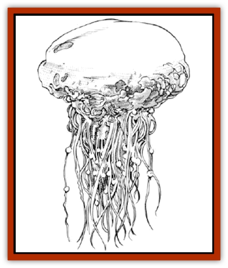

# Symbiotic Jelly

| Statistic | **Symbiotic Jelly** |
| --- | --- |
| **Activity Cycle:** | Any |
| **Alignment:** | Neutral |
| **Armor Class:** | 8 |
| **Climate/Terrain:** | Subterranean |
| **Damage/Attack:** | Nil |
| **Diet:** | Special |
| **Frequency:** | Very rare |
| **Hit Dice:** | 2 |
| **Intelligence:** | Semi- (2-4) |
| **Magic Resistance:** | Nil |
| **Morale:** | Steady (12-14) |
| **Movement:** | 1 |
| **No. Appearing:** | 1 |
| **No. of Attacks:** | Nil |
| **Organization:** | Solitary |
| **Size:** | T (2-3&rdquo; diameter) |
| **Special Attacks:** | See below |
| **Special Defenses:** | See below |
| **THAC0:** | 19 |
| **Treasure:** | Nil |
| **XP Value:** | 270 |

Symbiotic jelly is a distant cousin of the [[Ooze_Slime_Jelly_II|gelatinous cube]]. It occupies a very special ecological niche, and thus has a specific but rather unusual mode of existence. It exists by controlling the mind of another creature, which it then uses for protection and to obtain sustenance.

These jellies are difficult to spot due to their small size (about 2-3" diameter). Their appearance is similar to that of a jellyfish: yellow, spherical or slightly flattened globules. Radiating outwards from the central mass are about three dozen thin tendrils, which act as antennae from which the creature communicates with and controls another creature (see below). They are translucent and slightly milky, but contain no fixed internal structure.

**Combat:** These creatures choose unoccupied caves in which to dwell, and stick to the ceiling in the shadows, where they are almost impossible to detect. When a carnivore ventures into the cave, the symbiotic jelly will attempt to use its innate *charm monster* ability to persuade the intruder telepathically to remain in the cave and attack any other creature which enters. Monsters which are not carnivorous, creatures from planes other than the Prime Material, and undead are ignored by the jelly. The jelly then uses another powerful spell-like ability, similar to a *veil* spell. Two vivid illusions are thus created. The first illusion makes the *charmed* monster appear to be a much weaker variety of the same beast, while the second creates an inviting but illusory treasure in the cave. The nature of the treasure will be determined as the symbiotic jelly uses an *ESP*-like power to detect the victim's interest in the cave. The *ESP* is also used to determine the victim's response to the illusions, so that the jelly can quickly alter the illusion for greater believability. This adjustment occurs so rapidly, within a fraction of a second, that the viewer of the illusion is unaware of the subtle changes which have taken place. Creatures observing the illusions (except the *charmed* monster) will fail to recognize these as such, unless they save vs. spell at a penalty of -7. Thus, if a huge [[Bear|cave bear]] is charmed, it may be made to appear as a weak bear cub, while the back of the cave might appear to contain a rich vein of gold ore if a dwarf entered the cave, or a sumptuous banquet if a hungry halfling wandered by.

The symbiotic jelly gains sustenance by draining energy from a carnivorous creature which is feeding. This energy drain is done from a distance of about ten feel from the feeding site. If the intruder is killed by the creature the jelly has *charmed*, the jelly will drain power through the creature as it eats. If the charmed creature loses the battle, the jelly will attempt to *charm* the victor and persuade it to replace the former occupant. This peculiar diet is the reason for the jelly's unique behavior. It is believed that the jelly feeds on the emotions derived from satisfying the instinctual urge to eat.

The symbiotic jelly's communication tendrils are fragile, but regenerate quickly, within 1-3 turns per tendril destroyed. If any tendrils are damaged, there is a proportional decrease in the chance to communicate with the host creature. Thus, if 6 of the 36 tendrils are destroyed, there is a 6 in 36 chance (1 in 6) that communication will be severed, and the control of the host creature will be lost.

**Habitat/Society:** If a symbiotic jelly does not eat for one month, it forms a shell-like, protective coating around itself and enters a dormant stage. It will hibernate until a carnivore enters the cave and the *charm* process can begin. Thus, a symbiotic jelly who has charmed a cave bear will generally be dormant during the winter when the bear hibernates.

**Ecology:** Symbiotic jellies are not well-studied. Because of their extreme rarity, they have few known magical or commercial applications. It has been reported that the distilled essence of a symbiotic jelly may be useful in certain magical applications, including potions which emulate this creature's symbiotic lifestyle. The role of a symbiotic jelly in its local ecosystem has not yet been determined. It is known that its intelligence is instinctual, not learned.

---
## Discovery & Documentation

**Source Publication:** MC14 Fiend Folio Appendix (1992)
**Campaign Setting:** Fiends Folio
**Author(s):** Don Bingle, John Terra, Wes Nicholson, Tim Beach, Steve Hardinger, Kris Hardinger, Rob Nicholls, Greg Swedberg, Al Boyce, Vince Garcia, Norm Ritchie

### Other Creatures Found in This Source Book
   * [[Aballin|Aballin]]
   * [[Achaierai|Achaierai]]
   * [[Adherer|Adherer]]
   * [[Algoid|Algoid]]
   * [[Al-Mi'raj|Al-Mi'raj]]
   * [[Apparition|Apparition]]
   * [[Caterwaul|Caterwaul]]
   * [[Coffer_Corpse|Coffer Corpse]]
   * [[Crabman|Crabman]]
   * [[Dark_Creeper|Dark Creeper]]
   * [[Dark_Stalker|Dark Stalker]]
   * [[Darter|Darter]]
   * [[Denzelian|Denzelian]]
   * [[Dune_Stalker|Dune Stalker]]
   * [[Dwarf_Urdunnir|Dwarf, Urdunnir]]
   * [[Falcon_Fire|Falcon, Fire]]
   * [[Faux_Faerie|Faux Faerie]]
   * [[Flawder|Flawder]]
   * [[Fyrefly|Fyrefly]]
   * [[Gambado|Gambado]]
   * [[Garbug|Garbug]]
   * [[Giant_Fhoimorien|Giant, Fhoimorien]]
   * [[Gibberling|Gibberling]]
   * [[Gorbel|Gorbel]]
   * [[Grimlock|Grimlock]]
   * [[Hellcat|Hellcat]]
   * [[Ice_Lizard|Ice Lizard]]
   * [[Iron_Cobra|Iron Cobra]]
   * [[Khargra|Khargra]]
   * [[Mantari|Mantari]]
   * [[Penanggalan|Penanggalan]]
   * [[Pernicon|Pernicon]]
   * [[Phantom_Stalker|Phantom Stalker]]
   * [[Retriever|Retriever]]
   * [[Ruve|Ruve]]
   * [[Scathe|Scathe]]
   * [[Sheet_Ghoul_Sheet_Phantom|Sheet Ghoul/Sheet Phantom]]
   * [[Shocker|Shocker]]
   * [[Spanner|Spanner]]
   * [[Stwinger|Stwinger]]
   * [[Sussurus|Sussurus]]
   * [[Terithran|Terithran]]
   * [[Thunder_Children|Thunder Children]]
   * [[Troll_Ice|Troll, Ice]]
   * [[Tween|Tween]]
   * [[Umpleby|Umpleby]]
   * [[Volt|Volt]]
   * [[Xill|Xill]]
   * [[Xvart|Xvart]]
   * [[Zygraat|Zygraat]]
