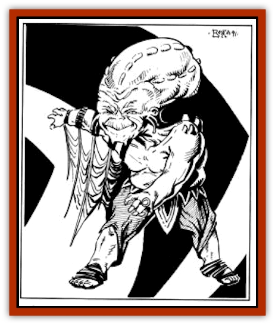

# T'Chowb

| Statistic | **T'Chowb** |
| --- | --- |
| **Activity Cycle:** | Night |
| **Alignment:** | Neutral evil |
| **Armor Class:** | 3 |
| **Climate/Terrain:** | Any |
| **Damage/Attack:** | By weapon |
| **Diet:** | Special |
| **Frequency:** | Rare |
| **Hit Dice:** | 2 |
| **Intelligence:** | See below |
| **Magic Resistance:** | Nil |
| **Morale:** | Elite (13-14) |
| **Movement:** | 12 |
| **No. Appearing:** | 1 |
| **No. of Attacks:** | 1 |
| **Organization:** | Solitary |
| **Size:** | T (1') |
| **Special Attacks:** | Intelligence Drain |
| **Special Defenses:** | See below |
| **THAC0:** | 19 |
| **Treasure:** | Nil |
| **XP Value:** | 270 |

**Psionics Summary**

| Level | Dis/Sci/Dev | Attack/Defense | Score | PSPs |
| --- | --- | --- | --- | --- |
| 2 | 2/2/7 | EW/IF | 10 | 45 |

**Telepathy -** *Sciences:* mind drain, mind link; *Devotions:* contact, daydream, ego whip, invisibility, intellect fortress.

**Psychometabolism -** *Sciences:* nil; *Devotions:* displacement, enhanced speed, heightened senses.

The t'chowb is a particularly deadly little creature that delights in draining intelligence from those smarter than itself.

A t'chowb is a tiny, humanoid creature with a leathery, gray skin. It has beady, red eyes and a purple ridge along the skull. It is hairless, and its head looks entirely too large for its small body.

A t'chowb ordinarily does not speak any language, but it does gain the ability to speak one of the languages known by its victim for every three points of intelligence it drains.

**Combat:** A t'chowb will never seek a face-to-face confrontation if it can possibly be avoided. With its powers, it is usually able to avoid such a fight. The t'chowb has a 40% chance to move silently and a 38% chance to hide in shadows. The t'chowb has a number of other powers that help it seek its prey, which is anyone with more intelligence than it possesses.The t'chowb's favorite method of attack is to sneak up on a party or caravan camped for the night. It attempts to get close to one of the sentries and tries to make psionic contact. If the sentry has a psionic defense, the t'chowb tries to use an *ego whip* to force contact with the sentry's mind. If both fail it is likely to break off the attack, either moving on to another sentry or waiting until a different sentry takes the watch.

Once contact is established, the t'chowb uses *daydream* to make the sentry's mind wander. It can then slip into camp to prey on sleeping victims. If it is discovered, either by the sentry or by those in camp, the t'chowb uses one of its two unique psionic powers, *enhanced speed*, to flee. *Enhanced speed* allows the t'chowb to move at a rate of 36 and costs 3 PSPs per round to maintain. It will also use *displacement* to aid its escape. If it is not noticed, the t'chowb moves in to "drain" a victim.

The t'chowb can drain victims using its other unique ability, *mind drain*. This is very similar to *mindwipe*, but with two important differences. It does not require the *contact* devotion. *It does require a round of physical contact*, however. The drain is painless and usually unnoticed by the victim, especially if he is sleeping.

When a t'chowb touches a victim, the victim is allowed a saving throw vs. spells, with a -4 penalty if he is sleeping. Failure means that he feels nothing and the drain continues uninterrupted. If the save is made, the victim has a terrible nightmare. This may cause him to wake up. A surprise roll is made; if the victim is not surprised, he wakes up screaming. If the potential victim was not asleep, a successful saving throw means he has a terrible feeling that something bad is about to happen to him. At this point, the t'chowb fades into the background and continues his draining.

For each round of draining, the victim loses one point of intelligence - permanently. The t'chowb gains one point of intelligence, but the gain only lasts for one day. Even if his victim wakes up, the t'chowb can keep using his *mind drain* until sated. A t'chowb is not sated until his intelligence reaches 24. Since the t'chowb's normal Intelligence is 4, this can be quite devastating for a character. When a victim's intelligence reaches 2, the t'chowb is no longer interested in him, since he is now a drooling idiot.

The mind drain can be kept up as long as the victim is within 30' of the t'chowb. The drain can only be broken if the t'chowb is forced beyond that range or if the beast takes any form of damage. A successful physical attack will stop the t'chowb's *mind drain* immediately. A successful psionic attack will stop the drain and cause the t'chowb to lose all the intelligence points it has gained from its current victim. Unfortunately, these points are not psionically funneled back into the victim's psyche; they are simply lost. A victim drained by a t'chowb can only have his intelligence restored by mental surgery, *heal*, or *restoration*.

**Habitat/Society:** A t'chowb is a solitary creature because it doesn't like anyone or anything except the feeling of power it gets from becoming smarter. A sated t'chowb is a genius and uses its newfound intelligence in whatever manner best suits it.

**Ecology:** The t'chowb can be found in cities, on the trail, or almost anywhere that intelligent beings gather.

---
## Discovery & Documentation

**Source Publication:** MC12 Dark Sun Appendix I - Terrors of the Desert (1991)
**Campaign Setting:** Dark Sun
**Author(s):** Tom Prusa, Louis J. Prosperi, Walter M. Baas

### Other Creatures Found in This Source Book
   * [[Animal_Herd_Athas|Animal, Herd (Athas)]]
   * [[Animal_Household_Athas|Animal, Household (Athas)]]
   * [[Antloid_Desert|Antloid, Desert]]
   * [[Banshee_Dwarf|Banshee, Dwarf]]
   * [[Beetle_Agony|Beetle, Agony]]
   * [[Bog_Wader|Bog Wader]]
   * [[Brambleweed|Brambleweed]]
   * [[B'rohg|B'rohg]]
   * [[Burnflower|Burnflower]]
   * [[Cat_Psionic|Cat, Psionic]]
   * [[Cha'thrang|Cha'thrang]]
   * [[Cistern_Fiend|Cistern Fiend]]
   * [[Clam_Giant|Clam, Giant]]
   * [[Cloud_Ray|Cloud Ray]]
   * [[Drake_Athas_Air|Drake (Athas), Air]]
   * [[Drake_Athas_Earth|Drake (Athas), Earth]]
   * [[Drake_Athas_Fire|Drake (Athas), Fire]]
   * [[Drake_Athas_Water|Drake (Athas), Water]]
   * [[Dune_Runner|Dune Runner]]
   * [[Dune_Trapper|Dune Trapper]]
   * [[Elemental_Athas_Greater_Air|Elemental (Athas), Greater, Air]]
   * [[Elemental_Athas_Greater_Earth|Elemental (Athas), Greater, Earth]]
   * [[Elemental_Athas_Greater_Fire|Elemental (Athas), Greater, Fire]]
   * [[Elemental_Athas_Greater_Water|Elemental (Athas), Greater, Water]]
   * [[Elemental_Athas_Lesser_Air_Earth|Elemental (Athas), Lesser, Air/Earth]]
   * [[Elemental_Athas_Lesser_Fire_Water|Elemental (Athas), Lesser, Fire/Water]]
   * [[Elemental_Athas_General_Information|Elemental (Athas), General Information]]
   * [[Erdland|Erdland]]
   * [[Esperweed|Esperweed]]
   * [[Flailer|Flailer]]
   * [[Floater|Floater]]
   * [[Giant_Athas|Giant (Athas)]]
   * [[Golem_Athas_I|Golem (Athas) I]]
   * [[Golem_Athas_II|Golem (Athas) II]]
   * [[Golem_Athas_III|Golem (Athas) III]]
   * [[Golem_Athas_General_Information|Golem (Athas), General Information]]
   * [[Halfling_Renegade|Halfling, Renegade]]
   * [[Hej-kin|Hej-kin]]
   * [[Id_Fiend|Id Fiend]]
   * [[Insect_Swarm_Athas|Insect Swarm (Athas)]]
   * [[Kank_Wild|Kank, Wild]]
   * [[Kirre|Kirre]]
   * [[Megapede|Megapede]]
   * [[Mul_Wild|Mul, Wild]]
   * [[Nightmare_Beast|Nightmare Beast]]
   * [[Plant_Carnivorous_Athas|Plant, Carnivorous (Athas)]]
   * [[Pterran|Pterran]]
   * [[Pterrax|Pterrax]]
   * [[Pulp_Bee|Pulp Bee]]
   * [[Pyreen|Pyreen]]
   * [[Rasclinn|Rasclinn]]
   * [[Razorwing|Razorwing]]
   * [[Roc_Athas|Roc (Athas)]]
   * [[Sand_Bride|Sand Bride]]
   * [[Sand_Cactus|Sand Cactus]]
   * [[Sand_Vortex|Sand Vortex]]
   * [[Scrab|Scrab]]
   * [[Silt_Horror|Silt Horror]]
   * [[Silt_Runner|Silt Runner]]
   * [[Sink_Worm|Sink Worm]]
   * [[Sloth_Athas|Sloth (Athas)]]
   * [[So-ut|So-ut]]
   * [[Spider_Cactus|Spider Cactus]]
   * [[Spider_Crystal|Spider, Crystal]]
   * [[Spirit_of_the_Land|Spirit of the Land]]
   * [[Thrax|Thrax]]
   * [[Tohr-kreen_I|Tohr-kreen I]]
   * [[Villichi|Villichi]]
   * [[Zhackal|Zhackal]]
   * [[Zombie_Plant|Zombie Plant]]
