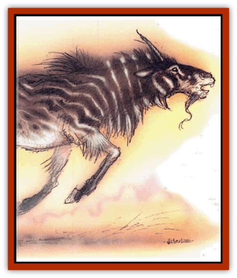

# T'uen-rin

| Statistic | **T'uen-rin** |
| --- | --- |
| **Activity Cycle:** | Any |
| **Alignment:** | Lawful good |
| **Armor Class:** | -8 |
| **Climate/Terrain:** | Arcadia |
| **Damage/Attack:** | 1d10/1d10/2d10 |
| **Diet:** | Herbivore |
| **Frequency:** | Very rare |
| **Hit Dice:** | 16 |
| **Intelligence:** | Supra-genius (19-20) |
| **Magic Resistance:** | 90% |
| **Morale:** | Fanatic (17-18) |
| **Movement:** | 24, Fl 48 (A) |
| **No. Appearing:** | 1 |
| **No. of Attacks:** | 3 (two hooves, horn) |
| **Organization:** | Solitary |
| **Size:** | H (13' long) |
| **Special Attacks:** | Awe, Spell use |
| **Special Defenses:** | Never surprised |
| **THAC0:** | 5 |
| **Treasure:** | H,I |
| **XP Value:** | 28,000 |

T'uen-rin are a powerful race of good servants that dwell in the peaceful skies and plains of Arcadia. They're related to the [[Ki-rin|ki-rin]] of the Prime Material Plane, but they're even more intelligent, capable, and noble than their "lesser" kin. T'uen-rin keep their distance from prime-material affairs, concentrating on the task of battling evil around the Great Wheel. However, from time to time the requirements of their endless war on evil send them to the worlds of the prime.

T'uen-rin resemble their more common counterparts. Their bodies are horselike, but their coats are covered with fine golden scales that scintillate with impossible shades of color. Their thick manes and tails are deep, dark gold, and their hooves and horn are pinkish-ivory. The t'uen-rin's face is wise and beautiful, and its eyes are liquid orbs of deep violet. Lots of berks say there's no more beautiful sight in the multiverse than a t'uen-rin galloping across the sky at sunrise, and they might be right.

T'uen-rin can understand and speak any human tongue, and can also communicate by telepathy or empathy. No natural, nonevil animal'll ever offer harm to a t'uen-rin. Flowers spring up where their hooves touch the earth.

**Combat:** Although t'uen-rin are peaceful and good, they'll fearlessly attack evil wherever they encounter it. A t'uen-rin's a match for even a greater [[Baatezu_General_Information|baatezu]] or true [[Tanar'ri_General_Information|tanar'ri]], and the noble creature'll never hesitate to engage such an opponent.

The t'uen-rin attacks physically with two blows of its mighty hooves and a thrust of its great horn. Its natural attacks're considered the equal of +5 weapons for purposes of harming creatures struck only by enchanted weapons. T'uen-rin enjoy dealing with evil opponents in a direct, physical approach and often choose this option over the use of spells or their *awe* power.

T'uen-rin can cast wizard spells at the 20th level of ability. Each day, they may use 15 1st-level spells, 14 2nd-level spells, 13 3rd-level spells, and so on up to 7 9th-level spells. They're especially fond of the schools of illusion and enchantment but won't hesitate to use extremely powerful spells such as *symbols*, *wishes*, or *power words* against very powerful evil entities.

The t'uen-rin's *telepathy* ability enables them to monitor conscious thoughts nearby, making them impossible to surprise. This also allows the t'uen-rin to *know alignment* and *detect lie* without error. Each day, the t'uen-rin can *create* nutritious food and beverage for 10d10 people, as well as 100 cubic feet of soft goods, 50 cubic feet of wood, and 20 cubic feet of stone or metal items. These creations are permanent.

T'uen-rin can assume *gaseous form*, become *invisible*, *summon weather*, and *call lightning* at will. They can freely enter the Ethereal or Astral Planes. Creatures of elemental air don't attack a t'uen-rin unless compelled by an evil force at least as powerful as the t'uen-rin.

Once per day, a t'uen-rin may create an aura of divine *awe*. Any being of a nondivine nature within sigbt must survive a saving throw versus spell at -6 or be *awed*. *Awed* beings stand motionless for a number of rounds equal to 20 minus the creature's Wisdom score. For example, a character with a Wisdom of 12 would be *awed* for 8 rounds. *Awed* creatures recover after a 1-round delay if attacked physically. If the t'uen-rin chooses, it may follow up the *awe* with a special *suggestion* or *emotion* spell that affects every *awed* creature. A t'uen-rin could use this power to inspire an entire army to courage, or put a legion of evil creatures to flight. Normally, t'uen-rin don't attack creatures they've *awed* unless the creatures are evil and must be destroyed to deter them from their purpose.

**Habitat/Society:** T'uen-rin're motivated purely by the pursuit of good. They often use their great powers to aid people of good heart wherever they find 'em. Naturally, a t'uen-rin'll seek out and destroy evil if at all possible. T'uen-rin are superhumanly intelligent, and they've got a good idea of when it's time to back off - they migbt consider a tanar'ri roaming the Astral to be fair game, but they won't follow that same tanar'ri into the Abyss.

Although t'uen-rin travel widely, their true home's the skies above Arcadia. They live among the clouds, and some t'uen-rin go centuries without setting foot on the ground. Unfortunately, this attitude's rubbed off on the t'uen-rin; there's a dark seed of arrogance and superiority in the hearts of many of these noble creatures, and there's some bloods who say that the t'uen-rin may be headed for a fall if they keep distancing themselves from mortal concern.

**Ecology:** In some prime-material cultures, the t'uen-rin're seen as the ultimate embodiment of good. 'Course, no planar'll ever say that about a t'uen-rin. Any cutter with a clue knows that there are high-ups even more important than a t'uen-rin. All that aside, there's no dark to the fact that t'uen-rin're some of the most gifted creatures in the multiverse, and that nothing short of a power dares face them in a fair fight.

It's said that all the t'uen-rin are female, that no males of the race exist. If this is the case, a body might wonder how more t'uen-rin show up. Some bloods say that there's only a limited number of t'uen-rin - a couple of dozen, no more than that - and that each time one is slain, the universe loses something unique and irreplaceable. Others say that the male t�uen-rin is actually the ki-rin (or vice-versa, depending on how a cutter looks at it), and that the two "races" are actually one divided species. The t'uen-rin themselves avoid questions of this nature.

---
## Discovery & Documentation

**Source Publication:** MC8 Outer Planes Appendix (1990)
**Campaign Setting:** Planescape
**Author(s):** Timothy B. Brown, Jamie LaFountain

### Other Creatures Found in This Source Book
   * [[Aasimon_Agathinon|Aasimon, Agathinon]]
   * [[Aasimon_Deva|Aasimon, Deva]]
   * [[Aasimon_Light|Aasimon, Light]]
   * [[Aasimon_General_Information|Aasimon, General Information]]
   * [[Aasimon_Planetar|Aasimon, Planetar]]
   * [[Aasimon_Solar|Aasimon, Solar]]
   * [[Air_Sentinel|Air Sentinel]]
   * [[Animal_Lord|Animal Lord]]
   * [[Archon|Archon]]
   * [[Baatezu_Lesser_Abishai|Baatezu, Lesser, Abishai]]
   * [[Baatezu_Greater_Amnizu|Baatezu, Greater, Amnizu]]
   * [[Baatezu_Lesser_Barbazu|Baatezu, Lesser, Barbazu]]
   * [[Baatezu_Greater_Cornugon|Baatezu, Greater, Cornugon]]
   * [[Baatezu_Lesser_Erinyes|Baatezu, Lesser, Erinyes]]
   * [[Baatezu_General_Information|Baatezu, General Information]]
   * [[Baatezu_Greater_Gelugon|Baatezu, Greater, Gelugon]]
   * [[Baatezu_Lesser_Hamatula|Baatezu, Lesser, Hamatula]]
   * [[Baatezu_Lemure|Baatezu, Lemure]]
   * [[Baatezu_Least_Nupperibo|Baatezu, Least, Nupperibo]]
   * [[Baatezu_Lesser_Osyluth|Baatezu, Lesser, Osyluth]]
   * [[Baatezu_Greater_Pit_Fiend|Baatezu, Greater, Pit Fiend]]
   * [[Baatezu_Least_Spinagon|Baatezu, Least, Spinagon]]
   * [[Balaena|Balaena]]
   * [[Bariaur|Bariaur]]
   * [[Bebilith|Bebilith]]
   * [[Bodak|Bodak]]
   * [[Dog_Moon|Dog, Moon]]
   * [[Dragon_Adamantite|Dragon, Adamantite]]
   * [[Einheriar|Einheriar]]
   * [[Gehreleth|Gehreleth]]
   * [[Githyanki|Githyanki]]
   * [[Githzerai|Githzerai]]
   * [[Hordling|Hordling]]
   * [[Lammasu_Celestial|Lammasu, Celestial]]
   * [[Larva|Larva]]
   * [[Maelephant|Maelephant]]
   * [[Marut|Marut]]
   * [[Mediator|Mediator]]
   * [[Mortai|Mortai]]
   * [[Night_Hag|Night Hag]]
   * [[Nightmare|Nightmare]]
   * [[Noctral|Noctral]]
   * [[Per|Per]]
   * [[Phoenix|Phoenix]]
   * [[Slaad|Slaad]]
   * [[Tanar'ri_Greater_Babau|Tanar'ri, Greater, Babau]]
   * [[Tanar'ri_Greater_Chasme|Tanar'ri, Greater, Chasme]]
   * [[Tanar'ri_Greater_Nabassu|Tanar'ri, Greater, Nabassu]]
   * [[Tanar'ri_Least_Dretch|Tanar'ri, Least, Dretch]]
   * [[Tanar'ri_Least_Manes|Tanar'ri, Least, Manes]]
   * [[Tanar'ri_Least_Rutterkin|Tanar'ri, Least, Rutterkin]]
   * [[Tanar'ri_Lesser_Alu-Fiend|Tanar'ri, Lesser, Alu-Fiend]]
   * [[Tanar'ri_Lesser_Bar-Lgura|Tanar'ri, Lesser, Bar-Lgura]]
   * [[Tanar'ri_Lesser_Cambion|Tanar'ri, Lesser, Cambion]]
   * [[Tanar'ri_Lesser_Succubus|Tanar'ri, Lesser, Succubus]]
   * [[Tanar'ri_Guardian_Molydeus|Tanar'ri, Guardian, Molydeus]]
   * [[Tanar'ri_General_Information|Tanar'ri, General Information]]
   * [[Tanar'ri_True_Balor|Tanar'ri, True, Balor]]
   * [[Tanar'ri_True_Glabrezu|Tanar'ri, True, Glabrezu]]
   * [[Tanar'ri_True_Hezrou|Tanar'ri, True, Hezrou]]
   * [[Tanar'ri_True_Marilith|Tanar'ri, True, Marilith]]
   * [[Tanar'ri_True_Nalfeshnee|Tanar'ri, True, Nalfeshnee]]
   * [[Tanar'ri_True_Vrock|Tanar'ri, True, Vrock]]
   * [[Titan|Titan]]
   * [[Translator|Translator]]
   * [[Vaporighu|Vaporighu]]
   * [[Warden_Beast|Warden Beast]]
   * [[Yugoloth_Greater_Arcanaloth|Yugoloth, Greater, Arcanaloth]]
   * [[Yugoloth_Lesser_Dergoloth|Yugoloth, Lesser, Dergoloth]]
   * [[Yugoloth_Lesser_Hydroloth|Yugoloth, Lesser, Hydroloth]]
   * [[Yugoloth_General_Information|Yugoloth, General Information]]
   * [[Yugoloth_Lesser_Mezzoloth|Yugoloth, Lesser, Mezzoloth]]
   * [[Yugoloth_Greater_Nycaloth|Yugoloth, Greater, Nycaloth]]
   * [[Yugoloth_Lesser_Piscoloth|Yugoloth, Lesser, Piscoloth]]
   * [[Yugoloth_Greater_Ultroloth|Yugoloth, Greater, Ultroloth]]
   * [[Yugoloth_Lesser_Yagnoloth|Yugoloth, Lesser, Yagnoloth]]
   * [[Zoveri|Zoveri]]
