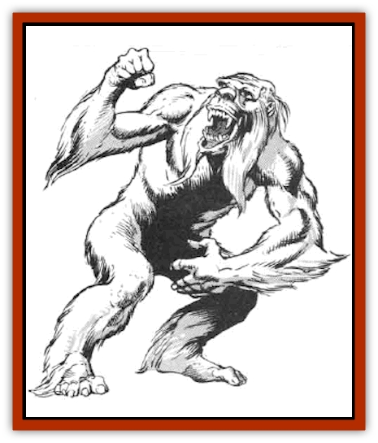

# Taer

| Statistic | **Taer** |
| --- | --- |
| **Activity Cycle:** | Day |
| **Alignment:** | Neutral |
| **Armor Class:** | 4 |
| **Climate/Terrain:** | Arctic and subartic/Mountains |
| **Damage/Attack:** | 1-6/1-4/1-4 or by weapon +3 |
| **Diet:** | Omnivore |
| **Frequency:** | Very rare |
| **Hit Dice:** | 3+6 |
| **Intelligence:** | Low (5-7) |
| **Magic Resistance:** | Nil |
| **Morale:** | Steady (11-12) |
| **Movement:** | 18 |
| **No. Appearing:** | 10-40 |
| **No. of Attacks:** | 3 or 1 |
| **Organization:** | Clan |
| **Size:** | M (6½' tall) |
| **Special Attacks:** | Odor (see below) |
| **Special Defenses:** | See below |
| **THAC0:** | 17 |
| **Treasure:** | Nil (see below) |
| **XP Value:** | 270 |

Taer are a race of shaggy humanoids that live in cold mountain regions. Taer look like a cross between cave men and apes. Their bodies are thick and barrel-chested. Long, powerful arms reach down to their ankles, ending in great wide hands. Thick, oily, matted fur, snow-white to grey in color, covers their entire body. The head is large but has virtually no forehead. Like many snow-creatures, taer possess a second transparent eyelid that enables them to see clearly even in heavy snowstorms without risking eye damage. Tear speak a crude language that consists of guttural grunts and body slapping.

**Combat:** Most taer shun weapons, though a few (25%) hurl huge stone spears before closing to melee. Any spear hurled by a taer zains a +1 bonus to the attack roll and a +3 bonus to damage, due to a taer's great strength. In melee, taer attack using kick/punch/bite.

Taer pores excrete a fatty substance that coats their fur. The odor of this substance is extremely vile. All creatures within ten feet of a taer must roll a successful saving throw vs. breath weapon or suffer disorientation and nausea for 1d4+1 hours. Attacks by disoriented creatures suffer a -2 penalty to attack rolls and a -1 penalty to damage. This same fatty substance protects taer from cold, including magical cold.Taer are both cunning and fierce when defending their territory. They are very knowledgeable of their home mountains and always use this to their advantage. Common ploys include deliberate avalanches, hurling down rocks upon unsuspecting victims, burrowing into the snow alongside mountain trails, and covering a crevice in the mountainside with snow to create a pit trap.

**Habitat/Society:** Taer live in nomadic clans that consist several interrelated families. These clans number 10d4 individuals. The clans skirt the edges of high mountain ranges, moving back and forth two to three miles a day within a predetermined territory.

During daylight hours, adult male and female taer venture down the slop to the bottom of the snow line to search for food. Taer gather and eat just about anything, including lichen, grubs, seeds, tree bark, bird eggs, and mountain goats. Taer never hunt humans or demihumans for food, preferring to drive off intelligent creatures with a show of strength and much hooting and hollering.

Taer are superstitious by nature, distrusting iron and metal. They avoid any creatures who wear cloth to keep warm, apparently attaching some supernatural significance to the presence of outer clothing. Taer worship their own guardian snow-god, asking for good hunting and snow to hide within. Clans carry a crudely fashioned stone guardian idol to protect them. Taer believe the size of the statue relates to the magical protection bestowed upon them. Some guardian statues weigh as much as 2,500 pounds and require several male taer to lift.

Taer have no lairs, per se, sleeping at night within deep snow banks or among rocky outcroppings. Before the gatherers leave each morning, the nursing females, young, and guardian statue are placed inside the nearest available cave. The adults then camouflage the entrance to the nursery with rocks, snow, and ice. Outside the eldest male hides himself. This male will try to distract any creature coming within 20 feet of the nursery during the day. Any attempt to open the nursery causes the male to charge. When defending the nursery, the eldest male gains a +2 bonus to his attack roll and +2 additional damage. His attack is designed to hurt and scare off the intruders more than to kill.

Even when a taer has a human or demihuman disoriented, the taer is more likely to leave the intruder injured and unconscious than to actually slay him.

**Ecology:** Taer adorn themselves with polished teeth and horns but keep no real treasure. Clans sometimes (25%) carry a single metal item taken from an unfortunate traveler. The item is 10% likely to be a magical weapon. The item is always wrapped in leather so that the taer do not have to touch it directly. Carrying this metal has religious significance for taer as a protection against metal-using humans. Taer fear humans because the creatures are sometimes hunted for their glands that secrete the oily substance in their fur. These are wo& 500 gold pieces on the open market and can be used to fashion a *protection from cold* potion.

---
## Discovery & Documentation

**Source Publication:** MC5 Greyhawk Appendix (1989)
**Campaign Setting:** Advanced Dungeons & Dragons 2nd Edition
**Author(s):** Grant Boucher, William W. Connors, Steve Gilbert, Bruce Nesmith, Chris Mortika, Skip Williams

### Other Creatures Found in This Source Book
   * [[Aspis|Aspis]]
   * [[Beastman|Beastman]]
   * [[Bonesnapper|Bonesnapper]]
   * [[Booka|Booka]]
   * [[Brownie_Buckawn|Brownie, Buckawn]]
   * [[Brownie_Quickling|Brownie, Quickling]]
   * [[Crystalmist|Crystalmist]]
   * [[Dragon_Cloud|Dragon, Cloud]]
   * [[Dragon_Oerth_Greyhawk|Dragon (Oerth), Greyhawk]]
   * [[Dragonfly_Giant|Dragonfly, Giant]]
   * [[Dragonnel|Dragonnel]]
   * [[Elf_Grugach|Elf, Grugach]]
   * [[Elf_Valley|Elf, Valley]]
   * [[Golem_Necrophidius|Golem, Necrophidius]]
   * [[Grell_Wild|Grell, Wild]]
   * [[Grung|Grung]]
   * [[Hobgoblin_Norker|Hobgoblin, Norker]]
   * [[Hook_Horror|Hook Horror]]
   * [[Horgar|Horgar]]
   * [[Hound_Yeth|Hound, Yeth]]
   * [[Iguana_Giant|Iguana, Giant]]
   * [[Ingundi|Ingundi]]
   * [[Kech|Kech]]
   * [[Kyuss_Son_of|Kyuss, Son of]]
   * [[Mite|Mite]]
   * [[Needleman|Needleman]]
   * [[Plant_Carnivorous_Oerth|Plant, Carnivorous (Oerth)]]
   * [[Plant_Carnivorous_Vampire_Cactus|Plant, Carnivorous, Vampire Cactus]]
   * [[Plasmoid_General_Information|Plasmoid, General Information]]
   * [[Rat_Oerth|Rat (Oerth)]]
   * [[Raven_Crow|Raven/Crow]]
   * [[Scarecrow|Scarecrow]]
   * [[Shadow_Slow|Shadow, Slow]]
   * [[Skulk|Skulk]]
   * [[Snail|Snail]]
   * [[Sprite|Sprite]]
   * [[Tentamort|Tentamort]]
   * [[Turtle_Giant|Turtle, Giant]]
   * [[Tyrg|Tyrg]]
   * [[Wolf_Mist|Wolf, Mist]]
   * [[Wraith_Oerth|Wraith (Oerth)]]
   * [[Zygom|Zygom]]
