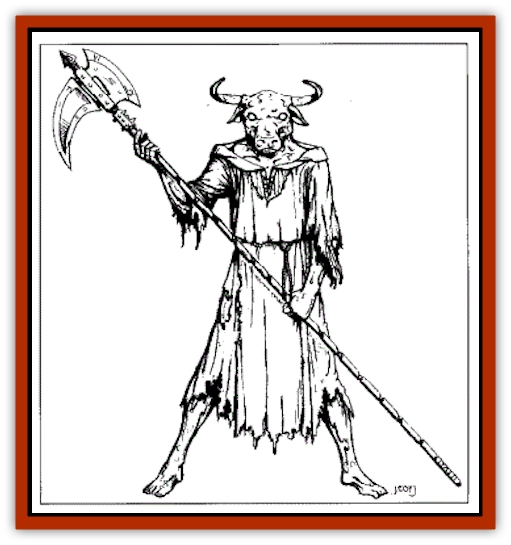
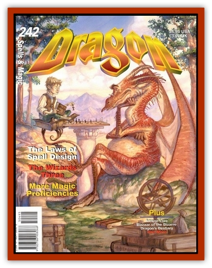

# Talisman Servant - Mystran

| Statistic | **Talisman Servant, Mystran** |
| --- | --- |
| **Activity Cycle:** | Any |
| **Alignment:** | Lawful neutral |
| **Armor Class:** | 0 |
| **Climate/Terrain:** | Any/Land |
| **Damage/Attack:** | 1-6 |
| **Diet:** | None |
| **Frequency:** | Very rare |
| **Hit Dice:** | 14 (84 hp) |
| **Intelligence:** | Average (8-10) |
| **Magic Resistance:** | 35% |
| **Morale:** | Champion (15-16) |
| **Movement:** | 12 |
| **No. Appearing:** | 1 or 2 |
| **No. of Attacks:** | 1 |
| **Organization:** | Solitary |
| **Size:** | L (7-9' tall) |
| **Special Attacks:** | Polearm, gaze weapon |
| **Special Defenses:** | Surprised only on a 1 or 2, +2 or better weapon to hit, spell immunity, tracking ability |
| **THAC0:** | 8 |
| **Treasure:** | Special |
| **XP Value:** | 13,000 |

Created by a powerful mage and a priest of at least 17th level, this talisman servant is named after Mystra, the Lady of Mysteries. The mystran is the most refined-looking of all the talisman servants. Fashioned from stone and metal (steel, mithril, or silver), a typical mystran appears as an athletic humanoid with an animal head. They almost always wear the robes of the higher clergy of Mystra or the armor and livery of ancient militia. Two features distinguish mystrans from [[Talisman_Servant_Gladiator|gladiator servants]]. The eyes of a mystran glow with intelligence and determination, and their ears are long pointed, and alert. The talisman most often associated with a mystran servant is a silver medallion or necklace shaped like an eight-pointed star or shield. In the case of a pair of servants, earrings or bracers serve as talismans. In either case, the talisman is embossed with the interlocking symbols of Mystra and a protective power (e.g., Helm, Berronar, or Yondalla).

**Combat:** The mystran servant is created to protect a treasure, structure, or person. A mystran never abandons its post. Mystran servants are the most sentient of all automatons. They can understand complex instructions, operate manual traps, and are capable strategists. Mystrans are rarely fooled and possess an excellent memory, being able to remember thieves no matter how much time has passed since the servant last saw them. In addition to their Intelligence, mystran servants are always armed with a magical polearm of some type (+1/+2 vs. thieves). Even unarmed, these servants can still bite an opponent with their stony jaws.

The mystran's eyes are its most potent defense. Each servant possesses one of two different gaze weapons. The first is a paralyzing glare. The victim must save vs. petrification or suffer the effects of a *hold person* or *hold monster* spell, but the effects last only as long as the servant maintains eye contact. The second gaze weapon is a powerful version of the *wizard eye* spell. While this ability has no combat value, the servants master sees everything his servant sees. The wizard must make a system shock roll when the mystran contacts him or else suffer acute vertigo for one round while his eyes adjust to the new perspective. If a mystran duo is encountered, one has the paralytic gaze and the other has the wizard eye. Each ability is performed at the 14th level of ability. In addition, mystran servants are immune to all illusion, invisibility, fear, and mind-altering spells. A mystran's hearing is very acute, thus it can be surprised only on a 1 or 2. Only weapons of +2 or greater can harm a mystran servant. No mystran pursues a retreating enemy beyond 240' of its post or charge, nor can a mystran break into homes or holy ground. However, if someone steals the mystran's ward or the master's talisman without first destroying the creature, the servant tracks the thief (with the skill of a 7th-level ranger) until he gives up the stolen property. Even seeking sanctuary does not stop a mystran with a mission. A mystran can wait decades for a thief, its righteous gaze looking in through the window every time the rogue looks out. A mystran is the least likely of the talisman servants to self-activate (5% chance). However, on occasion, a mystran activates and acts on a "hunch," prowling restlessly in an 240' arc for 1-8 rounds before it shuts down on its own.

**Habitat/Society:** Mystran servants served a key role in the security system of a wizard's fortress or priests temple in the Arcane Empire. In the present age of Faer�n, mystrans can be found in the North guarding the inner sanctums and treasuries of the few temples of Azuth, Helm, and Mystra fortunate enough to acquire them or in Nimbral, Halruua, and Thay where powerful and incorruptible guards are essential. If created to watch over a person, a bodyguard mystran might develop a "mother hen" complex which can be most embarrassing for its ward and entertaining for onlookers. Aside from its ward, a mystran rarely associates with anyone other than its partner or master.

**Ecology:** Mystran servants have no need for rest, food, drink, or air. They do not leave much of an impact on their environment. Not counting whatever treasure it was created to protect, the mystran's polearm and its eyes (gems worth at least 1,000 gp each) are the servants only treasures.

---
## Discovery & Documentation

**Source Publication:** Dragon242 (1997)
**Campaign Setting:** Dragon Magazine
**Author(s):** 

### Other Creatures Found in This Source Book
   * [[Fainil|Fainil]]
   * [[Mongrelman_Infiltrator|Mongrelman, Infiltrator]]
