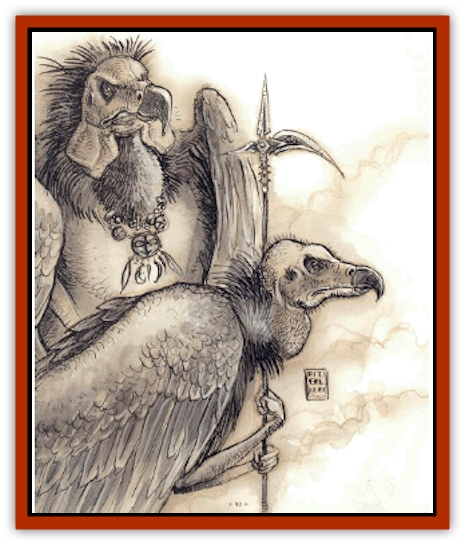

# Tanar'ri - General Information

* Greater tanar'ri take half damage from silver weapons.

All tanar'ri have a form of telepathy that lets them communicate with any intelligent life form regardless of language barriers. Tanar'ri with Average or better Intelligence can converse.

The Abyss-forged magical weapons of the tanar'ri dissolve upon the owner's death. When one doesn't, the weapon probably originated elsewhere.

**Habitat/Society:** The tanar'ri have five divisions, listed here in order of ascending power with member varieties:

*Least:* [[Tanar'ri_Least_Dretch|dretch]], [[Tanar'ri_Least_Manes|manes]], [[Tanar'ri_Least_Rutterkin|rutterkin]]

*Lesser:* [[Tanar'ri_Lesser_Alu-Fiend|alu-fiend]], [[Tanar'ri_Lesser_Armanite|armanite]], [[Tanar'ri_Lesser_Bar-Lgura|bar-lgura]], [[Tanar'ri_Lesser_Bulezau|bulezau]], [[Tanar'ri_Lesser_Cambion|cambion]], [[Tanar'ri_Lesser_Maurezhi|maurezhi]], [[Tanar'ri_Lesser_Succubus|succubus]], [[Tanar'ri_Lesser_Uridezu|uridezu]], [[Tanar'ri_Lesser_Yochlol|yochlol]]

*Guardian:* [[Tanar'ri_Guardian_Molydeus|molydeus]]

*Greater:* [[Tanar'ri_Greater_Babau|babau]], [[Tanar'ri_Greater_Chasme|chasme]], [[Tanar'ri_Greater_Goristro|goristro]], [[Tanar'ri_Greater_Nabassu|nabassu]], [[Tanar'ri_Greater_Wastrilith|wastrilith]]

*True:* [[Tanar'ri_True_Alkilith|alkilith]], [[Tanar'ri_True_Balor|balor]], [[Tanar'ri_True_Glabrezu|glabrezu]], [[Tanar'ri_True_Hezrou|hezrou]], [[Tanar'ri_True_Marilith|marilith]], [[Tanar'ri_True_Nalfeshnee|nalfeshnee]], [[Tanar'ri_True_Vrock|vrock]]

These classifications actually mean little in their lives. They are merely broad estimates of destructive power. The tanar'ri have little use for anything besides power, and a strong lesser tanar'ri who bests a greater cousin gains higher status in the Abyss. Their petty battles for position are endless. The only class free from these power struggles is the molydeus, a guardian tanar'ri that seems curiously divorced from the tanar'ri power structure.

There are also the [[Spyder_Fiend|spyder fiends]], a subrace of the tanar'ri.

The tanar'ri are one of the two major factions in the Blood War. For as long as the tanar'ri have existed, they have waged war against their ancient enemies, the baatezu. The tanar'ri and baatezu wage war in strikingly different ways. The baatezu are organized and fight their battles with planned tactics for strategic goals. The tanar'ri, however, are a horde of chaos and disorder, using their endless numbers in wars of attrition. It is difficult to estimate tanar'ri populations, considering they inhabit an infinite number of infinitely large planes, but there are easily 100 times as many tanar'ri as baatezu. This disordered race wages the Blood War only because true tanar'ri seem to have a primal urge to destroy baatezu. They force those less powerful than themselves to serve their wishes.

**Ecology:** Most tanar'ri feed on either flesh or the life force of other living beings. It appears that they derive more nutrition from a victim by instilling terror in it before the kill. Whereas most predators simply stalk and then kill, tanar'ri add a third step: stalk, terrify, kill.

---
## Discovery & Documentation

**Source Publication:** MC8 Outer Planes Appendix (1990)
**Campaign Setting:** Planescape
**Author(s):** Timothy B. Brown, Jamie LaFountain

### Other Creatures Found in This Source Book
   * [[Aasimon_Agathinon|Aasimon, Agathinon]]
   * [[Aasimon_Deva|Aasimon, Deva]]
   * [[Aasimon_Light|Aasimon, Light]]
   * [[Aasimon_General_Information|Aasimon, General Information]]
   * [[Aasimon_Planetar|Aasimon, Planetar]]
   * [[Aasimon_Solar|Aasimon, Solar]]
   * [[Air_Sentinel|Air Sentinel]]
   * [[Animal_Lord|Animal Lord]]
   * [[Archon|Archon]]
   * [[Baatezu_Lesser_Abishai|Baatezu, Lesser, Abishai]]
   * [[Baatezu_Greater_Amnizu|Baatezu, Greater, Amnizu]]
   * [[Baatezu_Lesser_Barbazu|Baatezu, Lesser, Barbazu]]
   * [[Baatezu_Greater_Cornugon|Baatezu, Greater, Cornugon]]
   * [[Baatezu_Lesser_Erinyes|Baatezu, Lesser, Erinyes]]
   * [[Baatezu_General_Information|Baatezu, General Information]]
   * [[Baatezu_Greater_Gelugon|Baatezu, Greater, Gelugon]]
   * [[Baatezu_Lesser_Hamatula|Baatezu, Lesser, Hamatula]]
   * [[Baatezu_Lemure|Baatezu, Lemure]]
   * [[Baatezu_Least_Nupperibo|Baatezu, Least, Nupperibo]]
   * [[Baatezu_Lesser_Osyluth|Baatezu, Lesser, Osyluth]]
   * [[Baatezu_Greater_Pit_Fiend|Baatezu, Greater, Pit Fiend]]
   * [[Baatezu_Least_Spinagon|Baatezu, Least, Spinagon]]
   * [[Balaena|Balaena]]
   * [[Bariaur|Bariaur]]
   * [[Bebilith|Bebilith]]
   * [[Bodak|Bodak]]
   * [[Dog_Moon|Dog, Moon]]
   * [[Dragon_Adamantite|Dragon, Adamantite]]
   * [[Einheriar|Einheriar]]
   * [[Gehreleth|Gehreleth]]
   * [[Githyanki|Githyanki]]
   * [[Githzerai|Githzerai]]
   * [[Hordling|Hordling]]
   * [[Lammasu_Celestial|Lammasu, Celestial]]
   * [[Larva|Larva]]
   * [[Maelephant|Maelephant]]
   * [[Marut|Marut]]
   * [[Mediator|Mediator]]
   * [[Mortai|Mortai]]
   * [[Night_Hag|Night Hag]]
   * [[Nightmare|Nightmare]]
   * [[Noctral|Noctral]]
   * [[Per|Per]]
   * [[Phoenix|Phoenix]]
   * [[Slaad|Slaad]]
   * [[Tanar'ri_Greater_Babau|Tanar'ri, Greater, Babau]]
   * [[Tanar'ri_Greater_Chasme|Tanar'ri, Greater, Chasme]]
   * [[Tanar'ri_Greater_Nabassu|Tanar'ri, Greater, Nabassu]]
   * [[Tanar'ri_Least_Dretch|Tanar'ri, Least, Dretch]]
   * [[Tanar'ri_Least_Manes|Tanar'ri, Least, Manes]]
   * [[Tanar'ri_Least_Rutterkin|Tanar'ri, Least, Rutterkin]]
   * [[Tanar'ri_Lesser_Alu-Fiend|Tanar'ri, Lesser, Alu-Fiend]]
   * [[Tanar'ri_Lesser_Bar-Lgura|Tanar'ri, Lesser, Bar-Lgura]]
   * [[Tanar'ri_Lesser_Cambion|Tanar'ri, Lesser, Cambion]]
   * [[Tanar'ri_Lesser_Succubus|Tanar'ri, Lesser, Succubus]]
   * [[Tanar'ri_Guardian_Molydeus|Tanar'ri, Guardian, Molydeus]]
   * [[Tanar'ri_True_Balor|Tanar'ri, True, Balor]]
   * [[Tanar'ri_True_Glabrezu|Tanar'ri, True, Glabrezu]]
   * [[Tanar'ri_True_Hezrou|Tanar'ri, True, Hezrou]]
   * [[Tanar'ri_True_Marilith|Tanar'ri, True, Marilith]]
   * [[Tanar'ri_True_Nalfeshnee|Tanar'ri, True, Nalfeshnee]]
   * [[Tanar'ri_True_Vrock|Tanar'ri, True, Vrock]]
   * [[Titan|Titan]]
   * [[Translator|Translator]]
   * [[T'uen-rin|T'uen-rin]]
   * [[Vaporighu|Vaporighu]]
   * [[Warden_Beast|Warden Beast]]
   * [[Yugoloth_Greater_Arcanaloth|Yugoloth, Greater, Arcanaloth]]
   * [[Yugoloth_Lesser_Dergoloth|Yugoloth, Lesser, Dergoloth]]
   * [[Yugoloth_Lesser_Hydroloth|Yugoloth, Lesser, Hydroloth]]
   * [[Yugoloth_General_Information|Yugoloth, General Information]]
   * [[Yugoloth_Lesser_Mezzoloth|Yugoloth, Lesser, Mezzoloth]]
   * [[Yugoloth_Greater_Nycaloth|Yugoloth, Greater, Nycaloth]]
   * [[Yugoloth_Lesser_Piscoloth|Yugoloth, Lesser, Piscoloth]]
   * [[Yugoloth_Greater_Ultroloth|Yugoloth, Greater, Ultroloth]]
   * [[Yugoloth_Lesser_Yagnoloth|Yugoloth, Lesser, Yagnoloth]]
   * [[Zoveri|Zoveri]]
