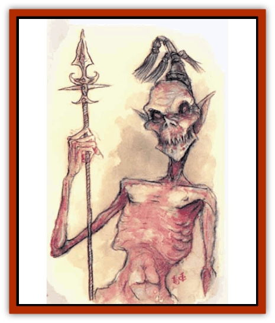
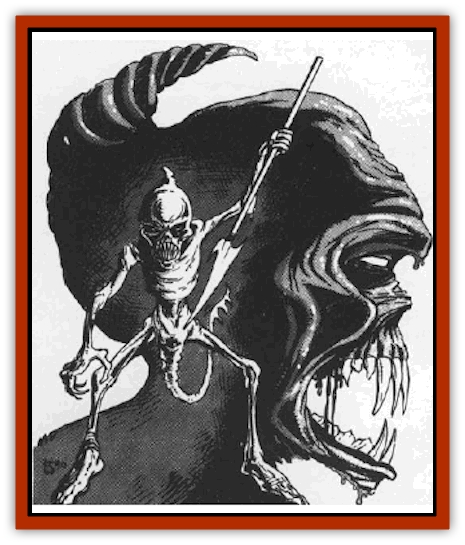

# Tanar'ri - Greater - Babau

| Statistic | **Tanar'ri, Greater, Babau** |
| --- | --- |
| **Activity Cycle:** | Any |
| **Alignment:** | Chaotic evil |
| **Armor Class:** | -3 |
| **Climate/Terrain:** | The Abyss |
| **Damage/Attack:** | 2d4+1/1d4+1/2d4 or by weapon +7 (Strength bonus) |
| **Diet:** | Carnivore |
| **Frequency:** | Uncommon |
| **Hit Dice:** | 8+14 |
| **Intelligence:** | Genius (17-18) |
| **Magic Resistance:** | 50% |
| **Morale:** | Champion (15-16) |
| **Movement:** | 15 |
| **No. Appearing:** | 1 (rarely: 1-2) |
| **No. of Attacks:** | 1 or 3 |
| **Organization:** | Solitary |
| **Size:** | M (7' tall) |
| **Special Attacks:** | Corrosion, gaze, backstab |
| **Special Defenses:** | +1 or better weapons to hit, thief abilities |
| **THAC0:** | 13 |
| **Treasure:** | D |
| **XP Value:** | 17,000 |

Babaus are greater [[Tanar'ri_General_Information|tanar'ri]] that roam the layers of the Abyss recruiting lesser and least tanar'ri for the vast armies of the Blood War. They look like tall skeletons covered with dark, form-fitting leather. A great horn protrudes from the back of their skulls. Babaus have long, wicked claws covered with dirt, blood, and decaying flesh. Their movements are very quick, sharp, and mechanical, emphasizing their alien nature.

Babaus communicate using telepathy.

**Combat:** Any creature who meets a babau's glowing red gaze must save vs. spells or be affected as by a *ray of enfeeblement*. Gaze range is 20'. The gaze affects one opponent per round, in addition to normal attacks. Babaus are immune from attacks by nonmagical weapons.

Babaus can use any weapon they find. They have enchanted and magical weapons 20% of the time (determine magical weapon randomly). Babaus have Strength 19 and gain a +7 damage bonus.

Babaus attack with two claws (1d4+1 damage each) and their sharp horn (2d4 damage). Babaus are intelligent and prefer other means of attack, but they fight fiercely unarmed when necessary.

Babaus generate a slick, dark red substance that covers their bodies. This slippery jelly halves damage from all slashing and piercing weapons (type S and P), and it has a corrosive quality. It has a 20% chance per hit of corroding a metal weapon. Normal metal weapons must save vs. acid with each hit or corrode and become useless. Magical metal weapons lose one "plus". Further, if the liquid comes into contact with exposed flesh (during grappling attacks or other contact), it burns for 1d6 of acid damage.

In addition to those available to all tanar'ri, babaus have the spell-like powers *dispel magic*, *fear*, *fly*, *heat metal*, *levitate*, and *polymorph self*. Once a day they can attempt to *gate* in 1-6 [[Tanar'ri_Lesser_Cambion|cambions]] or 1 babau with a 40% chance of success. There is also a chance that a true tanar'ri comes to the aid of a babau in trouble (see below).

Babaus have the abilities of a 9th-level thief (pick pockets 30%, open locks 30%, find/remove traps 25%, move silently 95%, hide in shadows 80%, detect noise 35%, climb walls 90%, read languages 30%, backstab (x4)).

**Habitat/Society:** Other tanar'ri hate babaus because they roam around recruiting for the vast Abyss armies. To escape service, numbers of lesser tanar�ri sometimes gang up on a pursuing babau and try to kill it. However, the babau defend themselves well.

True tanar'ri have close ties with babaus. If a babau is attacked, a true tanar'ri (randomly determined) is 20% likely to notice and come to its aid - not through any sense of loyalty, but rather to further the Blood War. This causes the lesser tanar'ri to fear babaus even more.

**Ecology:** According to the true tanar'ri (presumably among the greatest powers of the Abyss), the only purpose of the lesser and least tanar'ri is to fight in the Blood War. Because the babaus are the grim recruiters of those armies, they are integral to the Abyss and important in the Blood War.

---
## Discovery & Documentation

**Source Publication:** MC8 Outer Planes Appendix (1990)
**Campaign Setting:** Planescape
**Author(s):** Timothy B. Brown, Jamie LaFountain

### Other Creatures Found in This Source Book
   * [[Aasimon_Agathinon|Aasimon, Agathinon]]
   * [[Aasimon_Deva|Aasimon, Deva]]
   * [[Aasimon_Light|Aasimon, Light]]
   * [[Aasimon_General_Information|Aasimon, General Information]]
   * [[Aasimon_Planetar|Aasimon, Planetar]]
   * [[Aasimon_Solar|Aasimon, Solar]]
   * [[Air_Sentinel|Air Sentinel]]
   * [[Animal_Lord|Animal Lord]]
   * [[Archon|Archon]]
   * [[Baatezu_Lesser_Abishai|Baatezu, Lesser, Abishai]]
   * [[Baatezu_Greater_Amnizu|Baatezu, Greater, Amnizu]]
   * [[Baatezu_Lesser_Barbazu|Baatezu, Lesser, Barbazu]]
   * [[Baatezu_Greater_Cornugon|Baatezu, Greater, Cornugon]]
   * [[Baatezu_Lesser_Erinyes|Baatezu, Lesser, Erinyes]]
   * [[Baatezu_General_Information|Baatezu, General Information]]
   * [[Baatezu_Greater_Gelugon|Baatezu, Greater, Gelugon]]
   * [[Baatezu_Lesser_Hamatula|Baatezu, Lesser, Hamatula]]
   * [[Baatezu_Lemure|Baatezu, Lemure]]
   * [[Baatezu_Least_Nupperibo|Baatezu, Least, Nupperibo]]
   * [[Baatezu_Lesser_Osyluth|Baatezu, Lesser, Osyluth]]
   * [[Baatezu_Greater_Pit_Fiend|Baatezu, Greater, Pit Fiend]]
   * [[Baatezu_Least_Spinagon|Baatezu, Least, Spinagon]]
   * [[Balaena|Balaena]]
   * [[Bariaur|Bariaur]]
   * [[Bebilith|Bebilith]]
   * [[Bodak|Bodak]]
   * [[Dog_Moon|Dog, Moon]]
   * [[Dragon_Adamantite|Dragon, Adamantite]]
   * [[Einheriar|Einheriar]]
   * [[Gehreleth|Gehreleth]]
   * [[Githyanki|Githyanki]]
   * [[Githzerai|Githzerai]]
   * [[Hordling|Hordling]]
   * [[Lammasu_Celestial|Lammasu, Celestial]]
   * [[Larva|Larva]]
   * [[Maelephant|Maelephant]]
   * [[Marut|Marut]]
   * [[Mediator|Mediator]]
   * [[Mortai|Mortai]]
   * [[Night_Hag|Night Hag]]
   * [[Nightmare|Nightmare]]
   * [[Noctral|Noctral]]
   * [[Per|Per]]
   * [[Phoenix|Phoenix]]
   * [[Slaad|Slaad]]
   * [[Tanar'ri_Greater_Chasme|Tanar'ri, Greater, Chasme]]
   * [[Tanar'ri_Greater_Nabassu|Tanar'ri, Greater, Nabassu]]
   * [[Tanar'ri_Least_Dretch|Tanar'ri, Least, Dretch]]
   * [[Tanar'ri_Least_Manes|Tanar'ri, Least, Manes]]
   * [[Tanar'ri_Least_Rutterkin|Tanar'ri, Least, Rutterkin]]
   * [[Tanar'ri_Lesser_Alu-Fiend|Tanar'ri, Lesser, Alu-Fiend]]
   * [[Tanar'ri_Lesser_Bar-Lgura|Tanar'ri, Lesser, Bar-Lgura]]
   * [[Tanar'ri_Lesser_Cambion|Tanar'ri, Lesser, Cambion]]
   * [[Tanar'ri_Lesser_Succubus|Tanar'ri, Lesser, Succubus]]
   * [[Tanar'ri_Guardian_Molydeus|Tanar'ri, Guardian, Molydeus]]
   * [[Tanar'ri_General_Information|Tanar'ri, General Information]]
   * [[Tanar'ri_True_Balor|Tanar'ri, True, Balor]]
   * [[Tanar'ri_True_Glabrezu|Tanar'ri, True, Glabrezu]]
   * [[Tanar'ri_True_Hezrou|Tanar'ri, True, Hezrou]]
   * [[Tanar'ri_True_Marilith|Tanar'ri, True, Marilith]]
   * [[Tanar'ri_True_Nalfeshnee|Tanar'ri, True, Nalfeshnee]]
   * [[Tanar'ri_True_Vrock|Tanar'ri, True, Vrock]]
   * [[Titan|Titan]]
   * [[Translator|Translator]]
   * [[T'uen-rin|T'uen-rin]]
   * [[Vaporighu|Vaporighu]]
   * [[Warden_Beast|Warden Beast]]
   * [[Yugoloth_Greater_Arcanaloth|Yugoloth, Greater, Arcanaloth]]
   * [[Yugoloth_Lesser_Dergoloth|Yugoloth, Lesser, Dergoloth]]
   * [[Yugoloth_Lesser_Hydroloth|Yugoloth, Lesser, Hydroloth]]
   * [[Yugoloth_General_Information|Yugoloth, General Information]]
   * [[Yugoloth_Lesser_Mezzoloth|Yugoloth, Lesser, Mezzoloth]]
   * [[Yugoloth_Greater_Nycaloth|Yugoloth, Greater, Nycaloth]]
   * [[Yugoloth_Lesser_Piscoloth|Yugoloth, Lesser, Piscoloth]]
   * [[Yugoloth_Greater_Ultroloth|Yugoloth, Greater, Ultroloth]]
   * [[Yugoloth_Lesser_Yagnoloth|Yugoloth, Lesser, Yagnoloth]]
   * [[Zoveri|Zoveri]]
