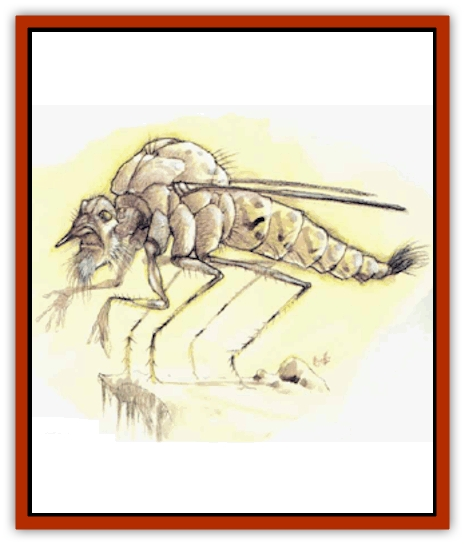
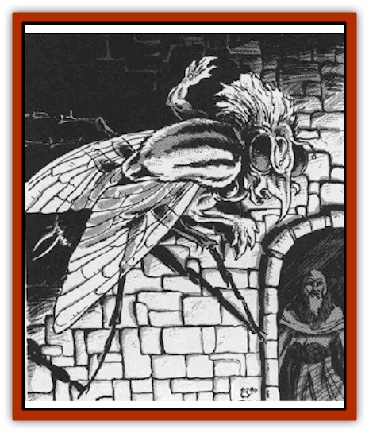
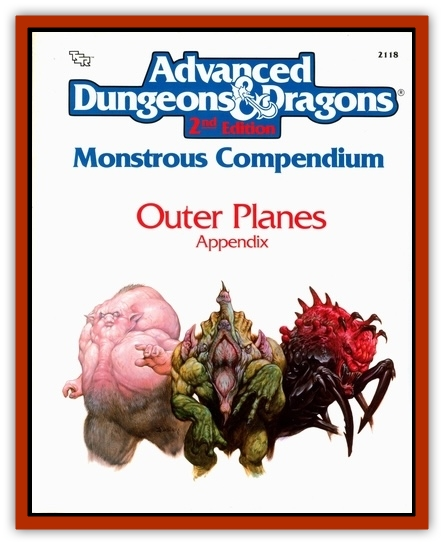

# Tanar'ri - Greater - Chasme

| Statistic | **Tanar'ri, Greater, Chasme** |
| --- | --- |
| **Activity Cycle:** | Any |
| **Alignment:** | Chaotic evil |
| **Armor Class:** | -5 |
| **Climate/Terrain:** | The Abyss |
| **Damage/Attack:** | 2d4/2d4/1d4 |
| **Diet:** | Carnivore |
| **Frequency:** | Common |
| **Hit Dice:** | 8+2 |
| **Intelligence:** | Average to very (8-12) |
| **Magic Resistance:** | 50% |
| **Morale:** | Champion (15-16) |
| **Movement:** | 6, Fl 24 (D) |
| **No. Appearing:** | 1 |
| **No. of Attacks:** | 3 |
| **Organization:** | Group |
| **Size:** | M (7' long) |
| **Special Attacks:** | Terror, sleep drone, wounding |
| **Special Defenses:** | See below |
| **THAC0:** | 13 |
| **Treasure:** | Nil |
| **XP Value:** | 14,000 |

Wretched and horrifying, the chasme travel the layers of the Abyss in search of [[Tanar'ri_General_Information|tanar'ri]] that evade participation in the Blood War.

The chasme are abominable crosses between human and fly: the body of a giant fly with unnatural human arms in place of forelegs and a vaguely human head. Their mouths are tiny, but their sharp, horn-like noses can bite and draw blood. These creatures can walk on floors, walls, and ceilings as they wish.

Chasme communicate using telepathy.

**Combat:** Anyone viewing a chasme must save vs. spells or flee in terror for 1-4 hours.

The chasme live to fight. Their physical attacks consist of a claw/claw/nose routine (2d4/2d4/1d4 damage). Claw wounds bleed profusely for 2 hp damage per round until magically healed (*cure light wounds*, etc.).

Chasmes buzz in a rasping voice. Living creatures who hear this drone must save vs. spell or fall into a comatose sleep. Sleeping victims must be splashed with water or vigorously stimulated to wake up. Otherwise, sleep persists for 2d4 hours or until the chasme starts to drain the victim's blood (1d4 hp per round). A creature can be affected by this power only once per encounter.

In addition to those available to all tanar'ri, chasmes have the following spell-like powers at 8th level of spell use: *detect good* (always active), *detect invisibility* (always active), *insect plague*, *ray of enfeeblement*, and *telekinesis*. Three times per day a chasme can try to gate in the following: 2-20 [[Tanar'ri_Least_Manes|manes]], 2-5 [[Tanar'ri_Lesser_Cambion|cambion]], or 1 chasme. There is a 40% chance of success.

**Habitat/Society:** The chasme act as the punishers of the tanar'ri. They travel the Abyss to punish those who do not fight in the Blood War. This punishment is, of course, lingering, painful death.

How the chasme spot Blood War evaders is a mystery. Although tanar'ri as a race are not psychically aware, perhaps these creatures have a psychic power that lets them read the thoughts or emotions of tanar'ri. If this ability extends to non-tanar'ri (a matter for speculation), these monsters would indeed be fearsome opponents.

In return for this duty, the chasme avoid going to the "front lines" to fight in combat formations. Instead they fill those ranks with other hapless tanar'ri. This makes them extremely unpopular among the tanar'ri, who often attack chasme on sight. Only their power and the backing of the true tanar'ri protect the chasme from annihilation.

Note, however, that the destructive activities of the chasme do not affect the war effort, for the fiends of the Abyss are nearly infinite.

**Ecology:** Chasme reproduce from eggs. Any adult chasme can lay up to 10 eggs per year. Eggs hatch in three months, and hatchlings growing to adults in seven years

Chasme wings have been used in brews to create *potions of flying*.

---
## Discovery & Documentation

**Source Publication:** MC8 Outer Planes Appendix (1990)
**Campaign Setting:** Planescape
**Author(s):** Timothy B. Brown, Jamie LaFountain

### Other Creatures Found in This Source Book
   * [[Aasimon_Agathinon|Aasimon, Agathinon]]
   * [[Aasimon_Deva|Aasimon, Deva]]
   * [[Aasimon_Light|Aasimon, Light]]
   * [[Aasimon_General_Information|Aasimon, General Information]]
   * [[Aasimon_Planetar|Aasimon, Planetar]]
   * [[Aasimon_Solar|Aasimon, Solar]]
   * [[Air_Sentinel|Air Sentinel]]
   * [[Animal_Lord|Animal Lord]]
   * [[Archon|Archon]]
   * [[Baatezu_Lesser_Abishai|Baatezu, Lesser, Abishai]]
   * [[Baatezu_Greater_Amnizu|Baatezu, Greater, Amnizu]]
   * [[Baatezu_Lesser_Barbazu|Baatezu, Lesser, Barbazu]]
   * [[Baatezu_Greater_Cornugon|Baatezu, Greater, Cornugon]]
   * [[Baatezu_Lesser_Erinyes|Baatezu, Lesser, Erinyes]]
   * [[Baatezu_General_Information|Baatezu, General Information]]
   * [[Baatezu_Greater_Gelugon|Baatezu, Greater, Gelugon]]
   * [[Baatezu_Lesser_Hamatula|Baatezu, Lesser, Hamatula]]
   * [[Baatezu_Lemure|Baatezu, Lemure]]
   * [[Baatezu_Least_Nupperibo|Baatezu, Least, Nupperibo]]
   * [[Baatezu_Lesser_Osyluth|Baatezu, Lesser, Osyluth]]
   * [[Baatezu_Greater_Pit_Fiend|Baatezu, Greater, Pit Fiend]]
   * [[Baatezu_Least_Spinagon|Baatezu, Least, Spinagon]]
   * [[Balaena|Balaena]]
   * [[Bariaur|Bariaur]]
   * [[Bebilith|Bebilith]]
   * [[Bodak|Bodak]]
   * [[Dog_Moon|Dog, Moon]]
   * [[Dragon_Adamantite|Dragon, Adamantite]]
   * [[Einheriar|Einheriar]]
   * [[Gehreleth|Gehreleth]]
   * [[Githyanki|Githyanki]]
   * [[Githzerai|Githzerai]]
   * [[Hordling|Hordling]]
   * [[Lammasu_Celestial|Lammasu, Celestial]]
   * [[Larva|Larva]]
   * [[Maelephant|Maelephant]]
   * [[Marut|Marut]]
   * [[Mediator|Mediator]]
   * [[Mortai|Mortai]]
   * [[Night_Hag|Night Hag]]
   * [[Nightmare|Nightmare]]
   * [[Noctral|Noctral]]
   * [[Per|Per]]
   * [[Phoenix|Phoenix]]
   * [[Slaad|Slaad]]
   * [[Tanar'ri_Greater_Babau|Tanar'ri, Greater, Babau]]
   * [[Tanar'ri_Greater_Nabassu|Tanar'ri, Greater, Nabassu]]
   * [[Tanar'ri_Least_Dretch|Tanar'ri, Least, Dretch]]
   * [[Tanar'ri_Least_Manes|Tanar'ri, Least, Manes]]
   * [[Tanar'ri_Least_Rutterkin|Tanar'ri, Least, Rutterkin]]
   * [[Tanar'ri_Lesser_Alu-Fiend|Tanar'ri, Lesser, Alu-Fiend]]
   * [[Tanar'ri_Lesser_Bar-Lgura|Tanar'ri, Lesser, Bar-Lgura]]
   * [[Tanar'ri_Lesser_Cambion|Tanar'ri, Lesser, Cambion]]
   * [[Tanar'ri_Lesser_Succubus|Tanar'ri, Lesser, Succubus]]
   * [[Tanar'ri_Guardian_Molydeus|Tanar'ri, Guardian, Molydeus]]
   * [[Tanar'ri_General_Information|Tanar'ri, General Information]]
   * [[Tanar'ri_True_Balor|Tanar'ri, True, Balor]]
   * [[Tanar'ri_True_Glabrezu|Tanar'ri, True, Glabrezu]]
   * [[Tanar'ri_True_Hezrou|Tanar'ri, True, Hezrou]]
   * [[Tanar'ri_True_Marilith|Tanar'ri, True, Marilith]]
   * [[Tanar'ri_True_Nalfeshnee|Tanar'ri, True, Nalfeshnee]]
   * [[Tanar'ri_True_Vrock|Tanar'ri, True, Vrock]]
   * [[Titan|Titan]]
   * [[Translator|Translator]]
   * [[T'uen-rin|T'uen-rin]]
   * [[Vaporighu|Vaporighu]]
   * [[Warden_Beast|Warden Beast]]
   * [[Yugoloth_Greater_Arcanaloth|Yugoloth, Greater, Arcanaloth]]
   * [[Yugoloth_Lesser_Dergoloth|Yugoloth, Lesser, Dergoloth]]
   * [[Yugoloth_Lesser_Hydroloth|Yugoloth, Lesser, Hydroloth]]
   * [[Yugoloth_General_Information|Yugoloth, General Information]]
   * [[Yugoloth_Lesser_Mezzoloth|Yugoloth, Lesser, Mezzoloth]]
   * [[Yugoloth_Greater_Nycaloth|Yugoloth, Greater, Nycaloth]]
   * [[Yugoloth_Lesser_Piscoloth|Yugoloth, Lesser, Piscoloth]]
   * [[Yugoloth_Greater_Ultroloth|Yugoloth, Greater, Ultroloth]]
   * [[Yugoloth_Lesser_Yagnoloth|Yugoloth, Lesser, Yagnoloth]]
   * [[Zoveri|Zoveri]]
