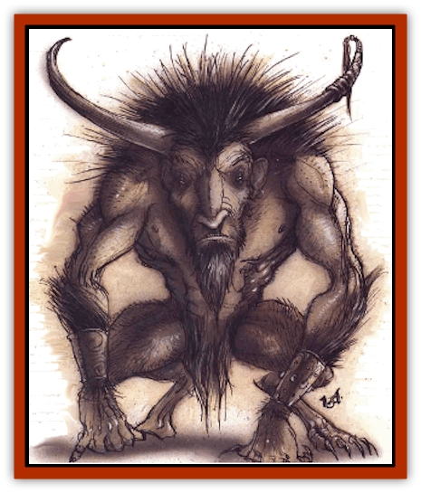

# Tanar'ri - Greater - Goristro

| Statistic | **Tanar'ri, Greater, Goristro** |
| --- | --- |
| **Activity Cycle:** | Any |
| **Alignment:** | Chaotic evil |
| **Armor Class:** | -2 |
| **Climate/Terrain:** | Abyss |
| **Damage/Attack:** | 6d4+6/6d4+6 and 5d8 |
| **Diet:** | Carnivore |
| **Frequency:** | Very rare |
| **Hit Dice:** | 20 |
| **Intelligence:** | Low (5-7) |
| **Magic Resistance:** | 60% |
| **Morale:** | Champion (15-16) |
| **Movement:** | 15 |
| **No. Appearing:** | 1 |
| **No. of Attacks:** | 2 and 1 |
| **Organization:** | Solitary |
| **Size:** | H (21-24' tall) |
| **Special Attacks:** | Spells, stamp, hurl boulders |
| **Special Defenses:** | Immunities, regenerate, +1 or better weapon to hit |
| **THAC0:** | 1 |
| **Treasure:** | B,C |
| **XP Value:** | 23,000 |

Collectively known as goristroi, these huge [[Tanar'ri_General_Information|tanar'ri]] can be found on nearly any plane of the Abyss, for they are adaptable and much desired by the rulers of the place to serve as engines of destruction. Abyssal lords and powers are able to command the goristroi and keep them serving as guardians, enforcers, siege engines, and so on. The hulking goristroi are too stupid and bestial to do more than carry out their orders, and thus their status never reaches that or the true tanar'ri.

Gorislroi are vaguely reminiscent of giant [[Bear|bears]], although their shoulder are broader, their visages a nightmarish cross beztween bison and human, and their hands and feet disproportionately large, splayed, and humanlike. Their arms are extremely long, like an ape's. Individual colors vary from dark brown through sickly greenish yellow to a peculiar purplish gray.

**Combat:** The attack mode of these monsters consists of two clubbing smashes with their long and very powerful arms for 6d4+6 points or damage each. Each is equal to a crushing blow, so material struck must be saved for. In addition, these brutes can make a stamping attack against any 6 feet tall or shorter opponent within 10 feet of them for 5d8 points of damage. They hurl boulders as [[Giant_Cloud|cloud giants]] (240 yard range for 2d12 points of damage).

In addition to standard tanar'ri abilities, goristroi have the following spell-like powers, which they can employ one at a time, one per round, at will: *detect invisibility*, *detect magic*, *fear* (as a wand, by gaze), *levitation*, and *spider climb*.

Even the lowliest of goristroi can be harmed only by +1 or better magical weapons. All of them are immune to cold, fire, poison, and poison gas. They regenerate 1 hit point per turn. They have infravision to 360 feet.

As noted in the statistics above, gorislroi gain 6 hit points per hit die in addition to whatever is rolled, giving each hit die a range of from 7-14 instead of the usual 1-8. Goristroi that have 140-160 hit points are only 21 feet tall and can be hit by magical weapons of +1 or better. Those with 161-200 hit points are 22 feet tall, and are also hit only by +1 or better weapons. If a goristro's hit points fall in the range of 201-240, the beast is 23 feet tall and is hit only by +2 or better weapons. The largest goristroi have 241-280 hit points, are 24 feet tall, and are hit only by +3 weapons or better.

**From the third volume of *Deception And Strategems*, by the [[Baatezu_Greater_Pit_Fiend|pit fiend]] Mellagorus:**

Though the lumbering goristroi are excellent at climbing sheer stone faces and though these assaults can break our fortications, such strategies also present us with an opportunity to destroy the beasts. Their powerful clawed fingers can make handholds in sheer stone, but their enormous size makes them vulnerable to falls, and they suffer twice the damage a smaller creature might from a fall. The goristroi are especially afraid of *Bigby's forceful hand*, *dig*, *fly*, *levitation*, and other spells that can push them off the heights to be broken on the rocks below or, even more amusingly, onto the weapons of their fellow tanar'ri. Weak-minded goristroi are also vulnerable to spells such as *cause fear*, *fear*, *symbol of fear*, and *repulsion*, which drive them off walls. For all these reasons, [[Yugoloth_Greater_Arcanaloth|arcanaloth]] are the best countermeasures to employ against goristroi assaults on an entrenched position on the height. Fools though they are, tanar'ri commanders rarely order a goristro over the walls unless the situation is desperate or a diversionary attack has drawn off most of the defenders. Take this as a sign of weakness and counterattack.

**Habitat/Society:** Usually solitary, goristroi are only important among their kin because of their ability to absorb damage and to mete it out. They are stupid and otherwise limited in power, unable even to *gate* in other tanar'ri. The vast majority of goristroi encountered are in the service of some Abyssal ruler, blindly carrying out the duties assigned to them with complete fanaticism. There is never a question of retreat or morale when dealing with these brutes, though the threat of long falls can induce paralysis on the field of action. In all other respects, they always continue to follow their given commands until completion or death occurs.

In the Blood War the goristroi serve as siege engines and rallying points for lesser tanar'ri, much as [[Elephant|elephants]] do among some prime-material worlds. A goristroi citadel is a platform strapped to the creature's head and shoulders like a helmet. The tanar'ri carries this citadel as a lesser creature might carry a knapsack; it hardly seems aware of it. The fortification usually provides excellent cover (-7 to AC) for two to four riders, depending on the size of the gorislroi.

**Again from Mellagorus' *Deception And Strategems*:**

Goristroi citadels are dangerous and best kept busy with cannon fodder and inferior troops, but if they can be broken the lesser troops surrounding them are usually routed. The best way to accomplish this is to harry a goristro from two directions. The retarded behemoth will turn from one attack to the other, unconscious of the fact that its rapid movements are shaking and battering the creatures within the citadel to death. At this point flying troops such as [[Baatezu_Lesser_Abishai|abishai]] can take the citadel and slay the goristro by a surgical strike to the neck with axes, polearms, and cleavers.

Goristroi ruled by an Abyssal lord or power always wear some symbol of servitude, such as a collar, an arm or wrist band, or an implanted symbol. Such devices zypically have the power to conves telepathic commands to the wearer as well as serve as tracking devices should the masters wish to know the whereabouts of their servants. Without direct command or supervision, goristroi tend to wander off on destructive rampages of their own direction and desire.

Goristroi do not breed naturally. They are carefully mated by their owners after extensive negotiations, eventually resulting in a single young. The goristroi are carefully watched throughout the entire process, for fear of foul play by the other side, such as an attempt to slay these valuable beasts. Generally, the terms are that the owner of the male goristroi gains the female young, and the owner of the mother is entitled to the male young produced. The young grow to maturity within five voracious, screaming years. This allows the lucky owner to breed further young on his own, albeit inbred ones. However, abductions, infanticide (if the young is the wrong gender), and even outright purchases of the live young are fairy common. Under no circumstances are the parents allowed to have any influence on the young goristro.

**Ecology:** Goristroi are predators that make no distinction between various types of prey. They eat anything that moves, even among their own kind, devouring lesser tanar'ri when their dim minds believe no one is watching. They are exclusively carnivorous, unable to eat vegetable matter even if no other food is available. If forced to go without living or recently slain meat, goristroi wither and die within two weeks, so tanar'ri commanders usually sacrifice lesser troops for the sake of keeping their citadels going.

Goristroi flesh is itself poisonous if ingested, so not even powerful planar creatures or pack hunters like [[Troll|trolls]] and [[Tanar'ri_Lesser_Armanite|armanites]] attack them.

---
## Discovery & Documentation

**Source Publication:** Planes of Chaos (1994)
**Campaign Setting:** Planescape
**Author(s):** Wolfgang Baur, L. W. Smith

### Other Creatures Found in This Source Book
   * [[Asrai|Asrai]]
   * [[Astral_Dreadnought|Astral Dreadnought]]
   * [[Bacchae|Bacchae]]
   * [[Chaos_Beast|Chaos Beast]]
   * [[Fensir|Fensir]]
   * [[Abyssal_Lord|Abyssal Lord]]
   * [[Howler|Howler]]
   * [[Imp_Chaos|Imp, Chaos]]
   * [[Lillend|Lillend]]
   * [[Murska|Murska]]
   * [[Oread|Oread]]
   * [[Ratatosk|Ratatosk]]
   * [[Tanar'ri_Lesser_Armanite|Tanar'ri, Lesser, Armanite]]
   * [[Varrangoin|Varrangoin]]
   * [[Viper_Tree|Viper Tree]]
