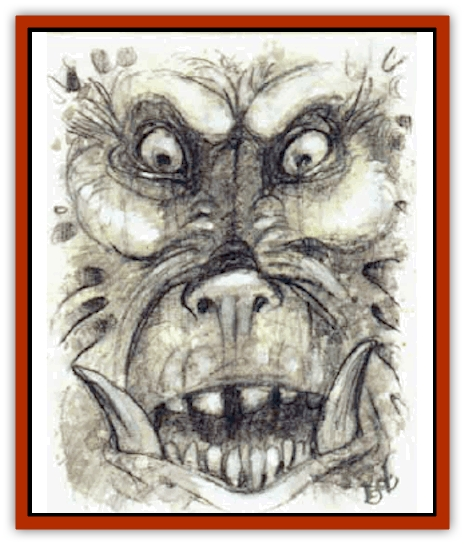
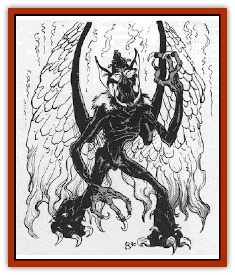

# Tanar'ri - Greater - Nabassu

| Statistic | **Tanar'ri, Greater, Nabassu** |
| --- | --- |
| **Activity Cycle:** | Any |
| **Alignment:** | Chaotic evil |
| **Armor Class:** | 4 to -5 |
| **Climate/Terrain:** | The Abyss or Prime |
| **Damage/Attack:** | 2d4/2d4/3d4 or weapon +7 (Strength bonus) |
| **Diet:** | Carnivore |
| **Frequency:** | Very rare |
| **Hit Dice:** | 7+2 to 7+20 |
| **Intelligence:** | High (13-14) |
| **Magic Resistance:** | 50% |
| **Morale:** | Champion (15-16) |
| **Movement:** | 12, Fl 15 (C) |
| **No. Appearing:** | 1 |
| **No. of Attacks:** | 3 |
| **Organization:** | Solitary |
| **Size:** | M (7' tall) |
| **Special Attacks:** | Death gaze, backstab, paralyzation |
| **Special Defenses:** | +1 or better weapon to hit |
| **THAC0:** | 13 |
| **Treasure:** | Q&times;10 |
| **XP Value:** | Mature: 16,000 / Fledgling: 8-11,000 |

Nabassu are creatures spawned in the Abyss but nurtured on other planes, where they grow and gain power by slaying and devouring humans. They communicate using telepathy.

Nabassu, unmistakably fiends, are [[Gargoyle_I|gargoylish]] in appearance, standing 7' tall. They are gaunt with leathery  wings, tightly corded muscles, long claws on hands and feet, steely gray eyes, and a wide mouth lined with sharp fangs.

**Combat:** Nabassu go through two distinct phases, fledgling and mature, that have different combat abilities. However, in both phases the nabassu can attack with two claws (2d4 damage each) and bite (3d4 damage). They can attack with magic but prefer natural attacks, especially against a helpless enemy. These create greater terror in the victim and, therefore, greater pleasure for the nabassu.

**Fledgling**

Fledglings begin life with AC 4 and 7 Hit Dice. When they enter another plane (usually the Outlands or the Prime), they gain 2 more hp. Each victim killed and eaten on the foreign plane adds 1 hp and a "half factor" of AC. For example, a fledgling that devours two humans would have 7+4 HD and AC 3. After 18 meals it reaches full growth (AC -5 and 7+20 HD).

Immature nabassu do not gain the spell-like abilities available to other [[Tanar'ri_General_Information|tanar'ri]] but have the following spell-like abilities: *darkness, 15' radius* and its *death gaze* (once per day). The death gaze forces the target to save vs. spell or transform, over 10 days, into a [[Ghoul|ghast]] (or [[Ghoul|ghoul]] if the victim is a demihuman). The death of the nabassu or a *remove curse* spell reverses the process, but once the process is complete, the change is irrevocable.

Immature nabassu also have some thief abilities: move silently (40%), hide in shadows (50%), detect noise (55%), and backstab (x2). They are affected only by attacks from magic or cold-wrought iron weapons. Nabassu have Strength 19 (+7 damage adjustment).

**Habitat/Society:** Nabassu are a scourge of humanity. They are the only fiends that live a part of their lives on a foreign plane. Unlike other tanar'ri, nabassu seem to have no place in the Blood War. Once they return to the Abyss from their tour of carnage on the Prime Material, they will reside in one of the fortress of the Abyss for the rest of their immortal existence.

**Ecology:** What role these monsters play is unknown. Perhaps the slaying of humans and spilling of innocent blood somehow bring the tanar'ri power.

---
## Discovery & Documentation

**Source Publication:** MC8 Outer Planes Appendix (1990)
**Campaign Setting:** Planescape
**Author(s):** Timothy B. Brown, Jamie LaFountain

### Other Creatures Found in This Source Book
   * [[Aasimon_Agathinon|Aasimon, Agathinon]]
   * [[Aasimon_Deva|Aasimon, Deva]]
   * [[Aasimon_Light|Aasimon, Light]]
   * [[Aasimon_General_Information|Aasimon, General Information]]
   * [[Aasimon_Planetar|Aasimon, Planetar]]
   * [[Aasimon_Solar|Aasimon, Solar]]
   * [[Air_Sentinel|Air Sentinel]]
   * [[Animal_Lord|Animal Lord]]
   * [[Archon|Archon]]
   * [[Baatezu_Lesser_Abishai|Baatezu, Lesser, Abishai]]
   * [[Baatezu_Greater_Amnizu|Baatezu, Greater, Amnizu]]
   * [[Baatezu_Lesser_Barbazu|Baatezu, Lesser, Barbazu]]
   * [[Baatezu_Greater_Cornugon|Baatezu, Greater, Cornugon]]
   * [[Baatezu_Lesser_Erinyes|Baatezu, Lesser, Erinyes]]
   * [[Baatezu_General_Information|Baatezu, General Information]]
   * [[Baatezu_Greater_Gelugon|Baatezu, Greater, Gelugon]]
   * [[Baatezu_Lesser_Hamatula|Baatezu, Lesser, Hamatula]]
   * [[Baatezu_Lemure|Baatezu, Lemure]]
   * [[Baatezu_Least_Nupperibo|Baatezu, Least, Nupperibo]]
   * [[Baatezu_Lesser_Osyluth|Baatezu, Lesser, Osyluth]]
   * [[Baatezu_Greater_Pit_Fiend|Baatezu, Greater, Pit Fiend]]
   * [[Baatezu_Least_Spinagon|Baatezu, Least, Spinagon]]
   * [[Balaena|Balaena]]
   * [[Bariaur|Bariaur]]
   * [[Bebilith|Bebilith]]
   * [[Bodak|Bodak]]
   * [[Dog_Moon|Dog, Moon]]
   * [[Dragon_Adamantite|Dragon, Adamantite]]
   * [[Einheriar|Einheriar]]
   * [[Gehreleth|Gehreleth]]
   * [[Githyanki|Githyanki]]
   * [[Githzerai|Githzerai]]
   * [[Hordling|Hordling]]
   * [[Lammasu_Celestial|Lammasu, Celestial]]
   * [[Larva|Larva]]
   * [[Maelephant|Maelephant]]
   * [[Marut|Marut]]
   * [[Mediator|Mediator]]
   * [[Mortai|Mortai]]
   * [[Night_Hag|Night Hag]]
   * [[Nightmare|Nightmare]]
   * [[Noctral|Noctral]]
   * [[Per|Per]]
   * [[Phoenix|Phoenix]]
   * [[Slaad|Slaad]]
   * [[Tanar'ri_Greater_Babau|Tanar'ri, Greater, Babau]]
   * [[Tanar'ri_Greater_Chasme|Tanar'ri, Greater, Chasme]]
   * [[Tanar'ri_Least_Dretch|Tanar'ri, Least, Dretch]]
   * [[Tanar'ri_Least_Manes|Tanar'ri, Least, Manes]]
   * [[Tanar'ri_Least_Rutterkin|Tanar'ri, Least, Rutterkin]]
   * [[Tanar'ri_Lesser_Alu-Fiend|Tanar'ri, Lesser, Alu-Fiend]]
   * [[Tanar'ri_Lesser_Bar-Lgura|Tanar'ri, Lesser, Bar-Lgura]]
   * [[Tanar'ri_Lesser_Cambion|Tanar'ri, Lesser, Cambion]]
   * [[Tanar'ri_Lesser_Succubus|Tanar'ri, Lesser, Succubus]]
   * [[Tanar'ri_Guardian_Molydeus|Tanar'ri, Guardian, Molydeus]]
   * [[Tanar'ri_General_Information|Tanar'ri, General Information]]
   * [[Tanar'ri_True_Balor|Tanar'ri, True, Balor]]
   * [[Tanar'ri_True_Glabrezu|Tanar'ri, True, Glabrezu]]
   * [[Tanar'ri_True_Hezrou|Tanar'ri, True, Hezrou]]
   * [[Tanar'ri_True_Marilith|Tanar'ri, True, Marilith]]
   * [[Tanar'ri_True_Nalfeshnee|Tanar'ri, True, Nalfeshnee]]
   * [[Tanar'ri_True_Vrock|Tanar'ri, True, Vrock]]
   * [[Titan|Titan]]
   * [[Translator|Translator]]
   * [[T'uen-rin|T'uen-rin]]
   * [[Vaporighu|Vaporighu]]
   * [[Warden_Beast|Warden Beast]]
   * [[Yugoloth_Greater_Arcanaloth|Yugoloth, Greater, Arcanaloth]]
   * [[Yugoloth_Lesser_Dergoloth|Yugoloth, Lesser, Dergoloth]]
   * [[Yugoloth_Lesser_Hydroloth|Yugoloth, Lesser, Hydroloth]]
   * [[Yugoloth_General_Information|Yugoloth, General Information]]
   * [[Yugoloth_Lesser_Mezzoloth|Yugoloth, Lesser, Mezzoloth]]
   * [[Yugoloth_Greater_Nycaloth|Yugoloth, Greater, Nycaloth]]
   * [[Yugoloth_Lesser_Piscoloth|Yugoloth, Lesser, Piscoloth]]
   * [[Yugoloth_Greater_Ultroloth|Yugoloth, Greater, Ultroloth]]
   * [[Yugoloth_Lesser_Yagnoloth|Yugoloth, Lesser, Yagnoloth]]
   * [[Zoveri|Zoveri]]
