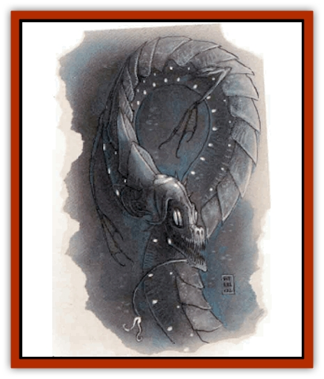
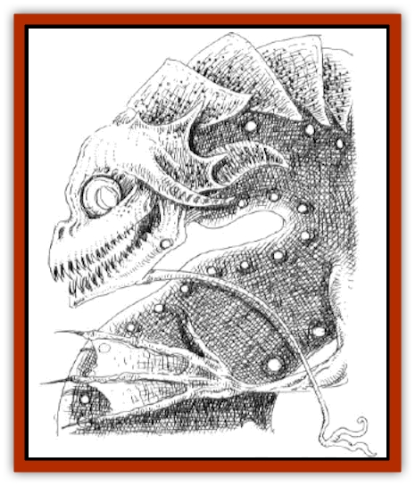

# Tanar'ri - Greater - Wastrilith

| Statistic | **Tanar'ri, Greater, Wastrilith** |
| --- | --- |
| **Activity Cycle:** | Any |
| **Alignment:** | Chaotic evil |
| **Armor Class:** | -1 |
| **Climate/Terrain:** | Water |
| **Damage/Attack:** | 1d8/1d8/1d12 |
| **Diet:** | Nil |
| **Frequency:** | Very rare |
| **Hit Dice:** | 15 |
| **Intelligence:** | High (13-14) |
| **Magic Resistance:** | 25% |
| **Morale:** | Fanatic (17-18) |
| **Movement:** | 9, sw 15 |
| **No. Appearing:** | 1 |
| **No. of Attacks:** | 3 |
| **Organization:** | Solitary |
| **Size:** | L (10' tall) |
| **Special Attacks:** | See below |
| **Special Defenses:** | See below |
| **THAC0:** | 5 |
| **Treasure:** | 25-50,000 gp |
| **XP Value:** | 19,000 |

The standoffish wastrilith, or water lords, inhabit watery parts of the Lower Planes (and, rarely, other planes), content in their isolation. Though they have no apparent magical power over other creatures, they intimidate undersea denizens so much that even unintelligent creatures serve them. Wastrilith are horrendous creatures with jaws full of needle-sharp teeth. Their bulging eyes give them the appearance of leering fish with humanoid torsos.

**Combat:** Wastrilith are canny opponents, rarely giving their enemies advantage and certainly no quarter. Because they do not believe in suffering needlessly, they send their minions forth to combat enemies: 2d6 [[Shark|sharks]], 3d6 [[Sahuagin|sahuagin]], 1d4 [[Ixitxachitl|ixitxachitl]], or 1d3 [[Elemental_Fire_Water|water elementals]]. As long as the minions continue the attack and the fiend itself is not threatened, it lets them fight by themselves.

A wastrilith can breathe a blast of boiling water three times per day in a cone 30' long with a 10' diameter base (3d10 damage). They can attack with two claws (1d8 damage each) and bite (1d12 damage).

Electrical attacks inflict full damage. However, due to the water lords' nature, such attacks reach them only half the time; the other half rebound on the caster, causing full damage. Fire-based attacks inflict double full damage if the fiend has left the water, but none if the creature remains fully immersed.

Water- and cold-based attacks cause no damage to the wastrilith. In addition, water elementals sent against the fiend do not attack it. Indeed, a water lord has a 50% chance of wresting control of water elementals from the summoner, as long as the water elementals have approached within 100'of it.

**Habitat/Society:** Wastrilith are territorial and do not allow other powerful creatures to establish themselves nearby. Once they have established their territory, they do not stray far from it. They protect what is theirs and don't meddle in matters outside their territory. Many are found on the 88th level of the Abyss, the Maw of Demogorgon, a watery plane that is dark and cold.

Wastrilith require no conventional food or drink, but they enjoy devouring creatures foolish enough to venture near their homes. They leave the remains outside to feed sharks and warn away other curiosity seekers.

**Ecology:** Wastrilith are nasty-tempered and try to break free of the bonds imposed by spellcasters. There is a 20% chance that a summoned wastrilith ignores the wishes of the summoner, kills him, and rampages until such time as it wearies of the plane. Until that time comes, the water lord can amass considerable power beneath the waves, creating havoc in the area. It is unknown why wastrilith do this, inasmuch as they rarely take their treasure back to their home plane.

On the Prime Material, a wastrilith's territory typically includes a 25-mile diameter circle, at the center of which is the fiend's palace. The palace can be a marvel of undersea engineering or a simple hole in a coral reef. A wastrilith that has not established its territory will often terrorize shipping in the area, destroying boats on a whim and driving out such creatures as [[Dragon_Sea|sea dragons]] and [[Elf_Aquatic|aquatic elves]].

---
## Discovery & Documentation

**Source Publication:** Dragon Mountain (1993)
**Campaign Setting:** Advanced Dungeons & Dragons 2nd Edition
**Author(s):** Colin McComb, Paul Arden Lidberg

### Other Creatures Found in This Source Book
   * [[Dragon-kin|Dragon-kin]]
   * [[Elemental_Earth_Kin_Earth_Weird|Elemental, Earth Kin, Earth Weird]]
   * [[Gnasher|Gnasher]]
   * [[Gnasher_Winged|Gnasher, Winged]]
   * [[Kobold_Dragon_Mountain|Kobold, Dragon Mountain]]
   * [[Living_Steel|Living Steel]]
   * [[Noran|Noran]]
   * [[Ophidian|Ophidian]]
   * [[Rautym|Rautym]]
   * [[Spider_Brain|Spider, Brain]]
   * [[Squeaker|Squeaker]]
   * [[Stone_Snake|Stone Snake]]
   * [[Suwyze|Suwyze]]
   * [[Undead_Dwarf|Undead Dwarf]]
