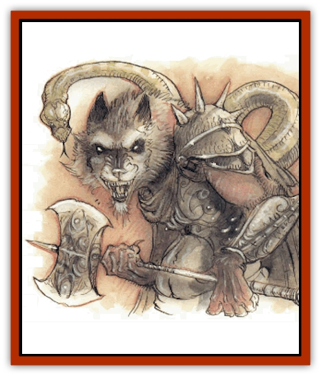
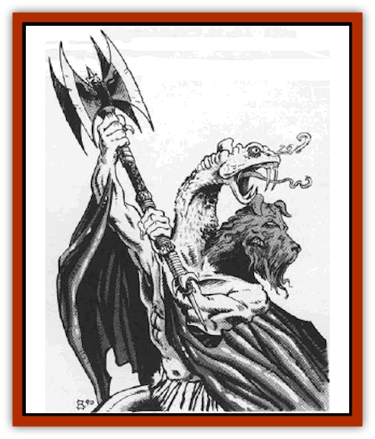

# Tanar'ri - Guardian - Molydeus

| Statistic | **Tanar'ri, Guardian, Molydeus** |
| --- | --- |
| **Activity Cycle:** | Any |
| **Alignment:** | Chaotic evil |
| **Armor Class:** | -5 |
| **Climate/Terrain:** | The Abyss |
| **Damage/Attack:** | 2d6/1d6/battle axe (2d10+5) |
| **Diet:** | Carnivore |
| **Frequency:** | Rare |
| **Hit Dice:** | 12 |
| **Intelligence:** | High to exceptional (15-16) |
| **Magic Resistance:** | 90% |
| **Morale:** | Fearless (19-20) |
| **Movement:** | 15 |
| **No. Appearing:** | 1 |
| **No. of Attacks:** | 3 |
| **Organization:** | Solitary |
| **Size:** | H (12' tall) |
| **Special Attacks:** | Vorpal and dancing battle axe, poison |
| **Special Defenses:** | Cold iron weapons to hit, never surprised |
| **THAC0:** | 9 |
| **Treasure:** | Nil |
| **XP Value:** | 21,000 |

The only guardian [[Tanar'ri_General_Information|tanar'ri]], the molydeus enforces the war effort as a sort of political officer.

Molydei are powerful, muscular humanoids with dark red skin. They could be mistaken for giant red men, except for their two grotesque heads. One is a snarling [[Dog|dog's]] head that misses nothing in front of it. The other, a long prehensile [[Snake|snake]] head, observes everything that happens behind it. These creatures carry ornate twin-bladed battleaxes.

Molydei have a form of *ESP* that lets them communicate with intelligent creatures and read the thoughts of others.

**Combat:** A molydeus is never surprised. It attacks fearlessly and seldom retreats. Its enchanted axe inflicts 2d10 damage per hit and is +5 to both attack and damage rolls. The axe has the powers of a *vorpal weapon* and a *dancing sword*.

Molydei also attack with both heads. The dog head inflicts 2d6 damage; the snake head does 1d6 damage and injects a powerful venom (save vs. poison or transform into a [[Tanar'ri_Least_Manes|manes]] in 1d6 turns). A *neutralize poison* spell followed by *remove curse* eliminates the poison. Once transformed, the victim is beyond restoration, short of divine intervention or a very carefully worded *wish*.

In addition to those available to all tanar'ri, a molydeus has the following spell-like abilities: *affect normal fires*, *animate object*, *blindness*, *charm person or mammal*, *command*, *Evard's black tentacles*, *fear*, *improved invisibility*, *know alignment*, *lightning bolt* (7 times per day), *polymorph other*, *sleep*, *suggestion*, *true seeing* (always active), and *vampiric touch*. Molydei can also *gate* in 1 molydeus, 1-2 [[Tanar'ri_Greater_Chasme|chasme]], or 1-4 [[Tanar'ri_Greater_Babau|babau]] once per hour with a 35% chance of success.

Molydei are immune to damage by most normal or magical weapons. Only cold-wrought iron weapons and magical spells can affect these creatures.

When a molydeus dies, its axe disappears. The only way to get this powerful weapon is to take it from a living molydeus. A molydeus does not rest until it recovers its weapon, stalking the thief day and night without end until the axe is recovered and the thief horribly killed.

**Habitat/Society:** The molydei are the greatest enigma in the Abyss. These powerful police wander the layers of the Abyss and search for true tanar'ri that stray from the cause of the Blood War. They report directly to the [[Tanar'ri_True_Balor|balors]], but even balors are not above reproach, and the molydei would turn against one that strays.

**Ecology:** By enforcing the loyalty of the true tanar'ri, the molydei play an important role in the Blood War. These creatures exist only to serve the cause. They have no loyalty towards any tanar'ri and will try to destroy any of them at the slightest sign of infidelity. They do not enforce their doctrine on nontrue tanar'ri, for they assume that these are all disloyal by nature, and that only constant threats and punishments keep them in line.

---
## Discovery & Documentation

**Source Publication:** MC8 Outer Planes Appendix (1990)
**Campaign Setting:** Planescape
**Author(s):** Timothy B. Brown, Jamie LaFountain

### Other Creatures Found in This Source Book
   * [[Aasimon_Agathinon|Aasimon, Agathinon]]
   * [[Aasimon_Deva|Aasimon, Deva]]
   * [[Aasimon_Light|Aasimon, Light]]
   * [[Aasimon_General_Information|Aasimon, General Information]]
   * [[Aasimon_Planetar|Aasimon, Planetar]]
   * [[Aasimon_Solar|Aasimon, Solar]]
   * [[Air_Sentinel|Air Sentinel]]
   * [[Animal_Lord|Animal Lord]]
   * [[Archon|Archon]]
   * [[Baatezu_Lesser_Abishai|Baatezu, Lesser, Abishai]]
   * [[Baatezu_Greater_Amnizu|Baatezu, Greater, Amnizu]]
   * [[Baatezu_Lesser_Barbazu|Baatezu, Lesser, Barbazu]]
   * [[Baatezu_Greater_Cornugon|Baatezu, Greater, Cornugon]]
   * [[Baatezu_Lesser_Erinyes|Baatezu, Lesser, Erinyes]]
   * [[Baatezu_General_Information|Baatezu, General Information]]
   * [[Baatezu_Greater_Gelugon|Baatezu, Greater, Gelugon]]
   * [[Baatezu_Lesser_Hamatula|Baatezu, Lesser, Hamatula]]
   * [[Baatezu_Lemure|Baatezu, Lemure]]
   * [[Baatezu_Least_Nupperibo|Baatezu, Least, Nupperibo]]
   * [[Baatezu_Lesser_Osyluth|Baatezu, Lesser, Osyluth]]
   * [[Baatezu_Greater_Pit_Fiend|Baatezu, Greater, Pit Fiend]]
   * [[Baatezu_Least_Spinagon|Baatezu, Least, Spinagon]]
   * [[Balaena|Balaena]]
   * [[Bariaur|Bariaur]]
   * [[Bebilith|Bebilith]]
   * [[Bodak|Bodak]]
   * [[Dog_Moon|Dog, Moon]]
   * [[Dragon_Adamantite|Dragon, Adamantite]]
   * [[Einheriar|Einheriar]]
   * [[Gehreleth|Gehreleth]]
   * [[Githyanki|Githyanki]]
   * [[Githzerai|Githzerai]]
   * [[Hordling|Hordling]]
   * [[Lammasu_Celestial|Lammasu, Celestial]]
   * [[Larva|Larva]]
   * [[Maelephant|Maelephant]]
   * [[Marut|Marut]]
   * [[Mediator|Mediator]]
   * [[Mortai|Mortai]]
   * [[Night_Hag|Night Hag]]
   * [[Nightmare|Nightmare]]
   * [[Noctral|Noctral]]
   * [[Per|Per]]
   * [[Phoenix|Phoenix]]
   * [[Slaad|Slaad]]
   * [[Tanar'ri_Greater_Babau|Tanar'ri, Greater, Babau]]
   * [[Tanar'ri_Greater_Chasme|Tanar'ri, Greater, Chasme]]
   * [[Tanar'ri_Greater_Nabassu|Tanar'ri, Greater, Nabassu]]
   * [[Tanar'ri_Least_Dretch|Tanar'ri, Least, Dretch]]
   * [[Tanar'ri_Least_Manes|Tanar'ri, Least, Manes]]
   * [[Tanar'ri_Least_Rutterkin|Tanar'ri, Least, Rutterkin]]
   * [[Tanar'ri_Lesser_Alu-Fiend|Tanar'ri, Lesser, Alu-Fiend]]
   * [[Tanar'ri_Lesser_Bar-Lgura|Tanar'ri, Lesser, Bar-Lgura]]
   * [[Tanar'ri_Lesser_Cambion|Tanar'ri, Lesser, Cambion]]
   * [[Tanar'ri_Lesser_Succubus|Tanar'ri, Lesser, Succubus]]
   * [[Tanar'ri_General_Information|Tanar'ri, General Information]]
   * [[Tanar'ri_True_Balor|Tanar'ri, True, Balor]]
   * [[Tanar'ri_True_Glabrezu|Tanar'ri, True, Glabrezu]]
   * [[Tanar'ri_True_Hezrou|Tanar'ri, True, Hezrou]]
   * [[Tanar'ri_True_Marilith|Tanar'ri, True, Marilith]]
   * [[Tanar'ri_True_Nalfeshnee|Tanar'ri, True, Nalfeshnee]]
   * [[Tanar'ri_True_Vrock|Tanar'ri, True, Vrock]]
   * [[Titan|Titan]]
   * [[Translator|Translator]]
   * [[T'uen-rin|T'uen-rin]]
   * [[Vaporighu|Vaporighu]]
   * [[Warden_Beast|Warden Beast]]
   * [[Yugoloth_Greater_Arcanaloth|Yugoloth, Greater, Arcanaloth]]
   * [[Yugoloth_Lesser_Dergoloth|Yugoloth, Lesser, Dergoloth]]
   * [[Yugoloth_Lesser_Hydroloth|Yugoloth, Lesser, Hydroloth]]
   * [[Yugoloth_General_Information|Yugoloth, General Information]]
   * [[Yugoloth_Lesser_Mezzoloth|Yugoloth, Lesser, Mezzoloth]]
   * [[Yugoloth_Greater_Nycaloth|Yugoloth, Greater, Nycaloth]]
   * [[Yugoloth_Lesser_Piscoloth|Yugoloth, Lesser, Piscoloth]]
   * [[Yugoloth_Greater_Ultroloth|Yugoloth, Greater, Ultroloth]]
   * [[Yugoloth_Lesser_Yagnoloth|Yugoloth, Lesser, Yagnoloth]]
   * [[Zoveri|Zoveri]]
