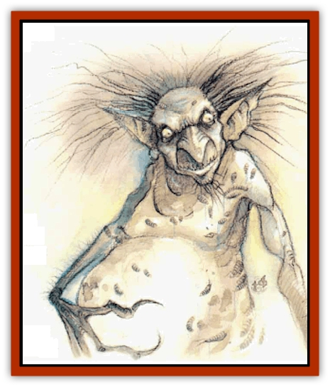
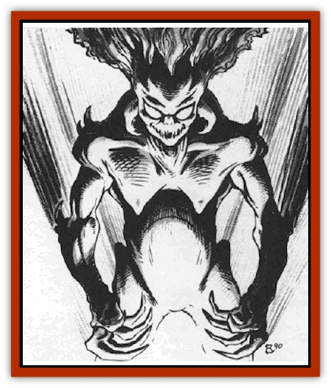

# Tanar'ri - Least - Manes

| Statistic | **Tanar'ri, Least, Manes** |
| --- | --- |
| **Activity Cycle:** | Any |
| **Alignment:** | Chaotic evil |
| **Armor Class:** | 8 |
| **Climate/Terrain:** | The Abyss |
| **Damage/Attack:** | 1d2/1d2/1d4 or by weapon |
| **Diet:** | Carnivore |
| **Frequency:** | Common |
| **Hit Dice:** | 1 |
| **Intelligence:** | Semi- (2-4) |
| **Magic Resistance:** | 10% |
| **Morale:** | See below |
| **Movement:** | 6 |
| **No. Appearing:** | 50-500 |
| **No. of Attacks:** | 3 |
| **Organization:** | Horde |
| **Size:** | S (3' tall) |
| **Special Attacks:** | Acidic vapor |
| **Special Defenses:** | Immune to mind-affecting spells |
| **THAC0:** | 20 |
| **Treasure:** | Nil |
| **XP Value:** | 975 |

Manes are the most pathetic beings on the lower layers of the Abyss, vast and endless as the layers themselves. They have pale white skin that appears bloated. Manes have long, cruel claws; sharp teeth; sparse hair; and pale white eyes that constantly drip disgusting liquids. Their bodies crawl with carrion creatures that literally feed on them.

Manes cannot communicate.

**Combat:** Manes are nearly mindless, senseless creatures. They are immune to mind-affecting spells. They wander the Abyss in endless hordes, attacking all non-[[Tanar'ri_General_Information|tanar'ri]] they encounter with two raking claws (1d2 damage each) and bite (1d4 damage).

When formed into legions, manes carry maces (1d8 damage). One major problem with arming the manes, however, is that they quickly forget how to use the maces, drop them, and fight with claws and teeth.

These creatures disregard their own existence. They never check morale and fight until slain. Killing a manes simply dissipates it into a noxious, stinking vapor that reforms in 24 hours. Anyone within 10' of a manes when it dies must save vs. poison or sustain 1d6 damage from the acidic vapor.

**Habitat/Society:** Manes travel in gibbering, snarling hordes that sometimes number in the thousands. Physically weak, they attack in such great numbers that non-tanar'ri fear them.

These wretched armies are difficult to maintain, for the manes are literally too stupid to understand commands. They can temporarily form a regiment, but they eventually wander about aimlessly, paying no heed to orders. If brought to a battle, however, they make excellent soldiers; once they see the enemy, they attack tirelessly. Sometimes they attack even when such a tactic does not favor their army, but such is war in the Abyss.

In the Abyss, manes are viewed as sub-tanar'ric and scorned by everything there. This does not bother the witless manes.

Like the [[Tanar'ri_Least_Dretch|dretches]], the manes represent a major fighting force that is highly expendable. Unaware of their position in the Blood War, the manes have no way to improve the cruel treatment they receive.

**Ecology:** When chaotic evil mortals from the Prime Material Plane die, their spirits go to the Abyss and become manes. Those who were particularly cruel and evil in life are confined to the Pits of Despair on the 400th layer of the Abyss. Of this place, wizards and sages know only the name, because none have ever seen it. The Pits are thought to be hidden beneath the Mountain of Woe, but again, little is known.

The lowly manes, plentiful and weak, have the dubious honor of serving as the primary food source in the Abyss. When a manes is eaten, it is destroyed utterly and will not reform.

---
## Discovery & Documentation

**Source Publication:** MC8 Outer Planes Appendix (1990)
**Campaign Setting:** Planescape
**Author(s):** Timothy B. Brown, Jamie LaFountain

### Other Creatures Found in This Source Book
   * [[Aasimon_Agathinon|Aasimon, Agathinon]]
   * [[Aasimon_Deva|Aasimon, Deva]]
   * [[Aasimon_Light|Aasimon, Light]]
   * [[Aasimon_General_Information|Aasimon, General Information]]
   * [[Aasimon_Planetar|Aasimon, Planetar]]
   * [[Aasimon_Solar|Aasimon, Solar]]
   * [[Air_Sentinel|Air Sentinel]]
   * [[Animal_Lord|Animal Lord]]
   * [[Archon|Archon]]
   * [[Baatezu_Lesser_Abishai|Baatezu, Lesser, Abishai]]
   * [[Baatezu_Greater_Amnizu|Baatezu, Greater, Amnizu]]
   * [[Baatezu_Lesser_Barbazu|Baatezu, Lesser, Barbazu]]
   * [[Baatezu_Greater_Cornugon|Baatezu, Greater, Cornugon]]
   * [[Baatezu_Lesser_Erinyes|Baatezu, Lesser, Erinyes]]
   * [[Baatezu_General_Information|Baatezu, General Information]]
   * [[Baatezu_Greater_Gelugon|Baatezu, Greater, Gelugon]]
   * [[Baatezu_Lesser_Hamatula|Baatezu, Lesser, Hamatula]]
   * [[Baatezu_Lemure|Baatezu, Lemure]]
   * [[Baatezu_Least_Nupperibo|Baatezu, Least, Nupperibo]]
   * [[Baatezu_Lesser_Osyluth|Baatezu, Lesser, Osyluth]]
   * [[Baatezu_Greater_Pit_Fiend|Baatezu, Greater, Pit Fiend]]
   * [[Baatezu_Least_Spinagon|Baatezu, Least, Spinagon]]
   * [[Balaena|Balaena]]
   * [[Bariaur|Bariaur]]
   * [[Bebilith|Bebilith]]
   * [[Bodak|Bodak]]
   * [[Dog_Moon|Dog, Moon]]
   * [[Dragon_Adamantite|Dragon, Adamantite]]
   * [[Einheriar|Einheriar]]
   * [[Gehreleth|Gehreleth]]
   * [[Githyanki|Githyanki]]
   * [[Githzerai|Githzerai]]
   * [[Hordling|Hordling]]
   * [[Lammasu_Celestial|Lammasu, Celestial]]
   * [[Larva|Larva]]
   * [[Maelephant|Maelephant]]
   * [[Marut|Marut]]
   * [[Mediator|Mediator]]
   * [[Mortai|Mortai]]
   * [[Night_Hag|Night Hag]]
   * [[Nightmare|Nightmare]]
   * [[Noctral|Noctral]]
   * [[Per|Per]]
   * [[Phoenix|Phoenix]]
   * [[Slaad|Slaad]]
   * [[Tanar'ri_Greater_Babau|Tanar'ri, Greater, Babau]]
   * [[Tanar'ri_Greater_Chasme|Tanar'ri, Greater, Chasme]]
   * [[Tanar'ri_Greater_Nabassu|Tanar'ri, Greater, Nabassu]]
   * [[Tanar'ri_Least_Dretch|Tanar'ri, Least, Dretch]]
   * [[Tanar'ri_Least_Rutterkin|Tanar'ri, Least, Rutterkin]]
   * [[Tanar'ri_Lesser_Alu-Fiend|Tanar'ri, Lesser, Alu-Fiend]]
   * [[Tanar'ri_Lesser_Bar-Lgura|Tanar'ri, Lesser, Bar-Lgura]]
   * [[Tanar'ri_Lesser_Cambion|Tanar'ri, Lesser, Cambion]]
   * [[Tanar'ri_Lesser_Succubus|Tanar'ri, Lesser, Succubus]]
   * [[Tanar'ri_Guardian_Molydeus|Tanar'ri, Guardian, Molydeus]]
   * [[Tanar'ri_General_Information|Tanar'ri, General Information]]
   * [[Tanar'ri_True_Balor|Tanar'ri, True, Balor]]
   * [[Tanar'ri_True_Glabrezu|Tanar'ri, True, Glabrezu]]
   * [[Tanar'ri_True_Hezrou|Tanar'ri, True, Hezrou]]
   * [[Tanar'ri_True_Marilith|Tanar'ri, True, Marilith]]
   * [[Tanar'ri_True_Nalfeshnee|Tanar'ri, True, Nalfeshnee]]
   * [[Tanar'ri_True_Vrock|Tanar'ri, True, Vrock]]
   * [[Titan|Titan]]
   * [[Translator|Translator]]
   * [[T'uen-rin|T'uen-rin]]
   * [[Vaporighu|Vaporighu]]
   * [[Warden_Beast|Warden Beast]]
   * [[Yugoloth_Greater_Arcanaloth|Yugoloth, Greater, Arcanaloth]]
   * [[Yugoloth_Lesser_Dergoloth|Yugoloth, Lesser, Dergoloth]]
   * [[Yugoloth_Lesser_Hydroloth|Yugoloth, Lesser, Hydroloth]]
   * [[Yugoloth_General_Information|Yugoloth, General Information]]
   * [[Yugoloth_Lesser_Mezzoloth|Yugoloth, Lesser, Mezzoloth]]
   * [[Yugoloth_Greater_Nycaloth|Yugoloth, Greater, Nycaloth]]
   * [[Yugoloth_Lesser_Piscoloth|Yugoloth, Lesser, Piscoloth]]
   * [[Yugoloth_Greater_Ultroloth|Yugoloth, Greater, Ultroloth]]
   * [[Yugoloth_Lesser_Yagnoloth|Yugoloth, Lesser, Yagnoloth]]
   * [[Zoveri|Zoveri]]
