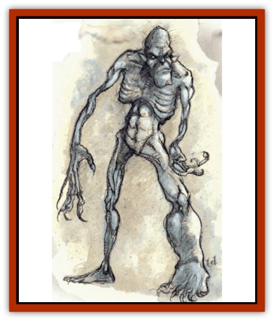
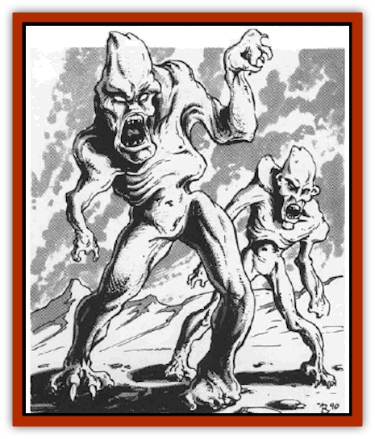

# Tanar'ri - Least - Rutterkin

| Statistic | **Tanar'ri, Least, Rutterkin** |
| --- | --- |
| **Activity Cycle:** | Any |
| **Alignment:** | Chaotic evil |
| **Armor Class:** | 0 |
| **Climate/Terrain:** | The Abyss |
| **Damage/Attack:** | By weapon or 1d6+1/1d6+1 |
| **Diet:** | Carnivore |
| **Frequency:** | Very rare |
| **Hit Dice:** | 4 |
| **Intelligence:** | Average (8-10) |
| **Magic Resistance:** | 10% |
| **Morale:** | Steady (11-12) |
| **Movement:** | 12 |
| **No. Appearing:** | 1 |
| **No. of Attacks:** | 1 or 2 |
| **Organization:** | Solitary |
| **Size:** | M (5-7' tall) |
| **Special Attacks:** | Snap-tong |
| **Special Defenses:** | None |
| **THAC0:** | 17 |
| **Treasure:** | Nil |
| **XP Value:** | 2,000 |

The rutterkin are pathetic, malformed [[Tanar'ri_General_Information|tanar'ri]]. They wander the planes of the Abyss, outcasts in their own deranged society. Rutterkin resemble terribly ugly humans. They are hairless or nearly so, with pointed skulls, distorted features, and backward-pointing ears.

Rutterkin communicate using telepathy.

**Combat:** Rutterkin are known for the strange weapons they carry. Some of their favorites include: a snap-tong device that inflicts 2d4 points upon hitting and then continues to inflict like damage each round until the opponent breaks free by scoring a hit on the weapon (AC 5); a polearm with a double crescent head; a saw-toothed flatchet (broad-headed sword that is +1 damage versus unarmored opponents); and a 3-armed blade thrown from a sling-like device. Here are the weapon statistics:

| Item | Weight (lbs) | Size | Speed Factor | Damage S-M/L |
| --- | --- | --- | --- | --- |
| Crescent polearm | 8 | S | 8 | 1-10/1d8 |
| Flatchet | 3 | S | 4 | 2-8/1d6 |
| Snap-tong | 5 | P | 8 | 2-8/1d4 |
| 3-armed blade | 2 | S | 3 | 1-6/1d6 |

 

| Range Weapon | ROF | S | M | L |
| --- | --- | --- | --- | --- |
| 3-armed blade | 3 | 2 | 4 | 6 |

A rutterkin can also attack with two claws (1d6+1 damage each). They dislike this attack because their malformed bodies feel pain if they strike (as one with a sprained wrist would feel pain from punching). Rutterkin groan and yelp when they attack with their claws.

In addition to those available to all tanar'ri, rutterkin have the following spell-like abilities: *fear* (by touch), *fly*, and *telekinesis* (3 times per day). Rutterkin can *gate* in 1-8 least tanar'ri once per day with a 50% chance of success.

**Habitat/Society:** Rutterkin are tanar'ri mutated by energies unknown. They are complete outcasts, not even cannon fodder in the Blood War.

However, rutterkin do unwittingly serve the tanar'ri. Rutterkin so hate their position that they wander the Abyss in solitude. There, they never attack any tanar'ri save for least tanar'ri. However, they savagely attack non-tanar'ri they see. Although the rutterkin are usually far too weak to stop intruders, these pathetic creatures try to gate in reinforcements, thereby spreading the alarm.

**Ecology:** The [[Tanar'ri_True_Nalfeshnee|nalfeshnee]] might create the rutterkin directly from the life forces of evil but incompetent beings who come before them for judgment. Rutterkin more truly represent chaos than their kin, for they are bound to no cause, have no society, and serve no master. Even the [[Tanar'ri_Greater_Chasme|chasme]] ignore them.

Ancient stories of the origin of the rutterkin say that many millennia ago, a race of humans in a distant corner of the Prime Material Plane experimented with plane and probability travel. These cerebral beings explored the Prime Material Plane and eventually expanded into the Inner and Outer Planes. When they discovered the Abyss, they were enslaved by the tanar'ri, who had never before encountered beings other than themselves. Originally, tanar'ri abuse changed the rutterkin into what they are, but now other types of creatures can become rutterkin as well.

---
## Discovery & Documentation

**Source Publication:** MC8 Outer Planes Appendix (1990)
**Campaign Setting:** Planescape
**Author(s):** Timothy B. Brown, Jamie LaFountain

### Other Creatures Found in This Source Book
   * [[Aasimon_Agathinon|Aasimon, Agathinon]]
   * [[Aasimon_Deva|Aasimon, Deva]]
   * [[Aasimon_Light|Aasimon, Light]]
   * [[Aasimon_General_Information|Aasimon, General Information]]
   * [[Aasimon_Planetar|Aasimon, Planetar]]
   * [[Aasimon_Solar|Aasimon, Solar]]
   * [[Air_Sentinel|Air Sentinel]]
   * [[Animal_Lord|Animal Lord]]
   * [[Archon|Archon]]
   * [[Baatezu_Lesser_Abishai|Baatezu, Lesser, Abishai]]
   * [[Baatezu_Greater_Amnizu|Baatezu, Greater, Amnizu]]
   * [[Baatezu_Lesser_Barbazu|Baatezu, Lesser, Barbazu]]
   * [[Baatezu_Greater_Cornugon|Baatezu, Greater, Cornugon]]
   * [[Baatezu_Lesser_Erinyes|Baatezu, Lesser, Erinyes]]
   * [[Baatezu_General_Information|Baatezu, General Information]]
   * [[Baatezu_Greater_Gelugon|Baatezu, Greater, Gelugon]]
   * [[Baatezu_Lesser_Hamatula|Baatezu, Lesser, Hamatula]]
   * [[Baatezu_Lemure|Baatezu, Lemure]]
   * [[Baatezu_Least_Nupperibo|Baatezu, Least, Nupperibo]]
   * [[Baatezu_Lesser_Osyluth|Baatezu, Lesser, Osyluth]]
   * [[Baatezu_Greater_Pit_Fiend|Baatezu, Greater, Pit Fiend]]
   * [[Baatezu_Least_Spinagon|Baatezu, Least, Spinagon]]
   * [[Balaena|Balaena]]
   * [[Bariaur|Bariaur]]
   * [[Bebilith|Bebilith]]
   * [[Bodak|Bodak]]
   * [[Dog_Moon|Dog, Moon]]
   * [[Dragon_Adamantite|Dragon, Adamantite]]
   * [[Einheriar|Einheriar]]
   * [[Gehreleth|Gehreleth]]
   * [[Githyanki|Githyanki]]
   * [[Githzerai|Githzerai]]
   * [[Hordling|Hordling]]
   * [[Lammasu_Celestial|Lammasu, Celestial]]
   * [[Larva|Larva]]
   * [[Maelephant|Maelephant]]
   * [[Marut|Marut]]
   * [[Mediator|Mediator]]
   * [[Mortai|Mortai]]
   * [[Night_Hag|Night Hag]]
   * [[Nightmare|Nightmare]]
   * [[Noctral|Noctral]]
   * [[Per|Per]]
   * [[Phoenix|Phoenix]]
   * [[Slaad|Slaad]]
   * [[Tanar'ri_Greater_Babau|Tanar'ri, Greater, Babau]]
   * [[Tanar'ri_Greater_Chasme|Tanar'ri, Greater, Chasme]]
   * [[Tanar'ri_Greater_Nabassu|Tanar'ri, Greater, Nabassu]]
   * [[Tanar'ri_Least_Dretch|Tanar'ri, Least, Dretch]]
   * [[Tanar'ri_Least_Manes|Tanar'ri, Least, Manes]]
   * [[Tanar'ri_Lesser_Alu-Fiend|Tanar'ri, Lesser, Alu-Fiend]]
   * [[Tanar'ri_Lesser_Bar-Lgura|Tanar'ri, Lesser, Bar-Lgura]]
   * [[Tanar'ri_Lesser_Cambion|Tanar'ri, Lesser, Cambion]]
   * [[Tanar'ri_Lesser_Succubus|Tanar'ri, Lesser, Succubus]]
   * [[Tanar'ri_Guardian_Molydeus|Tanar'ri, Guardian, Molydeus]]
   * [[Tanar'ri_General_Information|Tanar'ri, General Information]]
   * [[Tanar'ri_True_Balor|Tanar'ri, True, Balor]]
   * [[Tanar'ri_True_Glabrezu|Tanar'ri, True, Glabrezu]]
   * [[Tanar'ri_True_Hezrou|Tanar'ri, True, Hezrou]]
   * [[Tanar'ri_True_Marilith|Tanar'ri, True, Marilith]]
   * [[Tanar'ri_True_Nalfeshnee|Tanar'ri, True, Nalfeshnee]]
   * [[Tanar'ri_True_Vrock|Tanar'ri, True, Vrock]]
   * [[Titan|Titan]]
   * [[Translator|Translator]]
   * [[T'uen-rin|T'uen-rin]]
   * [[Vaporighu|Vaporighu]]
   * [[Warden_Beast|Warden Beast]]
   * [[Yugoloth_Greater_Arcanaloth|Yugoloth, Greater, Arcanaloth]]
   * [[Yugoloth_Lesser_Dergoloth|Yugoloth, Lesser, Dergoloth]]
   * [[Yugoloth_Lesser_Hydroloth|Yugoloth, Lesser, Hydroloth]]
   * [[Yugoloth_General_Information|Yugoloth, General Information]]
   * [[Yugoloth_Lesser_Mezzoloth|Yugoloth, Lesser, Mezzoloth]]
   * [[Yugoloth_Greater_Nycaloth|Yugoloth, Greater, Nycaloth]]
   * [[Yugoloth_Lesser_Piscoloth|Yugoloth, Lesser, Piscoloth]]
   * [[Yugoloth_Greater_Ultroloth|Yugoloth, Greater, Ultroloth]]
   * [[Yugoloth_Lesser_Yagnoloth|Yugoloth, Lesser, Yagnoloth]]
   * [[Zoveri|Zoveri]]
