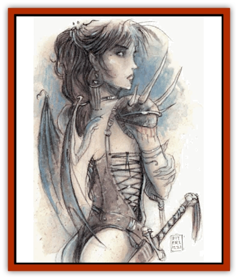
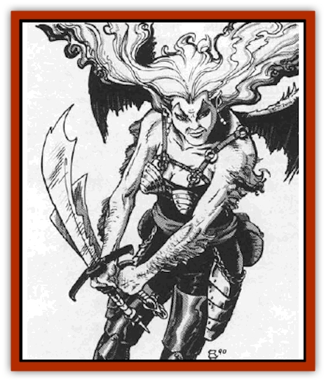

# Tanar'ri - Lesser - Alu-Fiend

| Statistic | **Tanar'ri, Lesser, Alu-Fiend** |
| --- | --- |
| **Activity Cycle:** | Any |
| **Alignment:** | Chaotic evil (see below) |
| **Armor Class:** | 5 (base; see below) |
| **Climate/Terrain:** | The Abyss |
| **Damage/Attack:** | By weapon |
| **Diet:** | Carnivore |
| **Frequency:** | Very rare |
| **Hit Dice:** | 2 |
| **Intelligence:** | Average to genius (8-18) |
| **Magic Resistance:** | 30% |
| **Morale:** | Steady (11-12) |
| **Movement:** | 12, Fl 15 (D) |
| **No. Appearing:** | 1-2 |
| **No. of Attacks:** | 1 |
| **Organization:** | Solitary |
| **Size:** | M (5' tall) |
| **Special Attacks:** | Magical weapon, spell use |
| **Special Defenses:** | Magical armor, cold iron or +1 or better weapons to hit, intuition |
| **THAC0:** | 19 |
| **Treasure:** | Nil |
| **XP Value:** | Normal: 4,000 / Genius (L1-4): 5,000 / Genius (L5-12): 6,000 |

Alu-fiends, the horrid female offspring of [[Tanar'ri_Lesser_Succubus|succubus]] and human, look like comely human females with attractive, powerful features. Only their sharp, upsloping eyebrows and wings indicate the truth.

Alu-fiends usually communicate using telepathy, but can sometimes speak additional languages.

**Combat:** Alu-fiends have an innate intuition that warns them of impending danger 75% of the time. They have no natural attack forms save fists and teeth (normal human damage). About 75% of them carry enchanted weapons, often gifts from their evil mothers. These weapons are most likely of common make (i.e. +1, +2, etc.), but there is a 15% chance for a special weapon. The fiend relies heavily on a special weapon and never willingly parts with it.

Alu-fiends can restore their own bit points at the expense of their opponents. This requires a normal melee hit (1d8 damage, of which the alu-fiend gets half, rounded up).

These creatures have base Armor Class 5, the heritage of their unnatural mother. Enchanted armor or protective items can improve the base AC. As with weapons, 75% of ah-fiends wear enchanted armor of common make (+1, +2, etc.). There is a 5% chance such armor is special (e.g. *plate mail of etherealness*, etc.).

For both magical armor and weapons, choose appropriate items from the tables on pages 139-140 of the *DMG*.

In addition to those available to all [[Tanar'ri_General_Information|tanar'ri]], all alu-fiends, regardless of intelligence, have the following spell-like powers: *charm person*, *dimension door* (once per day), *ESP*, *shape change* (to a humanoid form of approximately their own height and weight only), and *suggestion*.

All alu-fiends have infravision to 240'. Alu-fiends are affected only by cold-wrought iron or magical weapons.

Fully 10% of alu-fiends have Genius intelligence; they have all the spell-like powers of their sisters and are also actual mages. Genius alu-fiends are 1st- to 12th-level mages with full spell ability and can choose spells from any school. Genius alu-fiends are never specialist wizards.

**Habitat/Society:** Alu-fiends tend to be hateful, even by tanar'ri standards, because of their dual nature. They view themselves as outcasts, neither human or tanar'ri. Other tanar'ri view them the same way, as lowly and without purpose. Only the alu-fiends' power keeps them in contention as a lesser tanar'ri race.

**Ecology:** If an alu-fiend can somehow hide her wings, she is mistaken for a human 70% of the time.

Interestingly, about 20% of alu-fiends are chaotic neutral or true neutral in alignment. This usually occurs when a succubus mates with a non-evil human and the offspring retains a hint of her father's morality.

---
## Discovery & Documentation

**Source Publication:** MC8 Outer Planes Appendix (1990)
**Campaign Setting:** Planescape
**Author(s):** Timothy B. Brown, Jamie LaFountain

### Other Creatures Found in This Source Book
   * [[Aasimon_Agathinon|Aasimon, Agathinon]]
   * [[Aasimon_Deva|Aasimon, Deva]]
   * [[Aasimon_Light|Aasimon, Light]]
   * [[Aasimon_General_Information|Aasimon, General Information]]
   * [[Aasimon_Planetar|Aasimon, Planetar]]
   * [[Aasimon_Solar|Aasimon, Solar]]
   * [[Air_Sentinel|Air Sentinel]]
   * [[Animal_Lord|Animal Lord]]
   * [[Archon|Archon]]
   * [[Baatezu_Lesser_Abishai|Baatezu, Lesser, Abishai]]
   * [[Baatezu_Greater_Amnizu|Baatezu, Greater, Amnizu]]
   * [[Baatezu_Lesser_Barbazu|Baatezu, Lesser, Barbazu]]
   * [[Baatezu_Greater_Cornugon|Baatezu, Greater, Cornugon]]
   * [[Baatezu_Lesser_Erinyes|Baatezu, Lesser, Erinyes]]
   * [[Baatezu_General_Information|Baatezu, General Information]]
   * [[Baatezu_Greater_Gelugon|Baatezu, Greater, Gelugon]]
   * [[Baatezu_Lesser_Hamatula|Baatezu, Lesser, Hamatula]]
   * [[Baatezu_Lemure|Baatezu, Lemure]]
   * [[Baatezu_Least_Nupperibo|Baatezu, Least, Nupperibo]]
   * [[Baatezu_Lesser_Osyluth|Baatezu, Lesser, Osyluth]]
   * [[Baatezu_Greater_Pit_Fiend|Baatezu, Greater, Pit Fiend]]
   * [[Baatezu_Least_Spinagon|Baatezu, Least, Spinagon]]
   * [[Balaena|Balaena]]
   * [[Bariaur|Bariaur]]
   * [[Bebilith|Bebilith]]
   * [[Bodak|Bodak]]
   * [[Dog_Moon|Dog, Moon]]
   * [[Dragon_Adamantite|Dragon, Adamantite]]
   * [[Einheriar|Einheriar]]
   * [[Gehreleth|Gehreleth]]
   * [[Githyanki|Githyanki]]
   * [[Githzerai|Githzerai]]
   * [[Hordling|Hordling]]
   * [[Lammasu_Celestial|Lammasu, Celestial]]
   * [[Larva|Larva]]
   * [[Maelephant|Maelephant]]
   * [[Marut|Marut]]
   * [[Mediator|Mediator]]
   * [[Mortai|Mortai]]
   * [[Night_Hag|Night Hag]]
   * [[Nightmare|Nightmare]]
   * [[Noctral|Noctral]]
   * [[Per|Per]]
   * [[Phoenix|Phoenix]]
   * [[Slaad|Slaad]]
   * [[Tanar'ri_Greater_Babau|Tanar'ri, Greater, Babau]]
   * [[Tanar'ri_Greater_Chasme|Tanar'ri, Greater, Chasme]]
   * [[Tanar'ri_Greater_Nabassu|Tanar'ri, Greater, Nabassu]]
   * [[Tanar'ri_Least_Dretch|Tanar'ri, Least, Dretch]]
   * [[Tanar'ri_Least_Manes|Tanar'ri, Least, Manes]]
   * [[Tanar'ri_Least_Rutterkin|Tanar'ri, Least, Rutterkin]]
   * [[Tanar'ri_Lesser_Bar-Lgura|Tanar'ri, Lesser, Bar-Lgura]]
   * [[Tanar'ri_Lesser_Cambion|Tanar'ri, Lesser, Cambion]]
   * [[Tanar'ri_Lesser_Succubus|Tanar'ri, Lesser, Succubus]]
   * [[Tanar'ri_Guardian_Molydeus|Tanar'ri, Guardian, Molydeus]]
   * [[Tanar'ri_General_Information|Tanar'ri, General Information]]
   * [[Tanar'ri_True_Balor|Tanar'ri, True, Balor]]
   * [[Tanar'ri_True_Glabrezu|Tanar'ri, True, Glabrezu]]
   * [[Tanar'ri_True_Hezrou|Tanar'ri, True, Hezrou]]
   * [[Tanar'ri_True_Marilith|Tanar'ri, True, Marilith]]
   * [[Tanar'ri_True_Nalfeshnee|Tanar'ri, True, Nalfeshnee]]
   * [[Tanar'ri_True_Vrock|Tanar'ri, True, Vrock]]
   * [[Titan|Titan]]
   * [[Translator|Translator]]
   * [[T'uen-rin|T'uen-rin]]
   * [[Vaporighu|Vaporighu]]
   * [[Warden_Beast|Warden Beast]]
   * [[Yugoloth_Greater_Arcanaloth|Yugoloth, Greater, Arcanaloth]]
   * [[Yugoloth_Lesser_Dergoloth|Yugoloth, Lesser, Dergoloth]]
   * [[Yugoloth_Lesser_Hydroloth|Yugoloth, Lesser, Hydroloth]]
   * [[Yugoloth_General_Information|Yugoloth, General Information]]
   * [[Yugoloth_Lesser_Mezzoloth|Yugoloth, Lesser, Mezzoloth]]
   * [[Yugoloth_Greater_Nycaloth|Yugoloth, Greater, Nycaloth]]
   * [[Yugoloth_Lesser_Piscoloth|Yugoloth, Lesser, Piscoloth]]
   * [[Yugoloth_Greater_Ultroloth|Yugoloth, Greater, Ultroloth]]
   * [[Yugoloth_Lesser_Yagnoloth|Yugoloth, Lesser, Yagnoloth]]
   * [[Zoveri|Zoveri]]
