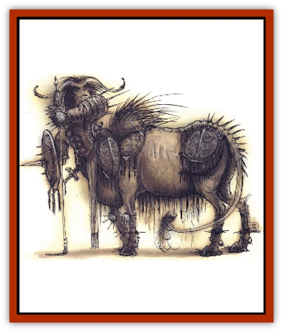

# Tanar'ri - Lesser - Armanite

| Statistic | **Tanar'ri, Lesser, Armanite** |
| --- | --- |
| **Activity Cycle:** | Any |
| **Alignment:** | Chaotic evil |
| **Armor Class:** | 2 |
| **Climate/Terrain:** | Abyss |
| **Damage/Attack:** | 2d6/2d6 and by weapon type |
| **Diet:** | Carnivore |
| **Frequency:** | Rare |
| **Hit Dice:** | 5 |
| **Intelligence:** | Average (8-10) |
| **Magic Resistance:** | Nil |
| **Morale:** | Champion (15-16) |
| **Movement:** | 18, Fl 18 (C) |
| **No. Appearing:** | 2d10 |
| **No. of Attacks:** | 2 and 1 |
| **Organization:** | Troop |
| **Size:** | L (10' tall, 6' at the haunches) |
| **Special Attacks:** | Spark bolts, crushing hooves |
| **Special Defenses:** | Immune to poison, cold, and electricity |
| **THAC0:** | 15 |
| **Treasure:** | A,D,I |
| **XP Value:** | 2,000 / Knecht: 7,000 / Konsul: 14,000 |

Armanites resemble pale, undead [[Centaur|centaurs]] with the horns of rams or bulls. They wear the full armor of knights. Their tails and the manes down their spines are stiff bristels, and the flesh on their bellies sags so much that older armanites sometimes look like gutted half-horses, dragging their entrails beneath them.

Some breeds of armanite are more kangaroolike in their nonhuman half. Their front limbs are hands, capable of manipulating weapons and small items.

All armanites wear black, fluted armor that seems more ornamental than functional. Because of their great strength, the armor is much heavier than ordinary armor and more effective than it might appear. Armanites are never without their weapons: flanged maces, wavy flamberge swords, and heavy crossbows or composite bows.

**Combat:** Armanites are mobile shock troops in the Blood War, able to strike and retreat quickly. They travel in troupes loyal to a single leader. They depend on the rush and fury of their charges to preserve them rather than on tactics, spellpower, or careful timing.

The armanites' primary mode of attack is a set of withering strikes from their spiked hooves. On a roll of 20, an armanite can crush a shield (75% of the time the strike hits the shield) or a breastplate (25% chance), reducing AC by 1. Magical armor is entitled to a saving throw versus crushing blow.

In addition, armanites can attack with the troupe's weapon of choice, usually a horseman's mace (20%), a two-handed sword called a flamberge (30%), a halberd (20%), a scimitarlike sabre (20%), or a lance and sabre (10%). Some troupes also carry heavy crossbows (10%) or short, recurved composite bows with wicked barbed arrows (20%, damage as +1 sheaf arrows). Armanites who have crossbows or bows can fire *spark bolts*. Just before these bolts are fired, they become magically charged by their contact with the amanites. If they hit, the spark bolts do 248 points of electrical damage, with a saving throw for half damage.

Armanites can gallop into the skies once per day for a maximum of 1 hour. This form of flight allows them to gallop slowly up from the grounds, as if they were climbing an invisible hill. They must stay in motion once they start. Flying armanites cannot change direction quickly, but the assault of an aerial charge can be devastating on opposing groundbased troops.

All armanites are immune to attack by weapons of less than +2 enchantment and are immune to poison, cold, and electricity, like all [[Tanar'ri_General_Information|tanar'ri]]. They suffer 3d6 points of damage from holy water, 1d6 points from splashes. Armanites also have the abilities common to all tanar'ri types.

Each pack of armanites always follows a single charismatic leader who rules through promises of plunder and threats of punishment. Called the Pathwarden or the Knecht, this leader has AC 0, 8 HD, Dmg 3d6/3d6, MV 21, and a 19 Strength. A Knecht can infuse not just his missile weapons but also his melee weapons with spark bolts each round. Packs that lose their leader roam without direction, destroying everything they meet until either they are destroyed or a new Knecht rises from among the ranks.

The 24 known towns of the armanites are each ruled by a Konsul, a master of as many as a hundred packs. The Konsul has AC -3, 11 HD, Dmg 4d6/4d6, MV 24, and 20 Strength. In addition to charging spark bolts as Knechts do, all Konsuls can throw 11-HD lightning bolts three times per day. A few of the Konsuls are also spellcasters: they can be mages of up to 8th level, or priests of up to 5th level. Rumors claim that two or the Konsuls are multiclassed priest/mages. The known immobile towns are Amber, Basalt, Bloodstone, Bone, Clay, Cold Iron, Dark Spring, Gray Glass, Jade, Mageblood, Maroon, Obsidian, Ochre, Oxblood, Purpure, Silver Spike, and Steelshank. The seven remaining towns are the towns or the female armanites. These small encampments of tents, carts, and large, wheeled towers change their name whenever they move.

**Habitat/Society:** Armanites are the mercenaries and scavengers of the Blood War, living by devouring the flesh and spirits of the fallen. They serve their masters well but expect plunder in return; failure to provide it results in desertion or rebellion, even on the eve of battle. Most herds of armanites specialize in a particular battlefield duty, such as scouting, foraging for quartermasters, skirmishing, archery, or the like. They never take part in sieges. Their reputation for fickleness is well earned; if they receive orders they don't like, they simply leave.

Female armanites number only half that of their male counterparts. The sexes are strictly segregated for most of their lives, for they inevitably fight among themselves if allowed to mix. Males and female herds only mingle during mating, which occurs after a successful battle against the [[Baatezu_General_Information|baatezu]]. Young are herded along with the servants and camp followers until the seize weapons of their own from a fallen member of the troupe and slay an enemy, at which point they join the adults.

 Each armanite troupe carries an individual troupe banner and the banner of their current master or mistress, such as [[Abyssal_Lord|Graz'zt's]] diagonal black-and-white slash or Pazrael's golden talon on dark red. If the banner is lost in battle, the troupe disband to take up service in the household of one of the lords of the Plain of Infinite Portals or to attempt to join annother troupe. The banner is the symbol and unifying principle of each warband; without it, the armanites feud among themselves and soon their group falls apart.

Because they operate well as independent groups, armenites are often selected to undertake special missions for the Abyssal lords. They are called the Dark Horsemen or the Dark Riders in the Upper Planes and are feared there. They are a common sight in Sigil as well, where they sometimes serve as bloodthirsty bodyguards.

**Ecology:** Armanites devour the blood and spirits of their fallen foes, rendering them unresurrectablc, and some stories say that they prefer this sustenance to any other. Their favorite prey are [[Varrangoin|varrangoin]], baatezu, and [[Yugoloth_General_Information|yugoloths]], in that order. Somc armanites take on [[Tanar'ri_Least_Rutterkin|rutterkin]] as grooms, smiths, riding auxiliaries, and servants, though this is rare. They despise all forms of least tanar'ri and abuse them mercilessly.

Armanites prefer raucous, chaotic group combat to formal duels or feats of arms. They often brawl like warhounds in the halls and citadels of the tanar'ri, and provoking a fight with one armanite means a grudge match with the entire troupe. Armanites despise the [[Bariaur|bariaur]] and attack them on sight.

---
## Discovery & Documentation

**Source Publication:** Planes of Chaos (1994)
**Campaign Setting:** Planescape
**Author(s):** Wolfgang Baur, L. W. Smith

### Other Creatures Found in This Source Book
   * [[Asrai|Asrai]]
   * [[Astral_Dreadnought|Astral Dreadnought]]
   * [[Bacchae|Bacchae]]
   * [[Chaos_Beast|Chaos Beast]]
   * [[Fensir|Fensir]]
   * [[Abyssal_Lord|Abyssal Lord]]
   * [[Howler|Howler]]
   * [[Imp_Chaos|Imp, Chaos]]
   * [[Lillend|Lillend]]
   * [[Murska|Murska]]
   * [[Oread|Oread]]
   * [[Ratatosk|Ratatosk]]
   * [[Tanar'ri_Greater_Goristro|Tanar'ri, Greater, Goristro]]
   * [[Varrangoin|Varrangoin]]
   * [[Viper_Tree|Viper Tree]]
