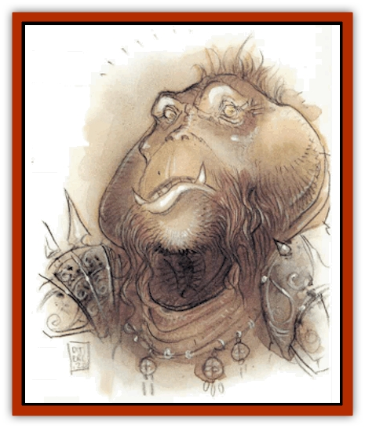
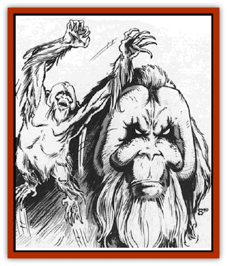

# Tanar'ri - Lesser - Bar-Lgura

| Statistic | **Tanar'ri, Lesser, Bar-Lgura** |
| --- | --- |
| **Activity Cycle:** | Any |
| **Alignment:** | Chaotic evil |
| **Armor Class:** | 0 |
| **Climate/Terrain:** | The Abyss |
| **Damage/Attack:** | 1d6/1d6/2d6 |
| **Diet:** | Carnivore |
| **Frequency:** | Uncommon |
| **Hit Dice:** | 6+6 |
| **Intelligence:** | Low to average (5-10) |
| **Magic Resistance:** | 30% |
| **Morale:** | Elite (13-14) |
| **Movement:** | 9, Climb 15 |
| **No. Appearing:** | 2-12 |
| **No. of Attacks:** | 3 |
| **Organization:** | Pack |
| **Size:** | M (5' tall) |
| **Special Attacks:** | Spring attack |
| **Special Defenses:** | Camouflage |
| **THAC0:** | 15 |
| **Treasure:** | Nil |
| **XP Value:** | 8,000 |

The bar-lgura are hulking, brutish creatures that roam the Abyss in small packs. They sometimes serve as scouts for armies in the Blood War.

Bar-lgura look like orangutans. Their fur is a deep, red dish brown and their skin, where exposed, is grayish brown They have frightening visages and six digits per limb, sharp, wicked claws extending from each digit. They shamble along the ground using both arms and legs for movement, but prefer to move among trees, rafters, vines, etc., for they have increased movement there.

Bar-lgura communicate using telepathy.

**Combat:** Bar-lgura favor ambush tactics, springing forth at opponents from cover. Experts at camouflage, they change their coloration to that of their surroundings, chameleon-like. The transformation requires one complete round and acts as a thief's hide in shadows ability (95%). They can spring up to 40' and attack savagely in the same round.

Bar-lgura attack in numbers, often trying to overwhelm a single unfortunate opponent with claws (1d6 damage) and bite (2d6 damage).

In addition to those available to all [[Tanar'ri_General_Information|tanar'ri]], the bar-lgura have the following spell-like powers at 6th level of spell use: *change self* (twice per day), *detect invisibility*, *dispel magic*, *entangle*, *fear* (by touch), *invisibility* (twice per day), *plant growth*, *spectral force* (twice per day), and *telekinesis*. Once per day they can also attempt to *gate* in 1-6 additional bar-lgura with a 35% chance of success.

**Habitat/Society:** Bar-lgura dislike other tanar'ri and prefer to hunt among their own kind. They obey only tanar'ri of obviously greater power than themselves, acting as scouts for the Blood War when commanded.

In certain areas of the Abyss, the bar-lgura form tribes of 300 or more. These societies divorce themselves from the day to day dealings of the Abyss and form their own crude "government", the only government in the Abyss. Tribal bar-lgura do not obey other tanar'ri, for their numbers protect them from the wrath of the true tanar'ri. Still, there are tales of a [[Tanar'ri_True_Balor|balor]] summarily laying waste to an entire tribe of rebellious bar-lgura.

**Ecology:** Bar-lgura are not quite beasts, but are not terribly intelligent. They do not hate baatezu as do other tanar'ri. The closest thing to animals among the tanar'ri, they receive especially cruel treatment by more powerful tanar'ri when they get out of line.

---
## Discovery & Documentation

**Source Publication:** MC8 Outer Planes Appendix (1990)
**Campaign Setting:** Planescape
**Author(s):** Timothy B. Brown, Jamie LaFountain

### Other Creatures Found in This Source Book
   * [[Aasimon_Agathinon|Aasimon, Agathinon]]
   * [[Aasimon_Deva|Aasimon, Deva]]
   * [[Aasimon_Light|Aasimon, Light]]
   * [[Aasimon_General_Information|Aasimon, General Information]]
   * [[Aasimon_Planetar|Aasimon, Planetar]]
   * [[Aasimon_Solar|Aasimon, Solar]]
   * [[Air_Sentinel|Air Sentinel]]
   * [[Animal_Lord|Animal Lord]]
   * [[Archon|Archon]]
   * [[Baatezu_Lesser_Abishai|Baatezu, Lesser, Abishai]]
   * [[Baatezu_Greater_Amnizu|Baatezu, Greater, Amnizu]]
   * [[Baatezu_Lesser_Barbazu|Baatezu, Lesser, Barbazu]]
   * [[Baatezu_Greater_Cornugon|Baatezu, Greater, Cornugon]]
   * [[Baatezu_Lesser_Erinyes|Baatezu, Lesser, Erinyes]]
   * [[Baatezu_General_Information|Baatezu, General Information]]
   * [[Baatezu_Greater_Gelugon|Baatezu, Greater, Gelugon]]
   * [[Baatezu_Lesser_Hamatula|Baatezu, Lesser, Hamatula]]
   * [[Baatezu_Lemure|Baatezu, Lemure]]
   * [[Baatezu_Least_Nupperibo|Baatezu, Least, Nupperibo]]
   * [[Baatezu_Lesser_Osyluth|Baatezu, Lesser, Osyluth]]
   * [[Baatezu_Greater_Pit_Fiend|Baatezu, Greater, Pit Fiend]]
   * [[Baatezu_Least_Spinagon|Baatezu, Least, Spinagon]]
   * [[Balaena|Balaena]]
   * [[Bariaur|Bariaur]]
   * [[Bebilith|Bebilith]]
   * [[Bodak|Bodak]]
   * [[Dog_Moon|Dog, Moon]]
   * [[Dragon_Adamantite|Dragon, Adamantite]]
   * [[Einheriar|Einheriar]]
   * [[Gehreleth|Gehreleth]]
   * [[Githyanki|Githyanki]]
   * [[Githzerai|Githzerai]]
   * [[Hordling|Hordling]]
   * [[Lammasu_Celestial|Lammasu, Celestial]]
   * [[Larva|Larva]]
   * [[Maelephant|Maelephant]]
   * [[Marut|Marut]]
   * [[Mediator|Mediator]]
   * [[Mortai|Mortai]]
   * [[Night_Hag|Night Hag]]
   * [[Nightmare|Nightmare]]
   * [[Noctral|Noctral]]
   * [[Per|Per]]
   * [[Phoenix|Phoenix]]
   * [[Slaad|Slaad]]
   * [[Tanar'ri_Greater_Babau|Tanar'ri, Greater, Babau]]
   * [[Tanar'ri_Greater_Chasme|Tanar'ri, Greater, Chasme]]
   * [[Tanar'ri_Greater_Nabassu|Tanar'ri, Greater, Nabassu]]
   * [[Tanar'ri_Least_Dretch|Tanar'ri, Least, Dretch]]
   * [[Tanar'ri_Least_Manes|Tanar'ri, Least, Manes]]
   * [[Tanar'ri_Least_Rutterkin|Tanar'ri, Least, Rutterkin]]
   * [[Tanar'ri_Lesser_Alu-Fiend|Tanar'ri, Lesser, Alu-Fiend]]
   * [[Tanar'ri_Lesser_Cambion|Tanar'ri, Lesser, Cambion]]
   * [[Tanar'ri_Lesser_Succubus|Tanar'ri, Lesser, Succubus]]
   * [[Tanar'ri_Guardian_Molydeus|Tanar'ri, Guardian, Molydeus]]
   * [[Tanar'ri_General_Information|Tanar'ri, General Information]]
   * [[Tanar'ri_True_Balor|Tanar'ri, True, Balor]]
   * [[Tanar'ri_True_Glabrezu|Tanar'ri, True, Glabrezu]]
   * [[Tanar'ri_True_Hezrou|Tanar'ri, True, Hezrou]]
   * [[Tanar'ri_True_Marilith|Tanar'ri, True, Marilith]]
   * [[Tanar'ri_True_Nalfeshnee|Tanar'ri, True, Nalfeshnee]]
   * [[Tanar'ri_True_Vrock|Tanar'ri, True, Vrock]]
   * [[Titan|Titan]]
   * [[Translator|Translator]]
   * [[T'uen-rin|T'uen-rin]]
   * [[Vaporighu|Vaporighu]]
   * [[Warden_Beast|Warden Beast]]
   * [[Yugoloth_Greater_Arcanaloth|Yugoloth, Greater, Arcanaloth]]
   * [[Yugoloth_Lesser_Dergoloth|Yugoloth, Lesser, Dergoloth]]
   * [[Yugoloth_Lesser_Hydroloth|Yugoloth, Lesser, Hydroloth]]
   * [[Yugoloth_General_Information|Yugoloth, General Information]]
   * [[Yugoloth_Lesser_Mezzoloth|Yugoloth, Lesser, Mezzoloth]]
   * [[Yugoloth_Greater_Nycaloth|Yugoloth, Greater, Nycaloth]]
   * [[Yugoloth_Lesser_Piscoloth|Yugoloth, Lesser, Piscoloth]]
   * [[Yugoloth_Greater_Ultroloth|Yugoloth, Greater, Ultroloth]]
   * [[Yugoloth_Lesser_Yagnoloth|Yugoloth, Lesser, Yagnoloth]]
   * [[Zoveri|Zoveri]]
