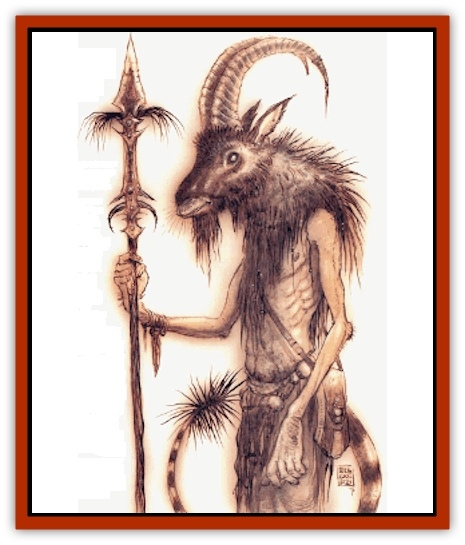

# Tanar'ri - Lesser - Bulezau

| Statistic | **Tanar'ri, Lesser, Bulezau** |
| --- | --- |
| **Activity Cycle:** | Any |
| **Alignment:** | Chaotic evil |
| **Armor Class:** | -1 |
| **Climate/Terrain:** | The Abyss |
| **Damage/Attack:** | 1d4+1/1d4+1/2d8/1d3 or 2d8/1d3 and weapon +6 |
| **Diet:** | Carnivore |
| **Frequency:** | Uncommon |
| **Hit Dice:** | 7+3 |
| **Intelligence:** | Low-Average (5-10) |
| **Magic Resistance:** | 25% |
| **Morale:** | Fanatic (17-18) |
| **Movement:** | 9 |
| **No. Appearing:** | 3-12 |
| **No. of Attacks:** | 4 or 3 |
| **Organization:** | Group |
| **Size:** | L (8' tall) |
| **Special Attacks:** | Head-butt, rage |
| **Special Defenses:** | Struck only by +1 or better weapons |
| **THAC0:** | 13 |
| **Treasure:** | A |
| **XP Value:** | 9,000 |

Bulezau [[Tanar'ri_General_Information|tanar'ri]] are born and bred to fight in the Blood War. With the exception of the [[Tanar'ri_True_Vrock|vrocks]], bulezau are the toughest front-line troops of the tanar'ri hordes. Bulezau are used as heavy infantry, assault leaders, and personal guards; they lack the mobility or magical prowess of a similar band of vrocks, but they're strong and fearless bashers who're too stubborn and stupid to ever give up.

A bulezau resembles a [[Minotaur|minotaur]], but it's gaunt and skeletal, and its flesh is filthy and diseased. The creature isn't covered with fur, but instead with patches of wiry bristles over battered, boil-covered skin. Its feet are clawed, not hoofed, and it has a long, serpentine tail with a clump of iron-hard spines at its end. The bulezau's horns and head are more ramlike than bull-like, and its mouth is filled with small, needle-sharp fangs. Bulezau are often armed with great tridents, pole arms, or morning stars of wicked design.

Bulezau can speak the common trade-jargon of the planes with difficulty or communicate with a weak form of telepathy at will. It's a good idea for a cutter to make out like he understands the bulezau perfectly no matter how animallike its speech is, since it's not a patient basher. If a bulezau decides it's easier to tear the arms off a sod than talk to him it won't wait long to act on its impulses.

**Combat:** Bulezau are built for a fight. They can deal out raw damage just as well as many kinds of greater or true tanar'ri, but their chief vulnerability's found in the hollow space between their ears. Strategy, discipline, and common sense've got no lace in the world of a bulezau, and if there's anything dumber than a bulezau, it's two of 'em together. 'Course, strength and energy'll make up for a lot of failings of strategy, and that's an approach bulezau are happy to take.

Like all tanar'ri, bulezau suffer no damage from nonmagical fire, electricity, or poison. Cold, magical fire, and gas cause only half damage to a bulezau.

Unarmed bulezau strike with each of their clawed forelimbs for 1d4+1 points of damage, deliver a powerful head-butt for 2d8 points of damage, and lash out with their bristly tails for another 1d3 points of damage. If the bulezau rolls a natural 19 or 20 with its head-butt, it knocks a man-size or smaller opponent back 5 to 10 feet (d6+4) and stuns the sod for 1 to 3 rounds. If the bulezau's armed, it substitutes the weapon attack for its claw attacks. Bulezau weapons're huge (size H) and inflict double normal damage, +6 for the creature's Strength. A bulezau fighting with a morning star'll do 4d4+6 points of damage with a hit. The bulezau can also butt and lash with its tail in the same round.

Once a bulezau's in a fight, it's likely to go berserk. There's a 25% chance each round that it goes on a rampage of destruction, refusing to stop until either it or its opponent is dead. This rises to a 75% chance in a round in which bulezau takes damage without managing to hit its foe. (They don't take failure well.) A berserk bulezau's Armor Class falls to 1, since it ignores any defensive tactics whatsoever, but it gains a +2 bonus to all attack rolls. While berserk, the bulezau gains a +4 bonus to its saving throws versus any fear, emotion, or mind-affecting spells, including *hold monster* and the like. The bulezau doesn't recover from its rage until all opponents are dead, routed, or the bulezau's been unable to engage in melee for 5 rounds or more.

In addition to the powers common to all tanar'ri, bulezau can use the following spell-like abilities (at will unless otherwise specified) at the 7th level of ability: *cause fear*, *command*, *detect invisibility*, *shout* (1/day), and *wall of fog*. Bulezau can be injured only by cold iron or weapons of +1 or better value. Once per day they can attempt to *gate* 1 to 3 [[Tanar'ri_Least_Rutterkin|rutterkin]] (40%) or 3 to 12 [[Tanar'ri_Least_Dretch|dretches]] (60%) with a 25% chance of success.

**Habitat/Society:** Bulezau are quarrelsome, bullying creature that often fall into lethal disagreements with each other. Only the authority of a powerful greater or true tanar'ri can keep them from each other's throats, and even then only if the promise of battle is near. Bulezau live for combat, and regard all other activities as a waste of time. They make poor pickets, sentries, or scouts since they've got no patience for waiting around or attempts at stealth - if a bulezau sees an enemy, it charges, and if it doesn't see an enemy, it goes looking for one.

Bulezau may be difficult troops to keep control of, but they're very good at what they do. Once committed to a battle, they hold nothing back and plunge into the thick of the fight with reckless abandon. For a tanar'ri commander, the bulezau are a slavering band of maniacs that'll attempt any attack and never retreat, no matter how long the odds are. Loyalty of that kind is hard to find in the Abyss, even if it's uncontrollable bloodlust instead of iron discipline.

Tanar'ri commanders've long recognized that it's a good idea to keep bulezau near the war front. They're just too stupid and aggressive to remain in a noncombat situation for long.

With a strong and charismatic commander, bulezau can hold themselves in check - just barely. High-ups in the Abyss sometimes create a ruthless and fanatical guard of bulezau, deciding that it's worth the headaches to have such capable and loyal (for tanar'ri) fighters at their back and call.

**Ecology:** It's rumored that the tanar'ri lord Baphomet, the patron demipower of minotaurs, was responsible for the creation of the bulezau. The chant goes that Baphomet bred his minotaur servants with some of the tanar'ri in his service, but there's no way to know if this's a peel or not. It's also said that Baphomet maintains a bodyguard of fierce bulezau of unusual loyalty and discipline.

Bulezau are generally well-regarded by tanar'ri of higher station, since bulezau pursue the Blood War with so much enthusiasm that a more subtle tanar'ri can drop out of sight when they're around. Tanar'ri commanders place a high value on bulezau formations and go out of their way to gather such units when possible. On the other hand, less powerful tanar'ri rarely want to be anywhere near a bulezau since the creature's likely to fly off into a murderous rage at the least provocation, regardless of the consequence. There've been engagements where more dretches and rutterkin were lost to bulezau impatience than to [[Baatezu_General_Information|baatezu]] action.

Bulezau've got a bitter rivalry with vrocks, and encounters between the two almost always break out into a fight unless there are baatezu nearby to deal with.

---
## Discovery & Documentation

**Source Publication:** Planescape II (1996)
**Campaign Setting:** Planescape
**Author(s):** Rich Baker, Karen S. Boomgarden

### Other Creatures Found in This Source Book
   * [[Aasimar|Aasimar]]
   * [[Abrian|Abrian]]
   * [[Arcane|Arcane]]
   * [[Balaena|Balaena]]
   * [[Beholder-kin_Observer|Beholder-kin, Observer]]
   * [[Bloodthorn|Bloodthorn]]
   * [[Bonespear|Bonespear]]
   * [[Darkweaver|Darkweaver]]
   * [[Demarax|Demarax]]
   * [[Dhour|Dhour]]
   * [[Eater_of_Knowledge|Eater of Knowledge]]
   * [[Eladrin_Greater_Firre|Eladrin, Greater, Firre]]
   * [[Eladrin_Greater_Ghaele|Eladrin, Greater, Ghaele]]
   * [[Eladrin_Greater_Tulani|Eladrin, Greater, Tulani]]
   * [[Eladrin_Lesser_Bralani|Eladrin, Lesser, Bralani]]
   * [[Eladrin_Lesser_Coure|Eladrin, Lesser, Coure]]
   * [[Eladrin_Lesser_Noviere|Eladrin, Lesser, Noviere]]
   * [[Eladrin_Lesser_Shiere|Eladrin, Lesser, Shiere]]
   * [[Fhorge|Fhorge]]
   * [[Ghostlight|Ghostlight]]
   * [[Guardinal_Avoral|Guardinal, Avoral]]
   * [[Guardinal_Cervidal|Guardinal, Cervidal]]
   * [[Guardinal_General_Information|Guardinal, General Information]]
   * [[Guardinal_Equinal|Guardinal, Equinal]]
   * [[Guardinal_Leonal|Guardinal, Leonal]]
   * [[Guardinal_Lupinal|Guardinal, Lupinal]]
   * [[Guardinal_Ursinal|Guardinal, Ursinal]]
   * [[Hollyphant|Hollyphant]]
   * [[Incantifer|Incantifer]]
   * [[Ironmaw|Ironmaw]]
   * [[Keeper|Keeper]]
   * [[Khaasta|Khaasta]]
   * [[Leomarh|Leomarh]]
   * [[Monster_of_Legend|Monster of Legend]]
   * [[Mortai|Mortai]]
   * [[Noctral|Noctral]]
   * [[Quill|Quill]]
   * [[Razorvine|Razorvine]]
   * [[Reave|Reave]]
   * [[Retriever|Retriever]]
   * [[Rilmani_Abiorach|Rilmani, Abiorach]]
   * [[Rilmani_General_Information|Rilmani, General Information]]
   * [[Rilmani_Argenach|Rilmani, Argenach]]
   * [[Rilmani_Aurumach|Rilmani, Aurumach]]
   * [[Rilmani_Cuprilach|Rilmani, Cuprilach]]
   * [[Rilmani_Ferrumach|Rilmani, Ferrumach]]
   * [[Rilmani_Plumach|Rilmani, Plumach]]
   * [[Shadowdrake|Shadowdrake]]
   * [[Spellhaunt|Spellhaunt]]
   * [[Spider_Hook|Spider, Hook]]
   * [[Sunfly|Sunfly]]
   * [[Sword_Spirit|Sword Spirit]]
   * [[Tanar'ri_Lesser_Maurezhi|Tanar'ri, Lesser, Maurezhi]]
   * [[Tanar'ri_Lesser_Yochlol|Tanar'ri, Lesser, Yochlol]]
   * [[Tanar'ri_General_Information|Tanar'ri, General Information]]
   * [[Tanar'ri_True_Alkilith|Tanar'ri, True, Alkilith]]
   * [[Terlen|Terlen]]
   * [[Tso|Tso]]
   * [[T'uen-rin|T'uen-rin]]
   * [[Vaporighu|Vaporighu]]
   * [[Vorr|Vorr]]
   * [[Wastrel|Wastrel]]
   * [[Wraithworm|Wraithworm]]
   * [[Yugoloth_Lesser_Canoloth|Yugoloth, Lesser, Canoloth]]
   * [[Zoveri|Zoveri]]
