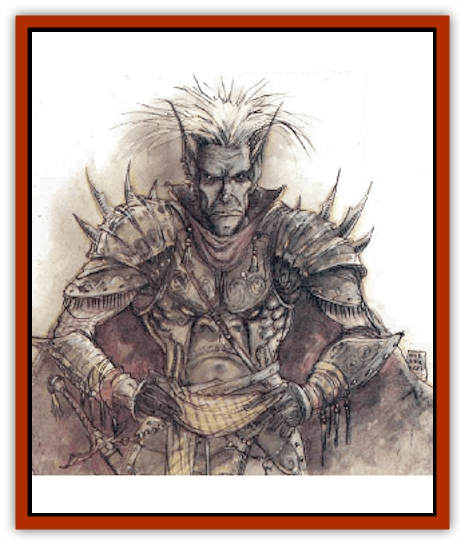
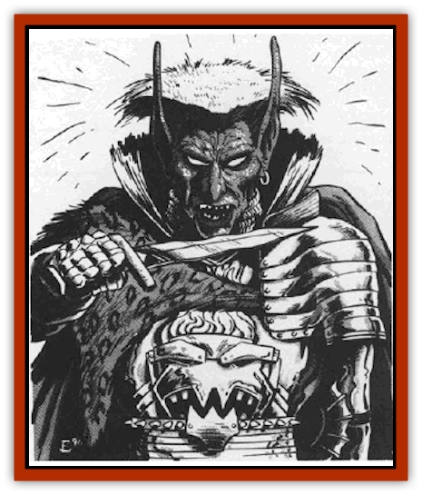

# Tanar'ri - Lesser - Cambion

| Statistic | **Baron/Marquis** | **Major** |
| --- | --- | --- |
| **Activity Cycle:** | Any | Any |
| **Alignment:** | Chaotic evil (see below) | Chaotic evil (see below) |
| **Armor Class:** | 2 | 6 |
| **Climate/Terrain:** | The Abyss | The Abyss |
| **Damage/Attack:** | By weapon | By weapon |
| **Diet:** | Carnivore | Carnivore |
| **Frequency:** | Very rare | Very rare |
| **Hit Dice:** | 6 | 4 |
| **Intelligence:** | High to genius (13-18) | Average to exceptional (9-16) |
| **Magic Resistance:** | 30% | 30% |
| **Morale:** | Elite (13-14) | Elite (13-14) |
| **Movement:** | 15 | 15 |
| **No. Appearing:** | 1 | 1 |
| **No. of Attacks:** | 2 | 2 |
| **Organization:** | Solitary | Solitary |
| **Size:** | M (6-7' tall) | M (6-7' tall) |
| **Special Attacks:** | See below | See below |
| **Special Defenses:** | See below | See below |
| **THAC0:** | 15 | 17 |
| **Treasure:** | Z,A | R,C |
| **XP Value:** | 6,000 | 4,000 |

In the event that a [[Tanar'ri_General_Information|tanar'ri]] mates with a human female, the resulting offspring is a cambion. The type sired depends on its parentage: a lesser or greater tanar'ri fathers a major cambion, whereas a true tanar'ri fathers a Baron/marquis. In either case, the mother does not survive the birth.

Cambions are ugly and terrifying. They are humanoid, but have pitch-black, slightly scaly skin covered with pockmarks; sharply pointed ears: and mouths filled with crooked, sickly fangs. Cambions often adorn themselves with spiked armor and weapons. They can communicate using telepathy.

Cambions have ability scores like characters. The range is determined by the type of cambion:

|  | Major | Baron/marquis |
| --- | --- | --- |
| Strength | 17-18 | 18-20 |
| Dexterity | 13-18 | 15-20 |
| Constitution | 13-18 | 15-18 |
| Intelligence | 9-16 | 13-18 |
| Wisdom | 5-8 | 13-18 |
| Charisma | 1-6 | 2-24 |

Charisma scores over 18 indicate the cambion is considered charming. Charming cambions can, at will, produce a reaction identical to a *charm person* spell.

**Combat:** Cambions have keen senses and are never surprised. Cambions use ornate weapons and armor. Many have a magical weapon (75% chance), most likely of common make (i.e. +1, +2, etc.), but 15% likely to be special (referee's choice). Magical armor is likely (75% chance), most likely of common make (+1, +2, etc.), but also 15% likely to be special.

In addition to those available to all tanar'ri, cambions have one to four of these spell-like powers: *detect magic*, *fear* (by touch), *levitate* (7 times per day), and *polymorph self* (3 times per day). Any cambion with 16 or higher Intelligence has wizard abilities. They have spells as wizards of a level equal to their Hit Dice (major 4th level, baron/marquis 6th level) and a randomly determined spellbook.

As stealthy as thieves, they can climb walls (95%), hide in shadows (80%), and move silently (80%) in bulky metal armor without penalty.

**Habitat/Society:** Cambions, like [[Tanar'ri_Lesser_Alu-Fiend|alu-fiends]], are freaks and outcasts. Never accepted in human society and only poorly tolerated in the Abyss, they feel bitter and hateful towards all things.

However, their stealth and detachment make them excellent assassins. The [[Tanar'ri_True_Balor|balors]] use them as personal bodyguards and advisors. Most cambions overcome their bitterness and take pnde in serving so high a power.

One in ten cambions is not chaotic evil, but neutral or even good, because its human mother was of good alignment. These wretched creatures are doomed to a miserable existence as lone wolves because they are rarely accepted by a good-aligned community.

**Ecology:** Evil cambions serve in the Blood War as assassins.

---
## Discovery & Documentation

**Source Publication:** MC8 Outer Planes Appendix (1990)
**Campaign Setting:** Planescape
**Author(s):** Timothy B. Brown, Jamie LaFountain

### Other Creatures Found in This Source Book
   * [[Aasimon_Agathinon|Aasimon, Agathinon]]
   * [[Aasimon_Deva|Aasimon, Deva]]
   * [[Aasimon_Light|Aasimon, Light]]
   * [[Aasimon_General_Information|Aasimon, General Information]]
   * [[Aasimon_Planetar|Aasimon, Planetar]]
   * [[Aasimon_Solar|Aasimon, Solar]]
   * [[Air_Sentinel|Air Sentinel]]
   * [[Animal_Lord|Animal Lord]]
   * [[Archon|Archon]]
   * [[Baatezu_Lesser_Abishai|Baatezu, Lesser, Abishai]]
   * [[Baatezu_Greater_Amnizu|Baatezu, Greater, Amnizu]]
   * [[Baatezu_Lesser_Barbazu|Baatezu, Lesser, Barbazu]]
   * [[Baatezu_Greater_Cornugon|Baatezu, Greater, Cornugon]]
   * [[Baatezu_Lesser_Erinyes|Baatezu, Lesser, Erinyes]]
   * [[Baatezu_General_Information|Baatezu, General Information]]
   * [[Baatezu_Greater_Gelugon|Baatezu, Greater, Gelugon]]
   * [[Baatezu_Lesser_Hamatula|Baatezu, Lesser, Hamatula]]
   * [[Baatezu_Lemure|Baatezu, Lemure]]
   * [[Baatezu_Least_Nupperibo|Baatezu, Least, Nupperibo]]
   * [[Baatezu_Lesser_Osyluth|Baatezu, Lesser, Osyluth]]
   * [[Baatezu_Greater_Pit_Fiend|Baatezu, Greater, Pit Fiend]]
   * [[Baatezu_Least_Spinagon|Baatezu, Least, Spinagon]]
   * [[Balaena|Balaena]]
   * [[Bariaur|Bariaur]]
   * [[Bebilith|Bebilith]]
   * [[Bodak|Bodak]]
   * [[Dog_Moon|Dog, Moon]]
   * [[Dragon_Adamantite|Dragon, Adamantite]]
   * [[Einheriar|Einheriar]]
   * [[Gehreleth|Gehreleth]]
   * [[Githyanki|Githyanki]]
   * [[Githzerai|Githzerai]]
   * [[Hordling|Hordling]]
   * [[Lammasu_Celestial|Lammasu, Celestial]]
   * [[Larva|Larva]]
   * [[Maelephant|Maelephant]]
   * [[Marut|Marut]]
   * [[Mediator|Mediator]]
   * [[Mortai|Mortai]]
   * [[Night_Hag|Night Hag]]
   * [[Nightmare|Nightmare]]
   * [[Noctral|Noctral]]
   * [[Per|Per]]
   * [[Phoenix|Phoenix]]
   * [[Slaad|Slaad]]
   * [[Tanar'ri_Greater_Babau|Tanar'ri, Greater, Babau]]
   * [[Tanar'ri_Greater_Chasme|Tanar'ri, Greater, Chasme]]
   * [[Tanar'ri_Greater_Nabassu|Tanar'ri, Greater, Nabassu]]
   * [[Tanar'ri_Least_Dretch|Tanar'ri, Least, Dretch]]
   * [[Tanar'ri_Least_Manes|Tanar'ri, Least, Manes]]
   * [[Tanar'ri_Least_Rutterkin|Tanar'ri, Least, Rutterkin]]
   * [[Tanar'ri_Lesser_Alu-Fiend|Tanar'ri, Lesser, Alu-Fiend]]
   * [[Tanar'ri_Lesser_Bar-Lgura|Tanar'ri, Lesser, Bar-Lgura]]
   * [[Tanar'ri_Lesser_Succubus|Tanar'ri, Lesser, Succubus]]
   * [[Tanar'ri_Guardian_Molydeus|Tanar'ri, Guardian, Molydeus]]
   * [[Tanar'ri_General_Information|Tanar'ri, General Information]]
   * [[Tanar'ri_True_Balor|Tanar'ri, True, Balor]]
   * [[Tanar'ri_True_Glabrezu|Tanar'ri, True, Glabrezu]]
   * [[Tanar'ri_True_Hezrou|Tanar'ri, True, Hezrou]]
   * [[Tanar'ri_True_Marilith|Tanar'ri, True, Marilith]]
   * [[Tanar'ri_True_Nalfeshnee|Tanar'ri, True, Nalfeshnee]]
   * [[Tanar'ri_True_Vrock|Tanar'ri, True, Vrock]]
   * [[Titan|Titan]]
   * [[Translator|Translator]]
   * [[T'uen-rin|T'uen-rin]]
   * [[Vaporighu|Vaporighu]]
   * [[Warden_Beast|Warden Beast]]
   * [[Yugoloth_Greater_Arcanaloth|Yugoloth, Greater, Arcanaloth]]
   * [[Yugoloth_Lesser_Dergoloth|Yugoloth, Lesser, Dergoloth]]
   * [[Yugoloth_Lesser_Hydroloth|Yugoloth, Lesser, Hydroloth]]
   * [[Yugoloth_General_Information|Yugoloth, General Information]]
   * [[Yugoloth_Lesser_Mezzoloth|Yugoloth, Lesser, Mezzoloth]]
   * [[Yugoloth_Greater_Nycaloth|Yugoloth, Greater, Nycaloth]]
   * [[Yugoloth_Lesser_Piscoloth|Yugoloth, Lesser, Piscoloth]]
   * [[Yugoloth_Greater_Ultroloth|Yugoloth, Greater, Ultroloth]]
   * [[Yugoloth_Lesser_Yagnoloth|Yugoloth, Lesser, Yagnoloth]]
   * [[Zoveri|Zoveri]]
