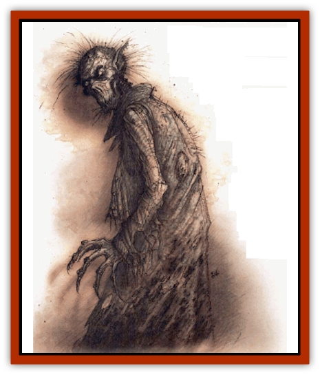

# Tanar'ri - Lesser - Maurezhi

| Statistic | **Tanar'ri, Lesser, Maurezhi** |
| --- | --- |
| **Activity Cycle:** | Any |
| **Alignment:** | Chaotic evil |
| **Armor Class:** | 5 (base) |
| **Climate/Terrain:** | The Abyss |
| **Damage/Attack:** | 1d6/1d6/2d4 |
| **Diet:** | Carnivore |
| **Frequency:** | Rare |
| **Hit Dice:** | 5 to 5+8 |
| **Intelligence:** | Average-Genius (8-18) |
| **Magic Resistance:** | 40% |
| **Morale:** | Steady (11-12) |
| **Movement:** | 12, Jp 3 |
| **No. Appearing:** | 1 (1-4 in the Abyss) |
| **No. of Attacks:** | 3 |
| **Organization:** | Solitary |
| **Size:** | M (6' tall) |
| **Special Attacks:** | Leap, assume shape |
| **Special Defenses:** | Struck only by + 1 or better weapons |
| **THAC0:** | 15 |
| **Treasure:** | B |
| **XP Value:** | Unimproved: 2,000 / Mature: 6,000 |

The maurezhi are a plague in the worlds beyond the Abyss, a scourge of evil that taints any plane it seeps onto. Maurezhi prey on mortals, spreading chaos and evil through their fearsome appetites. Like the [[Tanar'ri_Greater_Nabassu|nabassu]], maurezhi gain strength with each mortal they devour - but instead of absorbing mortal life forces, the maurezhi feed upon corpses, stealing portions of their victims' memories, skills, and appearance.

A maurezhi hears a strong resemblance to a common [[Ghoul|ghoul]]. Its posture is hunched and feral, its skin gray and leathery, and its hands filthy talons. The maurezhi's face slopes into a short, fang-filled muzzle, and its ears are catlike. Maurezhi leap and caper in sudden, unpredictable movements when excited or angered. They can communicate by means of telepathy, but the only sounds their rattling bone-boxes can make're gibbering howls, grunts, and shrieks.

Maurezhi seek opportunities to slay and devour mortals wherever they can find 'em. Most maurezhi're doomed to serve as marauders and skirmishers in the Blood War, but a few find ways to escape onto the Outlands or the Prime and begin a career of bloody murders and vile feasts.

**Combat:** Maurezhi enjoy stalking and terrifying their victims. They prefer a sudden surprise attack to a head-on challenge, but they're not afraid of a fight. They strike with each of their filthy claws for 1d6 points of damage and rend with their slavering jaws for 2d4 points of damage. Maurezhi can make lightning-swift leaps to close with their prey, gaining a +2 bonus to their first round of attacks. If the creature strikes from concealmeant this way, the victim suffers a -2 penalty to his surprise check. Regardless of its current ability scores, a maurezhi saves as a 10-HD monster.

Like nabassu, maurezhi grow stronger and more dangerous with their voracious feedings. For each human or human corpse a maurezhi consumes, it gains 1 bonus hit point, its Armor Class improves by one place from its base, and the damage of each claw attack increases by 1 point to the maximum allowable of 5+8. A maurezhi that's consumed five bodies has 5+5 Hit Dice, an AC of 0, and inflicts 1d6+5 points of damage with its claws.

In addition, the maurezhi's able to call upon the memories of any victim it's consumed and assume its appearance at will. Normally, only a *true seeing* spell or similar magic reveals the maurezhi's identity, but some bloods say that a faint odor of death lingers near a maurezhi masquerading as one of its victims. The maurezhi can use any physical talent its victim possessed, including the use of weapons the victim was proficient in, proficiences such as endurance, jumping, or tumbling, and thief skills. It can't utilize magical abilities such as spells or some class-related abilities such as a paladin's aura of *protection from evil*. Maurezhi can speak while in assumed form, and know all the languages the victim did.

Maurezhi can use the following spell-like powers (at will unless otherwise specified) at the 6th level of ability: *blur*, *cause fear*, *chill touch*, *paralysis* by touch (3/day), and *summon* 1d4 ghouls (1/day) A full-grown maurezhi (one with 5+8 Hit Dice) gains the additional powers: *animate dead*, *fear* (3/day), *hold person*, and *invisibility*. Once per day a maurezhi can attempt to gate 2d4 [[Tanar'ri_Least_Manes|manes]] with a 60% chance of success. Maurezhi can be struck only by cold iron or +1 or better weapons.

**Habitat/Society:** Maurezhi live only to consume the most powerful and intelligent mortals they can find. They're especially fond of waylaying lone travelers or adventurers, consuming them, and then assuming their appearance and using their acquaintances to seek out another victim while concealing the disappearance of the previous one. Between suitable victims, maurezhi're fond of haunting graveyards and barrows, sating their taste for the flesh of mortals.

Most maurezhi aren't given much of a chance to begin their growth in this fashion, though. They're frequently recruited by the [[Tanar'ri_Greater_Babau|babaus]] or [[Tanar'ri_True_Hezrou|hezrous]] and sent to fight in the Blood War. In the Abyss, a typical maurezhi's never had the chance to consume a human. However, a small percentage of maurezhi encountered in the Abyss will be full-grown creatures that've completed their expedition and returned to the Abyss at the peak of their power. These tanar'ri function as assassins and spies, roaming the Lower Planes to keep an eye on the baatezu war efforts.

The DM can decide what kinds of sods the maurezhi's already consumed and what they may or may not have known. Whenever possible, maurezhi seek out and consume mortals of exceptional skill and power. Each previous victim can be determined using the chart below:

| d% | Victim |
| --- | --- |
| 01-40 | 0-level character (possible proficiencies, identity, or information gained by the maurezhi) |
| 41-65 | Warrior of level 1-8 (possible improved THAC0, weapon specialization, tracking, or ranger skills) |
| 66-70 | Wizard of level 1-6 |
| 71-80 | Priest of level 1-8 |
| 81-95 | Thief of level 1-10 (with appropriate thief abilities) |
| 96-00 | Bard of leyel 1-8 (with appropriate thief and non-magical bard abilities) |

A maurezhi begins with average Intelligence, but each victim it consumes adds 1-2 points to its basic Intelligence rating if the victim was more intelligent than the maurezhi. As noted before, the memories and skills of each of their victims are available to the maurezhi, and it's possible for the fiend to have very unusual or rare secrets in its head.

**Ecology:** Although maurezhi devour all kinds of carrion and corpses on a daily basis, this doesn't increase their power. To consume a corpse, the maurezhi must personally kill the victim and devour him or her within one turn (10 minutes) of the murder. The grisly process requires no less than half an hour, and if the fiends interrupted, it can't completely consume its prey. A character who's been thus consumed can't he *raised* or *resurrected*, and can be returned to life only with a very carefully worded *wish*.

---
## Discovery & Documentation

**Source Publication:** Planescape II (1996)
**Campaign Setting:** Planescape
**Author(s):** Rich Baker, Karen S. Boomgarden

### Other Creatures Found in This Source Book
   * [[Aasimar|Aasimar]]
   * [[Abrian|Abrian]]
   * [[Arcane|Arcane]]
   * [[Balaena|Balaena]]
   * [[Beholder-kin_Observer|Beholder-kin, Observer]]
   * [[Bloodthorn|Bloodthorn]]
   * [[Bonespear|Bonespear]]
   * [[Darkweaver|Darkweaver]]
   * [[Demarax|Demarax]]
   * [[Dhour|Dhour]]
   * [[Eater_of_Knowledge|Eater of Knowledge]]
   * [[Eladrin_Greater_Firre|Eladrin, Greater, Firre]]
   * [[Eladrin_Greater_Ghaele|Eladrin, Greater, Ghaele]]
   * [[Eladrin_Greater_Tulani|Eladrin, Greater, Tulani]]
   * [[Eladrin_Lesser_Bralani|Eladrin, Lesser, Bralani]]
   * [[Eladrin_Lesser_Coure|Eladrin, Lesser, Coure]]
   * [[Eladrin_Lesser_Noviere|Eladrin, Lesser, Noviere]]
   * [[Eladrin_Lesser_Shiere|Eladrin, Lesser, Shiere]]
   * [[Fhorge|Fhorge]]
   * [[Ghostlight|Ghostlight]]
   * [[Guardinal_Avoral|Guardinal, Avoral]]
   * [[Guardinal_Cervidal|Guardinal, Cervidal]]
   * [[Guardinal_General_Information|Guardinal, General Information]]
   * [[Guardinal_Equinal|Guardinal, Equinal]]
   * [[Guardinal_Leonal|Guardinal, Leonal]]
   * [[Guardinal_Lupinal|Guardinal, Lupinal]]
   * [[Guardinal_Ursinal|Guardinal, Ursinal]]
   * [[Hollyphant|Hollyphant]]
   * [[Incantifer|Incantifer]]
   * [[Ironmaw|Ironmaw]]
   * [[Keeper|Keeper]]
   * [[Khaasta|Khaasta]]
   * [[Leomarh|Leomarh]]
   * [[Monster_of_Legend|Monster of Legend]]
   * [[Mortai|Mortai]]
   * [[Noctral|Noctral]]
   * [[Quill|Quill]]
   * [[Razorvine|Razorvine]]
   * [[Reave|Reave]]
   * [[Retriever|Retriever]]
   * [[Rilmani_Abiorach|Rilmani, Abiorach]]
   * [[Rilmani_General_Information|Rilmani, General Information]]
   * [[Rilmani_Argenach|Rilmani, Argenach]]
   * [[Rilmani_Aurumach|Rilmani, Aurumach]]
   * [[Rilmani_Cuprilach|Rilmani, Cuprilach]]
   * [[Rilmani_Ferrumach|Rilmani, Ferrumach]]
   * [[Rilmani_Plumach|Rilmani, Plumach]]
   * [[Shadowdrake|Shadowdrake]]
   * [[Spellhaunt|Spellhaunt]]
   * [[Spider_Hook|Spider, Hook]]
   * [[Sunfly|Sunfly]]
   * [[Sword_Spirit|Sword Spirit]]
   * [[Tanar'ri_Lesser_Bulezau|Tanar'ri, Lesser, Bulezau]]
   * [[Tanar'ri_Lesser_Yochlol|Tanar'ri, Lesser, Yochlol]]
   * [[Tanar'ri_General_Information|Tanar'ri, General Information]]
   * [[Tanar'ri_True_Alkilith|Tanar'ri, True, Alkilith]]
   * [[Terlen|Terlen]]
   * [[Tso|Tso]]
   * [[T'uen-rin|T'uen-rin]]
   * [[Vaporighu|Vaporighu]]
   * [[Vorr|Vorr]]
   * [[Wastrel|Wastrel]]
   * [[Wraithworm|Wraithworm]]
   * [[Yugoloth_Lesser_Canoloth|Yugoloth, Lesser, Canoloth]]
   * [[Zoveri|Zoveri]]
