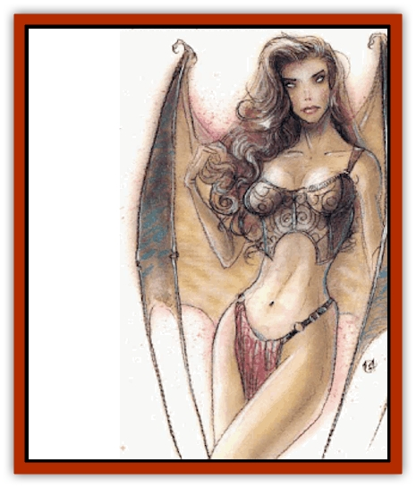
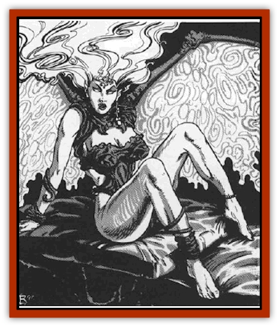

# Tanar'ri - Lesser - Succubus

| Statistic | **Tanar'ri, Lesser, Succubus** |
| --- | --- |
| **Activity Cycle:** | Any |
| **Alignment:** | Chaotic evil |
| **Armor Class:** | 0 |
| **Climate/Terrain:** | The abyss |
| **Damage/Attack:** | 1d3/1d3 |
| **Diet:** | Carnivore |
| **Frequency:** | Very rare |
| **Hit Dice:** | 6 |
| **Intelligence:** | Exceptional (15-16) |
| **Magic Resistance:** | 30% |
| **Morale:** | Elite (13-14) |
| **Movement:** | 12, F1 18 (C) |
| **No. Appearing:** | 1 |
| **No. of Attacks:** | 2 |
| **Organization:** | Solitary |
| **Size:** | M (6' tall) |
| **Special Attacks:** | Energy drain |
| **Special Defenses:** | +2 or better weapons to hit, immune to fire, never surprised |
| **THAC0:** | 15 |
| **Treasure:** | I,Q |
| **XP Value:** | 11,000 |

Beautiful and seductive, the succubi are the temptresses of mortals. Whereas the [[Tanar'ri_True_Glabrezu|glabrezu]] tempt men of power, the succubi choose men of passion and energy.Succubi appear most often *polymorphed* into stunningly beautiful women with perfect figures and smooth, milky skin. They may also appear as any demihuman race. However, they do not often deal with demihumans, because humans' fiery nature makes them easier prey.

Succubi look more [[Tanar'ri_General_Information|tanar'ric]] in their true form: that of a beautiful woman with large wings and sinister, glowing eyes.

Succubi can speak the language of their victims. They also communicate using telepathy.

**Combat:** Succubi are never surprised. They are not warriors. When pressed, they defend themselves, but flee when possible. When trapped, they can attack with two fists (1d3 damage each).

Succubi are affected only by +2 or better weapons. They are immune to all fire-based attacks, magical or otherwise.

The kiss of a succubus drains energy from its victim, causing the loss of one level of life energy. The succubus lures a mortal man into activities of passion and then drains energy from him. Even after a drain, the heat of the moment is so strong that most men do not notice (Wisdom check at -4 penalty to notice each drain). If he fails the check, he continues, heedless of danger.

In addition to those available to all tanar'ri, succubi also have the following spell-like powers: *become ethereal* (as if using *oil of etherealness*), *charm person*, *clairaudience*, *ESP*, *plane shift*, *shapechange* (to a humanoid form of about their own height and weight), and *suggestion*. They can also attempt to *gate* in 1 [[Tanar'ri_True_Balor|balor]] once per day with a 40% chance of success.

**Habitat/Society:** The temptresses of the Lower Planes are subtle and slow. They seduce mortals with their charms, ultimately killing them and taking their life forces to the Abyss.

Succubi act independently of tanar'ri society. They work of their own volition and ultimately answer to no one. The greater and true tanar'ri seem content with this situation.

**Ecology:** The destruction of mortals increases the power of the Abyss. With this power the succubi aid the eternal war effort of the tanar'ri, who therefore tolerate them.

**Incubus**

  lncubi are the male counterparts to succubi, but they are far less common. These creatures travel to the Prime Material Plane to tempt female mortals. These creatures always appear as the most perfect male specimen of whatever race they are tempting. However, succubi and incubi do not mate to perpetuate their kind.

It is uncertain why there are more succubi than incubi. Sages suggest that mortal men are far more susceptible to the temptations of beauty than are women.

---
## Discovery & Documentation

**Source Publication:** MC8 Outer Planes Appendix (1990)
**Campaign Setting:** Planescape
**Author(s):** Timothy B. Brown, Jamie LaFountain

### Other Creatures Found in This Source Book
   * [[Aasimon_Agathinon|Aasimon, Agathinon]]
   * [[Aasimon_Deva|Aasimon, Deva]]
   * [[Aasimon_Light|Aasimon, Light]]
   * [[Aasimon_General_Information|Aasimon, General Information]]
   * [[Aasimon_Planetar|Aasimon, Planetar]]
   * [[Aasimon_Solar|Aasimon, Solar]]
   * [[Air_Sentinel|Air Sentinel]]
   * [[Animal_Lord|Animal Lord]]
   * [[Archon|Archon]]
   * [[Baatezu_Lesser_Abishai|Baatezu, Lesser, Abishai]]
   * [[Baatezu_Greater_Amnizu|Baatezu, Greater, Amnizu]]
   * [[Baatezu_Lesser_Barbazu|Baatezu, Lesser, Barbazu]]
   * [[Baatezu_Greater_Cornugon|Baatezu, Greater, Cornugon]]
   * [[Baatezu_Lesser_Erinyes|Baatezu, Lesser, Erinyes]]
   * [[Baatezu_General_Information|Baatezu, General Information]]
   * [[Baatezu_Greater_Gelugon|Baatezu, Greater, Gelugon]]
   * [[Baatezu_Lesser_Hamatula|Baatezu, Lesser, Hamatula]]
   * [[Baatezu_Lemure|Baatezu, Lemure]]
   * [[Baatezu_Least_Nupperibo|Baatezu, Least, Nupperibo]]
   * [[Baatezu_Lesser_Osyluth|Baatezu, Lesser, Osyluth]]
   * [[Baatezu_Greater_Pit_Fiend|Baatezu, Greater, Pit Fiend]]
   * [[Baatezu_Least_Spinagon|Baatezu, Least, Spinagon]]
   * [[Balaena|Balaena]]
   * [[Bariaur|Bariaur]]
   * [[Bebilith|Bebilith]]
   * [[Bodak|Bodak]]
   * [[Dog_Moon|Dog, Moon]]
   * [[Dragon_Adamantite|Dragon, Adamantite]]
   * [[Einheriar|Einheriar]]
   * [[Gehreleth|Gehreleth]]
   * [[Githyanki|Githyanki]]
   * [[Githzerai|Githzerai]]
   * [[Hordling|Hordling]]
   * [[Lammasu_Celestial|Lammasu, Celestial]]
   * [[Larva|Larva]]
   * [[Maelephant|Maelephant]]
   * [[Marut|Marut]]
   * [[Mediator|Mediator]]
   * [[Mortai|Mortai]]
   * [[Night_Hag|Night Hag]]
   * [[Nightmare|Nightmare]]
   * [[Noctral|Noctral]]
   * [[Per|Per]]
   * [[Phoenix|Phoenix]]
   * [[Slaad|Slaad]]
   * [[Tanar'ri_Greater_Babau|Tanar'ri, Greater, Babau]]
   * [[Tanar'ri_Greater_Chasme|Tanar'ri, Greater, Chasme]]
   * [[Tanar'ri_Greater_Nabassu|Tanar'ri, Greater, Nabassu]]
   * [[Tanar'ri_Least_Dretch|Tanar'ri, Least, Dretch]]
   * [[Tanar'ri_Least_Manes|Tanar'ri, Least, Manes]]
   * [[Tanar'ri_Least_Rutterkin|Tanar'ri, Least, Rutterkin]]
   * [[Tanar'ri_Lesser_Alu-Fiend|Tanar'ri, Lesser, Alu-Fiend]]
   * [[Tanar'ri_Lesser_Bar-Lgura|Tanar'ri, Lesser, Bar-Lgura]]
   * [[Tanar'ri_Lesser_Cambion|Tanar'ri, Lesser, Cambion]]
   * [[Tanar'ri_Guardian_Molydeus|Tanar'ri, Guardian, Molydeus]]
   * [[Tanar'ri_General_Information|Tanar'ri, General Information]]
   * [[Tanar'ri_True_Balor|Tanar'ri, True, Balor]]
   * [[Tanar'ri_True_Glabrezu|Tanar'ri, True, Glabrezu]]
   * [[Tanar'ri_True_Hezrou|Tanar'ri, True, Hezrou]]
   * [[Tanar'ri_True_Marilith|Tanar'ri, True, Marilith]]
   * [[Tanar'ri_True_Nalfeshnee|Tanar'ri, True, Nalfeshnee]]
   * [[Tanar'ri_True_Vrock|Tanar'ri, True, Vrock]]
   * [[Titan|Titan]]
   * [[Translator|Translator]]
   * [[T'uen-rin|T'uen-rin]]
   * [[Vaporighu|Vaporighu]]
   * [[Warden_Beast|Warden Beast]]
   * [[Yugoloth_Greater_Arcanaloth|Yugoloth, Greater, Arcanaloth]]
   * [[Yugoloth_Lesser_Dergoloth|Yugoloth, Lesser, Dergoloth]]
   * [[Yugoloth_Lesser_Hydroloth|Yugoloth, Lesser, Hydroloth]]
   * [[Yugoloth_General_Information|Yugoloth, General Information]]
   * [[Yugoloth_Lesser_Mezzoloth|Yugoloth, Lesser, Mezzoloth]]
   * [[Yugoloth_Greater_Nycaloth|Yugoloth, Greater, Nycaloth]]
   * [[Yugoloth_Lesser_Piscoloth|Yugoloth, Lesser, Piscoloth]]
   * [[Yugoloth_Greater_Ultroloth|Yugoloth, Greater, Ultroloth]]
   * [[Yugoloth_Lesser_Yagnoloth|Yugoloth, Lesser, Yagnoloth]]
   * [[Zoveri|Zoveri]]
