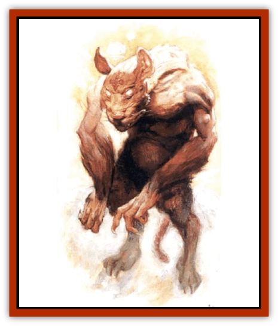
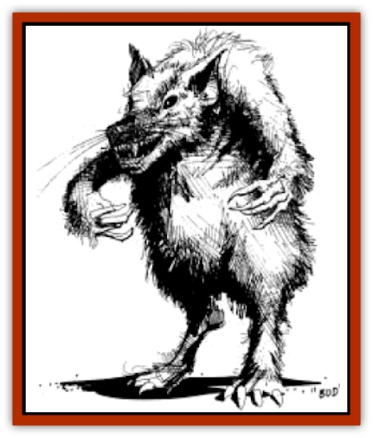

# Tanar'ri - Lesser - Uridezu

| Statistic | **Tanar'ri, Lesser, Uridezu** |
| --- | --- |
| **Activity Cycle:** | Any |
| **Alignment:** | Chaotic evil |
| **Armor Class:** | 0 |
| **Climate/Terrain:** | The Abyss and Prime Material Plane |
| **Damage/Attack:** | 1d8/1d8/2d6 |
| **Diet:** | Carnivore |
| **Frequency:** | Very Rare |
| **Hit Dice:** | 7 |
| **Intelligence:** | Low (5-7) |
| **Magic Resistance:** | Nil |
| **Morale:** | Steady (11-12) |
| **Movement:** | 18 |
| **No. Appearing:** | 1 |
| **No. of Attacks:** | 3 |
| **Organization:** | Solitary |
| **Size:** | M (6' tall) |
| **Special Attacks:** | Paralysis, command rats |
| **Special Defenses:** | Never surprised, immune to sleep and cold-based spells, cold iron or magical weapons to hit |
| **THAC0:** | 13 |
| **Treasure:** | Nil (B, Prime Material Plane) |
| **XP Value:** | 3,000 |

Uridezu, called rat-fiends are hulking, man-sized creatures resembling leprous, muscular hunch-backed rodents walking on two short legs. They inhabit the Abyss, where they serve the various [[Tanar'ri_General_Information|tanar'ri]]. Highly resistant to the effects of other planes, rat-fiends are often sent on errands by powerful tanar'ri. Their services may also be awarded to favored allies on other planes, or they may be compelled to service by powerful wizards. On occasion, they are stranded on the Prime Material Plane, where they can terrorize entire communities.

When encountered in the Abyss, rat-fiends have no treasure. Those rat-fiends that set up lairs on the Prime Material Plane accumulate treasure, both from victims and in the form of loot brought by their [[Rat|rat]]-servitors. Rat-fiends' lairs on the Prime Material contain Treasure Type B.

Marginally intelligent, rat-fiends are capable of carrying out simple commands, and are bright enough to change tactics or flee if they are threatened with destruction. A rat-fiend's body is maintained on planes other than the Abyss by its life energies. If killed on another plane, a rat-fiend's body will completely disintegrate within five minutes of its death.

**Combat:** Rat-fiends slash with their claws and bite with their sharp incisors. Victims struck by a rat-fiend's bite attack must save vs paralyzation or be paralyzed for 2-8 hours. Paralyzed victims may be carried off by the rat-fiend, who will then take them back to its home plane.

Although they are vulnerable to other attacks, rat-fiends are completely immune to *sleep* spells and cold-based enchantments such as *cone of cold*, *ice storm* and the like. In addition rat-fiends never roll for surprise. Like other tanar'ri, they have infravison and can create *darkness 15' radius*. They are immune to electrical attacks, normal fire, and poison. They take half damage from magical fire and gasess. A rat fiend has a 40% chance to *gate* in its masters, although this is often worse for the uridezu than for any foes it might face.

Apparently created from magically-mutated or particularly ferocious rodent-like creatures of the Abyss, rat-fiends retain a connection to the rats of the Prime Material Plane. A rat-fiend can command 2-12 normal or 1-6 giant rats to do its bidding, but only in areas where rats are normally found; in other areas, a rat-fiend is on its own.

Rat-fiends are highly vulnerable while returning to their home plane, for they must remain stationary for 3-12 turns and not be disturbed. For this reason they usually arrive on or leave the Prime Material Plane at an isolated area where they will not be disturbed.

**Habitat/Society:** Rat-fiends serve higher-level tanar'ri such as [[Tanar'ri_True_Balor|balor]], [[Tanar'ri_Lesser_Succubus|succubi]] and [[Tanar'ri_True_Glabrezu|glabrezu]] as slaves, servitors, messengers, and assassins. They are very low on the Abyss's social ladder, abused and tormented by other tanar'ri. Particularly accomplished rat-fiends are treated well by powerful tanar'ri lords as long as they continue to be useful. Old or unsuccessful rat-fiends often find themselves served up as dinner by their masters.

Because they are so ill-treated on their home plane, rat-fiends prefer traveling to other locales such as the Prime Material Plane, where they are sometimes found as familiars or servants of powerful spellcasters. Tanar'ri sometimes loan rat-fiends to mortal servants or allies, but such individuals are often incompetent or quarrelsome.

**Ecology:** Rat-fiends are unnatural creatures, and act as predators or scavengers when on the Prime Material Plane, sometimes setting up lairs in urban areas and preying on local animals and unfortunate inhabitants. In such cases, they usually dwell in ruins, cellars, slums, or other regions with large numbers of rats, using their rodent-control abilities to command local creatures to do their bidding. Such rats act as scouts and bodyguards for their masters, scavenging for their own food.

In the Abyss, rat-fiends who do not serve other tanar'ri are scavengers by nature, filling a niche similar to that of ordinary rats on the Prime Material Plane. They are a constant nuisance, lurking in shadows, grabbing scraps of food and attacking [[Tanar'ri_Least_Rutterkin|rutterkin]], [[Tanar'ri_Least_Dretch|dretch]], and other low-level tanar'ri.

---
## Discovery & Documentation

**Source Publication:** Monstrous Compendium, 1997 Annual, Volume 4 (1995)
**Campaign Setting:** Advanced Dungeons & Dragons 2nd Edition
**Author(s):** Jon Pickens

### Other Creatures Found in This Source Book
   * [[Anemone_Giant_Sea|Anemone, Giant Sea]]
   * [[Asperii|Asperii]]
   * [[Bainligor|Bainligor]]
   * [[Beast_of_Chaos|Beast of Chaos]]
   * [[Blindheim|Blindheim]]
   * [[Bloodsipper_Far_Realm|Bloodsipper (Far Realm)]]
   * [[Bulette_Gohlbrorn|Bulette, Gohlbrorn]]
   * [[Child_of_the_Sea|Child of the Sea]]
   * [[Clockwork_Horror|Clockwork Horror]]
   * [[Clockwork_Swordsman|Clockwork Swordsman]]
   * [[Coral|Coral]]
   * [[Darklore|Darklore]]
   * [[Dharculus|Dharculus]]
   * [[Dolphin_Athas|Dolphin (Athas)]]
   * [[Dragon_Neutral_Moonstone|Dragon, Neutral, Moonstone]]
   * [[Dragon_Prismatic|Dragon, Prismatic]]
   * [[Dream_Stalker|Dream Stalker]]
   * [[Dragon-kin_Albino_Wyrm|Dragon-kin, Albino Wyrm]]
   * [[Echyan|Echyan]]
   * [[Firestar|Firestar]]
   * [[Firetail|Firetail]]
   * [[Fish_Ascallion|Fish, Ascallion]]
   * [[Fish_Deep_Ocean|Fish, Deep Ocean]]
   * [[Fish_Tropical|Fish, Tropical]]
   * [[Fish_Vurgens|Fish, Vurgens]]
   * [[Fogwarden|Fogwarden]]
   * [[Fraal|Fraal]]
   * [[Giant_Crag|Giant, Crag]]
   * [[Gibberling_Brood|Gibberling, Brood]]
   * [[Glutton_Sea|Glutton, Sea]]
   * [[Golden_Ammonite|Golden Ammonite]]
   * [[Golem_Brass_Minotaur|Golem, Brass Minotaur]]
   * [[Golem_Gemstone|Golem, Gemstone]]
   * [[Golem_Maggot|Golem, Maggot]]
   * [[Groundling|Groundling]]
   * [[Hermit_Sea|Hermit, Sea]]
   * [[Hound_of_Law|Hound of Law]]
   * [[Human_Amazon|Human, Amazon]]
   * [[Human_Pygmy|Human, Pygmy]]
   * [[Inquisitor|Inquisitor]]
   * [[Kercpa|Kercpa]]
   * [[Kreel|Kreel]]
   * [[Lycanthrope_Lythari|Lycanthrope, Lythari]]
   * [[Mercurial|Mercurial]]
   * [[Mold_Chromatic|Mold, Chromatic]]
   * [[Mummy_Bog|Mummy, Bog]]
   * [[Neh-thalggu|Neh-thalggu]]
   * [[Nymph_Grain|Nymph, Grain]]
   * [[Nymph_Unseelie|Nymph, Unseelie]]
   * [[Octopus_Octo-Jelly|Octopus, Octo-Jelly]]
   * [[Puddingfish|Puddingfish]]
   * [[Sea_Demon|Sea Demon]]
   * [[Shade|Shade]]
   * [[Shadowrath|Shadowrath]]
   * [[Shark_Athas|Shark (Athas)]]
   * [[Siren_Ravenloft|Siren (Ravenloft)]]
   * [[Skeleton_Variant|Skeleton, Variant]]
   * [[Skyfish|Skyfish]]
   * [[Spectral_Scion|Spectral Scion]]
   * [[Spyder_Fiend|Spyder Fiend]]
   * [[Squid_Squark|Squid, Squark]]
   * [[Troll_Mutate|Troll Mutate]]
   * [[Vaati|Vaati]]
   * [[Vampire_Cerebral|Vampire, Cerebral]]
   * [[Varkha|Varkha]]
   * [[Wizshade|Wizshade]]
   * [[Worm_Lukhorn|Worm, Lukhorn]]
   * [[Wyste|Wyste]]
   * [[Yugoloth_Lesser_Gacholoth|Yugoloth, Lesser, Gacholoth]]
   * [[Zombie_Mud|Zombie, Mud]]
