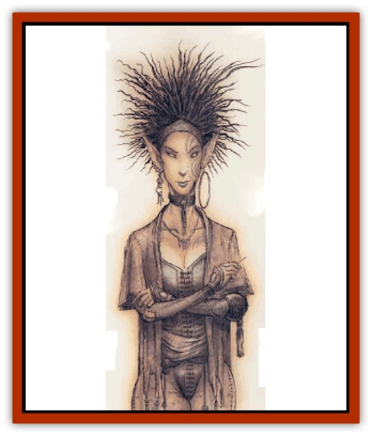
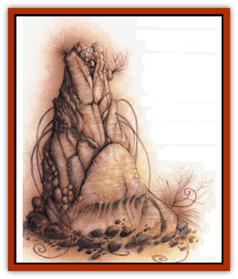

# Tanar'ri - Lesser - Yochlol

| Statistic | **Tanar'ri, Lesser, Yochlol** |
| --- | --- |
| **Activity Cycle:** | Any |
| **Alignment:** | Chaotic evil |
| **Armor Class:** | 10 (4 as spider) |
| **Climate/Terrain:** | The Abyss |
| **Damage/Attack:** | 1d4+4 &times;8 / 1d8 as spider / By weapon +4 as humanoid |
| **Diet:** | Carnivore |
| **Frequency:** | Very rare |
| **Hit Dice:** | 6+6 |
| **Intelligence:** | High (13-14) |
| **Magic Resistance:** | 50% |
| **Morale:** | Champion (15-16) |
| **Movement:** | 12, Wb 6 as spider |
| **No. Appearing:** | 1-4 |
| **No. of Attacks:** | 8 (1 as spider or humanoid) |
| **Organization:** | Group |
| **Size:** | M (6' tall) |
| **Special Attacks:** | Poison (spider), psionics |
| **Special Defenses:** | Struck only by +2 or better weapons |
| **THAC0:** | 15 |
| **Treasure:** | None |
| **XP Value:** | 11,000 |

**Psionics Summary**

| Level | Dis/Sci/Dev | Attack/Defense | Score | PSPs |
| --- | --- | --- | --- | --- |
| 6 | 1/3/10 | MT,II,EW/All | 14 | 90 |

**Telepathy -** *Sciences:* domination, mind link, probe; *Devotions:* attraction, contact, ESP, invisibility, phobia amplification, psionic impersonation.

Lolth, the Queen of Spiders, is one of many powers that call the Abyss home. Her infinte maze of black webs fills an entire layer. Whiel Lolth is preoccupied with the affairs of [[Elf_Drow|drow]] throughout the multiverse, she doesn't ignore the balance of power within the Abyss. The yochlol are her servants in her home layer and her agents on the Outer Planes. No other type of [[Tanar'ri_General_Information|tanar'ri]] has such a close relationship with a power that inhabits the Abyss; in fact, the yochlol are known as the Handmaidens of Lolth in some circles.

In their natural form, the yochlol bear a passing resemblance to a [[Roper|roper]] or an [[Tanar'ri_True_Alkilith|alkilith]] - they're man-size heaps of amorphous slime, with eight powerful tentacles and a single, glaring, red eye. However, they can also assume the form of beautiful young woman of human or [[Elf|elven]] race (usually drow), or take the form of a giant black [[Spider|spider]]. Like alkiliths, yochlol can assume *gaseous* form, taking the shape of a small *stinking cloud*. Some bloods've guessed that Lolth chose her handmaidens from the most suitable tanar'ri at hand and modified them for her own purposes, but there's no way to prove this short of a trip to the Abyss. It's not surprising that most sages're happy to leave this particular question unanswered.

Yochlol stand apart from the common tanar'ri causes, existing only to serve their dark mistress in whatever tasks she sets before them. They couldn't care less about the Blood War. The only part of the Abyss where the yochlol are common is in Lolth's pits; they don't leave their home layer except when Lolth commands them to, and even then they're more likely to be sent to the Prime than any other part of the Abyss.

**Combat:** Yochlol've got no fewer than four different body forms, and possess different powers and vulnerabilities in each. In the Abyss, they're most commonly found in their amorphous or natureal state. In the Outlands or the Prime, yochlol prefer to travel in their humanoid or spider shapes. Regardless of their shape, yochlol can be struck only by cold iron or weapons of +2 or better enchantment. They're immune to nonmagical fire, gasses, poison, and electricity and take only half damage from magical fire or cold.

In their natural amorphous forms, yochlol are AC 10. They can attack with each of their 8 tentacles, striking for 1d4 points of damage each, +4 for the yochlol's Strength.

In spider-form, yochlol can move freely in weby, have an AC of 4, and can attack once per round for 1d8 points of damage. As spiders, their poisonous bite immediatly kills their victim unless he or she succeeds with a saving throw vs. poison.

In human form, yochlol are AC 10 but often use chain or plate mail of drow make to improve their Armor Class. They favor weapons used by drow, including short swords, hand crossbows, and javelins. Yochlol retain their 18/51 Strength rating in humanoid form, and strike with a +2 attack bonus and inflict +4 points of damage with whatever weapon they use.

Last but not least, yochlol can assume gaseous form, creating a stinking cloud roughly 10 feet tall and 5 feet in diameter. Yochlol can't use any physical attacks or spell-like abilities in this form, but they can make use of their psionic powers. In gaseous form, yochlol are immune to all physical damage and can be injured only by magical cold, magical fire, or *magic missiles*. A *gust of wind* spell inflirts 6d6 points of damage to a yachlol in this form, and a *wind walk* spell slays the yochlol instantly with no saving throw or magic resistance check.

Yochlol've got the spell-like powers common to all tanar'ri, and can also use the following abilities at will as 6th-level spellcasters: *charm person*, *spider climb*, *stone shape*, and *web*. Yochlol also command modest psionic powers, as shown above. Generally, a yochlol'll carefully evaluate a situation and decide if its mistress's interests are best served through a deceptive approach of misdirection and subtlety, or a naked show of force. In the first instance, the yochlol hides its true form and uses its beauty and charm to beguile its opponents; in the latter case, it shows itself in its true form.

**Habitat/Society:** As Lolth's chosen servants, yochlol are not well-liked by other tanar'ri, but they are guaranteed free passage in the layers controlled by most Abyssal Lords. Even a demipower such as Demogorgon or [[Abyssal_Lord|Graz'zt]] prefers not to aggravate the Spider Queen needlessly, and interfering with Lolth's handmaidens is a quick way to draw her attention. A cutter who meets a yochlol somewhere other than Lolth's webs usually finds that the creature's too busy with the Spider Queen's business to bother with him.

'Course, things're a lot different if the cutter himself is Lolth's business.

Yochlol cooperate with each other surprisingly well. They're unswervingly loyal to Lolth and place her interests before their own - a rare characteristic in creatures of chaos and evil. It's been suggested that the Spider Queen maintains some kind of charm or control over her minions to ensure their continued loyalty, but it's more likely that the yochlol are terrified of what their might do to a cross-trader or stag-turner.

**Ecology:** The chant's that Lolth personally creates each of her handmaidens. but this ain't true. The yochlol are recruited from the numberless ranks of least tanar'ri and subjected to unspeakable ceremonies and torture to win their elevated station. It's worth noting that some yochlol may be far more powerful and important than typical, since Lolth rewards those who serve her well.

---
## Discovery & Documentation

**Source Publication:** Planescape II (1996)
**Campaign Setting:** Planescape
**Author(s):** Rich Baker, Karen S. Boomgarden

### Other Creatures Found in This Source Book
   * [[Aasimar|Aasimar]]
   * [[Abrian|Abrian]]
   * [[Arcane|Arcane]]
   * [[Balaena|Balaena]]
   * [[Beholder-kin_Observer|Beholder-kin, Observer]]
   * [[Bloodthorn|Bloodthorn]]
   * [[Bonespear|Bonespear]]
   * [[Darkweaver|Darkweaver]]
   * [[Demarax|Demarax]]
   * [[Dhour|Dhour]]
   * [[Eater_of_Knowledge|Eater of Knowledge]]
   * [[Eladrin_Greater_Firre|Eladrin, Greater, Firre]]
   * [[Eladrin_Greater_Ghaele|Eladrin, Greater, Ghaele]]
   * [[Eladrin_Greater_Tulani|Eladrin, Greater, Tulani]]
   * [[Eladrin_Lesser_Bralani|Eladrin, Lesser, Bralani]]
   * [[Eladrin_Lesser_Coure|Eladrin, Lesser, Coure]]
   * [[Eladrin_Lesser_Noviere|Eladrin, Lesser, Noviere]]
   * [[Eladrin_Lesser_Shiere|Eladrin, Lesser, Shiere]]
   * [[Fhorge|Fhorge]]
   * [[Ghostlight|Ghostlight]]
   * [[Guardinal_Avoral|Guardinal, Avoral]]
   * [[Guardinal_Cervidal|Guardinal, Cervidal]]
   * [[Guardinal_General_Information|Guardinal, General Information]]
   * [[Guardinal_Equinal|Guardinal, Equinal]]
   * [[Guardinal_Leonal|Guardinal, Leonal]]
   * [[Guardinal_Lupinal|Guardinal, Lupinal]]
   * [[Guardinal_Ursinal|Guardinal, Ursinal]]
   * [[Hollyphant|Hollyphant]]
   * [[Incantifer|Incantifer]]
   * [[Ironmaw|Ironmaw]]
   * [[Keeper|Keeper]]
   * [[Khaasta|Khaasta]]
   * [[Leomarh|Leomarh]]
   * [[Monster_of_Legend|Monster of Legend]]
   * [[Mortai|Mortai]]
   * [[Noctral|Noctral]]
   * [[Quill|Quill]]
   * [[Razorvine|Razorvine]]
   * [[Reave|Reave]]
   * [[Retriever|Retriever]]
   * [[Rilmani_Abiorach|Rilmani, Abiorach]]
   * [[Rilmani_General_Information|Rilmani, General Information]]
   * [[Rilmani_Argenach|Rilmani, Argenach]]
   * [[Rilmani_Aurumach|Rilmani, Aurumach]]
   * [[Rilmani_Cuprilach|Rilmani, Cuprilach]]
   * [[Rilmani_Ferrumach|Rilmani, Ferrumach]]
   * [[Rilmani_Plumach|Rilmani, Plumach]]
   * [[Shadowdrake|Shadowdrake]]
   * [[Spellhaunt|Spellhaunt]]
   * [[Spider_Hook|Spider, Hook]]
   * [[Sunfly|Sunfly]]
   * [[Sword_Spirit|Sword Spirit]]
   * [[Tanar'ri_Lesser_Bulezau|Tanar'ri, Lesser, Bulezau]]
   * [[Tanar'ri_Lesser_Maurezhi|Tanar'ri, Lesser, Maurezhi]]
   * [[Tanar'ri_General_Information|Tanar'ri, General Information]]
   * [[Tanar'ri_True_Alkilith|Tanar'ri, True, Alkilith]]
   * [[Terlen|Terlen]]
   * [[Tso|Tso]]
   * [[T'uen-rin|T'uen-rin]]
   * [[Vaporighu|Vaporighu]]
   * [[Vorr|Vorr]]
   * [[Wastrel|Wastrel]]
   * [[Wraithworm|Wraithworm]]
   * [[Yugoloth_Lesser_Canoloth|Yugoloth, Lesser, Canoloth]]
   * [[Zoveri|Zoveri]]
