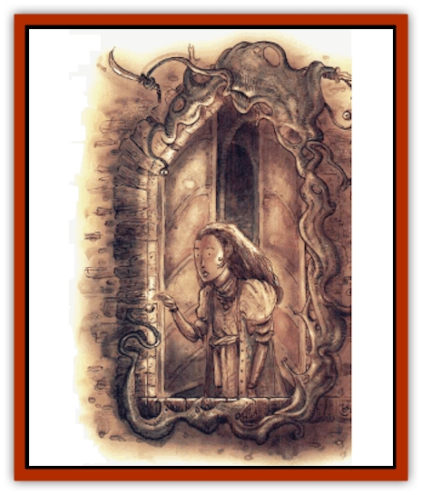

# Tanar'ri - True - Alkilith

| Statistic | **Tanar'ri, True, Alkilith** |
| --- | --- |
| **Activity Cycle:** | Any |
| **Alignment:** | Chaotic evil |
| **Armor Class:** | 3 |
| **Climate/Terrain:** | The Abyss |
| **Damage/Attack:** | 2d4/2d4/2d4/2d4 |
| **Diet:** | Carnivore |
| **Frequency:** | Rare |
| **Hit Dice:** | 11 |
| **Intelligence:** | High (13-14) |
| **Magic Resistance:** | 40% |
| **Morale:** | Champion (15-16) |
| **Movement:** | 6 |
| **No. Appearing:** | 1-3 |
| **No. of Attacks:** | 4 |
| **Organization:** | Solitary |
| **Size:** | L (6' diameter) |
| **Special Attacks:** | Acid, poison |
| **Special Defenses:** | ½ damage from Type S or B weapons; struck only hy +2 or better weapons |
| **THAC0:** | 9 |
| **Treasure:** | F |
| **XP Value:** | 17,000 |

The horrors of the Abyss are uncountable. Layers upon layers of seething, pustulent evil wait for the unwary traveler. At first glance, it'd seem that some of the Abyssal layers are uninhabitable, even for [[Tanar'ri_General_Information|tanar'ri]] - but a body'd be addle-coved to believe that. The alkiliths're a type of tanar'ri that thrives in the foulest and most inhospitable places of the Ahyss, acting as personal agents of the unspeakable Abyssal Lords.

Alkiliths've got an unusual purpose among the true tanar'ri: They exist to corrupt all they touch, extending the reach of the Ahyss by despoiling anything that comes into contact with it. The alkiliths seek to pollute the world beyond the Ahyss physically and morally. While fiends such as the [[Tanar'ri_True_Glabrezu|glabrezu]] and [[Tanar'ri_Lesser_Succubus|succubi]] bring mortals to the Abyss, the alkiliths work to bring the Abyss itself to any world unfortunate enough to he within reach. Alkiliths destroy things that're beautiful, desecrate things that're sacred, and fan the embers of fear or resentment into raging hatred. By spreading chaos and evil throughout the multiverse, they'll increase the power of the Abyss.

Alkiliths�re closely tied to the various [[Ooze_Slime_Jelly_I|slimes, jellies, and oozes]] found on many prime worlds. They're not remotely humanoid, taking the form of a disgusting blob of phosphorescent green corruption. Their hodies're surrounded by a cracked, leathery coating or secretion that constantly oozes more of their vile protoplasm in a continual process of exuding and reabsorbing hide. Alkiliths're capable of assuming a semi-rigid form, and their pseudopods can wield weapons and manipulate objects with surprising precision. Dark, swollen eye-globules dot an alkilith's surface; normally the creature's got anywhere from 3 to 7 of these spread out around its body to observe what's happening around it.

**Combat:** Alkiliths're never surprised in the Abyss, and only on a roll of 1 elsewhere. They can he injured only by weapons of cold iron or a +2 or better enchantment. Like all tanar'ri, alkiliths're resistant to many attack forms; they suffer no damage from electricity, nonmagical fire, or poison, and only half damage from cold or magical fire. In addition, the alkilith's unusual physical form renders it immune to all acids or harmful gasses. Slashing or bludgeoning weapons don't cause alkiliths serious harm , and inflict only half normal damage against the monster. Piercing weapons can reach their vitals and cause full damage.

Alkiliths're extremely dangerous in close combat. Each round, they can strike with four lightning-fast pseudopods, each inflicting 2d4 points of damage. If the alkilith hits, a vile, corrosive slime is smeared across its victim. The victim has to make a successful saving throw versus poison or suffer an additional 1d6 points of damage per round for the next 1 to 6 rounds or until the slime is cleaned off. Whether or not the victim succeeds in his saving throw, some portion of his equipment may he endangered by the potent acid. Check the chart below:

| % roll | Equipment threatened |
| --- | --- |
| 01-60 | Victim's armor degrades one place per round of corrosion until an item saving throw vs. acid is successful. |
| 61-75 | Victim's shield is ruined unless an item saving throw vs. acid is successful. |
| 76-90 | Victim's weapon is ruined or degrades by one plus per round until an item saving throw vs. acid is successful. |
| 91-00 | A random item (backpack, worn or carried magical item, etc.) is ruined unless an item saving throw vs. acid is successful. |

Alkiliths also have the ability to assume *gaseous form*, but in doing so they expand to create a 20'x20'x10' cloud of foul, stinking vapors. The vapors are impenetrable to normal vision and duplicate the effects of a *cloudkill* spell. An alkilith is impervious to physical damage in this form, but it requires a full round of no other activity for the fiend to make the transition to cloud and back again. Alkiliths can move at a rate of only 1 in *gaseous form*, and if struck by a *gust of wind* or similar effect suffer 1d6 points of damage per level of the caster with no saving throw.

In addition to the powers available to all tanar'ri, alkiliths can also make use of the following spell-like abilities (at will unless otherwise specified) at the 11th lwel of spell use: *cause disease*, *command* any ooze, jelly, slime, or fungus-based monster, *cone of cold* (3/day), *detect magic*, *dispel magic*, *enervation*, *hold person*, *putrefy food and drink* (by touch), *stinking cloud*, and *wall of ice*. Once per day an alkilith may attempt to *gate* 1 to 3 chasme (30%) or 1 hezrou (70%) with a 50% chance of success.

**Habitat/Society:** Alkiliths're the envoys, agents, and assassins of the Abyssal Lords. A great number of their missions take place within the Abyss, as the lords of the tanar'ri spend much of their time scheming and feuding with each other. From time to time they're sent into the Great Wheel or onto the Prime Material Plane on an errand of vile corruption. Alkiliths take an unholy delight in tasks that allow them to mar things or places of beauty.

The Blood War's only a tangential concern for the alkiliths. They'll fight when they have to, but normally they steer clear of the [[Tanar'ri_Greater_Babau|babaus]] and [[Tanar'ri_Guardian_Molydeus|molydei]] by retreating into regions so despicable and unclean that even other tanar'ri hesitate to follow. However, an alkilith'll savagely attack any [[Baatezu_General_Information|baatezu]] it encounters while it's about its work.

Alkiliths aren't very common in the Abyss, but they're greatly feared because other tanar'ri have no innate resistance to their horrible acid or vile cloud of poisonous gas. As creatures of the Abyssal Lords, the alkiliths aren't well-liked by their peers, but they're guaranteed a certain measure of protection. An alkilith's fortunes wax and wane with those of its master, and when the Abyssal Lord suffers a setback, the alkilith often ends up lost.

**Ecology:** Whenever possible, alkiliths bring the hateful spite and corruption of the Abyss to unfortunate prime-material worlds. In some cases, the seeds of evil and pestilence planted by an alkilith can ovenvhelm an entire land, plunging thousands of mortals into a living nightmare of senseless war and devastation.

---
## Discovery & Documentation

**Source Publication:** Planescape II (1996)
**Campaign Setting:** Planescape
**Author(s):** Rich Baker, Karen S. Boomgarden

### Other Creatures Found in This Source Book
   * [[Aasimar|Aasimar]]
   * [[Abrian|Abrian]]
   * [[Arcane|Arcane]]
   * [[Balaena|Balaena]]
   * [[Beholder-kin_Observer|Beholder-kin, Observer]]
   * [[Bloodthorn|Bloodthorn]]
   * [[Bonespear|Bonespear]]
   * [[Darkweaver|Darkweaver]]
   * [[Demarax|Demarax]]
   * [[Dhour|Dhour]]
   * [[Eater_of_Knowledge|Eater of Knowledge]]
   * [[Eladrin_Greater_Firre|Eladrin, Greater, Firre]]
   * [[Eladrin_Greater_Ghaele|Eladrin, Greater, Ghaele]]
   * [[Eladrin_Greater_Tulani|Eladrin, Greater, Tulani]]
   * [[Eladrin_Lesser_Bralani|Eladrin, Lesser, Bralani]]
   * [[Eladrin_Lesser_Coure|Eladrin, Lesser, Coure]]
   * [[Eladrin_Lesser_Noviere|Eladrin, Lesser, Noviere]]
   * [[Eladrin_Lesser_Shiere|Eladrin, Lesser, Shiere]]
   * [[Fhorge|Fhorge]]
   * [[Ghostlight|Ghostlight]]
   * [[Guardinal_Avoral|Guardinal, Avoral]]
   * [[Guardinal_Cervidal|Guardinal, Cervidal]]
   * [[Guardinal_General_Information|Guardinal, General Information]]
   * [[Guardinal_Equinal|Guardinal, Equinal]]
   * [[Guardinal_Leonal|Guardinal, Leonal]]
   * [[Guardinal_Lupinal|Guardinal, Lupinal]]
   * [[Guardinal_Ursinal|Guardinal, Ursinal]]
   * [[Hollyphant|Hollyphant]]
   * [[Incantifer|Incantifer]]
   * [[Ironmaw|Ironmaw]]
   * [[Keeper|Keeper]]
   * [[Khaasta|Khaasta]]
   * [[Leomarh|Leomarh]]
   * [[Monster_of_Legend|Monster of Legend]]
   * [[Mortai|Mortai]]
   * [[Noctral|Noctral]]
   * [[Quill|Quill]]
   * [[Razorvine|Razorvine]]
   * [[Reave|Reave]]
   * [[Retriever|Retriever]]
   * [[Rilmani_Abiorach|Rilmani, Abiorach]]
   * [[Rilmani_General_Information|Rilmani, General Information]]
   * [[Rilmani_Argenach|Rilmani, Argenach]]
   * [[Rilmani_Aurumach|Rilmani, Aurumach]]
   * [[Rilmani_Cuprilach|Rilmani, Cuprilach]]
   * [[Rilmani_Ferrumach|Rilmani, Ferrumach]]
   * [[Rilmani_Plumach|Rilmani, Plumach]]
   * [[Shadowdrake|Shadowdrake]]
   * [[Spellhaunt|Spellhaunt]]
   * [[Spider_Hook|Spider, Hook]]
   * [[Sunfly|Sunfly]]
   * [[Sword_Spirit|Sword Spirit]]
   * [[Tanar'ri_Lesser_Bulezau|Tanar'ri, Lesser, Bulezau]]
   * [[Tanar'ri_Lesser_Maurezhi|Tanar'ri, Lesser, Maurezhi]]
   * [[Tanar'ri_Lesser_Yochlol|Tanar'ri, Lesser, Yochlol]]
   * [[Tanar'ri_General_Information|Tanar'ri, General Information]]
   * [[Terlen|Terlen]]
   * [[Tso|Tso]]
   * [[T'uen-rin|T'uen-rin]]
   * [[Vaporighu|Vaporighu]]
   * [[Vorr|Vorr]]
   * [[Wastrel|Wastrel]]
   * [[Wraithworm|Wraithworm]]
   * [[Yugoloth_Lesser_Canoloth|Yugoloth, Lesser, Canoloth]]
   * [[Zoveri|Zoveri]]
