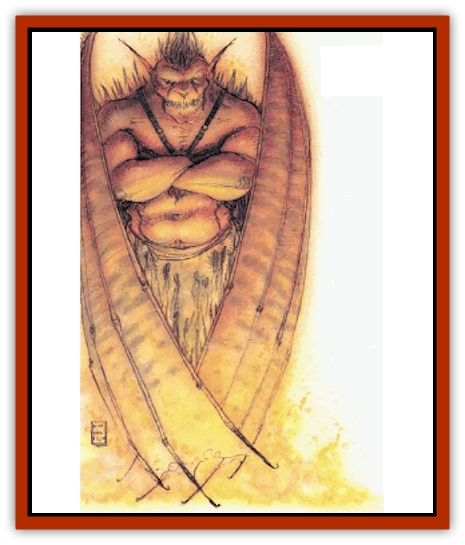
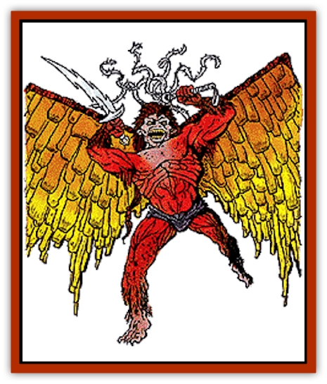

# Tanar'ri - True - Balor

| Statistic | **Tanar'ri, True, Balor** |
| --- | --- |
| **Activity Cycle:** | Any |
| **Alignment:** | Chaotic evil |
| **Armor Class:** | -8 |
| **Climate/Terrain:** | The Abyss |
| **Damage/Attack:** | 1d12/1d4 + special |
| **Diet:** | Carnivore |
| **Frequency:** | Very rare |
| **Hit Dice:** | 13 |
| **Intelligence:** | Supra-genius (19-20) |
| **Magic Resistance:** | 70% |
| **Morale:** | Fearless (19-20) |
| **Movement:** | 15, Fl 36 (B) |
| **No. Appearing:** | 1 |
| **No. of Attacks:** | 2 (sword, whip) |
| **Organization:** | Solitary |
| **Size:** | L (12' tall) |
| **Special Attacks:** | Terror, body flames, death throes, explosion |
| **Special Defenses:** | +3 or better weapons to hit |
| **THAC0:** | 7 |
| **Treasure:** | H&times;3 |
| **XP Value:** | 26,000 |

Greatest and most terrible of the true [[Tanar'ri_General_Information|tanar'ri]], the balors are the undisputed terrors of the Abyss. They motivate the tanar'ri involvement in the Blood War and derive immense pleasure from others' suffering.

Balors are repulsive, towering humanoids with dark red skin; huge wings that propel them with unnatural speed and agility; long, wicked claws; and grotesque fangs that drip venom. Each balor carries a sword of lightning and a many-tailed whip, and searing flames surround the creature.

Balors communicate using telepathy.

**Combat:** Balors are cannot be surprised. They are immune to all nonmagical attacks including fire, gas, poison, and weapons, and all attacks with magical weapons of less than +3 enchantment.

Balors prefer their primary weapon, a *vorpal sword* that looks like a bolt of lightning and can *detect evil/good* in a 30' radius. Any creature picking up a balor's sword suffers 10d6 damage and must save vs. spell or die.

Balors also use a long whip with many tails (1d4 damage). These magically wrap around the victim, who is drawn into the balor's bodily flames (4d6 damage per round). Escaping the whip requires a successful check against half the victim's Strength score. A whip that holds a victim cannot be used in attacks.

Balors can also attack with their fists (2d6 damage and save vs. spell at -6 or flee in terror for 1-6 turns). If slain in the Abyss, a balor explodes in a blinding flash of light, inflicting 50 hp damage to everything in a 100�radius (save vs. spell for half damage).

In addition to those available to all tanar'ri, balors can use the following spell-like powers at 20th level of spell use: *detect invisibility* (always active), *detect magic* (always active), *dispel magic*, *fear*, *pyrotechnics*, *read magic*, *suggestion*, *symbol* (any type), *telekinesis*, and *tongues*. Once per hour they can automatically *gate* in 1-8 least, 1-6 lesser, 1-4 greater, or 1 true tanar'ri.

**Habitat/Society:** At least twenty-four balors are known to exist. They wander the Abyss, forming armies and commanding them in battle with the [[Baatezu_General_Information|baatezu]].

Balors recognize all planes as potential battlegrounds in the War. They make pacts with mortals to perform services in return for power in the mortals' planes. The more followers or allies they gain there, the more magical power they command in the Blood War.

**Ecology:** Nothing is more important in the Abyss than the Blood War. The balor, in a sense, are the Blood War from a tanar'ri perspective. In that sense they are the ecology of the Abyss, driving the creation of new beings and mandating their survival.

---
## Discovery & Documentation

**Source Publication:** MC8 Outer Planes Appendix (1990)
**Campaign Setting:** Planescape
**Author(s):** Timothy B. Brown, Jamie LaFountain

### Other Creatures Found in This Source Book
   * [[Aasimon_Agathinon|Aasimon, Agathinon]]
   * [[Aasimon_Deva|Aasimon, Deva]]
   * [[Aasimon_Light|Aasimon, Light]]
   * [[Aasimon_General_Information|Aasimon, General Information]]
   * [[Aasimon_Planetar|Aasimon, Planetar]]
   * [[Aasimon_Solar|Aasimon, Solar]]
   * [[Air_Sentinel|Air Sentinel]]
   * [[Animal_Lord|Animal Lord]]
   * [[Archon|Archon]]
   * [[Baatezu_Lesser_Abishai|Baatezu, Lesser, Abishai]]
   * [[Baatezu_Greater_Amnizu|Baatezu, Greater, Amnizu]]
   * [[Baatezu_Lesser_Barbazu|Baatezu, Lesser, Barbazu]]
   * [[Baatezu_Greater_Cornugon|Baatezu, Greater, Cornugon]]
   * [[Baatezu_Lesser_Erinyes|Baatezu, Lesser, Erinyes]]
   * [[Baatezu_General_Information|Baatezu, General Information]]
   * [[Baatezu_Greater_Gelugon|Baatezu, Greater, Gelugon]]
   * [[Baatezu_Lesser_Hamatula|Baatezu, Lesser, Hamatula]]
   * [[Baatezu_Lemure|Baatezu, Lemure]]
   * [[Baatezu_Least_Nupperibo|Baatezu, Least, Nupperibo]]
   * [[Baatezu_Lesser_Osyluth|Baatezu, Lesser, Osyluth]]
   * [[Baatezu_Greater_Pit_Fiend|Baatezu, Greater, Pit Fiend]]
   * [[Baatezu_Least_Spinagon|Baatezu, Least, Spinagon]]
   * [[Balaena|Balaena]]
   * [[Bariaur|Bariaur]]
   * [[Bebilith|Bebilith]]
   * [[Bodak|Bodak]]
   * [[Dog_Moon|Dog, Moon]]
   * [[Dragon_Adamantite|Dragon, Adamantite]]
   * [[Einheriar|Einheriar]]
   * [[Gehreleth|Gehreleth]]
   * [[Githyanki|Githyanki]]
   * [[Githzerai|Githzerai]]
   * [[Hordling|Hordling]]
   * [[Lammasu_Celestial|Lammasu, Celestial]]
   * [[Larva|Larva]]
   * [[Maelephant|Maelephant]]
   * [[Marut|Marut]]
   * [[Mediator|Mediator]]
   * [[Mortai|Mortai]]
   * [[Night_Hag|Night Hag]]
   * [[Nightmare|Nightmare]]
   * [[Noctral|Noctral]]
   * [[Per|Per]]
   * [[Phoenix|Phoenix]]
   * [[Slaad|Slaad]]
   * [[Tanar'ri_Greater_Babau|Tanar'ri, Greater, Babau]]
   * [[Tanar'ri_Greater_Chasme|Tanar'ri, Greater, Chasme]]
   * [[Tanar'ri_Greater_Nabassu|Tanar'ri, Greater, Nabassu]]
   * [[Tanar'ri_Least_Dretch|Tanar'ri, Least, Dretch]]
   * [[Tanar'ri_Least_Manes|Tanar'ri, Least, Manes]]
   * [[Tanar'ri_Least_Rutterkin|Tanar'ri, Least, Rutterkin]]
   * [[Tanar'ri_Lesser_Alu-Fiend|Tanar'ri, Lesser, Alu-Fiend]]
   * [[Tanar'ri_Lesser_Bar-Lgura|Tanar'ri, Lesser, Bar-Lgura]]
   * [[Tanar'ri_Lesser_Cambion|Tanar'ri, Lesser, Cambion]]
   * [[Tanar'ri_Lesser_Succubus|Tanar'ri, Lesser, Succubus]]
   * [[Tanar'ri_Guardian_Molydeus|Tanar'ri, Guardian, Molydeus]]
   * [[Tanar'ri_General_Information|Tanar'ri, General Information]]
   * [[Tanar'ri_True_Glabrezu|Tanar'ri, True, Glabrezu]]
   * [[Tanar'ri_True_Hezrou|Tanar'ri, True, Hezrou]]
   * [[Tanar'ri_True_Marilith|Tanar'ri, True, Marilith]]
   * [[Tanar'ri_True_Nalfeshnee|Tanar'ri, True, Nalfeshnee]]
   * [[Tanar'ri_True_Vrock|Tanar'ri, True, Vrock]]
   * [[Titan|Titan]]
   * [[Translator|Translator]]
   * [[T'uen-rin|T'uen-rin]]
   * [[Vaporighu|Vaporighu]]
   * [[Warden_Beast|Warden Beast]]
   * [[Yugoloth_Greater_Arcanaloth|Yugoloth, Greater, Arcanaloth]]
   * [[Yugoloth_Lesser_Dergoloth|Yugoloth, Lesser, Dergoloth]]
   * [[Yugoloth_Lesser_Hydroloth|Yugoloth, Lesser, Hydroloth]]
   * [[Yugoloth_General_Information|Yugoloth, General Information]]
   * [[Yugoloth_Lesser_Mezzoloth|Yugoloth, Lesser, Mezzoloth]]
   * [[Yugoloth_Greater_Nycaloth|Yugoloth, Greater, Nycaloth]]
   * [[Yugoloth_Lesser_Piscoloth|Yugoloth, Lesser, Piscoloth]]
   * [[Yugoloth_Greater_Ultroloth|Yugoloth, Greater, Ultroloth]]
   * [[Yugoloth_Lesser_Yagnoloth|Yugoloth, Lesser, Yagnoloth]]
   * [[Zoveri|Zoveri]]
