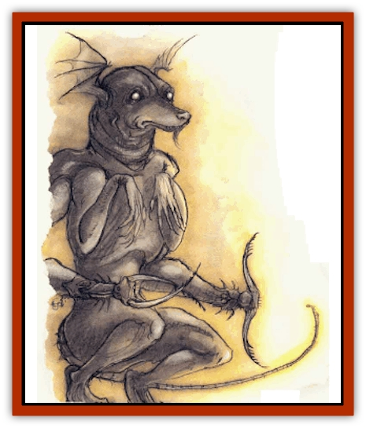
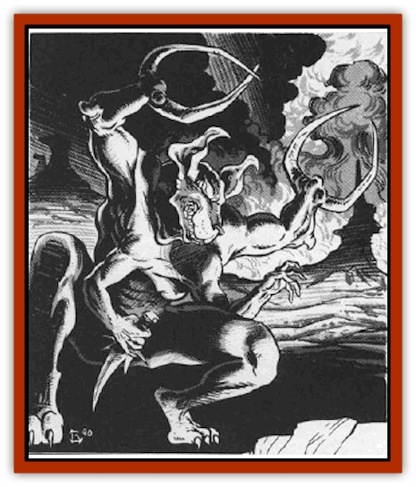

# Tanar'ri - True - Glabrezu

| Statistic | **Tanar'ri, True, Glabrezu** |
| --- | --- |
| **Activity Cycle:** | Any |
| **Alignment:** | Chaotic evil |
| **Armor Class:** | -7 |
| **Climate/Terrain:** | The Abyss |
| **Damage/Attack:** | 2d6/2d6/1d3/1d3/1d4+1 |
| **Diet:** | Carnivore |
| **Frequency:** | Rare |
| **Hit Dice:** | 10 |
| **Intelligence:** | Exceptional (15-16) |
| **Magic Resistance:** | 50% |
| **Morale:** | Fanatic (17-18) |
| **Movement:** | 15 |
| **No. Appearing:** | 1 |
| **No. of Attacks:** | 5 |
| **Organization:** | Solitary |
| **Size:** | H (15' tall) |
| **Special Attacks:** | Grab |
| **Special Defenses:** | +2 or better weapons to hit |
| **THAC0:** | 11 |
| **Treasure:** | H (see below) |
| **XP Value:** | 12,000 |

Glabrezu are the [[Tanar'ri_General_Information|tanar'ri]] that typically respond to summonings from other planes. They go forth and secure power for their cause.

Glabrezu are towering, broad and well-muscled, with four arms, two that end in clawed hands and two with powerful pincers. They have dog-like heads with sharp fangs and penetrating violet eyes. Their skin color ranges from a deep russet to pitch black. These commanding tanar'ri are terrifying to see.

Glabrezu communicate using telepathy.

**Combat:** Glabrezu usually avoid combat with mortals, preferring guile, trickery, and evil bargains. However, if things do not go as planned, the glabrezu thinks nothing of slaying the mortal (who, to the glabrezu's thinking, will probably end up in the Abyss anyway).

A glabrezu can attack with two claws (1d3 damage each), two pincers (2d6 damage each), and a bite (1d4+1 damage). With a successful claw attack it can attempt to grab and pick up an opponent of 150 pounds or less (Dexterity check to avoid this). A grabbed opponent can still attack at a -4 penalty, or can break free with a successful Strength check instead of attacking. A glabrezu rarely drops a grabbed opponent unless it faces imminent death.

In addition to those available to all tanar'ri, glabrezu can use the following spell-like powers at 10th level of spell use: *burning hands*, *charm person*, *confusion*, *detect magic* (always active), *dispel magic*, *enlarge*, *mirror image*, *power word stun* (7 times per day), *reverse gravity*, and *true seeing* (always active). Once per day a glabrezu can *gate* in one greater tanar'ri with a 50% chance of success.

These creatures are immune to all nonmagical attacks such as fire, gas, acid, etc., and to weapons of less than +2 magical enchantment.

Due to their role in tanar'ri society, glabrezu can *plane shift* at will. They rarely do this of their own volition, however, prefening to leave the Abyss only when summoned.

**Habitat/Society:** Glabrezu are the covert agents of the underworld. They lure weak and impulsive mortals into giving them power. When a mortal mage summons a glabrezu, the mage is confident that strong magic will master the situation. But mags are short-sighted compared to the immortal glabrezu. The glabrezu knows that with each summoning, its power there, like a seed of evil, germinates and begins to grow.

Glabrezu possess rich treasure that they hoard in vast subterranean lairs in the Abyss. With these masses of gold, magic, and wealth they tempt mortals into summoning them.

**Ecology:** Glabrezu leech power from other planes and exert their influence there with surgical precision. Although they take little part in the shughter of the Blood War, their subtle manipulations and subjugations are a deeper evil. They do not get on well with [[Tanar'ri_True_Marilith|mariliths]].

---
## Discovery & Documentation

**Source Publication:** MC8 Outer Planes Appendix (1990)
**Campaign Setting:** Planescape
**Author(s):** Timothy B. Brown, Jamie LaFountain

### Other Creatures Found in This Source Book
   * [[Aasimon_Agathinon|Aasimon, Agathinon]]
   * [[Aasimon_Deva|Aasimon, Deva]]
   * [[Aasimon_Light|Aasimon, Light]]
   * [[Aasimon_General_Information|Aasimon, General Information]]
   * [[Aasimon_Planetar|Aasimon, Planetar]]
   * [[Aasimon_Solar|Aasimon, Solar]]
   * [[Air_Sentinel|Air Sentinel]]
   * [[Animal_Lord|Animal Lord]]
   * [[Archon|Archon]]
   * [[Baatezu_Lesser_Abishai|Baatezu, Lesser, Abishai]]
   * [[Baatezu_Greater_Amnizu|Baatezu, Greater, Amnizu]]
   * [[Baatezu_Lesser_Barbazu|Baatezu, Lesser, Barbazu]]
   * [[Baatezu_Greater_Cornugon|Baatezu, Greater, Cornugon]]
   * [[Baatezu_Lesser_Erinyes|Baatezu, Lesser, Erinyes]]
   * [[Baatezu_General_Information|Baatezu, General Information]]
   * [[Baatezu_Greater_Gelugon|Baatezu, Greater, Gelugon]]
   * [[Baatezu_Lesser_Hamatula|Baatezu, Lesser, Hamatula]]
   * [[Baatezu_Lemure|Baatezu, Lemure]]
   * [[Baatezu_Least_Nupperibo|Baatezu, Least, Nupperibo]]
   * [[Baatezu_Lesser_Osyluth|Baatezu, Lesser, Osyluth]]
   * [[Baatezu_Greater_Pit_Fiend|Baatezu, Greater, Pit Fiend]]
   * [[Baatezu_Least_Spinagon|Baatezu, Least, Spinagon]]
   * [[Balaena|Balaena]]
   * [[Bariaur|Bariaur]]
   * [[Bebilith|Bebilith]]
   * [[Bodak|Bodak]]
   * [[Dog_Moon|Dog, Moon]]
   * [[Dragon_Adamantite|Dragon, Adamantite]]
   * [[Einheriar|Einheriar]]
   * [[Gehreleth|Gehreleth]]
   * [[Githyanki|Githyanki]]
   * [[Githzerai|Githzerai]]
   * [[Hordling|Hordling]]
   * [[Lammasu_Celestial|Lammasu, Celestial]]
   * [[Larva|Larva]]
   * [[Maelephant|Maelephant]]
   * [[Marut|Marut]]
   * [[Mediator|Mediator]]
   * [[Mortai|Mortai]]
   * [[Night_Hag|Night Hag]]
   * [[Nightmare|Nightmare]]
   * [[Noctral|Noctral]]
   * [[Per|Per]]
   * [[Phoenix|Phoenix]]
   * [[Slaad|Slaad]]
   * [[Tanar'ri_Greater_Babau|Tanar'ri, Greater, Babau]]
   * [[Tanar'ri_Greater_Chasme|Tanar'ri, Greater, Chasme]]
   * [[Tanar'ri_Greater_Nabassu|Tanar'ri, Greater, Nabassu]]
   * [[Tanar'ri_Least_Dretch|Tanar'ri, Least, Dretch]]
   * [[Tanar'ri_Least_Manes|Tanar'ri, Least, Manes]]
   * [[Tanar'ri_Least_Rutterkin|Tanar'ri, Least, Rutterkin]]
   * [[Tanar'ri_Lesser_Alu-Fiend|Tanar'ri, Lesser, Alu-Fiend]]
   * [[Tanar'ri_Lesser_Bar-Lgura|Tanar'ri, Lesser, Bar-Lgura]]
   * [[Tanar'ri_Lesser_Cambion|Tanar'ri, Lesser, Cambion]]
   * [[Tanar'ri_Lesser_Succubus|Tanar'ri, Lesser, Succubus]]
   * [[Tanar'ri_Guardian_Molydeus|Tanar'ri, Guardian, Molydeus]]
   * [[Tanar'ri_General_Information|Tanar'ri, General Information]]
   * [[Tanar'ri_True_Balor|Tanar'ri, True, Balor]]
   * [[Tanar'ri_True_Hezrou|Tanar'ri, True, Hezrou]]
   * [[Tanar'ri_True_Marilith|Tanar'ri, True, Marilith]]
   * [[Tanar'ri_True_Nalfeshnee|Tanar'ri, True, Nalfeshnee]]
   * [[Tanar'ri_True_Vrock|Tanar'ri, True, Vrock]]
   * [[Titan|Titan]]
   * [[Translator|Translator]]
   * [[T'uen-rin|T'uen-rin]]
   * [[Vaporighu|Vaporighu]]
   * [[Warden_Beast|Warden Beast]]
   * [[Yugoloth_Greater_Arcanaloth|Yugoloth, Greater, Arcanaloth]]
   * [[Yugoloth_Lesser_Dergoloth|Yugoloth, Lesser, Dergoloth]]
   * [[Yugoloth_Lesser_Hydroloth|Yugoloth, Lesser, Hydroloth]]
   * [[Yugoloth_General_Information|Yugoloth, General Information]]
   * [[Yugoloth_Lesser_Mezzoloth|Yugoloth, Lesser, Mezzoloth]]
   * [[Yugoloth_Greater_Nycaloth|Yugoloth, Greater, Nycaloth]]
   * [[Yugoloth_Lesser_Piscoloth|Yugoloth, Lesser, Piscoloth]]
   * [[Yugoloth_Greater_Ultroloth|Yugoloth, Greater, Ultroloth]]
   * [[Yugoloth_Lesser_Yagnoloth|Yugoloth, Lesser, Yagnoloth]]
   * [[Zoveri|Zoveri]]
