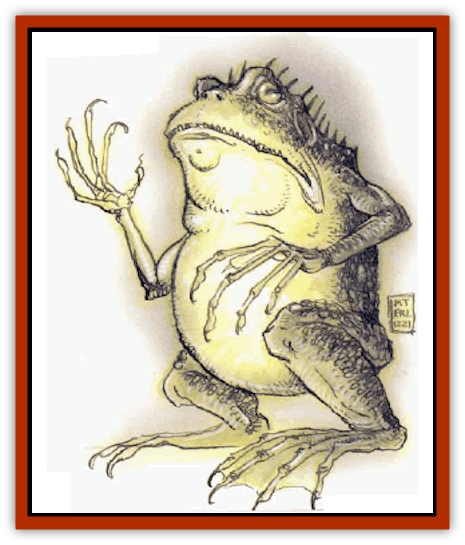
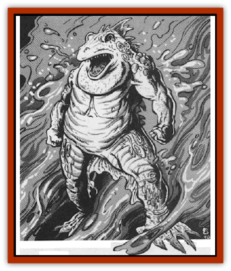

# Tanar'ri - True - Hezrou

| Statistic | **Tanar'ri, True, Hezrou** |
| --- | --- |
| **Activity Cycle:** | Any |
| **Alignment:** | Chaotic evil |
| **Armor Class:** | -6 |
| **Climate/Terrain:** | The Abyss |
| **Damage/Attack:** | 1d6/1d6/4d4 |
| **Diet:** | Carnivore |
| **Frequency:** | Common |
| **Hit Dice:** | 9 |
| **Intelligence:** | Average to high (8-14) |
| **Magic Resistance:** | 70% |
| **Morale:** | Fanatic (17-18) |
| **Movement:** | 12 |
| **No. Appearing:** | 1-6 |
| **No. of Attacks:** | 3 |
| **Organization:** | Group |
| **Size:** | L (7'+ tall) |
| **Special Attacks:** | Bearhug, stench |
| **Special Defenses:** | +2 or better weapons to hit, half damage from other nonmagical attacks, never surprised |
| **THAC0:** | 11 |
| **Treasure:** | C |
| **XP Value:** | 14,000 |

The hezrou, among the least powerful of the true [[Tanar'ri_General_Information|tanar'ri]], are still creatures of formidable power. They perform the will of the [[Tanar'ri_True_Nalfeshnee|nalfeshnee]] by wandering the Abyss and overseeing the formation of armies.

Hezrou look like large, roughly humanoid [[Toad_Giant|toads]] with arms in place of forelegs. They stand upright or on all four limbs by turns. They have rows of blunt, powerful teeth; spines run the length of their back.

Hezrou communicate using telepathy.

**Combat:** Hezrou are impossible to surprise. They are immune to attacks from nonmagical weapons and take half damage from all nonmagical attack forms (fire, poison, acid, etc.) Hezrou have infravision to 120' and have double human normal auditory and olfactory senses.

Hezrou are foul-tempered and mean. They attack even those that follow their instructions, just for sheer entertainment. Their claw attacks inflict 1d6 damage, and their blunt, crushing teeth inflict 4d4 points per bite.

If both claw attacks successfully hit a target in the same round, the victim is in a powerful hear hug and cannot attack. The victim takes 2d4 damage per round and the hezrou's bite attacks automatically hit. The victim must succeed in a Strength check against one half its Strength score to escape the hug. A hezrou that takes 20 hp damage in one round releases its victim.

The amphibious, frog-like skin of a hezrou emits a foul liquid that coats its skin. Anyone within 10 feet of the creature must save vs. paralyzation or be overcome by its powerful stench. Anyone so overcome lies helpless on the ground, gagging and vomiting. Those that do successfully make their saving throw still take a -2 penalty to their attack and initiative rolls.

In addition to those available to all tanar'ri, hezrou have the following spell-like powers, at 9th level of spell use: *animate object*, *blink*, *duo-dimension* (3 times per day), *produce flame*, *protection from normal missiles*, *summon insects*, *unholy word* (reverse of *holy word*), and *wall of fire*. Three times per day they can attempt to *gate* in 4-40 least, 1-10 lesser, or 1-4 greater tanar'ri with a 5O% chance of success. Once per day, they can attempt to gate in 1 true tanar'ri with a 20% chance of success.

**Habitat/Society:** Hezrou are the long arm of the imperious nalfeshnee. They walk among the layers of the Abyss enforcing directions of the higher true tanar'ri. Due to the chaotic nature of the Abyss, the hezrou's services are vital.

At certain times in a century, the hezrou can *plane shift* at will. During these Dark Walks, as they are known, the hezrou go forth and make pacts with mortals. They willingly enter into service to a mortal, typically one in dire need, but exact a heavy toll. In exchange for a major service, such as destroying an enemy's castle or retrieving a lost artifact, the hezrou secure eternal subservience by the mortal, a family member, friend, or lover. The victims come to the Abyss and serve as [[Tanar'ri_Least_Manes|manes]].

**Ecology:** As true tanar'ri, the hezrou are integral to the Blood War. They enforce the will of true tanar'ri, so they are spared certain death in frontline duty.

Hezrou are not as intelligent or intuitive as the other true tanar'ri. This is ideal for their duties, however, for theirs is to obey and enforce.

---
## Discovery & Documentation

**Source Publication:** MC8 Outer Planes Appendix (1990)
**Campaign Setting:** Planescape
**Author(s):** Timothy B. Brown, Jamie LaFountain

### Other Creatures Found in This Source Book
   * [[Aasimon_Agathinon|Aasimon, Agathinon]]
   * [[Aasimon_Deva|Aasimon, Deva]]
   * [[Aasimon_Light|Aasimon, Light]]
   * [[Aasimon_General_Information|Aasimon, General Information]]
   * [[Aasimon_Planetar|Aasimon, Planetar]]
   * [[Aasimon_Solar|Aasimon, Solar]]
   * [[Air_Sentinel|Air Sentinel]]
   * [[Animal_Lord|Animal Lord]]
   * [[Archon|Archon]]
   * [[Baatezu_Lesser_Abishai|Baatezu, Lesser, Abishai]]
   * [[Baatezu_Greater_Amnizu|Baatezu, Greater, Amnizu]]
   * [[Baatezu_Lesser_Barbazu|Baatezu, Lesser, Barbazu]]
   * [[Baatezu_Greater_Cornugon|Baatezu, Greater, Cornugon]]
   * [[Baatezu_Lesser_Erinyes|Baatezu, Lesser, Erinyes]]
   * [[Baatezu_General_Information|Baatezu, General Information]]
   * [[Baatezu_Greater_Gelugon|Baatezu, Greater, Gelugon]]
   * [[Baatezu_Lesser_Hamatula|Baatezu, Lesser, Hamatula]]
   * [[Baatezu_Lemure|Baatezu, Lemure]]
   * [[Baatezu_Least_Nupperibo|Baatezu, Least, Nupperibo]]
   * [[Baatezu_Lesser_Osyluth|Baatezu, Lesser, Osyluth]]
   * [[Baatezu_Greater_Pit_Fiend|Baatezu, Greater, Pit Fiend]]
   * [[Baatezu_Least_Spinagon|Baatezu, Least, Spinagon]]
   * [[Balaena|Balaena]]
   * [[Bariaur|Bariaur]]
   * [[Bebilith|Bebilith]]
   * [[Bodak|Bodak]]
   * [[Dog_Moon|Dog, Moon]]
   * [[Dragon_Adamantite|Dragon, Adamantite]]
   * [[Einheriar|Einheriar]]
   * [[Gehreleth|Gehreleth]]
   * [[Githyanki|Githyanki]]
   * [[Githzerai|Githzerai]]
   * [[Hordling|Hordling]]
   * [[Lammasu_Celestial|Lammasu, Celestial]]
   * [[Larva|Larva]]
   * [[Maelephant|Maelephant]]
   * [[Marut|Marut]]
   * [[Mediator|Mediator]]
   * [[Mortai|Mortai]]
   * [[Night_Hag|Night Hag]]
   * [[Nightmare|Nightmare]]
   * [[Noctral|Noctral]]
   * [[Per|Per]]
   * [[Phoenix|Phoenix]]
   * [[Slaad|Slaad]]
   * [[Tanar'ri_Greater_Babau|Tanar'ri, Greater, Babau]]
   * [[Tanar'ri_Greater_Chasme|Tanar'ri, Greater, Chasme]]
   * [[Tanar'ri_Greater_Nabassu|Tanar'ri, Greater, Nabassu]]
   * [[Tanar'ri_Least_Dretch|Tanar'ri, Least, Dretch]]
   * [[Tanar'ri_Least_Manes|Tanar'ri, Least, Manes]]
   * [[Tanar'ri_Least_Rutterkin|Tanar'ri, Least, Rutterkin]]
   * [[Tanar'ri_Lesser_Alu-Fiend|Tanar'ri, Lesser, Alu-Fiend]]
   * [[Tanar'ri_Lesser_Bar-Lgura|Tanar'ri, Lesser, Bar-Lgura]]
   * [[Tanar'ri_Lesser_Cambion|Tanar'ri, Lesser, Cambion]]
   * [[Tanar'ri_Lesser_Succubus|Tanar'ri, Lesser, Succubus]]
   * [[Tanar'ri_Guardian_Molydeus|Tanar'ri, Guardian, Molydeus]]
   * [[Tanar'ri_General_Information|Tanar'ri, General Information]]
   * [[Tanar'ri_True_Balor|Tanar'ri, True, Balor]]
   * [[Tanar'ri_True_Glabrezu|Tanar'ri, True, Glabrezu]]
   * [[Tanar'ri_True_Marilith|Tanar'ri, True, Marilith]]
   * [[Tanar'ri_True_Nalfeshnee|Tanar'ri, True, Nalfeshnee]]
   * [[Tanar'ri_True_Vrock|Tanar'ri, True, Vrock]]
   * [[Titan|Titan]]
   * [[Translator|Translator]]
   * [[T'uen-rin|T'uen-rin]]
   * [[Vaporighu|Vaporighu]]
   * [[Warden_Beast|Warden Beast]]
   * [[Yugoloth_Greater_Arcanaloth|Yugoloth, Greater, Arcanaloth]]
   * [[Yugoloth_Lesser_Dergoloth|Yugoloth, Lesser, Dergoloth]]
   * [[Yugoloth_Lesser_Hydroloth|Yugoloth, Lesser, Hydroloth]]
   * [[Yugoloth_General_Information|Yugoloth, General Information]]
   * [[Yugoloth_Lesser_Mezzoloth|Yugoloth, Lesser, Mezzoloth]]
   * [[Yugoloth_Greater_Nycaloth|Yugoloth, Greater, Nycaloth]]
   * [[Yugoloth_Lesser_Piscoloth|Yugoloth, Lesser, Piscoloth]]
   * [[Yugoloth_Greater_Ultroloth|Yugoloth, Greater, Ultroloth]]
   * [[Yugoloth_Lesser_Yagnoloth|Yugoloth, Lesser, Yagnoloth]]
   * [[Zoveri|Zoveri]]
