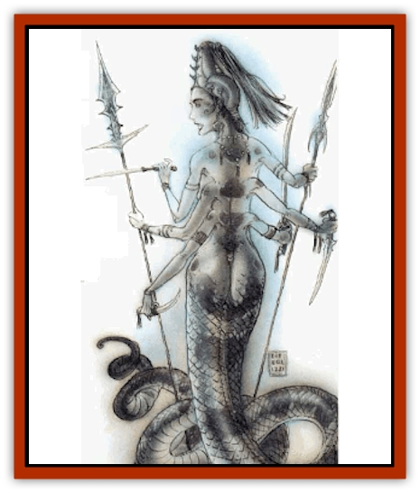
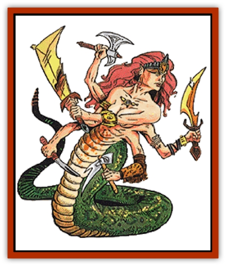

# Tanar'ri - True - Marilith

| Statistic | **Tanar'ri, True, Marilith** |
| --- | --- |
| **Activity Cycle:** | Any |
| **Alignment:** | Chaotic evil |
| **Armor Class:** | -9 |
| **Climate/Terrain:** | The Abyss |
| **Damage/Attack:** | 4d6 (tail) and six weapons |
| **Diet:** | Carnivore |
| **Frequency:** | Very rare |
| **Hit Dice:** | 12 |
| **Intelligence:** | Genius (17- 18) |
| **Magic Resistance:** | 70% |
| **Morale:** | Fanatic (17-18) |
| **Movement:** | 15 |
| **No. Appearing:** | 1-2 |
| **No. of Attacks:** | 7 |
| **Organization:** | Solitary |
| **Size:** | L (7' tall) |
| **Special Attacks:** | Magical weapons, constriction |
| **Special Defenses:** | +2 or better weapons to hit, never surprised, spell immunity |
| **THAC0:** | 9 |
| **Treasure:** | C,F |
| **XP Value:** | 23,000 |

Bold and cunning, mariliths are the generals and tacticians for the Blood War. Where [[Tanar'ri_True_Balor|balors]] are the influence and energy behind the war effort, mariliths are the brains and tactics.

Mariliths appear as half [[Snake|snake]], half humanoid. From the waist down, these creatures have the bodies of giant snakes, with huge, green, scaly coils. Above the waist they are beautiful, comely females. Besides the obvious snake body, the feature that identifies a marilith is its six arms. They are commonly adorned with precious jewelry and bear highly decorated weapons: marilith usually carry a different weapon in each hand. They communicate using telepathy.

**Combat:** Mariliths are never surprised. Although they are strategists and tacticians, Mariliths love physical combat when opportunity presents. They size up any combat before getting involved and take full advantage of terrain, obstacles, and the opponent's disadvantages. They can attack with each of their six arms and constrict a victim with their snaky tails, as well.

Weapons of +1 or lesser magical enchantment cannot harm a marilith. They cannot be fooled by illusions and are immune to mind-affecting spells.

Mariliths favor exotic swords and axes. The DM should assign specific weapons; 90% of them should be magical (+1, +2, etc.), and 15% of these should be special. Marilith cherish their weapons; if one is lost or stolen, the owner will go to great lengths to recover it.

A marilith can constrict with its deadly tail. If the tail hits in combat, it wraps around a victim to crush the life out of him. The tail inflicts 4d6 points of crushing damage and drives the breath from a victim. Once constricted, the victim automatically takes 4d6 damage each round. Additionally, the trapped creature must make a Constitution check every round or fall unconscious. No opponent with less than 15 Strength can even hope to break free of the coils. Each round, there is a 10% chance per round per point of Strength over 14 that the victim can escape.

In addition to those available to all [[Tanar'ri_General_Information|tanar'ri]], mariliths have the following spell-like powers: *animate dead*, *cause serious wounds* (reverse of *cure serious wounds*), *cloudkill*, *comprehend languages*, *curse* (reverse of *bless*), *detect evil*, *detect magic*, *detect invisibility*, *polymorph self* (7 times per day), *project image*, *pyrotechnics*, and *telekinesis*. They can also attempt to *gate* in 2-20 least tanar'ri, 1-6 lesser tanar'ri, 1-4 greater tanar'ri, or 1 true tanar'ri once per hour with a 35% chance of success.

**Habitat/Society:** As noted, marilith are the strategists of the Blood War. They devise battle tactics and coordinate the true tanar'ri (except for the balors, of course). Due to the chaotic nature of the other tanar'ri, coordinating their activities is nearly impossible.

Mariliths hate the [[Tanar'ri_True_Glabrezu|glabrezu]]. They feel that the subtle warfare of the glabrezu is a childrens' game and inferior to proper warfare. Mariliths try to discredit the glabrezu in any way they can. They would completely destroy the subtle beasts, but the all-powerful balors favor the glabrezus' tactics.

**Ecology:** Marilith secretly feel that they are the true force behind the Blood War, that the balors have their place only because of their great power, and are otherwise unnecessary. They may be right, but the power of the balors remains unchallenged.

---
## Discovery & Documentation

**Source Publication:** MC8 Outer Planes Appendix (1990)
**Campaign Setting:** Planescape
**Author(s):** Timothy B. Brown, Jamie LaFountain

### Other Creatures Found in This Source Book
   * [[Aasimon_Agathinon|Aasimon, Agathinon]]
   * [[Aasimon_Deva|Aasimon, Deva]]
   * [[Aasimon_Light|Aasimon, Light]]
   * [[Aasimon_General_Information|Aasimon, General Information]]
   * [[Aasimon_Planetar|Aasimon, Planetar]]
   * [[Aasimon_Solar|Aasimon, Solar]]
   * [[Air_Sentinel|Air Sentinel]]
   * [[Animal_Lord|Animal Lord]]
   * [[Archon|Archon]]
   * [[Baatezu_Lesser_Abishai|Baatezu, Lesser, Abishai]]
   * [[Baatezu_Greater_Amnizu|Baatezu, Greater, Amnizu]]
   * [[Baatezu_Lesser_Barbazu|Baatezu, Lesser, Barbazu]]
   * [[Baatezu_Greater_Cornugon|Baatezu, Greater, Cornugon]]
   * [[Baatezu_Lesser_Erinyes|Baatezu, Lesser, Erinyes]]
   * [[Baatezu_General_Information|Baatezu, General Information]]
   * [[Baatezu_Greater_Gelugon|Baatezu, Greater, Gelugon]]
   * [[Baatezu_Lesser_Hamatula|Baatezu, Lesser, Hamatula]]
   * [[Baatezu_Lemure|Baatezu, Lemure]]
   * [[Baatezu_Least_Nupperibo|Baatezu, Least, Nupperibo]]
   * [[Baatezu_Lesser_Osyluth|Baatezu, Lesser, Osyluth]]
   * [[Baatezu_Greater_Pit_Fiend|Baatezu, Greater, Pit Fiend]]
   * [[Baatezu_Least_Spinagon|Baatezu, Least, Spinagon]]
   * [[Balaena|Balaena]]
   * [[Bariaur|Bariaur]]
   * [[Bebilith|Bebilith]]
   * [[Bodak|Bodak]]
   * [[Dog_Moon|Dog, Moon]]
   * [[Dragon_Adamantite|Dragon, Adamantite]]
   * [[Einheriar|Einheriar]]
   * [[Gehreleth|Gehreleth]]
   * [[Githyanki|Githyanki]]
   * [[Githzerai|Githzerai]]
   * [[Hordling|Hordling]]
   * [[Lammasu_Celestial|Lammasu, Celestial]]
   * [[Larva|Larva]]
   * [[Maelephant|Maelephant]]
   * [[Marut|Marut]]
   * [[Mediator|Mediator]]
   * [[Mortai|Mortai]]
   * [[Night_Hag|Night Hag]]
   * [[Nightmare|Nightmare]]
   * [[Noctral|Noctral]]
   * [[Per|Per]]
   * [[Phoenix|Phoenix]]
   * [[Slaad|Slaad]]
   * [[Tanar'ri_Greater_Babau|Tanar'ri, Greater, Babau]]
   * [[Tanar'ri_Greater_Chasme|Tanar'ri, Greater, Chasme]]
   * [[Tanar'ri_Greater_Nabassu|Tanar'ri, Greater, Nabassu]]
   * [[Tanar'ri_Least_Dretch|Tanar'ri, Least, Dretch]]
   * [[Tanar'ri_Least_Manes|Tanar'ri, Least, Manes]]
   * [[Tanar'ri_Least_Rutterkin|Tanar'ri, Least, Rutterkin]]
   * [[Tanar'ri_Lesser_Alu-Fiend|Tanar'ri, Lesser, Alu-Fiend]]
   * [[Tanar'ri_Lesser_Bar-Lgura|Tanar'ri, Lesser, Bar-Lgura]]
   * [[Tanar'ri_Lesser_Cambion|Tanar'ri, Lesser, Cambion]]
   * [[Tanar'ri_Lesser_Succubus|Tanar'ri, Lesser, Succubus]]
   * [[Tanar'ri_Guardian_Molydeus|Tanar'ri, Guardian, Molydeus]]
   * [[Tanar'ri_General_Information|Tanar'ri, General Information]]
   * [[Tanar'ri_True_Balor|Tanar'ri, True, Balor]]
   * [[Tanar'ri_True_Glabrezu|Tanar'ri, True, Glabrezu]]
   * [[Tanar'ri_True_Hezrou|Tanar'ri, True, Hezrou]]
   * [[Tanar'ri_True_Nalfeshnee|Tanar'ri, True, Nalfeshnee]]
   * [[Tanar'ri_True_Vrock|Tanar'ri, True, Vrock]]
   * [[Titan|Titan]]
   * [[Translator|Translator]]
   * [[T'uen-rin|T'uen-rin]]
   * [[Vaporighu|Vaporighu]]
   * [[Warden_Beast|Warden Beast]]
   * [[Yugoloth_Greater_Arcanaloth|Yugoloth, Greater, Arcanaloth]]
   * [[Yugoloth_Lesser_Dergoloth|Yugoloth, Lesser, Dergoloth]]
   * [[Yugoloth_Lesser_Hydroloth|Yugoloth, Lesser, Hydroloth]]
   * [[Yugoloth_General_Information|Yugoloth, General Information]]
   * [[Yugoloth_Lesser_Mezzoloth|Yugoloth, Lesser, Mezzoloth]]
   * [[Yugoloth_Greater_Nycaloth|Yugoloth, Greater, Nycaloth]]
   * [[Yugoloth_Lesser_Piscoloth|Yugoloth, Lesser, Piscoloth]]
   * [[Yugoloth_Greater_Ultroloth|Yugoloth, Greater, Ultroloth]]
   * [[Yugoloth_Lesser_Yagnoloth|Yugoloth, Lesser, Yagnoloth]]
   * [[Zoveri|Zoveri]]
