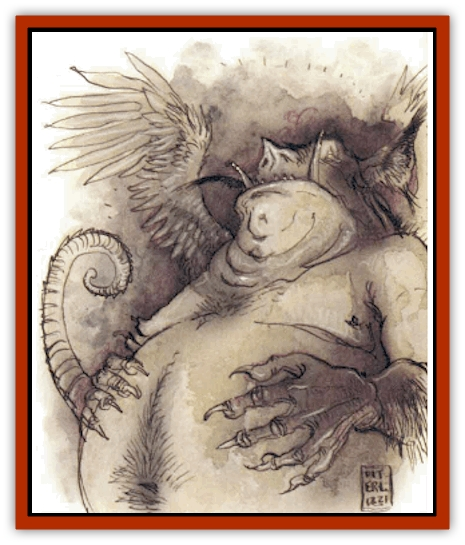
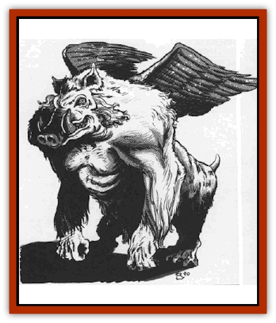

# Tanar'ri - True - Nalfeshnee

| Statistic | **Tanar'ri, True, Nalfeshnee** |
| --- | --- |
| **Activity Cycle:** | Any |
| **Alignment:** | Chaotic evil |
| **Armor Class:** | -8 |
| **Climate/Terrain:** | The Abyss |
| **Damage/Attack:** | 1d4/1d4/2d4 |
| **Diet:** | Carnivore |
| **Frequency:** | Very rare |
| **Hit Dice:** | 11 |
| **Intelligence:** | Godlike (21+) |
| **Magic Resistance:** | 70% |
| **Morale:** | Fanatic (17-18) |
| **Movement:** | 12, Fl 15 (D) |
| **No. Appearing:** | 1 |
| **No. of Attacks:** | 3 |
| **Organization:** | Solitary |
| **Size:** | H (20' tall) |
| **Special Attacks:** | Magical spray |
| **Special Defenses:** | Never surprised, cold iron or +2 or better weapons to hit |
| **THAC0:** | 9 |
| **Treasure:** | H&times;2 |
| **XP Value:** | 17,000 |

Few beings terrify mortals more than the nalfeshnee. Mortals who pass into the Abyss eventually come before one of these "lords of woe", there to suffer judgment and the pain of transformation.

Nalfeshnee are 20' tall; most of their immense strength goes simply to support their bodies. They combine the worst features of ape and [[Boar|boar]], and their small wings appear unable to bear their ponderous bodies. Nalfeshnee have red, glowing eyes that pierce the mind and seem to draw energy from just a glance.

Nalfeshnee can communicate with any being using a powerful form of telepathy.

**Combat:** Nalfeshnee are never surprised. They are immune to weapons of less than +2 enchantment, but can be hit by weapons of cold-wrought iron.

Though the nalfeshnee usually sit atop their thrones and judge the masses of mortal lives in the Abyss, they are capable in battle. They can attack with two claws (1d4 damage each) and bite (2d4 damage), but prefer a special attack that looks like the *color spray* spell (usable three times per day). They must concentrate for an entire melee round; hits on the creature during that round do not break concentration. Then the nalfeshnee releases multiple rainbow beams that shoot in every direction. All creatures within 60' suffer 15 hp damage (save vs. spell for half damage). They must then again save vs. spell with -2 penalty. Failure means they are temporarily stricken dumb and wander in a trance for 1d10 rounds. In that trance each creature a vision of its greatest fear.

In addition to the standard abilities of all tanar'ri, nalfeshnee have the following spell-like powers: *alter self*, *bind*, *call lightning*, *chill touch*, *detect invisibility* (always active), *distance distortion*, *ESP* (always active), *feeblemind*, *forget*, *giant insect*, *invisibility*, *know alignment* (always active), *mirror image*, *protection from good* (always active), *raise dead*, *slow*, and *web*. Nalfeshnee can also attempt to gate in 1-6 [[Tanar'ri_Greater_Babau|babaus]] or 1 [[Tanar'ri_True_Vrock|vrock]], twice per day, with a 50% chance of success.

**Habitat/Society:** Nalfeshnee are the most intelligent tanar'ri, considering themselves superior even to the [[Tanar'ri_True_Balor|balors]]. Nalfeshnee do not act on this feeling because they recognize the balors' greater strength. However, a nalfeshnee seldom passes up an opportunity to secretly embarrass a balor, foil its plans, or even prolong the Blood War. The nalfeshnee rule the 400th layer of the Abyss, where they sit on flaming thrones on the Mountain of Woe. There they judge the mortal life forces that pass into the Abyss.

**Ecology:** Nalfeshnee feed on hatred and despair, emotions they can draw out of any being they see. They devour these feelings from the life forces they judge, leaving empty husks of useless thoughts. These husks then transform into other forms of tanar'ri in ceremonies involving unimaginable torture.

---
## Discovery & Documentation

**Source Publication:** MC8 Outer Planes Appendix (1990)
**Campaign Setting:** Planescape
**Author(s):** Timothy B. Brown, Jamie LaFountain

### Other Creatures Found in This Source Book
   * [[Aasimon_Agathinon|Aasimon, Agathinon]]
   * [[Aasimon_Deva|Aasimon, Deva]]
   * [[Aasimon_Light|Aasimon, Light]]
   * [[Aasimon_General_Information|Aasimon, General Information]]
   * [[Aasimon_Planetar|Aasimon, Planetar]]
   * [[Aasimon_Solar|Aasimon, Solar]]
   * [[Air_Sentinel|Air Sentinel]]
   * [[Animal_Lord|Animal Lord]]
   * [[Archon|Archon]]
   * [[Baatezu_Lesser_Abishai|Baatezu, Lesser, Abishai]]
   * [[Baatezu_Greater_Amnizu|Baatezu, Greater, Amnizu]]
   * [[Baatezu_Lesser_Barbazu|Baatezu, Lesser, Barbazu]]
   * [[Baatezu_Greater_Cornugon|Baatezu, Greater, Cornugon]]
   * [[Baatezu_Lesser_Erinyes|Baatezu, Lesser, Erinyes]]
   * [[Baatezu_General_Information|Baatezu, General Information]]
   * [[Baatezu_Greater_Gelugon|Baatezu, Greater, Gelugon]]
   * [[Baatezu_Lesser_Hamatula|Baatezu, Lesser, Hamatula]]
   * [[Baatezu_Lemure|Baatezu, Lemure]]
   * [[Baatezu_Least_Nupperibo|Baatezu, Least, Nupperibo]]
   * [[Baatezu_Lesser_Osyluth|Baatezu, Lesser, Osyluth]]
   * [[Baatezu_Greater_Pit_Fiend|Baatezu, Greater, Pit Fiend]]
   * [[Baatezu_Least_Spinagon|Baatezu, Least, Spinagon]]
   * [[Balaena|Balaena]]
   * [[Bariaur|Bariaur]]
   * [[Bebilith|Bebilith]]
   * [[Bodak|Bodak]]
   * [[Dog_Moon|Dog, Moon]]
   * [[Dragon_Adamantite|Dragon, Adamantite]]
   * [[Einheriar|Einheriar]]
   * [[Gehreleth|Gehreleth]]
   * [[Githyanki|Githyanki]]
   * [[Githzerai|Githzerai]]
   * [[Hordling|Hordling]]
   * [[Lammasu_Celestial|Lammasu, Celestial]]
   * [[Larva|Larva]]
   * [[Maelephant|Maelephant]]
   * [[Marut|Marut]]
   * [[Mediator|Mediator]]
   * [[Mortai|Mortai]]
   * [[Night_Hag|Night Hag]]
   * [[Nightmare|Nightmare]]
   * [[Noctral|Noctral]]
   * [[Per|Per]]
   * [[Phoenix|Phoenix]]
   * [[Slaad|Slaad]]
   * [[Tanar'ri_Greater_Babau|Tanar'ri, Greater, Babau]]
   * [[Tanar'ri_Greater_Chasme|Tanar'ri, Greater, Chasme]]
   * [[Tanar'ri_Greater_Nabassu|Tanar'ri, Greater, Nabassu]]
   * [[Tanar'ri_Least_Dretch|Tanar'ri, Least, Dretch]]
   * [[Tanar'ri_Least_Manes|Tanar'ri, Least, Manes]]
   * [[Tanar'ri_Least_Rutterkin|Tanar'ri, Least, Rutterkin]]
   * [[Tanar'ri_Lesser_Alu-Fiend|Tanar'ri, Lesser, Alu-Fiend]]
   * [[Tanar'ri_Lesser_Bar-Lgura|Tanar'ri, Lesser, Bar-Lgura]]
   * [[Tanar'ri_Lesser_Cambion|Tanar'ri, Lesser, Cambion]]
   * [[Tanar'ri_Lesser_Succubus|Tanar'ri, Lesser, Succubus]]
   * [[Tanar'ri_Guardian_Molydeus|Tanar'ri, Guardian, Molydeus]]
   * [[Tanar'ri_General_Information|Tanar'ri, General Information]]
   * [[Tanar'ri_True_Balor|Tanar'ri, True, Balor]]
   * [[Tanar'ri_True_Glabrezu|Tanar'ri, True, Glabrezu]]
   * [[Tanar'ri_True_Hezrou|Tanar'ri, True, Hezrou]]
   * [[Tanar'ri_True_Marilith|Tanar'ri, True, Marilith]]
   * [[Tanar'ri_True_Vrock|Tanar'ri, True, Vrock]]
   * [[Titan|Titan]]
   * [[Translator|Translator]]
   * [[T'uen-rin|T'uen-rin]]
   * [[Vaporighu|Vaporighu]]
   * [[Warden_Beast|Warden Beast]]
   * [[Yugoloth_Greater_Arcanaloth|Yugoloth, Greater, Arcanaloth]]
   * [[Yugoloth_Lesser_Dergoloth|Yugoloth, Lesser, Dergoloth]]
   * [[Yugoloth_Lesser_Hydroloth|Yugoloth, Lesser, Hydroloth]]
   * [[Yugoloth_General_Information|Yugoloth, General Information]]
   * [[Yugoloth_Lesser_Mezzoloth|Yugoloth, Lesser, Mezzoloth]]
   * [[Yugoloth_Greater_Nycaloth|Yugoloth, Greater, Nycaloth]]
   * [[Yugoloth_Lesser_Piscoloth|Yugoloth, Lesser, Piscoloth]]
   * [[Yugoloth_Greater_Ultroloth|Yugoloth, Greater, Ultroloth]]
   * [[Yugoloth_Lesser_Yagnoloth|Yugoloth, Lesser, Yagnoloth]]
   * [[Zoveri|Zoveri]]
