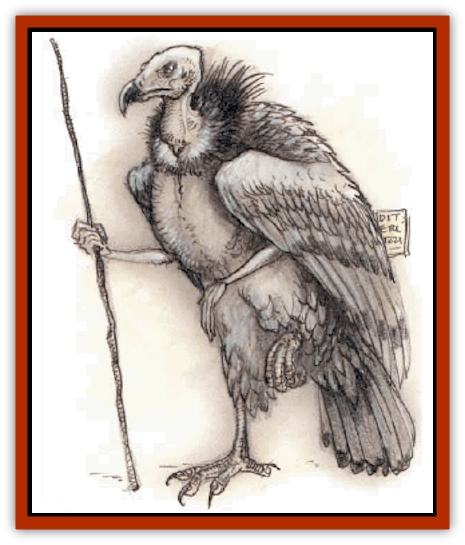
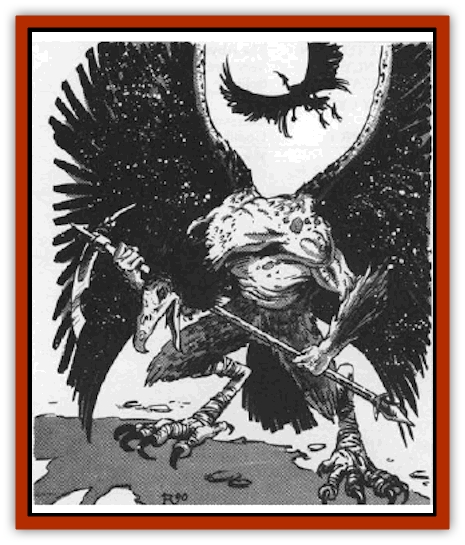

# Tanar'ri - True - Vrock

| Statistic | **Tanar'ri, True, Vrock** |
| --- | --- |
| **Activity Cycle:** | Any |
| **Alignment:** | Chaotic evil |
| **Armor Class:** | -5 |
| **Climate/Terrain:** | The Abyss |
| **Damage/Attack:** | 1d4/1d4/1d8/1d8/1d6 or by weapon +7 (Strength bonus) |
| **Diet:** | Carnivore |
| **Frequency:** | Uncommon |
| **Hit Dice:** | 8 |
| **Intelligence:** | High (12-14) |
| **Magic Resistance:** | 70% |
| **Morale:** | Fanatic (17-18) |
| **Movement:** | 12, Fl 18 (C) |
| **No. Appearing:** | 2-8 |
| **No. of Attacks:** | 5 |
| **Organization:** | Group |
| **Size:** | L (8' tall) |
| **Special Attacks:** | Spores, screech, first attack, <i>dance of ruin</i> |
| **Special Defenses:** | +2 or better weapons to hit, never surprised |
| **THAC0:** | 13 |
| **Treasure:** | Nil |
| **XP Value:** | 19,000 |

The vrock serve as elite fighting troops in the Blood War. Vrock look like a cross between a large human and a [[Vulture|vulture]], with strong, sinewy limbs covered with fine gray feathers; long necks and vulture heads; and wicked claws and beak.

Vrock communicate using telepathy.

**Combat:** Vrocks are never surprised and always attack first in melee. These creatures have Strength 19 (+7 damage adjustment) and infravision to 120'. Vrocks are immune to attacks from nonmagical weapons.

Vicious fighters, the vrocks can attack five times per melee round. Because of their dexterity and extreme battle prowess, vrocks can direct each of these attacks against different opponents. Their hand claw attacks each inflict 1d8 damage. Their beaks inflict 1d6 damage per successful hit. Vrocks can also attack with their foot claws, inflicting only 1d4 damage because the vrock is off balance when attacking this way.

The vrocks also attack with a stinging ejection of spores from small glands about the creatures' bodies. They can attack once every three melee rounds with a spore attack. A spray of spores automatically inflicts 1d8 damage on all opponents within 5 feet. Once the spores have hit, they implant themselves just below the surface of the skin and begin to grow and sprout. Victims suffer 1d2 damage per round from spore growth. The spores continue to grow for 10 melee rounds, at which time the victim is covered with thick, vine-like growths. The spores can be killed by a *bless*, *neutralize poison*, or similar spell or by being sprinkled with holy water. *Slow poison* stops the growth.

Once per battle, a vrock can emit a loud, deafening screech. This screech deafens everyone within 30', stunning them for 1 round (Constitution check to avoid the stun). Vrock usually save their screech for emergencies and typically use it when near death, screeching just before they *teleport* away.

In addition to those available to all [[Tanar'ri_General_Information|tanar'ri]], vrocks have the following spell-like powers at 10th level of spell use: *detect invisibility*, *detect magic*, *dispel magic*, *mass charm*, *mirror image*, and *telekinesis*. They can attempt once per day to *gate* in 2-20 [[Tanar'ri_Least_Manes|manes]], 1-6 [[Tanar'ri_Lesser_Bar-Lgura|bar-lgura]], or 1 [[Tanar'ri_True_Nalfeshnee|nalfeshnee]]. There is a 50% chance of success.

When five or more vrocks fight together in battle, they can attempt a special power called *dance of ruin*. The vrocks join hands in a circle, then dance wildly, screeching and chanting in ancient languages. After three rounds, a weave of energy crackles and scintillates in the air like lightning. Anyone within 100 feet of the *dance of ruin* must save vs. death magic or suffer 2d20 damage (save vs. spells for half damage). If any vrock takes 20 or more points of damage during the three melee rounds, the *dance* is disrupted and must be started again. All creatures, including the vrock, are affected.

**Habitat/Society:** Vrocks are an elite fighting force used in important battles. They are often sent on missions such as infiltration and other covert missions.

**Ecology:** Vrocks eat their fallen foes after combat. They are powerful fighting machines from birth. Vrocks are loyal to their own. They travel in groups of up to eight (more when entering battle) and in battle coordinate with each other with perfect timing.

---
## Discovery & Documentation

**Source Publication:** MC8 Outer Planes Appendix (1990)
**Campaign Setting:** Planescape
**Author(s):** Timothy B. Brown, Jamie LaFountain

### Other Creatures Found in This Source Book
   * [[Aasimon_Agathinon|Aasimon, Agathinon]]
   * [[Aasimon_Deva|Aasimon, Deva]]
   * [[Aasimon_Light|Aasimon, Light]]
   * [[Aasimon_General_Information|Aasimon, General Information]]
   * [[Aasimon_Planetar|Aasimon, Planetar]]
   * [[Aasimon_Solar|Aasimon, Solar]]
   * [[Air_Sentinel|Air Sentinel]]
   * [[Animal_Lord|Animal Lord]]
   * [[Archon|Archon]]
   * [[Baatezu_Lesser_Abishai|Baatezu, Lesser, Abishai]]
   * [[Baatezu_Greater_Amnizu|Baatezu, Greater, Amnizu]]
   * [[Baatezu_Lesser_Barbazu|Baatezu, Lesser, Barbazu]]
   * [[Baatezu_Greater_Cornugon|Baatezu, Greater, Cornugon]]
   * [[Baatezu_Lesser_Erinyes|Baatezu, Lesser, Erinyes]]
   * [[Baatezu_General_Information|Baatezu, General Information]]
   * [[Baatezu_Greater_Gelugon|Baatezu, Greater, Gelugon]]
   * [[Baatezu_Lesser_Hamatula|Baatezu, Lesser, Hamatula]]
   * [[Baatezu_Lemure|Baatezu, Lemure]]
   * [[Baatezu_Least_Nupperibo|Baatezu, Least, Nupperibo]]
   * [[Baatezu_Lesser_Osyluth|Baatezu, Lesser, Osyluth]]
   * [[Baatezu_Greater_Pit_Fiend|Baatezu, Greater, Pit Fiend]]
   * [[Baatezu_Least_Spinagon|Baatezu, Least, Spinagon]]
   * [[Balaena|Balaena]]
   * [[Bariaur|Bariaur]]
   * [[Bebilith|Bebilith]]
   * [[Bodak|Bodak]]
   * [[Dog_Moon|Dog, Moon]]
   * [[Dragon_Adamantite|Dragon, Adamantite]]
   * [[Einheriar|Einheriar]]
   * [[Gehreleth|Gehreleth]]
   * [[Githyanki|Githyanki]]
   * [[Githzerai|Githzerai]]
   * [[Hordling|Hordling]]
   * [[Lammasu_Celestial|Lammasu, Celestial]]
   * [[Larva|Larva]]
   * [[Maelephant|Maelephant]]
   * [[Marut|Marut]]
   * [[Mediator|Mediator]]
   * [[Mortai|Mortai]]
   * [[Night_Hag|Night Hag]]
   * [[Nightmare|Nightmare]]
   * [[Noctral|Noctral]]
   * [[Per|Per]]
   * [[Phoenix|Phoenix]]
   * [[Slaad|Slaad]]
   * [[Tanar'ri_Greater_Babau|Tanar'ri, Greater, Babau]]
   * [[Tanar'ri_Greater_Chasme|Tanar'ri, Greater, Chasme]]
   * [[Tanar'ri_Greater_Nabassu|Tanar'ri, Greater, Nabassu]]
   * [[Tanar'ri_Least_Dretch|Tanar'ri, Least, Dretch]]
   * [[Tanar'ri_Least_Manes|Tanar'ri, Least, Manes]]
   * [[Tanar'ri_Least_Rutterkin|Tanar'ri, Least, Rutterkin]]
   * [[Tanar'ri_Lesser_Alu-Fiend|Tanar'ri, Lesser, Alu-Fiend]]
   * [[Tanar'ri_Lesser_Bar-Lgura|Tanar'ri, Lesser, Bar-Lgura]]
   * [[Tanar'ri_Lesser_Cambion|Tanar'ri, Lesser, Cambion]]
   * [[Tanar'ri_Lesser_Succubus|Tanar'ri, Lesser, Succubus]]
   * [[Tanar'ri_Guardian_Molydeus|Tanar'ri, Guardian, Molydeus]]
   * [[Tanar'ri_General_Information|Tanar'ri, General Information]]
   * [[Tanar'ri_True_Balor|Tanar'ri, True, Balor]]
   * [[Tanar'ri_True_Glabrezu|Tanar'ri, True, Glabrezu]]
   * [[Tanar'ri_True_Hezrou|Tanar'ri, True, Hezrou]]
   * [[Tanar'ri_True_Marilith|Tanar'ri, True, Marilith]]
   * [[Tanar'ri_True_Nalfeshnee|Tanar'ri, True, Nalfeshnee]]
   * [[Titan|Titan]]
   * [[Translator|Translator]]
   * [[T'uen-rin|T'uen-rin]]
   * [[Vaporighu|Vaporighu]]
   * [[Warden_Beast|Warden Beast]]
   * [[Yugoloth_Greater_Arcanaloth|Yugoloth, Greater, Arcanaloth]]
   * [[Yugoloth_Lesser_Dergoloth|Yugoloth, Lesser, Dergoloth]]
   * [[Yugoloth_Lesser_Hydroloth|Yugoloth, Lesser, Hydroloth]]
   * [[Yugoloth_General_Information|Yugoloth, General Information]]
   * [[Yugoloth_Lesser_Mezzoloth|Yugoloth, Lesser, Mezzoloth]]
   * [[Yugoloth_Greater_Nycaloth|Yugoloth, Greater, Nycaloth]]
   * [[Yugoloth_Lesser_Piscoloth|Yugoloth, Lesser, Piscoloth]]
   * [[Yugoloth_Greater_Ultroloth|Yugoloth, Greater, Ultroloth]]
   * [[Yugoloth_Lesser_Yagnoloth|Yugoloth, Lesser, Yagnoloth]]
   * [[Zoveri|Zoveri]]
