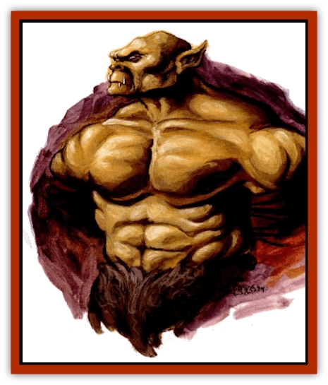

# Tarek

| Statistic | **Tarek** |
| --- | --- |
| **Activity Cycle:** | Day |
| **Alignment:** | Lawful neutral |
| **Armor Class:** | 7 |
| **Climate/Terrain:** | Any plains |
| **Damage/Attack:** | 1d4/1d4 or by weapon +2 |
| **Diet:** | Omnivore |
| **Frequency:** | Uncommon |
| **Hit Dice:** | 2 |
| **Intelligence:** | High (13-14) |
| **Magic Resistance:** | Nil |
| **Morale:** | Steady (12) |
| **Movement:** | 12 |
| **No. Appearing:** | 2-12/20-60 (tribe) |
| **No. of Attacks:** | 2 or 1 |
| **Organization:** | Tribal |
| **Size:** | M (6' tall) |
| **Special Attacks:** | Psionics |
| **Special Defenses:** | Fight past death |
| **THAC0:** | 19 |
| **Treasure:** | P (D) |
| **XP Value:** | 65 |

**Psionics Summary**

| Level | Dis/Sci/Dev | Attack/Defense | Score | PSPs |
| --- | --- | --- | --- | --- |
| 5 | 2/2/7 | MT,PsC/MBk,TS | = Int | 30 |

**Clairsentience -** *Science:* true sight; *Devotions:* combat mind, martial trance, psionic sense.

**Telepathy -** *Science:* mind link; *Devotions:* contact, invisibility, mind thrust, psionic crush.

Tareks are big, musclebound, and hairless bipeds that inhabit the hilly and mountainous areas of Athas. They have square, big-boned heads with sloping foreheads and massive brow ridges. Their flat noses have flared nostrils, and their domed muzzles are full of sharp teeth. Their powerful arms are so long that their knuckles drag along the ground. Tareks have a distinct musky odor that can be detected from as far away as 15'.

Tareks move with jerky, awkward strides except when engaged in combat. Then they exhibit a style and grace usually uncommon in creatures of their size and build. To watch them engage in combat is to watch fluid motions that are as artistic as dance - unless the viewer happens to be on the receiving end of the deadly spectacle.

Tareks speak their own language, as well as the common language of the Tyr region. Their voices are harsh and gutteral, as fearful in tone as their appearance and just as powerful.

**Combat:** Tareks are violent and aggressive. They place great value and honor in physical prowess. Their great strength gives them a +2 damage bonus when using weapons, though their huge fists can do considerable damage on their own (1d4). While tareks will use weapons, they shun armor of any sort. Instead, they rely on their own tough hides and natural combat agility to protect them.

The most common weapons employed by tarek warriors are the handfork and the heartpick. The handfork serves equally well as a parrying tool or a slicing weapon that does 1d6 points of damage. The handfork is usually made out of obsidian, but 10% of these weapons are forged from iron or steel. The heartpick, usually made of bone, is a hammerlike weapon with a serrated pick on the front and a heavy, flat head on the back. The bone heartpick inflicts 1d8 points of damage.

In the wild, tareks fight in concert, making them extremely formidable opponents. They have such a developed sense of teamwork that for every tarek fighting together against the same foe, their THAC0 number improves by 1. So, two tareks fighting the same enemy have a THAC0 of 18 (instead of 19), while five tareks would each have THAC0s of 14. This attack bonus is only applied when tareks team up against a single foe or group of foes, not when each tarek in the group fights a different opponent.

This attack bonus and their natural ferocity make tareks extremely popular in the gladiatorial arenas of the citystates. They are often set up as mated pairs, giving them an advantage over other gladiator teams. In rare intstances, as many as six tareks are teamed against one huge opponent for special contests. The crowds love to watch tarek teams tear into a braxat or other terror from the wastes. Such contests are so popular in Nibenay that a select group of templars are assigned to keep the arena stocked with both tareks and monsters to pit them against for the monthly Festival of Ral.

Due to their great strength and remarkable constitutions, tareks have the ability to battle beyond the point where other creatures would succumb to wounds and other injuries. Even when dealt a fatal blow, tareks continue to fight after death. In game terms, tareks can continue to attack until they are reduced to -10 hit points without suffering any penalties. When they do take enough damage to reduce them to -10, tareks finally succumb to the damage they've sustained.

**Habitat/Society:** Tareks gather in tribes, building small communities in the hills and mountains of the Tyr region. These communities often sustain themselves by raiding, and visitors are not welcome. Unless a group of visitors include an obvious elemental cleric, tarek warriors rush out to kill or drive the intruders away In rare instances, members of a community will be sent out to trade with merchant caravans, but few traders will blindly conduct business with these representatives. More often than not, such representatives are decoys for an unseen raiding party. More than one caravan has been taken by surprise while negotiating a deal with tarek traders.

For every six tareks encountered, there will be one leader. A tarek leader has 3 HD and a THAC0 of 18 In groups of 20 or more, one tarek hero will be present. Tarek heroes have 5 HD and THAC0s of 16. A tribal community has a chief with 7 HD and a THAC0 of 14.

Tareks hate wizardly magic in all its forms. They go out of their way to destroy defilers, and they'll even chase away preservers who use their magic in the vicinity of a tarek community. This hatred of magic translates into a strong dislike for [[Elf_Athas|elves]], since elves often deal in the business of spell components and have an innate love for all thing magical. Tarek raiders often attack elf tribes that wander too close to their territory as an automatic response to the probable proximity of wizardly magic.

On the other hand, tareks have a great deal of respect for all types of priestly magic. The elemental forces that hold sway over the world receive as much reverence as the violenttempered tareks are capable of giving. However, tarek tribes tolerate only one kind of cleric in their midst - earth clerics. Tareks respect the earth and everything connected with its elemental nature. They consider themselves to be born of the earth, and feel a kinship with the mountains and hills they choose to live among. "Solid is the tarek, strong like the earth, and numerous as the soil," sing the earth clerics of the tarek tribes.

**Ecology:** Tareks have an average life span of 50 years (though few creatures ever get to die naturally on Athas). They sometimes wage great wars with the [[Gith|gith]], as both of these races seek to control the same territory. If they hate elves because of their association with magic, then they hate gith because the gith are seen as abominations to the elemental earth forces. Gith set up lairs beneath the mountains tareks hold sacred, defiling the earth with their very presence (at least according to the teachings of the tarek shamans). As such, tarek communities see it as their sacred duty to keep gith out of the mountains and hills they have selected as their homes.

**Tarek Shamans**

  Tarek shamans are always elemental earth clerics. These tareks constantly commune with nature, and thus live near to but outside the tarek community they're attached to. This lends them an air of mystery that helps strengthen their role in the tribe. Tarek shamans serve as advisers to tribal chiefs and leaders, direct the spiritual life of their tribes, teach tribal legends and traditions, and act as medicine men for their communities. They also direct the rituals and ceremonies that make up much of the tribal lifestyle.

Tarek shamans can advance as high as 6th level, though the most common shamans are of 2nd to 4th level. A tribe will rarely have more than one earth shaman attached to it, and never more than three. Tarek shamans who reach 6th level are looked upon as great holy men who serve the most powerful elemental earth forces. Lower level tarek shamans from all over will come to study for a time at the feet of such holy tareks. There is a 50% chance that there will be from 2-8 (2d4) lesser shamans studying with a 6th-level tarek shaman at any given time. At all other times, the 6th-level shaman serves his community alone or with 1-2 apprentices. Only the largest, most powerful tribes have 6th-level shamans administering to their needs.

Because of their intimate connection to the earth, tarek shamans shun weapons made out of any material other than stone or obsidian. Tarek shamans of 3rd level or higher can bless a stone weapon once per year for use by the tribe's chief or greatest warrior. This blessing bestows a magical enchantment on the weapon that lasts for one year, effectively making it a magical weapon. Magical bonuses are based upon the level of the tarek shaman: 3rd-level shamans grant a +1 bonus, 4th-level shamans grant a +2 bonus, 5th-level shamans grant a +3 bonus, and 6th-level shamans grant a +4 bonus to the blessed weapons. If a blessed weapon is taken from the tarek who is intended to wield it, it slowly loses its enchantment. After 1d6 weeks, it reverts to a normal stone or obsidian weapon.

---
## Discovery & Documentation

**Source Publication:** Dark Sun Appendix II - Terrors Beyond Tyr (1991)
**Campaign Setting:** Dark Sun
**Author(s):** Jim Atkiss, Steve Brown, Timothy B. Brown, Andrew P. Morris, Bruce Nesmith, Wes Nicholson, Bill Slavicsek

### Other Creatures Found in This Source Book
   * [[Aarakocra_Athas|Aarakocra (Athas)]]
   * [[Animal_Domestic_Athas_II|Animal, Domestic (Athas) II]]
   * [[Aviarag|Aviarag]]
   * [[Baazrag|Baazrag]]
   * [[Baazrag_Boneclaw|Baazrag, Boneclaw]]
   * [[Bloodgrass|Bloodgrass]]
   * [[Cactus_Hunting|Cactus, Hunting]]
   * [[Cactus_Rock|Cactus, Rock]]
   * [[Cilops|Cilops]]
   * [[Crodlu|Crodlu]]
   * [[Dagorran|Dagorran]]
   * [[Dhaot|Dhaot]]
   * [[Drake_Lesser_Athas_General_Information|Drake, Lesser (Athas), General Information]]
   * [[Drake_Lesser_Athas_Magma|Drake, Lesser (Athas), Magma]]
   * [[Drake_Lesser_Athas_Rain|Drake, Lesser (Athas), Rain]]
   * [[Drake_Lesser_Athas_Silt|Drake, Lesser (Athas), Silt]]
   * [[Drake_Lesser_Athas_Sun|Drake, Lesser (Athas), Sun]]
   * [[Dray|Dray]]
   * [[Drik|Drik]]
   * [[Dune_Reaper|Dune Reaper]]
   * [[Dwarf_Athas|Dwarf (Athas)]]
   * [[Elemental_Beast_Athas_Air|Elemental Beast (Athas), Air]]
   * [[Elemental_Beast_Athas_Earth|Elemental Beast (Athas), Earth]]
   * [[Elemental_Beast_Athas_Fire|Elemental Beast (Athas), Fire]]
   * [[Elemental_Beast_Athas_Water|Elemental Beast (Athas), Water]]
   * [[Elf_Athas|Elf (Athas)]]
   * [[Fael|Fael]]
   * [[Feylaar|Feylaar]]
   * [[Fordorran|Fordorran]]
   * [[Giant_Half-giant|Giant, Half-giant]]
   * [[Giant_Shadow|Giant, Shadow]]
   * [[Golem_Athas_Magma|Golem (Athas), Magma]]
   * [[Golem_Athas_Salt|Golem (Athas), Salt]]
   * [[Golem_Athas_General_Information|Golem (Athas), General Information]]
   * [[Gorak|Gorak]]
   * [[Halfling_Athas|Halfling (Athas)]]
   * [[Human_Athas|Human (Athas)]]
   * [[Jhakar|Jhakar]]
   * [[Kaisharga|Kaisharga]]
   * [[Kes'trekel|Kes'trekel]]
   * [[Klar|Klar]]
   * [[Krag|Krag]]
   * [[Kragling|Kragling]]
   * [[Lirr|Lirr]]
   * [[Mastyrial|Mastyrial]]
   * [[Meorty|Meorty]]
   * [[Mul|Mul]]
   * [[Nikaal|Nikaal]]
   * [[Paraelemental_Beast_General_Information|Paraelemental Beast, General Information]]
   * [[Paraelemental_Beast_Magma|Paraelemental Beast, Magma]]
   * [[Paraelemental_Beast_Rain|Paraelemental Beast, Rain]]
   * [[Paraelemental_Beast_Silt|Paraelemental Beast, Silt]]
   * [[Paraelemental_Beast_Sun|Paraelemental Beast, Sun]]
   * [[Pakubrazi|Pakubrazi]]
   * [[Psionocus|Psionocus]]
   * [[Psurlon|Psurlon]]
   * [[Raaig|Raaig]]
   * [[Retriever_Obsidian|Retriever, Obsidian]]
   * [[Ruktoi|Ruktoi]]
   * [[Ruvoka_Athas|Ruvoka (Athas)]]
   * [[Sand_Howler|Sand Howler]]
   * [[Scorpion_Athas|Scorpion (Athas)]]
   * [[Seed_Brain|Seed, Brain]]
   * [[Silt_Horror_Black|Silt Horror, Black]]
   * [[Silt_Horror_Magma|Silt Horror, Magma]]
   * [[Silt_Horror_Red|Silt Horror, Red]]
   * [[Silt_Spawn|Silt Spawn]]
   * [[Slig|Slig]]
   * [[Spider_Athas|Spider (Athas)]]
   * [[Spinewyrm|Spinewyrm]]
   * [[Ssurran|Ssurran]]
   * [[Stalking_Horror|Stalking Horror]]
   * [[Tari|Tari]]
   * [[Thri-kreen|Thri-kreen]]
   * [[T'liz|T'liz]]
   * [[Tohr-kreen_II|Tohr-kreen II]]
   * [[Tohr-kreen_III|Tohr-kreen III]]
   * [[Trin|Trin]]
   * [[Tul'k|Tul'k]]
   * [[Undead_Athas_General_Information|Undead (Athas), General Information]]
   * [[Wraith_Athas|Wraith (Athas)]]
   * [[Xerichou|Xerichou]]
   * [[Zombie_Thinking|Zombie, Thinking]]
