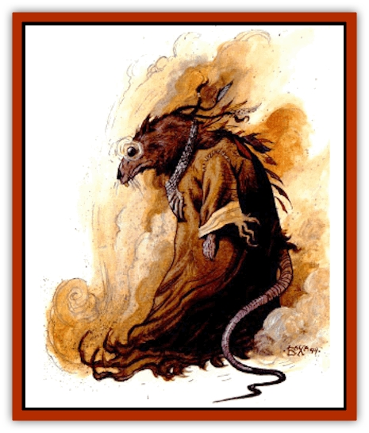

# Tari

| Statistic | **Chieftain** | **Tari** | **Warrior** |
| --- | --- | --- | --- |
| **Activity Cycle:** | Night | Night | Night |
| **Alignment:** | Neutral | Neutral | Neutral |
| **Armor Class:** | 6 | 6 | 5 |
| **Climate/Terrain:** | Any | Any | Any |
| **Damage/Attack:** | 1-6/1-3 | 1-3 bite or by weapon | 1-8/1-8/1-3 |
| **Diet:** | Scavenger | Scavenger | Scavenger |
| **Frequency:** | Very rare | Uncommon | Rare |
| **Hit Dice:** | 4 | 3 | 4+2 |
| **Intelligence:** | Average (8-10) | Average (8-10) | Average (8-10) |
| **Magic Resistance:** | Nil | Nil | Nil |
| **Morale:** | Average (8-10) | Average (8-10) | Champion (15-16) |
| **Movement:** | 9 | 9 | 9 |
| **No. Appearing:** | 1 | 5-30 | 2-12 |
| **No. of Attacks:** | 2 | 1 | 3 |
| **Organization:** | Pack | Pack | Pack |
| **Size:** | M (5' tall) | S (4' tall) | M (5' tall) |
| **Special Attacks:** | Disease | Disease | Disease |
| **Special Defenses:** | Nil | Nil | Nil |
| **THAC0:** | 17 | 17 | 17 |
| **Treasure:** | M (C) | M (C) | M (C) |
| **XP Value:** | 175/270 | 120 | 175 |

The tari are commonly referred to as ratmen by the other denizens of the Tyr region. They are small, furry humanoid scavengers, capable of thriving on food and water too polluted for humans to ingest. Hunted freely as pests, the tari are the barbaric descendants of a once thriving culture who inhabited lands to the south of the Tyr region.

The tari are unimpressive creatures, roughly 5' tall and weighing 100 pounds. They move about as bipeds, but sometimes walk on their knuckles. Their tails are about 2½' long, used mainly for balance, and just strong enough that they can wrap it around a branch and hang from it. Their entire bodies are covered with fine fur, usually brown, but sometimes gray, golden, or even silver, or a combination of any of these. Many tari use dyes from gyava berries to create rings or spots of color for decoration. Males and females alike often braid the longer hair along the back of the neck and the base of the spine and decorate these with beads or feathers. Their mouths are filled with needlelike teeth, and to either side they have long black hairs that add to their overall ratlike appearance.

Tari wear no clothing, though warriors sometimes have leather jerkins or even chitin greaves. Chieftains and warriors are taller than other tari and the former are usually highly decorated with dyes, beads, and ceremonial garb.

Tari have a high-pitched, squeaky language all their own. They can send and receive some signals that are beyond the human ear's ability to hear. Chieftains sometimes have psionic powers that allow them to communicate with their packs and other beings. Tari can learn other languages, namely human and [[Elf_Athas|elven]], though the sounds of humanoid speech are difficult for them to make with their mouths. There is a 5% chance a tari knows human or elven, but only a 50% chance that humans understand the communication.

**Combat:** Tari are nocturnal scavengers and hunters that travel in packs. A pack attacks humans or human-sized animals only if they outnumber them three to one. A pack has 5-30 normal tari, 2-12 warriors. and 1 chieftain. If they decide to attack, they wait until the quietest hours before dawn to surround and then attack. Warriors always stay in a single group around one arc of the enclosing circle, and the chieftain advances behind his warriors. Tari do not attack foes larger than human-sized, but they will trail the injured and weak, hoping they perish in the desert

Normal tari have a 50% chance of having a weapon, usually a wooden or bone sword or spear that lnflicts 1-6 (1d6) points of damage. Those without weapons bite for 1-3 points of damage. Warriors fight with two bone weapons that each cause 1-8 (1d8) points of damage and can bite in the same round. Chieftains fight with ceremonial clubs that inflict 1-6 (1d6) points of damage and bite.

Each time a tari successfully bites an opponent it has a 5% chance of lnflicting a disease. The victim can avoid the effects if he successfully saves vs. poison. Once infected, the victim becomes feverish and virtually incapacitated in 1-6 hours. On the third day after contracting the disease, the victim loses 1-3 hit points per day, permanently. There are many false cures for the tari disease sold in the marketplaces of Athas. The only sure means is a *cure disease* spell. Even that will not restore the lost hit points.

Each tari chieftain has one psionic wild talent that the DM should determine during an encounter by using *The Complete Psionic Handbook*. If the wild talent has any combat value, the pack changes its tactics to take advantage and, if defeated, the chieftain is worth the higher XP value listed. If the chieftain is slain, the rest of the tari flee.

**Habitat/Society:** The lives of the urban and wilderness tari are quite different, though their tactics for the kill are universal. Both travel in packs, but their approaches to survival are quite different.

The urban tari are denizens of the sewers and garbage heaps. By day they sleep beneath the filth of human society, and by night they gather the food and water to keep themselves alive, but they also seek out creature comforts for themselves and their chieftains. The small, furry thieves scour the buildings, scurrying up walls and through windows, stealing everything they can. They aren't particularly good thieves, making a lot of noise, upsetting tables and toppling chairs in their clumsy approach. Though not work for children, a warrior can earn a good living hunting tari, earning about 8 ceramic pieces a head.

The urban tari lair is a hodgepodge of stolen finery and trash. Crates are covered with silk and linens, while plush pillows and rugs adorn the floors and walls. Ratmen tend their chieftain who wears the jewelry and rags the neighborhood provides. If left alone, a tari pack can live in relative luxury, unnoticed beneath the bustling city.

The wilderness, however, is not so kind. Wasteland tari are nomadic scavengers, scouting miles in all directions to find the richest grounds, contending with the desert's other creatures for the little food to be had. Wilderness tari move their few belongings and families in triangular frames of leather and wooden poles. These frames are piled with belongings and dragged along the ground. Occasionally, tari use pack animals, such as [[Animal_Domestic_Athas_I|inix]] or [[Crodlu|crodlu]]. Corralling such a beast can take an entire pack and cost many tari lives. Tari animal handlers are very rare, but can become very important to the wilderness packs.

The tari race once boasted a thriving culture far to the south of the Tvr region. Ythri, the legendary capital city, is now a ruin lost among the crags. Their education and knowledge was much greater than today and their technology allowed them to build stone and concrete structures. What happened to their civilization is a mystery. The tari of the Tyr region have no written history. What remains is a collection of exaggerated myths and legends describing wondrous works.

**Ecology:** Tari mate once per year. The females of a single pack go into heat during the conjunction of the moons, initiating the mating season. Each female gestates for six months before giving birth to a litter of 2-8 young. The baby tari rely on the mother for their nourishment for the first three months of their lives, after which they are taught to hunt and survive on their own.

Young tari require another year to gain full maturity. During that time they are taught the harsh survival skills of the wilderness or the thieving and stealth skills of the city. Immature tari receive only 1 Hit Die and there can be 3-36 of them with a pack in its lair.

Their disease-causing venom is produced by two glands set deep in the jaw. Each bite produces a flow of venom that sprays from two openings to either side of the main canines. Retrieving the glands from fallen tari is a difficult and dangerous task, but the deadly properties of their contents makes them valuable to the alchemists and bards of the cities. A pair of tari disease glands can bring as much as 12 ceramic bits in the larger cities.

---
## Discovery & Documentation

**Source Publication:** Dark Sun Appendix II - Terrors Beyond Tyr (1991)
**Campaign Setting:** Dark Sun
**Author(s):** Jim Atkiss, Steve Brown, Timothy B. Brown, Andrew P. Morris, Bruce Nesmith, Wes Nicholson, Bill Slavicsek

### Other Creatures Found in This Source Book
   * [[Aarakocra_Athas|Aarakocra (Athas)]]
   * [[Animal_Domestic_Athas_II|Animal, Domestic (Athas) II]]
   * [[Aviarag|Aviarag]]
   * [[Baazrag|Baazrag]]
   * [[Baazrag_Boneclaw|Baazrag, Boneclaw]]
   * [[Bloodgrass|Bloodgrass]]
   * [[Cactus_Hunting|Cactus, Hunting]]
   * [[Cactus_Rock|Cactus, Rock]]
   * [[Cilops|Cilops]]
   * [[Crodlu|Crodlu]]
   * [[Dagorran|Dagorran]]
   * [[Dhaot|Dhaot]]
   * [[Drake_Lesser_Athas_General_Information|Drake, Lesser (Athas), General Information]]
   * [[Drake_Lesser_Athas_Magma|Drake, Lesser (Athas), Magma]]
   * [[Drake_Lesser_Athas_Rain|Drake, Lesser (Athas), Rain]]
   * [[Drake_Lesser_Athas_Silt|Drake, Lesser (Athas), Silt]]
   * [[Drake_Lesser_Athas_Sun|Drake, Lesser (Athas), Sun]]
   * [[Dray|Dray]]
   * [[Drik|Drik]]
   * [[Dune_Reaper|Dune Reaper]]
   * [[Dwarf_Athas|Dwarf (Athas)]]
   * [[Elemental_Beast_Athas_Air|Elemental Beast (Athas), Air]]
   * [[Elemental_Beast_Athas_Earth|Elemental Beast (Athas), Earth]]
   * [[Elemental_Beast_Athas_Fire|Elemental Beast (Athas), Fire]]
   * [[Elemental_Beast_Athas_Water|Elemental Beast (Athas), Water]]
   * [[Elf_Athas|Elf (Athas)]]
   * [[Fael|Fael]]
   * [[Feylaar|Feylaar]]
   * [[Fordorran|Fordorran]]
   * [[Giant_Half-giant|Giant, Half-giant]]
   * [[Giant_Shadow|Giant, Shadow]]
   * [[Golem_Athas_Magma|Golem (Athas), Magma]]
   * [[Golem_Athas_Salt|Golem (Athas), Salt]]
   * [[Golem_Athas_General_Information|Golem (Athas), General Information]]
   * [[Gorak|Gorak]]
   * [[Halfling_Athas|Halfling (Athas)]]
   * [[Human_Athas|Human (Athas)]]
   * [[Jhakar|Jhakar]]
   * [[Kaisharga|Kaisharga]]
   * [[Kes'trekel|Kes'trekel]]
   * [[Klar|Klar]]
   * [[Krag|Krag]]
   * [[Kragling|Kragling]]
   * [[Lirr|Lirr]]
   * [[Mastyrial|Mastyrial]]
   * [[Meorty|Meorty]]
   * [[Mul|Mul]]
   * [[Nikaal|Nikaal]]
   * [[Paraelemental_Beast_General_Information|Paraelemental Beast, General Information]]
   * [[Paraelemental_Beast_Magma|Paraelemental Beast, Magma]]
   * [[Paraelemental_Beast_Rain|Paraelemental Beast, Rain]]
   * [[Paraelemental_Beast_Silt|Paraelemental Beast, Silt]]
   * [[Paraelemental_Beast_Sun|Paraelemental Beast, Sun]]
   * [[Pakubrazi|Pakubrazi]]
   * [[Psionocus|Psionocus]]
   * [[Psurlon|Psurlon]]
   * [[Raaig|Raaig]]
   * [[Retriever_Obsidian|Retriever, Obsidian]]
   * [[Ruktoi|Ruktoi]]
   * [[Ruvoka_Athas|Ruvoka (Athas)]]
   * [[Sand_Howler|Sand Howler]]
   * [[Scorpion_Athas|Scorpion (Athas)]]
   * [[Seed_Brain|Seed, Brain]]
   * [[Silt_Horror_Black|Silt Horror, Black]]
   * [[Silt_Horror_Magma|Silt Horror, Magma]]
   * [[Silt_Horror_Red|Silt Horror, Red]]
   * [[Silt_Spawn|Silt Spawn]]
   * [[Slig|Slig]]
   * [[Spider_Athas|Spider (Athas)]]
   * [[Spinewyrm|Spinewyrm]]
   * [[Ssurran|Ssurran]]
   * [[Stalking_Horror|Stalking Horror]]
   * [[Tarek|Tarek]]
   * [[Thri-kreen|Thri-kreen]]
   * [[T'liz|T'liz]]
   * [[Tohr-kreen_II|Tohr-kreen II]]
   * [[Tohr-kreen_III|Tohr-kreen III]]
   * [[Trin|Trin]]
   * [[Tul'k|Tul'k]]
   * [[Undead_Athas_General_Information|Undead (Athas), General Information]]
   * [[Wraith_Athas|Wraith (Athas)]]
   * [[Xerichou|Xerichou]]
   * [[Zombie_Thinking|Zombie, Thinking]]
