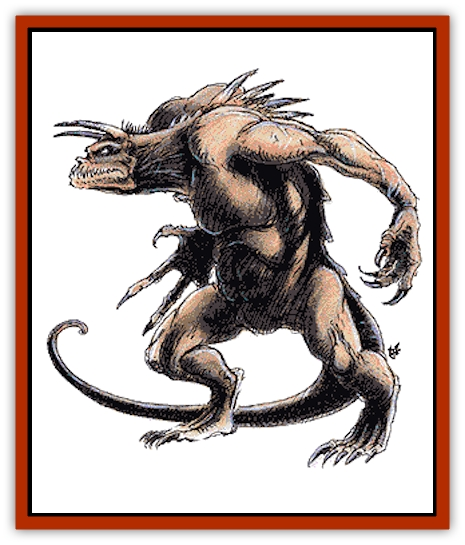

# Tarrasque

| Statistic | **Tarrasque** |
| --- | --- |
| **Activity Cycle:** | See below |
| **Alignment:** | Neutral |
| **Armor Class:** | -3 |
| **Climate/Terrain:** | Any land |
| **Damage/Attack:** | 1-12/1-12/2-24/5-50/1-10/1-10 |
| **Diet:** | Omnivore |
| **Frequency:** | Unique |
| **Hit Dice:** | 300 hp (approx. 70 HD) |
| **Intelligence:** | Animal (1) |
| **Magic Resistance:** | Nil |
| **Morale:** | Champion (15) |
| **Movement:** | 9, Rush 15 |
| **No. Appearing:** | 1 |
| **No. of Attacks:** | 6 |
| **Organization:** | Solitary |
| **Size:** | G (50' long) |
| **Special Attacks:** | Sharpness bite, terror |
| **Special Defenses:** | See below |
| **THAC0:** | -5 |
| **Treasure:** | See below |
| **XP Value:** | 107,000 |

The legendary tarrasque, for there is fortunately only one known to exist, is the most dreaded monster native to the Prime Material plane. The creature is a scaly biped with two horns on its head, a lashing tail, and a reflective carapace.

**Combat:** The tarrasque is a killing machine and when active (see below) eats everything for miles around, including all animals and vegetation. Normal attacks are with its two forelimb claws (1d12 points of damage each), a sweeping tail lash (2d12 points of damage), a savage bite (5d10 points of damage plus acts as a *sword of sharpness*, severing a limb on a natural attack roll of 18 or better), and two thrusting horn attacks (1d10 points of damage each).

Once every turn, the normally slow-moving tarrasque can rush forward at a movement rate of 15, making all horn attacks cause double damage and trampling anything underfoot for 4d10 points of crushing damage.

The mere sight of the tarrasque causes creatures with less than 3 levels or Hit Dice to be paralyzed with fright (no saving throw) until it is out of their vision. Creatures of 3 or more levels or Hit Dice flee in panic, although those of 7 or more levels or Hit Dice that manage to succeed with a saving throw vs. paralyzation are not affected (though they often still decide to run away).

The tarrasque's carapace is exceptionally tough and highly reflective. Bolts and rays such as *lightning bolts*, *cones of cold*, and even *magic missiles* are useless against it. The reflection is such that 1 in 6 of these attacks actually bounces directly back at the caster (affecting him normally), while the rest bounce off harmlessly to the sides and into the air.

The tarrasque is also immune to all heat and fire, and it regenerates lost hit points at a rate of 1 hit point per round. Only enchanted weapons (+1 or better) have any hope of harming the tarrasque. The Tarrasque is totally immune to all psionics.

**Habitat/Society:** It is fortunate that the tarrasque is active only for short periods of time. Typically, the monster comes forth to forage for a week or two, ravaging the countryside for miles around. The tarrasque then seeks a hidden lair underground and lies dormant, sleeping for 5d4 months before coming forth again. Once every decade or so, the monster is particularly active, staying awake for several months. Thereafter its period of dormancy is 4d4 years unless disturbed. The ratio of active to dormant states seems to be about 1:30.

**Ecology:** Slaying of the tarrasque is said to be possible only if the monster is reduced to -30 or fewer hit points and a *wish* is then used. Otherwise, even the slightest piece of the tarrasque can regenerate and restore the monster completely. Legend says that a great treasure can be extracted from the tarrasque's carapace. The upper portion, treated with acid and then heated in a furnace, is thought to yield gems (10d10 diamonds of 1,000 gp base value each). The underbelly material, mixed with the creature's blood and adamantite, is said to produce a metal that can be forged by master dwarven blacksmiths into 1d4 shields of +5 enchantment. It takes two years to manufacture each shield, and the dwarves aren't likely to do it for free.

It is hoped that the tarrasque is a solitary creation, some hideous abomination unleashed by the dark arts or by elder, forgotten gods to punish all of nature. The elemental nature of the tarrasque leads the few living tarrasque experts to speculate that the [[Archomental_Evil|elemental princes of evil]] have something to do with its existence. In any case, the location of the tarrasque remains a mystery, as it rarely leaves witnesses in its wake, and nature quickly grows over all remnants of its presence. It is rumored that the tarrasque is responsible for the extinction of one ancient civilization, for the records of their last days spoke of a "great reptilian punisher sent by the gods to end the world".

**Note:** Creatures with a minus THAC0 can only be hit on a 1.

---
## Discovery & Documentation

**Source Publication:** MC2 Volume II (1993)
**Campaign Setting:** Advanced Dungeons & Dragons 2nd Edition
**Author(s):** Jay Batista, Scott Bennie, Grant Boucher, William W. Connors, Steve Gilbert, Heike Kubasch, James Lowder, David Edward Martin, Bruce Nesmith, Jean Rabe, Rick Swan, John J. Terra, Gary L. Thomas

### Other Creatures Found in This Source Book
   * [[Ant|Ant]]
   * [[Ant_Lion_Giant|Ant Lion, Giant]]
   * [[Ape_Carnivorous|Ape, Carnivorous]]
   * [[Baboon|Baboon]]
   * [[Badger|Badger]]
   * [[Barracuda|Barracuda]]
   * [[Beetle_Giant|Beetle, Giant]]
   * [[Bulette|Bulette]]
   * [[Bullywug|Bullywug]]
   * [[Dwarf_Duergar|Dwarf, Duergar]]
   * [[Dwarf_Gully|Dwarf, Gully]]
   * [[Eagle|Eagle]]
   * [[Eel|Eel]]
   * [[Elemental_Air_Kin|Elemental, Air Kin]]
   * [[Elemental_Water_Kin|Elemental, Water Kin]]
   * [[Elemental_Water_Kin_Water_Weird|Elemental, Water Kin, Water Weird]]
   * [[Firestar|Firestar]]
   * [[Firetail|Firetail]]
   * [[Fish_Giant|Fish, Giant]]
   * [[Frog|Frog]]
   * [[Gorgon|Gorgon]]
   * [[Hawk|Hawk]]
   * [[Heucuva|Heucuva]]
   * [[Hippocampus|Hippocampus]]
   * [[Hippogriff|Hippogriff]]
   * [[Kelpie|Kelpie]]
   * [[Kenku|Kenku]]
   * [[Killmoulis|Killmoulis]]
   * [[Kuo-Toa|Kuo-Toa]]
   * [[Lamia|Lamia]]
   * [[Lammasu|Lammasu]]
   * [[Lamprey|Lamprey]]
   * [[Leech|Leech]]
   * [[Leprechaun|Leprechaun]]
   * [[Leucrotta|Leucrotta]]
   * [[Locathah|Locathah]]
   * [[Lycanthrope_Wereboar|Lycanthrope, Wereboar]]
   * [[Lycanthrope_Werefox|Lycanthrope, Werefox]]
   * [[Mammal_Minimal|Mammal, Minimal]]
   * [[Mammal_Small|Mammal, Small]]
   * [[Mimic|Mimic]]
   * [[Morkoth|Morkoth]]
   * [[Muckdweller|Muckdweller]]
   * [[Myconid|Myconid]]
   * [[Naga|Naga]]
   * [[Obliviax|Obliviax]]
   * [[Octopus_Giant|Octopus, Giant]]
   * [[Otyugh|Otyugh]]
   * [[Piranha|Piranha]]
   * [[Plant_Dangerous_I|Plant, Dangerous I]]
   * [[Plant_Intelligent|Plant, Intelligent]]
   * [[Poltergeist|Poltergeist]]
   * [[Porcupine|Porcupine]]
   * [[Rat_Osquip|Rat, Osquip]]
   * [[Roc|Roc]]
   * [[Roper|Roper]]
   * [[Rot_Grub|Rot Grub]]
   * [[Rust_Monster|Rust Monster]]
   * [[Sahuagin|Sahuagin]]
   * [[Sea_Lion|Sea Lion]]
   * [[Sea_Horse_Giant|Sea Horse, Giant]]
   * [[Shambling_Mound|Shambling Mound]]
   * [[Shark|Shark]]
   * [[Sphinx|Sphinx]]
   * [[Squid_Giant|Squid, Giant]]
   * [[Stirge|Stirge]]
   * [[Swanmay|Swanmay]]
   * [[Tasloi|Tasloi]]
   * [[Triton|Triton]]
   * [[Troglodyte|Troglodyte]]
   * [[Urchin|Urchin]]
   * [[Urd|Urd]]
   * [[Weasel|Weasel]]
   * [[Wolverine|Wolverine]]
   * [[Yellow_Musk_Creeper|Yellow Musk Creeper]]
