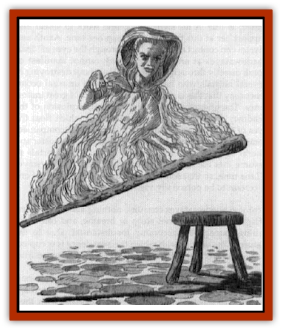
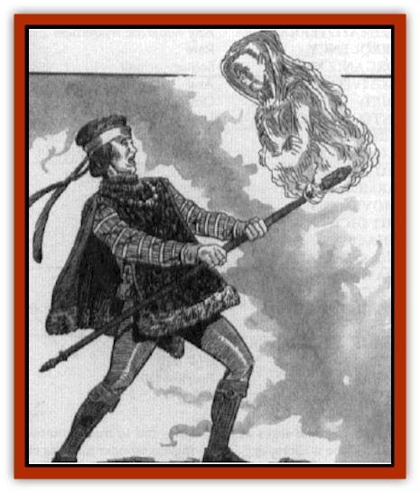
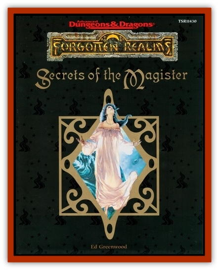

# Tarsardar

| Statistic | **Tarsardar** |
| --- | --- |
| **Activity Cycle:** | Any |
| **Alignment:** | Lawful neutral |
| **Armor Class:** | 6 |
| **Climate/Terrain:** | Any |
| **Damage/Attack:** | 3d4/3d4 |
| **Diet:** | Nil |
| **Frequency:** | Very rare |
| **Hit Dice:** | 5+5 |
| **Intelligence:** | As in life |
| **Magic Resistance:** | 66% |
| **Morale:** | Fearless (20) |
| **Movement:** | Fl 14 (A) |
| **No. Appearing:** | 1 |
| **No. of Attacks:** | 2 |
| **Organization:** | Solitary |
| **Size:** | M (6' tall but amorphous) |
| **Special Attacks:** | Item control |
| **Special Defenses:** | Immunities |
| **THAC0:** | 15 |
| **Treasure:** | Nil |
| **XP Value:** | 7,000 |

More commonly known as "staff spirits" or "sword spirits" due to the favorite types of enchanted items they like to inhabit, tarsardar are translucent, amorphous flying wraithlike beings that tend to appear tattered and "flowing" in form, keeping to a vaguely upright humanoid stance with a head and shoulders, but letting all else change and shift (one bard described them aptly as "ghostly glowing wisps"). Tarsardar are empowered to enter into any sort of item that bears even the smallest enchantment, dwindling down to fit within its confines (even if it's a gem or finger-ring), but can emerge at will, even if the item's powers include trapping souls or spirits, or controlling creatures. Like the [[Shadowstaff|shadowstaves]] they resemble, tarsardar may be mistaken for undead, but are not unliving, and are not subject to any magic or powers that govern or harm undead.

**Combat:** Tarsardar cannot be compelled or controlled by any known means (short of Azuth's and Mystra's command of the Weave, which can at will transform tarsardar into any sort of creature, or destroy them in an instant). They avoid combat when possible, although they are not hesitant to animate a chosen item from within and have it attack "by itself" if they see targets to their liking.

Tarsardar can control any item as if they were the class, alignment, and nature of creature the item was most intended for, of the highest possible experience level, and as if they were experienced in the use of all item powers and properties. A tarsardar must be in an unfamiliar item for 1 round of inactivity to master all item powers, but can activate an obvious power, or one it has recently seen in use, immediately upon entering an item - and all tarsardar can make items float, fly, and move around as if carried and manipulated by unseen hands, for it is actually the tarsardar that's moving, clinging to the enchantment on the item by means of its unique nature.

Any *dispel magic* spell can drive forth a tarsardar from its chosen item (there's no need to roll for spell success to determine this result, only to decide the *dispel* effects on the item), but the *dispel* neither harms the tarsardar or keeps it out of the item for more than 3 rounds. (Note that if the tarsardar is animating the item, and it lacks the power to so move on its own, it will plummet to the ground if the tarsardar is banished.) If a tarsardar is within an item that loses all of its enchantments, it is driven forth from the item and cannot return (though it suffers no harm in the expulsion). Tarsardar can see all magical auras and bindings, as if using a permanent, ceaseless *detect magic*, within a 90-foot radius of themselves, perceiving items on all sides at once.

Tarsardar can deliver two "energy burn" touch attacks per round. These attacks are automatically successful if sent against a creature touching an item that a tarsardar is within, but a successful attack roll is required if the tarsardar is partially or wholly emergent. If a tarsardar is injured for more than 6 hit points of damage in a round and also manages to deliver a touch attack in the same round, the hit points over and above the 6 that they lose are added to the damage roll of their energy burn attack, as they "leak" excess energy.

Tarsardar can pass through the smallest of crevices and openings, changing size without pause. They cannot be harmed by winds, falling, or weapons that have the same form as the item they currently call home (for instance, if a tarsardar is inhabiting a magical ax, no bladed chopping weapon - magical or not, artifact or crude homemade ax - can do it any harm). Moreover, they can deem themselves immune to one attack power (if any) possessed by the item they call home, and thereafter will be immune to that power and all related powers (for example, *lightning bolt* and *chain lightning* are related, as are *fireball* and *meteor swarm*) - even if launched against them from the very item they "call their home" - until the item is destroyed or they deem themselves immune to another magical attack form, of that or another item. Tarsardar can migrate from enchanted item to enchanted item at will.

Tarsardar are immune to Enchantment/charm and Illusion/phantasm spells, to death magic, and to all forms of hold and paralyzation magic. They are also immune to psionics and to all poison, petrification, polymorph, cold-based, and electricity-based attacks.

**Habitat/Society:** Tarsardar can whisper (in a haunting, windwhistle drone), gesture, and write. They can also communicate mentally with beings they are touching. Tarsardar retain the intellect, memories, and character they possessed in their former lives, although many seem to grow sarcastic, cynical, or bitter, and are charged to increase the use and availability of magic for all, and to enhance the "awe" and allure of magic by making Mystra seem to be everywhere, and enchanted items to move and act "by themselves".

More than shadowstaves, they seem to develop an independent streak and a desire to "play favorites" among the mortal mages they interact with. Some thwart evil mages as a matter of course (by making magical items flee or turn against them, for instance), while others confound good mages or magically gifted rulers or lawmakers.

Tarsardar do obey Azuth and Mystra and their Chosen, but tend to ignore the authority of the current Magister and all clergy of the deities of magic, and to follow the letter and not the spirit of dictates and strictures of Mystra, Azuth, and the Chosen when those beings are not actually present. Many tarsardar have been destroyed for disobedience, or forcibly and permanently transformed into [[Wingless_Wonder|wingless wonders]], common mules, and other creatures (sometimes even those suitable for use as familiars). When such destruction occurs (at the hands of Azuth or Mystra), the tarsardar can be viewed as having shifted alignment, losing the lawful (and perhaps the neutral) facet of their nature.

Tarsardar never willingly fight each other, even by means of items they animate. Rival mortals who attack each other with items that are inhabited by tarsardar will usually discover that such items suddenly become inert, all powers simply refusing to activate.

**Ecology:** Tarsardar need not eat, drink, breathe, sleep, or keep warm. Many are curious, and will move to investigate any magic they detect (which has misled some human sages into believing they somehow "feed off magic"), but they need not do so, and are part of no food chain or natural cycle.

---
## Discovery & Documentation

**Source Publication:** FOR13 Secrets of the Magister (1990)
**Campaign Setting:** Forgotten Realms
**Author(s):** Ed Greenwood

### Other Creatures Found in This Source Book
   * [[Shadowstaff|Shadowstaff]]
   * [[Wingless_Wonder|Wingless Wonder]]
