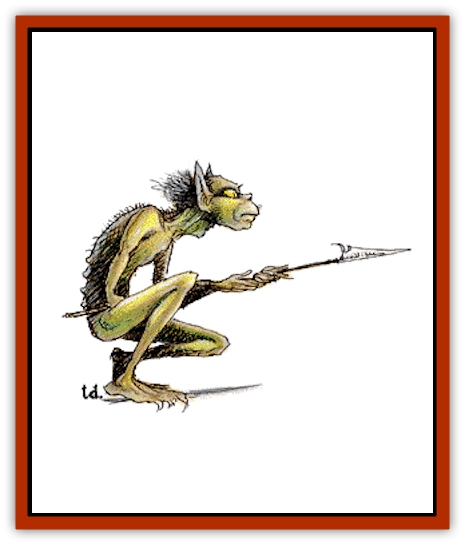

# Tasloi

| Statistic | **Tasloi** |
| --- | --- |
| **Activity Cycle:** | Night |
| **Alignment:** | Chaotic evil |
| **Armor Class:** | 5 (6) |
| **Climate/Terrain:** | Tropical/Jungles |
| **Damage/Attack:** | 1-3/1-3 or by weapon type |
| **Diet:** | Omnivore |
| **Frequency:** | Rare |
| **Hit Dice:** | 1 |
| **Intelligence:** | Low to average (5-10) |
| **Magic Resistance:** | Nil |
| **Morale:** | Average (10) |
| **Movement:** | 9, Cl 15 |
| **No. Appearing:** | 10-100 |
| **No. of Attacks:** | 2 or 1 |
| **Organization:** | Tribal |
| **Size:** | S (2-3' tall) |
| **Special Attacks:** | Surprise |
| **Special Defenses:** | Nil |
| **THAC0:** | 19 |
| **Treasure:** | Q&times;5 |
| **XP Value:** | Normal: 35 / Chieftain: 270 / Shaman: 420 |

Tasloi are long-legged, flat-headed humanoids. They walk in a crouching posture, touching their knuckles to the ground from time to time. Their skins are a lustrous green and are thinly covered with coarse black hair. Their eyes are similar to a [[Cat_Small|cat's]] and are gold in color.

Often they can be heard at night, speaking in their high, whispery voices. Tasloi speak their own tongue and can also speak the languages of [[Mammal_Small|monkeys]] and apes. About 5% of their kind have learned a pidgin common that they use when trading.

**Combat:** Tasloi like to hide in tree tops and drop down on the weak and unwary. They are quick and nimble in the trees, but slow and clumsy on the ground. When they are in jungle, their stealthy movements impose a -4 penalty to opponents' surprise rolls. They also hide in shadows, like a thief, with 75% effectiveness. Their infravision enables them to see up to 90 feet in darkness, but they hate daylight and suffer a -1 penalty to their attack roll when fighting in broad daylight.

Tasloi carry the following weapons: small shield (AC 5) and javelin - 20%, club and javelin - 40%, short sword and small shield (AC 5) - 10%, javelin and net - 15%, short sword and net - 10%, or javelin and lasso - 5%. Tasloi without shields are AC 6. They customarily carry all javelins and shields on their backs when they travel through the trees.

Tasloi eat anything, but they enjoy all kinds of flesh, especially humans and [[Elf|elves]]. They normally attack from above, trying to capture if possible. If they gain surprise, they use their 10-foot-diameter nets to trap their prey (the nets totally entangle those of less than 15 Strength; those of 15 or greater Strength need a successful open doors roll to rip the net and escape). If a party is too vigilant or prepared, the tasloi attempt to wear down the group through short, sudden attacks followed by retreat. If possible, tasloi try to steal the enemy's dead after an attack.

**Habitat/Society:** The tasloi live in loosely-structured bands of several families. In every band of 70 or more, there is a chief of 5 Hit Dice. There is a 30% chance that any band has a shaman. Tasloi shamans may advance up to 5th level.

When found in their lair, in addition to the males, there are females and young equal to 70% and 50% of the number of males, respectively. Females fight as males, but the young do not fight at all. The lair consists of a series of 1d6 large trees with 4d6 platforms 50-100 feet above the ground. All the trees are connected by vines and ropes. There is a 60% chance that the tasloi have 1d6 trained [[Spider|giant spiders]] and a 20% chance that they have 2d4 trained [[Hornet_Giant|giant wasps]]. Tasloi are able to ride these wasps for great distances, and the spiders aid in the construction, protection, and overall maintenance of the tree-village.

**Ecology:** It is not known where and how tasloi originated. It is likely they have been around for many millennia, interbreeding in deep isolated jungles. Their primitive lifestyle has probably existed in much the same fashion for thousands upon thousands of years.

While certainly among the least fearsome of all jungle creatures, tasloi are perhaps worth worrying about in numbers, or after fleeing encounters with nastier jungle denizens. Tasloi know the location of such lairs and often set up obvious escape routes for any creature that foolishly finds itself confronting the beast. The tasloi then lay their traps along the escape path and wait for the weakened, unsuspecting creatures to run through blindly. This strategy is highly successful, apparently, as the tasloi boast many more trophies than their small size and limited prowess might otherwise indicate.

---
## Discovery & Documentation

**Source Publication:** MC2 Volume II (1993)
**Campaign Setting:** Advanced Dungeons & Dragons 2nd Edition
**Author(s):** Jay Batista, Scott Bennie, Grant Boucher, William W. Connors, Steve Gilbert, Heike Kubasch, James Lowder, David Edward Martin, Bruce Nesmith, Jean Rabe, Rick Swan, John J. Terra, Gary L. Thomas

### Other Creatures Found in This Source Book
   * [[Ant|Ant]]
   * [[Ant_Lion_Giant|Ant Lion, Giant]]
   * [[Ape_Carnivorous|Ape, Carnivorous]]
   * [[Baboon|Baboon]]
   * [[Badger|Badger]]
   * [[Barracuda|Barracuda]]
   * [[Beetle_Giant|Beetle, Giant]]
   * [[Bulette|Bulette]]
   * [[Bullywug|Bullywug]]
   * [[Dwarf_Duergar|Dwarf, Duergar]]
   * [[Dwarf_Gully|Dwarf, Gully]]
   * [[Eagle|Eagle]]
   * [[Eel|Eel]]
   * [[Elemental_Air_Kin|Elemental, Air Kin]]
   * [[Elemental_Water_Kin|Elemental, Water Kin]]
   * [[Elemental_Water_Kin_Water_Weird|Elemental, Water Kin, Water Weird]]
   * [[Firestar|Firestar]]
   * [[Firetail|Firetail]]
   * [[Fish_Giant|Fish, Giant]]
   * [[Frog|Frog]]
   * [[Gorgon|Gorgon]]
   * [[Hawk|Hawk]]
   * [[Heucuva|Heucuva]]
   * [[Hippocampus|Hippocampus]]
   * [[Hippogriff|Hippogriff]]
   * [[Kelpie|Kelpie]]
   * [[Kenku|Kenku]]
   * [[Killmoulis|Killmoulis]]
   * [[Kuo-Toa|Kuo-Toa]]
   * [[Lamia|Lamia]]
   * [[Lammasu|Lammasu]]
   * [[Lamprey|Lamprey]]
   * [[Leech|Leech]]
   * [[Leprechaun|Leprechaun]]
   * [[Leucrotta|Leucrotta]]
   * [[Locathah|Locathah]]
   * [[Lycanthrope_Wereboar|Lycanthrope, Wereboar]]
   * [[Lycanthrope_Werefox|Lycanthrope, Werefox]]
   * [[Mammal_Minimal|Mammal, Minimal]]
   * [[Mammal_Small|Mammal, Small]]
   * [[Mimic|Mimic]]
   * [[Morkoth|Morkoth]]
   * [[Muckdweller|Muckdweller]]
   * [[Myconid|Myconid]]
   * [[Naga|Naga]]
   * [[Obliviax|Obliviax]]
   * [[Octopus_Giant|Octopus, Giant]]
   * [[Otyugh|Otyugh]]
   * [[Piranha|Piranha]]
   * [[Plant_Dangerous_I|Plant, Dangerous I]]
   * [[Plant_Intelligent|Plant, Intelligent]]
   * [[Poltergeist|Poltergeist]]
   * [[Porcupine|Porcupine]]
   * [[Rat_Osquip|Rat, Osquip]]
   * [[Roc|Roc]]
   * [[Roper|Roper]]
   * [[Rot_Grub|Rot Grub]]
   * [[Rust_Monster|Rust Monster]]
   * [[Sahuagin|Sahuagin]]
   * [[Sea_Lion|Sea Lion]]
   * [[Sea_Horse_Giant|Sea Horse, Giant]]
   * [[Shambling_Mound|Shambling Mound]]
   * [[Shark|Shark]]
   * [[Sphinx|Sphinx]]
   * [[Squid_Giant|Squid, Giant]]
   * [[Stirge|Stirge]]
   * [[Swanmay|Swanmay]]
   * [[Tarrasque|Tarrasque]]
   * [[Triton|Triton]]
   * [[Troglodyte|Troglodyte]]
   * [[Urchin|Urchin]]
   * [[Urd|Urd]]
   * [[Weasel|Weasel]]
   * [[Wolverine|Wolverine]]
   * [[Yellow_Musk_Creeper|Yellow Musk Creeper]]
