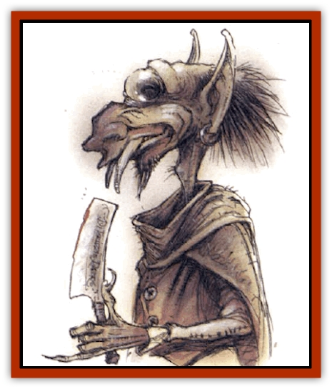
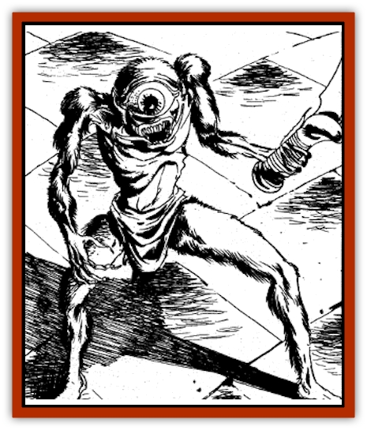

# Tatalla

| Statistic | **Tatalla** |
| --- | --- |
| **Activity Cycle:** | Night |
| **Alignment:** | Lawful evil |
| **Armor Class:** | 4 |
| **Climate/Terrain:** | Urban |
| **Damage/Attack:** | 1-3/1-3 or by weapon |
| **Diet:** | Carnivore |
| **Frequency:** | Rare |
| **Hit Dice:** | 2+2 |
| **Intelligence:** | Average (8-10) |
| **Magic Resistance:** | Nil |
| **Morale:** | Unsteady (5-7) |
| **Movement:** | 12 |
| **No. Appearing:** | 1-4 |
| **No. of Attacks:** | 2 |
| **Organization:** | Guild |
| **Size:** | S (just over 2' tall) |
| **Special Attacks:** | Poison, backstab |
| **Special Defenses:** | Thieving skills |
| **THAC0:** | 19 |
| **Treasure:** | K,C |
| **XP Value:** | 650 / Guildmaster: 975 |

The tatalla, "the eye", is a malevolent little creature used as a spy or as a stealthy assassin. It is skinny, almost emaciated, about two feet tall, and basically humanoid. The tatalla's name comes from its single, very large, protruding eye.

Many tatalla have tusks and large ears, and they greatly resemble miniaturized versions of [[Ogre_Zakhara|ogre]] giants. Learned people suspect some sort of relationship between the two races, though nothing has been proven for certain.

Tatalla speak Midani with a guttural intonation, perverting the natural beauty of the language. They also know the languages of similar creatures, such as [[Imp|imps]] and [[Imp|quasits]], and they can communicate with [[Bat|bats]] and [[Rat|rats]].

These creatures have a guild structure that assigns them to specific tasks, ranging from spying to stealing to assassination.

**Combat:** All tatalla have thieving abilities as follows: PP 50%; OL 42%; F/RT 40%; MS 50%; HS 51%; DN 20%; CW 90%; backstab for triple damage. When assigned to kill someone, the tatalla usually attempts to sneak into that individual's home. Once the tatalla has discovered the desired victim, it bites him and scurries away.

The bite wakes any person who rolls his Wisdom score or lower on 1d20; the bite mark appears to be that of a [[Spider|large spider]]. One bite causes nausea, a second bite increases nausea and causes weakness and a loss of Dexterity (no Dexterity bonus to Armor Class, and -2 penalty to all attack rolls). A third bite within as many days kills the victim in 1d4 rounds, unless the victim rolls a successful saving throw vs. poison. Each bite beyond the third requires another saving throw, with a cumulative -2 penalty to the roll. The tatalla visits its victim's residence for as many consecutive days as necessary, trailing the victim if it tries to escape by changing resting places.

Generally, tatalla try to avoid direct combat, preferring to accomplish their tasks without being noticed. Many run when threatened. If cornered, or if assigned to kill someone, however, they fight very ferociously. Each claw causes 1-3 points of damage. Many tatalla carry a pair of small weapons, such as a pair of jambiya or razors; they can use two such weapons simultaneously with no penalties.

If forced to fight, the tatalla can forego its normal two attacks, attempting to use its poisonous bite instead. It attacks using its regular THAC0, and the effects of the bites are as given above.

A tatalla can also summon 1d100 normal bats or rats for aid. These arrive in 1d4 rounds. While the tatalla waits for aid, it scurries about trying to hide from and dodge its attackers. The rats or bats leave when the tatalla dies or releases them.

**Habitat/Society:** Tatalla reside only in urban areas, where their services are often desired, and where they are never far from vermin to aid them in their tasks. On rare occasions, they can track a victim across great tracts of land, traveling at night under the cover of darkness. They have an unerring tracking sense once they have been assigned to a victim. Though the victim may elude the tatalla for a time, the tenacious creature eventually catches up.

Tatalla have a guild organization, much like the hierarchy found in a thieves' guild or a society of holy slayers. A guild typically has 4d20 members. One tatalla is the guild master and has approval over all contracts entered into by the guild, as well as the ability to assign any of the guild members to a given task. The guildmaster has 3+3 Hit Dice and a THAC0 of 17, and it uses any magical items the guild may have in its treasury.

A tatalla guild often cooperates with other illicit societies in the same city, particularly burglars and holy slayers. They demand payment in advance, and they never break a contract. Payment ranges from a few pieces of silver for a surveillance job, to several pieces of gold or a magical item for an assassination. If an individual or group breaks a contract with the tatalla guild, they quickly find themselves in a blood feud unless amends are made.

**Ecology:** Tatalla are scavengers, living off the remains of society. They steal what they need and give nothing back to society or to their environment.

---
## Discovery & Documentation

**Source Publication:** City of Delights (1993)
**Campaign Setting:** Al-Qadim (Forgotten Realms)
**Author(s):** tom Prusa, Tim Beach, Steve Kurtz

### Other Creatures Found in This Source Book
   * [[Afanc|Afanc]]
   * [[Al-Jahar|Al-Jahar]]
   * [[Bird_Talking|Bird, Talking]]
   * [[Cat_Winged|Cat, Winged]]
   * [[Crypt_Servant|Crypt Servant]]
   * [[Elemental_Vermin|Elemental Vermin]]
   * [[Genie_Tasked_Harim_Servant|Genie, Tasked, Harim Servant]]
   * [[Ogre_Zakhara|Ogre (Zakhara)]]
   * [[Opinicus|Opinicus]]
   * [[Parasite|Parasite]]
   * [[Pasari-Niml|Pasari-Niml]]
   * [[Sirine|Sirine]]
   * [[Tree_Singing|Tree, Singing]]
