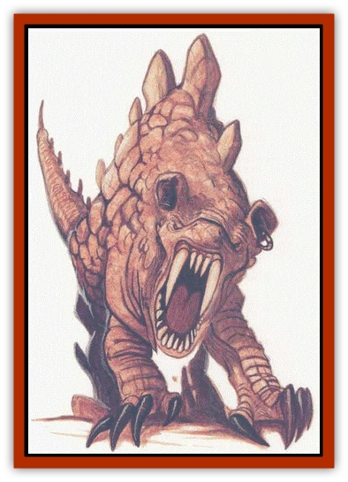

# Tembo

| Statistic | **Tembo** |
| --- | --- |
| **Activity Cycle:** | Night |
| **Alignment:** | Chaotic evil |
| **Armor Class:** | 4 |
| **Climate/Terrain:** | Tablelands and mountains |
| **Damage/Attack:** | 1d4 (&times;2)/1d6 (&times;2)/1d8 |
| **Diet:** | Carnivore |
| **Frequency:** | Uncommon |
| **Hit Dice:** | 4 |
| **Intelligence:** | High (13-14) |
| **Magic Resistance:** | 10% |
| **Morale:** | Fearless (20) |
| **Movement:** | 15 |
| **No. Appearing:** | 1-6 |
| **No. of Attacks:** | 5 |
| **Organization:** | Pack |
| **Size:** | M (3-6' long) |
| **Special Attacks:** | Psionics, level drain |
| **Special Defenses:** | Psionics, dodge missiles |
| **THAC0:** | 17 |
| **Treasure:** | I |
| **XP Value:** | 4,000 |

**Psionics Summary**

| Level | Dis/Sci/Dev | Attack/Defense | Score | PSPs |
| --- | --- | --- | --- | --- |
| 5 | 2/4/11 | EW,II,MT/IF,MBk,TW | 10 | 80 |

**Psychometabolism -** *Sciences:* death field, life draining, shadow form; *Devotions:* chameleon power, displacement, ectoplasmatic form, heightened senses, immovability.

**Telepathy -** *Science:* tower of iron will; *Devotions:* contact, ego whip, id insinuation, intellect fortress, mind blank, mind thrust.

The tembo is a despicable, furless, tawny-colored beast covered with loose folds of scaly hide. Varying between three and six feet in length, they usually stand about as high as a man's thigh. All four of their lithe feet end in long sharp claws, and huge canine fangs protrude from beneath the flappy lips of their squarish snouts. The tembo has huge, squarish ears which it can turn in any direction, independently of each other.

**Combat:** Though all tembo love to fight, their battle tactics are as unpredictable as these vicious beasts themselves. Some attack by stealth from a short distance away, sneaking as close as possible to their victims and trying to destroy them with a death field. Others prefer to play with their victims, batting them from one paw to another, using life draining each time the paw lands. Still other tembos like to leap into the fray immediately, meleeing their victims from the first round.

In such physical confrontations, the tembo are true horrors. Their favorite tactic is to leap at their victim, attacking with all four feet and their bite at once. The front claws cause only 1d4 damage, but the back claws have a greater tendency to sink into softer flesh, ripping through important tendons and organs (which is why they do more damage). The greatest danger of the tembo comes from its horrid mouth, however. When the tembo successfully hits with its powerful jaws, the victim must make a saving throw vs. death magic or lose one life level. This loss is permanent, and a save must be made each time the tembo lands a successful bite.

When attacked from a distance, the dexterous tembo have a 40% chance of dodging any non-magical missile fire directed at them.

Tembo display no fear, and will always fight to the death rather than run.

**Habitat/Society:** Tembo prowl the desert in small packs that seem to have no real social organization or cohesiveness. Each tembo does more or less as it pleases, not sharing any prey it downs with the others. The tembo's one concession to social life is that if one of them is attacked, the entire pack will join to fight the enemy.

**Ecology:** The favorite food of the tembo is the young of any other race. Tembo are famous for sneaking into a nomadic camps to drag off [[Elf_Athas|elven]] children, for skulking about [[Dwarf_Athas|dwarven]] villages prowling for untended toddlers, even for sneaking into populated cities to snatch noble babes from their cradles. Needless to say, this makes these despicable beasts universal objects of hatred. Even feuding elf tribes, the most dedicated of enemies, have been known to call a truce for the purposing of hunting down a tembo pack that has appeared in the area.

---
## Discovery & Documentation

**Source Publication:** Monstrous Compendium, 1996 Annual, Volume 3 (1995)
**Campaign Setting:** Advanced Dungeons & Dragons 2nd Edition
**Author(s):** Jon Pickens

### Other Creatures Found in This Source Book
   * [[Alaghi|Alaghi]]
   * [[Alhoon|Alhoon]]
   * [[Aranea_Savage_Coast|Aranea (Savage Coast)]]
   * [[Arcane_Head|Arcane Head]]
   * [[Banedead|Banedead]]
   * [[Banelich|Banelich]]
   * [[Bat_Bonebat|Bat, Bonebat]]
   * [[Beetle|Beetle]]
   * [[Belgoi|Belgoi]]
   * [[Bladeling|Bladeling]]
   * [[Braxat|Braxat]]
   * [[Bunyip|Bunyip]]
   * [[Burbur|Burbur]]
   * [[Bvanen|Bvanen]]
   * [[Cat_Great_Snow_Tiger|Cat, Great, Snow Tiger]]
   * [[Chosen_One|Chosen One]]
   * [[Chronovoid|Chronovoid]]
   * [[Cildabrin|Cildabrin]]
   * [[Coffer_Corpse|Coffer Corpse]]
   * [[Disenchanter|Disenchanter]]
   * [[Dog_Temporal|Dog, Temporal]]
   * [[Dragon_Cerilia|Dragon (Cerilia)]]
   * [[Dragon_Ghost|Dragon, Ghost]]
   * [[Dragon_Lesser_Undead|Dragon, Lesser Undead]]
   * [[Dragon_Neutral_Amber|Dragon, Neutral, Amber]]
   * [[Dread_Warrior|Dread Warrior]]
   * [[Dreamweaver|Dreamweaver]]
   * [[Dream_Spawn_Greater_Ennui|Dream Spawn, Greater, Ennui]]
   * [[Dream_Spawn_Lesser_Morph|Dream Spawn, Lesser, Morph]]
   * [[Dwarf_Arctic|Dwarf, Arctic]]
   * [[Dwarf_Urdunnir|Dwarf, Urdunnir]]
   * [[Eel_Giant_Moray|Eel, Giant Moray]]
   * [[Elemental_Fire_Kin_Tome_Guardian|Elemental, Fire Kin, Tome Guardian]]
   * [[Elf_Rockseer|Elf, Rockseer]]
   * [[Ethyk|Ethyk]]
   * [[Faerie_Faerie_Fiddler|Faerie, Faerie Fiddler]]
   * [[Faerie_Petty_Bramble|Faerie, Petty, Bramble]]
   * [[Faerie_Petty_Gorse|Faerie, Petty, Gorse]]
   * [[Faerie_Petty|Faerie, Petty]]
   * [[Firenewt|Firenewt]]
   * [[Formian|Formian]]
   * [[Gargoyle_II|Gargoyle II]]
   * [[Giant_Cerilia|Giant (Cerilia)]]
   * [[Goblin_Cerilia|Goblin (Cerilia)]]
   * [[Golem_Magic|Golem, Magic]]
   * [[Golem_Shaboath|Golem, Shaboath]]
   * [[Hag_Bheur|Hag, Bheur]]
   * [[Hamadryad|Hamadryad]]
   * [[Hound_of_Ill-Omen|Hound of Ill-Omen]]
   * [[Human_Cerilia|Human (Cerilia)]]
   * [[Hybsil|Hybsil]]
   * [[Ibrandlin|Ibrandlin]]
   * [[Imp_Chaos|Imp, Chaos]]
   * [[Ixitxachitl_Ixzan|Ixitxachitl, Ixzan]]
   * [[Jabberwock|Jabberwock]]
   * [[Kyton|Kyton]]
   * [[Kyuss_Son_of|Kyuss, Son of]]
   * [[Lillend|Lillend]]
   * [[Life-Shaped_Creation_Guardian|Life-Shaped Creation, Guardian]]
   * [[Life-Shaped_Creation_Transport|Life-Shaped Creation, Transport]]
   * [[Lycanthrope_Werecrocodile|Lycanthrope, Werecrocodile]]
   * [[Lycanthrope_Werespider|Lycanthrope, Werespider]]
   * [[Magedoom|Magedoom]]
   * [[Manotaur|Manotaur]]
   * [[Mastiff_Shadow|Mastiff, Shadow]]
   * [[Meazel|Meazel]]
   * [[Mist_Scarlet_Dancer|Mist, Scarlet Dancer]]
   * [[Needleman|Needleman]]
   * [[Orc_Neo-Orog|Orc, Neo-Orog]]
   * [[Orc_Ondonti|Orc, Ondonti]]
   * [[Owlbear_II|Owlbear II]]
   * [[Pegataur|Pegataur]]
   * [[Phaerimm|Phaerimm]]
   * [[Reggelid|Reggelid]]
   * [[Render|Render]]
   * [[Saurial|Saurial]]
   * [[Scalamagdrion|Scalamagdrion]]
   * [[Sharn|Sharn]]
   * [[Snake_Messenger|Snake, Messenger]]
   * [[Spirit_Forest_Uthraki|Spirit, Forest, Uthraki]]
   * [[Spirit_Forest_Wood_Man|Spirit, Forest, Wood Man]]
   * [[Spirit_Ice_Orglash|Spirit, Ice, Orglash]]
   * [[Spirit_Rock_Thomil|Spirit, Rock, Thomil]]
   * [[Strider_Giant|Strider, Giant]]
   * [[Temporal_Glider|Temporal Glider]]
   * [[Temporal_Stalker|Temporal Stalker]]
   * [[Tether_Beast|Tether Beast]]
   * [[Thessalmonster|Thessalmonster]]
   * [[Time_Dimensional|Time Dimensional]]
   * [[Tomb_Tapper|Tomb Tapper]]
   * [[Undead_Dragon_Slayer|Undead Dragon Slayer]]
   * [[Unicorn_Black_Toril|Unicorn, Black (Toril)]]
   * [[Vaath|Vaath]]
   * [[Vortex_Spider|Vortex Spider]]
   * [[Weredragon|Weredragon]]
   * [[Zhentarim_Spirit|Zhentarim Spirit]]
