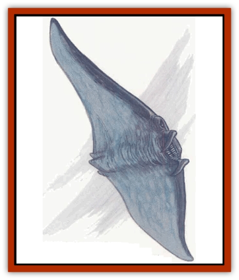

# Temporal Glider

| Statistic | **Temporal Glider** |
| --- | --- |
| **Activity Cycle:** | Any |
| **Alignment:** | Neutral |
| **Armor Class:** | -2 |
| **Climate/Terrain:** | Demiplane of Time |
| **Damage/Attack:** | 5d4 |
| **Diet:** | Special (see below) |
| **Frequency:** | Uncommon |
| **Hit Dice:** | 6 to 10 |
| **Intelligence:** | Average (8) |
| **Magic Resistance:** | 20% |
| **Morale:** | Average (10) |
| **Movement:** | 15 |
| **No. Appearing:** | 1 |
| **No. of Attacks:** | 1 |
| **Organization:** | Solitary |
| **Size:** | L to H (12-18' long) |
| **Special Attacks:** | Nil |
| **Special Defenses:** | Half damage from nonmagical weapons |
| **THAC0:** | 6 HD: 15 / 7-8 HD: 13 / 9-10 HD: 11 |
| **Treasure:** | Nil |
| **XP Value:** | 4,000-10,000 |

Gliders are large, kitelike creatures that drift along in the empty spaces of Demiplane of Time or close to the surface of a timestream. They never travel to the Prime Material Plane reality, although there is much speculation that they could do so if they ever were to have the desire. Each looks like a large black [[Ray|manta ray]] without any sort of tail - basically one giant wingspan. The tips of these wings flex slightly, but their motion appears to be thought generated.

**Combat:** Gliders defend themselves if attacked, which is the only way they enter combat. They only have one means of attack. They ram their heads into those attacking them, and they can perform this maneuver only once per round. Their skin is extremely tough, and nonmagical weapons only do half damage against them (this includes any Strength bonuses, which are also halved). They are also likely to use their timestream slipping ability to escape if the combat goes badly. Any creature within 20 feet of a glider that slips into another timestream must save vs. rod/staff/wand or take 5d10 points of concussion damage from the backlash of the raging temporal tides. A creature riding on the glider is subject to the creative control of the Dungeon Master. The trip is never a pleasant one, and if the glider's unwelcome traveling companion should somehow manage to survive the trip and yet lose hold of the glider, he may have a difficult time getting back home from whatever random plane's timestream the glider deposits him upon.

Gliders can be forced into submission if the character manages to convey his intentions to the creature and then only strikes for nonlethal damage. Normally, the character must manage to get onto the glider's back (a Dexterity check after being rammed, with a -5 modifier to the check) and then continue to cause submission (nonlethal) damage.

The glider probably slips through several different timestreams during this process, placing the character at considerable risk. The character should be forced to make another Dexterity check (without a penalty) for each of the planes the temporal glider slips into. The transfer is never a pleasant process. If the foolhardy traveler manages to survive the harrowing experience, the temporal glider eventually submits and agrees to carry the time traveler wherever he wishes.

**Habitat/Society:** Temporal gliders possess the ability to travel between the timestreams of different planes, and when a glider disappears within a large cloud of mist-smoke, it has slipped directly to an alternate plane within the same reality. They are feeding on the change in temporal forces that exist along the borders of different timestreams: the temporal tides. The conflicting forces do not bother them at all, but if a creature managed to catch a ride on the back of one of these gliders, the forces would still affect them. Such a trip would likely rip any hitchhiker to pieces in the process.

Gliders travel alone, and they have no fixed place to which they return. They simply roam the Demiplane of Time constantly, like a shark in deep waters. While they are intelligent, temporal gliders have absolutely no interest in treasure and are never found with any.

Although they must feed on something, they have never been seen eating, and they never interact with other creatures by choice. They are a mystery to most adventurers, and only the most curious or antagonistic bother with these indifferent creatures. Some chronomancers have fit that bill nicely, though, and through their researches, they have found what temporal gliders are actually doing as they drift among the mist-smoke is continuously feeding. They do this much in the way that a great [[Whale|whale]] sifts plankton from the sea.

**Ecology:** It is rumored that a limited number of harnesses have been invented for the purpose of subduing these creatures. After all, controlling a steed that can shift between the planes at will can be quite useful. However, none of these legendary harnesses have ever been found, although it's improbable that a person would even recognize one when presented with it.

Temporal gliders do not bear their service willingly. Given the opportunity to escape, they do so at once. They are especially wont to do this when their rider returns to reality for a period of time. There is a good chance that when the chronomancer returns to look for the glider, the creature may well be long gone.

---
## Discovery & Documentation

**Source Publication:** Monstrous Compendium, 1996 Annual, Volume 3 (1995)
**Campaign Setting:** Advanced Dungeons & Dragons 2nd Edition
**Author(s):** Jon Pickens

### Other Creatures Found in This Source Book
   * [[Alaghi|Alaghi]]
   * [[Alhoon|Alhoon]]
   * [[Aranea_Savage_Coast|Aranea (Savage Coast)]]
   * [[Arcane_Head|Arcane Head]]
   * [[Banedead|Banedead]]
   * [[Banelich|Banelich]]
   * [[Bat_Bonebat|Bat, Bonebat]]
   * [[Beetle|Beetle]]
   * [[Belgoi|Belgoi]]
   * [[Bladeling|Bladeling]]
   * [[Braxat|Braxat]]
   * [[Bunyip|Bunyip]]
   * [[Burbur|Burbur]]
   * [[Bvanen|Bvanen]]
   * [[Cat_Great_Snow_Tiger|Cat, Great, Snow Tiger]]
   * [[Chosen_One|Chosen One]]
   * [[Chronovoid|Chronovoid]]
   * [[Cildabrin|Cildabrin]]
   * [[Coffer_Corpse|Coffer Corpse]]
   * [[Disenchanter|Disenchanter]]
   * [[Dog_Temporal|Dog, Temporal]]
   * [[Dragon_Cerilia|Dragon (Cerilia)]]
   * [[Dragon_Ghost|Dragon, Ghost]]
   * [[Dragon_Lesser_Undead|Dragon, Lesser Undead]]
   * [[Dragon_Neutral_Amber|Dragon, Neutral, Amber]]
   * [[Dread_Warrior|Dread Warrior]]
   * [[Dreamweaver|Dreamweaver]]
   * [[Dream_Spawn_Greater_Ennui|Dream Spawn, Greater, Ennui]]
   * [[Dream_Spawn_Lesser_Morph|Dream Spawn, Lesser, Morph]]
   * [[Dwarf_Arctic|Dwarf, Arctic]]
   * [[Dwarf_Urdunnir|Dwarf, Urdunnir]]
   * [[Eel_Giant_Moray|Eel, Giant Moray]]
   * [[Elemental_Fire_Kin_Tome_Guardian|Elemental, Fire Kin, Tome Guardian]]
   * [[Elf_Rockseer|Elf, Rockseer]]
   * [[Ethyk|Ethyk]]
   * [[Faerie_Faerie_Fiddler|Faerie, Faerie Fiddler]]
   * [[Faerie_Petty_Bramble|Faerie, Petty, Bramble]]
   * [[Faerie_Petty_Gorse|Faerie, Petty, Gorse]]
   * [[Faerie_Petty|Faerie, Petty]]
   * [[Firenewt|Firenewt]]
   * [[Formian|Formian]]
   * [[Gargoyle_II|Gargoyle II]]
   * [[Giant_Cerilia|Giant (Cerilia)]]
   * [[Goblin_Cerilia|Goblin (Cerilia)]]
   * [[Golem_Magic|Golem, Magic]]
   * [[Golem_Shaboath|Golem, Shaboath]]
   * [[Hag_Bheur|Hag, Bheur]]
   * [[Hamadryad|Hamadryad]]
   * [[Hound_of_Ill-Omen|Hound of Ill-Omen]]
   * [[Human_Cerilia|Human (Cerilia)]]
   * [[Hybsil|Hybsil]]
   * [[Ibrandlin|Ibrandlin]]
   * [[Imp_Chaos|Imp, Chaos]]
   * [[Ixitxachitl_Ixzan|Ixitxachitl, Ixzan]]
   * [[Jabberwock|Jabberwock]]
   * [[Kyton|Kyton]]
   * [[Kyuss_Son_of|Kyuss, Son of]]
   * [[Lillend|Lillend]]
   * [[Life-Shaped_Creation_Guardian|Life-Shaped Creation, Guardian]]
   * [[Life-Shaped_Creation_Transport|Life-Shaped Creation, Transport]]
   * [[Lycanthrope_Werecrocodile|Lycanthrope, Werecrocodile]]
   * [[Lycanthrope_Werespider|Lycanthrope, Werespider]]
   * [[Magedoom|Magedoom]]
   * [[Manotaur|Manotaur]]
   * [[Mastiff_Shadow|Mastiff, Shadow]]
   * [[Meazel|Meazel]]
   * [[Mist_Scarlet_Dancer|Mist, Scarlet Dancer]]
   * [[Needleman|Needleman]]
   * [[Orc_Neo-Orog|Orc, Neo-Orog]]
   * [[Orc_Ondonti|Orc, Ondonti]]
   * [[Owlbear_II|Owlbear II]]
   * [[Pegataur|Pegataur]]
   * [[Phaerimm|Phaerimm]]
   * [[Reggelid|Reggelid]]
   * [[Render|Render]]
   * [[Saurial|Saurial]]
   * [[Scalamagdrion|Scalamagdrion]]
   * [[Sharn|Sharn]]
   * [[Snake_Messenger|Snake, Messenger]]
   * [[Spirit_Forest_Uthraki|Spirit, Forest, Uthraki]]
   * [[Spirit_Forest_Wood_Man|Spirit, Forest, Wood Man]]
   * [[Spirit_Ice_Orglash|Spirit, Ice, Orglash]]
   * [[Spirit_Rock_Thomil|Spirit, Rock, Thomil]]
   * [[Strider_Giant|Strider, Giant]]
   * [[Tembo|Tembo]]
   * [[Temporal_Stalker|Temporal Stalker]]
   * [[Tether_Beast|Tether Beast]]
   * [[Thessalmonster|Thessalmonster]]
   * [[Time_Dimensional|Time Dimensional]]
   * [[Tomb_Tapper|Tomb Tapper]]
   * [[Undead_Dragon_Slayer|Undead Dragon Slayer]]
   * [[Unicorn_Black_Toril|Unicorn, Black (Toril)]]
   * [[Vaath|Vaath]]
   * [[Vortex_Spider|Vortex Spider]]
   * [[Weredragon|Weredragon]]
   * [[Zhentarim_Spirit|Zhentarim Spirit]]
