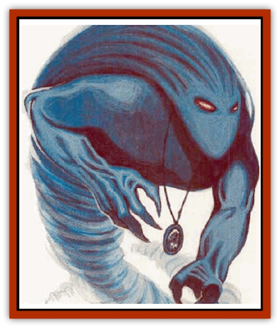

# Temporal Stalker

| Statistic | **Temporal Stalker** |
| --- | --- |
| **Activity Cycle:** | Any |
| **Alignment:** | Neutral evil |
| **Armor Class:** | 3 |
| **Climate/Terrain:** | Demiplane of Time |
| **Damage/Attack:** | 1d6 |
| **Diet:** | Special (see below) |
| **Frequency:** | Rare |
| **Hit Dice:** | 4+2 |
| **Intelligence:** | Genius (18) |
| **Magic Resistance:** | 20% |
| **Morale:** | Average (10) |
| **Movement:** | 18 |
| **No. Appearing:** | 1-4 |
| **No. of Attacks:** | 1 |
| **Organization:** | Solitarv or small groups |
| **Size:** | M (6' tall) |
| **Special Attacks:** | Level drain; special |
| **Special Defenses:** | Hit only by +1 or better magical weapons |
| **THAC0:** | 15 |
| **Treasure:** | Nil |
| **XP Value:** | 1,750 |

Temporal stalkers are the undead of the pseudo-reality of the Demiplane of Time, and a large number of them used to be chronomancers. Since the basis of their existence depends on temporal forces, traveling to other-planar reality means instant destruction for the stalkers. They appear to be composed entirely of the mist-smoke of Demiplane of Time, condensed down into a near-solid form. Flashes of silver light seem to pulse from within their forms, and twin red glows replace their eyes. As one moves, a glimpse of its physical body can sometimes be seen through a haze of mist, although this may only be an illusion of some sort.

**Combat:** Temporal stalkers usually hunt alone unless they are after a large group or a exceptionally powerful individual. They track a single target for months until they are able to catch him by surprise. If a small group of travelers is involved, the stalkers wait until one separates from the others before attacking. A successful hit by a temporal stalker causes only light damage, but also drains one level and all the abilities that go with it. Alternatively, with the same touch, the stalker can use *paradox* on a victim, fouling its past. Often it uses this to exchange a spell that a wizardly victim has memorized for one that is entirely useless in the given situation.

A character drained below level 0 becomes a temporal stalker himself. Mist-smoke begins to swarm around the victim's body until, several days later, most of his physical body is hidden within the shroud. Companions can prevent the transformation by bringing the body back to reality before the new stalker awakens.

**Habitat/Society:** Temporal stalkers have no lairs, and they are beyond the desire for material wealth. The only thmg a temporal stalker actually possesses is a deep-seated hatred for linear creatures and a desire to see them destroyed. These evil undead are highly intelligent and know much concerning the Demiplane of Time , which is one more thing to drive them into anger, since they can no longer use this information. It's no good to them if they can never leave the pseudo-plane and have an effect upon reality.

Of all linear beings, temporal stalkers hate the Guardians the most, as these men and women have the most effect upon reality of any chronomancers. The jealousy the temporal stalkers feel burns brightly in them, and they sometimes organize small ambushes for a Guardian if they think there is any chance of catching the powerful chronomancer by surprise. This is hardly likely, as the Guardians are well aware of the tepporal stalkers and the dangers that they represent to travelers of the Demiplane of Time.

Despite this hatred that is focused upon them (of which they are sometimes painfuly aware), the Guardians usually choose to leave the temporal stalkers alone. Since the creatures can't slip into reality, they are no danger to the timestream. In fact, they act as a kind of weeding-out system. In the opinion of many Guardians, chronomancers who are too unwary to deal with temporal stalkers are stupid (or at least incautious) enough to present a danger to the timestream themselves. If the temporal stalkers take care of these bumblers early on, then it may never be up to the Guardians to do so if the fools somehow manage to gain power.

On the other hand, those who survive an encounter with a group of temporal stalkers learn a fine lesson of the dangers of time travelling. The impact that this can have is far more effective than any lecture a Guardian might give.

If there is any hope of dealing with a stalker, it is through exploiting their desire to ssek the destruction of a Guardian above all else. More than one cunning chronomancer has been spared by a group of temporal stalkers by promising to deliver a Guardian or two into a trap of their devising - the more Guardians, the better. Of course, several of these deals fell through when the stalker's victim simply told the Guardians of the creatures' plans. Now, the stalkers are more than a little wary of cutting such deals, and getting them to agree to one takes some doing.

**Ecology:** Temporal stalkers cannot exist outside of the normal Demiplane of Time. They are neither hunted by temporal creatures, nor do they hunt such creatures. Temporal stalkers roam the various timestreams of the Demiplane of Time in search of one thing: linear lifeforms intruding upon their realm. Once the mist trail left by a traveler is discovered, a temporal stalker tracks that individual down (unless, of course, the traveler leaves before the temporal stalker manages to catch up with him). Temporal stalkers can move just as fast as most chronomancer, and they never have to sleep, so it is rare to outdistance them.

---
## Discovery & Documentation

**Source Publication:** Monstrous Compendium, 1996 Annual, Volume 3 (1995)
**Campaign Setting:** Advanced Dungeons & Dragons 2nd Edition
**Author(s):** Jon Pickens

### Other Creatures Found in This Source Book
   * [[Alaghi|Alaghi]]
   * [[Alhoon|Alhoon]]
   * [[Aranea_Savage_Coast|Aranea (Savage Coast)]]
   * [[Arcane_Head|Arcane Head]]
   * [[Banedead|Banedead]]
   * [[Banelich|Banelich]]
   * [[Bat_Bonebat|Bat, Bonebat]]
   * [[Beetle|Beetle]]
   * [[Belgoi|Belgoi]]
   * [[Bladeling|Bladeling]]
   * [[Braxat|Braxat]]
   * [[Bunyip|Bunyip]]
   * [[Burbur|Burbur]]
   * [[Bvanen|Bvanen]]
   * [[Cat_Great_Snow_Tiger|Cat, Great, Snow Tiger]]
   * [[Chosen_One|Chosen One]]
   * [[Chronovoid|Chronovoid]]
   * [[Cildabrin|Cildabrin]]
   * [[Coffer_Corpse|Coffer Corpse]]
   * [[Disenchanter|Disenchanter]]
   * [[Dog_Temporal|Dog, Temporal]]
   * [[Dragon_Cerilia|Dragon (Cerilia)]]
   * [[Dragon_Ghost|Dragon, Ghost]]
   * [[Dragon_Lesser_Undead|Dragon, Lesser Undead]]
   * [[Dragon_Neutral_Amber|Dragon, Neutral, Amber]]
   * [[Dread_Warrior|Dread Warrior]]
   * [[Dreamweaver|Dreamweaver]]
   * [[Dream_Spawn_Greater_Ennui|Dream Spawn, Greater, Ennui]]
   * [[Dream_Spawn_Lesser_Morph|Dream Spawn, Lesser, Morph]]
   * [[Dwarf_Arctic|Dwarf, Arctic]]
   * [[Dwarf_Urdunnir|Dwarf, Urdunnir]]
   * [[Eel_Giant_Moray|Eel, Giant Moray]]
   * [[Elemental_Fire_Kin_Tome_Guardian|Elemental, Fire Kin, Tome Guardian]]
   * [[Elf_Rockseer|Elf, Rockseer]]
   * [[Ethyk|Ethyk]]
   * [[Faerie_Faerie_Fiddler|Faerie, Faerie Fiddler]]
   * [[Faerie_Petty_Bramble|Faerie, Petty, Bramble]]
   * [[Faerie_Petty_Gorse|Faerie, Petty, Gorse]]
   * [[Faerie_Petty|Faerie, Petty]]
   * [[Firenewt|Firenewt]]
   * [[Formian|Formian]]
   * [[Gargoyle_II|Gargoyle II]]
   * [[Giant_Cerilia|Giant (Cerilia)]]
   * [[Goblin_Cerilia|Goblin (Cerilia)]]
   * [[Golem_Magic|Golem, Magic]]
   * [[Golem_Shaboath|Golem, Shaboath]]
   * [[Hag_Bheur|Hag, Bheur]]
   * [[Hamadryad|Hamadryad]]
   * [[Hound_of_Ill-Omen|Hound of Ill-Omen]]
   * [[Human_Cerilia|Human (Cerilia)]]
   * [[Hybsil|Hybsil]]
   * [[Ibrandlin|Ibrandlin]]
   * [[Imp_Chaos|Imp, Chaos]]
   * [[Ixitxachitl_Ixzan|Ixitxachitl, Ixzan]]
   * [[Jabberwock|Jabberwock]]
   * [[Kyton|Kyton]]
   * [[Kyuss_Son_of|Kyuss, Son of]]
   * [[Lillend|Lillend]]
   * [[Life-Shaped_Creation_Guardian|Life-Shaped Creation, Guardian]]
   * [[Life-Shaped_Creation_Transport|Life-Shaped Creation, Transport]]
   * [[Lycanthrope_Werecrocodile|Lycanthrope, Werecrocodile]]
   * [[Lycanthrope_Werespider|Lycanthrope, Werespider]]
   * [[Magedoom|Magedoom]]
   * [[Manotaur|Manotaur]]
   * [[Mastiff_Shadow|Mastiff, Shadow]]
   * [[Meazel|Meazel]]
   * [[Mist_Scarlet_Dancer|Mist, Scarlet Dancer]]
   * [[Needleman|Needleman]]
   * [[Orc_Neo-Orog|Orc, Neo-Orog]]
   * [[Orc_Ondonti|Orc, Ondonti]]
   * [[Owlbear_II|Owlbear II]]
   * [[Pegataur|Pegataur]]
   * [[Phaerimm|Phaerimm]]
   * [[Reggelid|Reggelid]]
   * [[Render|Render]]
   * [[Saurial|Saurial]]
   * [[Scalamagdrion|Scalamagdrion]]
   * [[Sharn|Sharn]]
   * [[Snake_Messenger|Snake, Messenger]]
   * [[Spirit_Forest_Uthraki|Spirit, Forest, Uthraki]]
   * [[Spirit_Forest_Wood_Man|Spirit, Forest, Wood Man]]
   * [[Spirit_Ice_Orglash|Spirit, Ice, Orglash]]
   * [[Spirit_Rock_Thomil|Spirit, Rock, Thomil]]
   * [[Strider_Giant|Strider, Giant]]
   * [[Tembo|Tembo]]
   * [[Temporal_Glider|Temporal Glider]]
   * [[Tether_Beast|Tether Beast]]
   * [[Thessalmonster|Thessalmonster]]
   * [[Time_Dimensional|Time Dimensional]]
   * [[Tomb_Tapper|Tomb Tapper]]
   * [[Undead_Dragon_Slayer|Undead Dragon Slayer]]
   * [[Unicorn_Black_Toril|Unicorn, Black (Toril)]]
   * [[Vaath|Vaath]]
   * [[Vortex_Spider|Vortex Spider]]
   * [[Weredragon|Weredragon]]
   * [[Zhentarim_Spirit|Zhentarim Spirit]]
