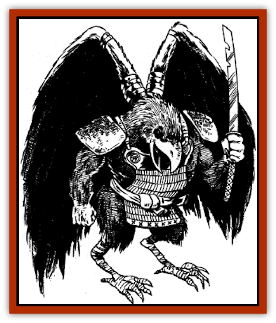

# Tengu

| Statistic | **Crow Tengu** | **Humanoid Tengu** |
| --- | --- | --- |
| **Activity Cycle:** | Day | Day |
| **Alignment:** | Chaotic evil | Chaotic neutral |
| **Armor Class:** | 6 | 4 |
| **Climate/Terrain:** | Tropical, subtropical, and temperate mountains | Tropical, subtropical, and temperate mountains |
| **Damage/Attack:** | 1-8 or by weapon | 1-6 or by weapon |
| **Diet:** | Omnivore | Omnivore |
| **Frequency:** | Rare | Rare |
| **Hit Dice:** | 2-5 (4 average) | 5-10 (8 average) |
| **Intelligence:** | Low to average (5-10) | Very to high (11-14) |
| **Magic Resistance:** | Nil | Nil |
| **Morale:** | Average (10) | Elite (13) |
| **Movement:** | 9, Fl 24(C) | 12, Fl 15(C) |
| **No. Appearing:** | 1-4 | 1-3 |
| **No. of Attacks:** | 1 | 2 |
| **Organization:** | Flock | Solitary or flock |
| **Size:** | S (2-3' tall) | S (3-4' tall) |
| **Special Attacks:** | Spells | Spells |
| **Special Defenses:** | Nil | Invisibility |
| **THAC0:** | 2 HD: 19 / 3-4 HD:17 / 5 HD: 15 | 5-6 HD: 15 / 7-8 HD: 13 / 9-10 HD: 11 |
| **Treasure:** | C | C |
| **XP Value:** | 2 HD: 175 / 3 HD: 270 / 4 HD: 420 / 5 HD: 650 | 5 HD: 975 / 6 HD: 1,400 / 7 HD: 2,000 / 8 HD: 3,000 / 9 HD: 4,000 / 10 HD: 5,000 |

The tengu are a race of [[Bird|bird]]like humanoid creatures, found in uninhabited mountain areas not far from settled lands. They are extremely secretive and capricious. Little is known about their way of life, aside from their obsession for privacy and their intolerance for humans.

There are two types of tengu: [[Raven_Crow|crow]] and humanoid. The crow tengu is slightly more common. It stands about 2 feet tall, and has the head and beak of a crow. Brightly colored feathers cover its body, usually in shades of green, yellow, or red. Wings sprout from between its shoulder blades.

Tengu speak their own tongue, the language of the local human population, and the languages of animals. They also are perfect mimics, able to imitate the voices of anyone they have heard.

**Combat:** Crow tengu are bad-natured and sharp-tempered, seeking to cause harm to all humans who enter their territory. They arm themselves with katana and wakizashi, and can use *polymorph* and *shout* spells three times per day. They typically swoop and charge to attack, casting shout to disable their enemies, then rushing in with weapons swinging.

**Habitat/Society:** Tengu do not form villages or permanent communities. Instead, they make simple nests of sticks and weeds in forest glades, in meadows, or on the banks of streams and ponds. A flock consists of 1-4 males, an equal number of females, and 2-8 (2d4) hatchlings. A female lays 1-2 eggs per year. One to three humanoid tengu (see below) typically live with a crow tengu flock. Crow tengu have lower status than the humanoid tengu and follow the humanoids' orders.

**Ecology:** Tengu eat mostly grains and fruits, supplemented with the occasional fish, worm, insect, or small mammal. They are exceptionally fond of sake. All tengu also have a taste for music, particularly that of the flute and drum. They often hang songbirds in small cages from trees near their lairs.

**Humanoid Tengu**

  Humanoid tengu stand 3 to 4 feet tall. They have normal human faces, except their skin is red or blue, and their noses are exceptionally long. About 70% have stunted, feathered wings between their shoulder blades. They speak the tengu tongue, as well as the languages of animals and the local human population. Like crow tengu, humanoid tengu can perfectly mimic any voice they have ever heard.

Humanoid tengu are less aggressive than the crow tengu who serve them. The humanoids are more likely to stay in a safe location while the crow tengu under their command do most of the fighting. However, when threatened or cornered, humanoid tengu become crafty and ferocious fighters. They can use *polymorph self*, *shout*, and *phantasmal force* three times per day, can become *invisible* at will, use *reward* or *ancient curse* once per week, use *misdirection* once per turn, and use *ghost light* once per round. They also have the spellcasting ability of a shukenja and the combat ability of a kensai. (In both cases, they enjoy the experience level equaling their Hit Dice.) Additionally, they know one martial arts style, with 2-5 special maneuvers in that style.

Humanoid tengu always carry a fan made of brightly colored feathers. This magical fan can serve as a normal katana when folded. When fanned, it has three powers, each of which can be used three times each day. First, it can create a wind equal to a strong gale (like *wind breath*). Second, it can cast a *quickgrowth* spell. Third, it can cause the abnormal growth or shrinkage of an opponent's facial feature (the nose or ears are most common).

Although they are not evil, humanoid tengu are not overly fond of humans and often play cruel tricks on them. However, humanoid tengu do have a liking for shukenja, wu jen, and kensai who specialize in the sword. On rare occasions, they tutor a sword kensai, teaching him the secrets of their skill. Such tutoring, which takes 1-3 months, automatically earns the kensai character 1,000 experience points.

---
## Discovery & Documentation

**Source Publication:** MC6 Kara-Tur Appendix (1990)
**Campaign Setting:** Kara-Tur (Forgotten Realms)
**Author(s):** Rick Swan

### Other Creatures Found in This Source Book
   * [[Bajang|Bajang]]
   * [[Bakemono|Bakemono]]
   * [[Bisan|Bisan]]
   * [[Buso|Buso]]
   * [[Carp_Giant|Carp, Giant]]
   * [[Centipede_Spirit|Centipede, Spirit]]
   * [[Chu-u|Chu-u]]
   * [[Con-tinh|Con-tinh]]
   * [[Doc_cu'o'c|Doc cu'o'c]]
   * [[Duruch'i-lin|Duruch'i-lin]]
   * [[Flame_Spirit|Flame Spirit]]
   * [[Foo_Creature|Foo Creature]]
   * [[Gaki|Gaki]]
   * [[Gargantua|Gargantua]]
   * [[Goblin_Rat|Goblin Rat]]
   * [[Hai_Nu|Hai Nu]]
   * [[Hannya|Hannya]]
   * [[Hengeyokai|Hengeyokai]]
   * [[Hsing-sing|Hsing-sing]]
   * [[Hu_Hsien|Hu Hsien]]
   * [[Human_Kara-Tur|Human (Kara-Tur)]]
   * [[Ikiryo|Ikiryo]]
   * [[Jishin_Mushi|Jishin Mushi]]
   * [[Kala|Kala]]
   * [[Kaluk|Kaluk]]
   * [[Kappa|Kappa]]
   * [[Korobokuru|Korobokuru]]
   * [[Krakentua|Krakentua]]
   * [[Kuei|Kuei]]
   * [[Memedi|Memedi]]
   * [[Men-shen|Men-shen]]
   * [[Nat|Nat]]
   * [[Ningyo|Ningyo]]
   * [[Oni|Oni]]
   * [[P'oh|P'oh]]
   * [[P'oh_Gohei|P'oh, Gohei]]
   * [[Shan_Sao|Shan Sao]]
   * [[Shirokinukatsukami|Shirokinukatsukami]]
   * [[Spirit_Folk|Spirit Folk]]
   * [[Spirit_Nature|Spirit, Nature]]
   * [[Spirit_Stone|Spirit, Stone]]
   * [[Tako|Tako]]
   * [[Wang-Liang|Wang-Liang]]
   * [[Yuan-ti_Histachii|Yuan-ti, Histachii]]
   * [[Yuki-on-na|Yuki-on-na]]
