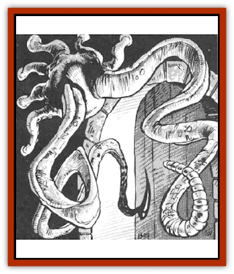

# Tentamort

| Statistic | **Tentamort** |
| --- | --- |
| **Activity Cycle:** | Any |
| **Alignment:** | Neutral |
| **Armor Class:** | 3 (tentacles)/1 (body) |
| **Climate/Terrain:** | Any subterranean |
| **Damage/Attack:** | 1-6 |
| **Diet:** | Carnivore |
| **Frequency:** | Rare |
| **Hit Dice:** | 2 each tentacle, 4 body |
| **Intelligence:** | Non- (0) |
| **Magic Resistance:** | Nil |
| **Morale:** | Average (8-10) |
| **Movement:** | 1 |
| **No. Appearing:** | 1-10 |
| **No. of Attacks:** | 2 |
| **Organization:** | Nest |
| **Size:** | S (but tentacles 10' long) |
| **Special Attacks:** | See below |
| **Special Defenses:** | Nil |
| **THAC0:** | 17 |
| **Treasure:** | Nil |
| **XP Value:** | 650 |

Tentamorts are dungeon predators distantly related to [[Squid_Giant|sea squids]]. Their head/body is a flesh sphere two feet in diameter, covered by a chitinous shell. This head/body contains all the vital organs as well as the sense organs - smell, taste, and hearing. At the bottom of the body are six to eight short suction-cup covered tentacles. These serve as feet and enable the tentamort to attach itself firmly to almost any surface. The feet also provide the tentamorts with their only form of locomotion. Two larger tentacles grow atop tentamorts. Both measure ten to 12 feet in length. Tentamorts have no eyes, but their head/body has a delicate organ that senses body heat. Breathing is accomplished through three blow holes located just above the feet. Tentamorts are gray-green in color.

**Combat:** A tentamort drags itself through dungeon corridors, using its sense of smell to find a well-traveled doorway or intersection. The tentamort then attaches itself to the ceiling or wall and waits for prey. Any creature coming within ten feet of the tentamort is attacked by the tentamort's two larger tentacles. Each tentacle has 2 Hit Dice, while the head/body has 4 Hit Dice. When a tentacle is reduced to 0 hit points it is severed. Severed tentacles grow back in one week's time. Severing one tentacle does not affect the other. The only way to kill a tentamort is to destroy the head/body.

Each tentacle can lash an opponent for 1d6 points of damage. In addition, each has a special attack.

One tentacle is a powerful constrictor. This tentacle seizes its target on a hit 2 or more above the required to hit roll (or on a natural 20). Seized victims are trapped within the constricting coils of the tentacle. Victims cannot move their arms, cast spells, or use weapons. They may use their natural Strength to try to break free (successful Strength check required, with a -2 penalty). Each round thereafter, the tentacle automatically inflicts 1d6 points of constriction damage; no attack roll is required. The tentacle continues to constrict until the victim dies or until the tentacle is severed.

The other tentacle is much more deadly. A hollow needle of bone, six inches long, protrudes from its end. Like the first tentacle, this one seizes prey on a roll of 20 or on a hit 2 above what is needed. This tentacle, however, does not constrict. Instead, the round after grasping, the bone needle is inserted into the victim (no roll required). During the next two rounds the tentamort injects a saliva-like fluid into the helpless victim. This fluid softens the victim's muscles and organs to enable them to be sucked out through the hollow needle. If the tentacle is severed during injection, the victim can be saved by casting a *cure disease* spell cast upon him within one hour. Creatures receiving the full two-round injection die automatically three rounds later unless treated by more powerful and immediate magic. A *heal* spell will negate the fluid, as will a *regenerate* followed by *cure wounds*.

If two victims are within reach, the tentacles attack them simultaneously. If only one target is available, both arms attack it.

Tentamorts respond to very basic stimuli. They withdraw rapidly from fire or cold. Unless very hungry, tentamorts quit attacking after losing one tentacle.

**Habitat/Society:** Tentamorts live in both dungeons and dismal swamps. In dungeon settings they clump together in nests of 1d10 around a single entrance or tunnel bend. In swamps they usually spread out more, with individuals wrapping their feet around trees and then mixing their tentacles in with the water and muck. Tentamorts, like earthworms, are both male and female. When two tentamorts mate, both give birth to clusters of offspring, each two to three pounds in weight.

**Ecology:** The body of a tentamort is little more than a huge hunk of flesh. They are frequently hunted by [[Goblin|goblins]], [[Orc|orcs]] and other intelligent creatures. They kill tentamorts by standing out of their reach and firing arrows into them. To avoid this, tentamorts sometimes crawl back into crevices, attacking with their tentacles while protecting their vulnerable head/body.

The poison glands of a tentamort sell for 10d4 gold pieces. From a single tentamort a skilled alchemist can make 1d3 doses of a deadly, tasteless, odorless poison. When consumed, this poison causes a slow disintegration of the victim's internal organs. The victim loses 1 hit point the first day, 2 the second, and so on. Victims cannot be healed (even magically) until a *neutralize poison* is cast on them. Untreated victims eventually die from massive internal bleeding. This poison is favored by assassins, especially those who like to be miles away when their victim dies.

---
## Discovery & Documentation

**Source Publication:** MC5 Greyhawk Appendix (1989)
**Campaign Setting:** Advanced Dungeons & Dragons 2nd Edition
**Author(s):** Grant Boucher, William W. Connors, Steve Gilbert, Bruce Nesmith, Chris Mortika, Skip Williams

### Other Creatures Found in This Source Book
   * [[Aspis|Aspis]]
   * [[Beastman|Beastman]]
   * [[Bonesnapper|Bonesnapper]]
   * [[Booka|Booka]]
   * [[Brownie_Buckawn|Brownie, Buckawn]]
   * [[Brownie_Quickling|Brownie, Quickling]]
   * [[Crystalmist|Crystalmist]]
   * [[Dragon_Cloud|Dragon, Cloud]]
   * [[Dragon_Oerth_Greyhawk|Dragon (Oerth), Greyhawk]]
   * [[Dragonfly_Giant|Dragonfly, Giant]]
   * [[Dragonnel|Dragonnel]]
   * [[Elf_Grugach|Elf, Grugach]]
   * [[Elf_Valley|Elf, Valley]]
   * [[Golem_Necrophidius|Golem, Necrophidius]]
   * [[Grell_Wild|Grell, Wild]]
   * [[Grung|Grung]]
   * [[Hobgoblin_Norker|Hobgoblin, Norker]]
   * [[Hook_Horror|Hook Horror]]
   * [[Horgar|Horgar]]
   * [[Hound_Yeth|Hound, Yeth]]
   * [[Iguana_Giant|Iguana, Giant]]
   * [[Ingundi|Ingundi]]
   * [[Kech|Kech]]
   * [[Kyuss_Son_of|Kyuss, Son of]]
   * [[Mite|Mite]]
   * [[Needleman|Needleman]]
   * [[Plant_Carnivorous_Oerth|Plant, Carnivorous (Oerth)]]
   * [[Plant_Carnivorous_Vampire_Cactus|Plant, Carnivorous, Vampire Cactus]]
   * [[Plasmoid_General_Information|Plasmoid, General Information]]
   * [[Rat_Oerth|Rat (Oerth)]]
   * [[Raven_Crow|Raven/Crow]]
   * [[Scarecrow|Scarecrow]]
   * [[Shadow_Slow|Shadow, Slow]]
   * [[Skulk|Skulk]]
   * [[Snail|Snail]]
   * [[Sprite|Sprite]]
   * [[Taer|Taer]]
   * [[Turtle_Giant|Turtle, Giant]]
   * [[Tyrg|Tyrg]]
   * [[Wolf_Mist|Wolf, Mist]]
   * [[Wraith_Oerth|Wraith (Oerth)]]
   * [[Zygom|Zygom]]
