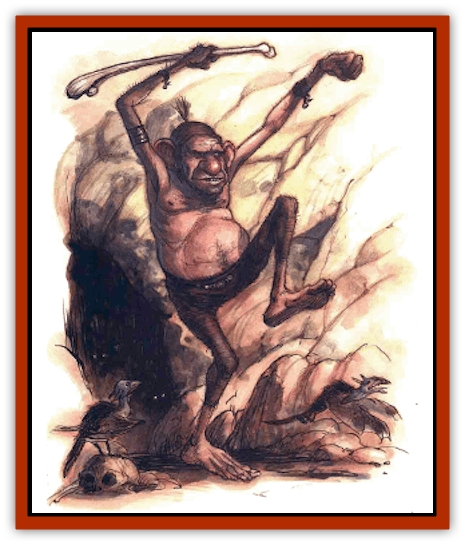
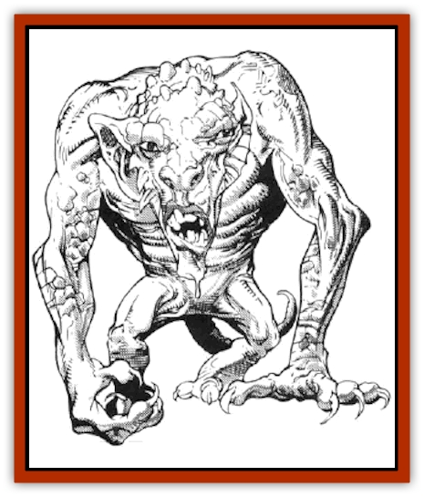

# Terithran

| Statistic | **Terithran** |
| --- | --- |
| **Activity Cycle:** | Any |
| **Alignment:** | Neutral |
| **Armor Class:** | 6 (3 on the Prime) |
| **Climate/Terrain:** | Ethereal Plane |
| **Damage/Attack:** | 1d8+1/1d8+1 |
| **Diet:** | Carnivorous? |
| **Frequency:** | Rare |
| **Hit Dice:** | 5+1 |
| **Intelligence:** | Low to average (7-9) |
| **Magic Resistance:** | 50% |
| **Morale:** | Average (8-10) |
| **Movement:** | 18 (15 on the Prime) |
| **No. Appearing:** | 1 |
| **No. of Attacks:** | 2 |
| **Organization:** | Solitary |
| **Size:** | S (4' tall) |
| **Special Attacks:** | Spell-like powers |
| **Special Defenses:** | Spell-like powers |
| **THAC0:** | 15 |
| **Treasure:** | Nearly drained magical items |
| **XP Value:** | 2,000 |

Making their lairs within tombs of solid ether, the ugly, hairless humanoids known as terithran sleep peacefully until disturbed. Only the presence of wizardly magic in their minds, the bane of all existence - causes them to stir. To a terithran's sensibilities, sorcery used on the Prime Material Plane defiles the area of the Ethereal with which it intersects. When the magic is strong enough to be felt even in the Deep Ethereal, the sleeper awakens.

Apparently, a terithran can sense the warping ripples of magic without even trying (a few planewalkers've joked that the creature's oversized ears pick up the disturbance). And when it perceives them, it rises angrily from its slumber, walks the maze of its Ethereal lair, and slips onto the Prime to punish the offender, often dragging him back to the Misty Shore for discipline - which means the dead-book for the bark. It's whispered that the terithran also eats the heart of the magic-user, but whether this is for sustenance or simple retribution isn't known. Terithran don't seem to be meat eaters otherwise.

So only prime-material wielders of magic need fear the creatures, right? Wrong. See, travelers on the Ethereal can run afoul of the things as well. Though they don't seem to worry about wizards on their own plane, terithran are notoriously cranky once they've finished dealing with an offender from the Prime. For up to a week, a terithran might wait in its lair, unable to sleep, or perhaps even wander the Ethereal in its restlessness.

Planewalkers encountering an agitated terithran must have a care. The slightest provocation will anger the beast. Those who approach with the proper gentle manner might garner a bit of chant from the sleepless terithran, though it's highly suspect that such a creature could possess any useful knowledge. In any case, it communicates via telepathy.

**Combat:** Though a terithran isn't particularly tall and its limbs are quite spindly, when provoked the creature can lash out with two sharp claws per round, inflicting 1d8+1 points of damage each. What's worse, though, is that an angry terithran has a variety of magical powers at its disposal, which it uses with great skill and strategy despite its less-than-impressive intellect.

First of all, it can *detect magic* at will. Fact is, the creature apparently can't help but detect the presence of nearby magic. Furthermore, a terithran has four other powers which it can use a combined total of 16 times per day. These abilities are:

<ul><li>*Blast of power.* Inflicts 4d8 points of damage upon all within a 10-foot radius. A successful saving throw versus spell reduces the damage by half.</li><li>*Drain power.* Drains a wizard of all memorized spells or a magical item of all its power (or charges). A successful saving throw versus breath weapon negates this attack. Treat affected spellcasters as if they've used all their spells for that day.</li><li>*Cause serious wounds.* Augments the terithran's claw attacks so that each causes 2d8+1 points of damage. There is no saving throw to avoid this effect.</li><li>*Transportation.* Allows the terithran to move back and forth between the Ethereal and the Prime. It can take one other creature along for the ride, although to transport an unwilling victim, the terithran must make a successful claw attack against it. The victim receives no saving throw to avoid the effect.</li></ul>On the Prime Material plane, the terithran becomes shadowy and less substantial, and its abilities and statistics change slightly. Its Armor Class improves to 3, and it can be harmed only by silver weapons or those of +1 or greater enchantment. However, the creature's movement slows to 15, and it can use its special abilities a total of only 6 times per day. Finally, its *blast of power* acts as a *power word: stun* spell rather than inflicting damage.

Because of these limitations, most terithran transport their victims to the Ethereal to finish them off. They use their blasts to ward away a wizard's allies and rely upon their innate magic resistance to penetrate a spellcaster's defenses.

**Habitat/Society:** Sleeping endlessly in their spiraling mazework lairs, terithran are always found alone. Truth is, they don't seem to interact at all, not even to breed. No one's ever seen terithran young or uncovered any evidence that the creatures age or die or natural causes. It just seems that they've always been and always will be - and the terithran themselves support this belief. Despite this apparent immortality, though, they don't really do much of anything unless disturbed from their repose.

No one knows exactly what attracts a terithran, but scholars generally agree on a few specifics. The creature seems to take notice of magic only when it's a wizard spell of 7th level or higher, an equivalent use from a magical item, or a burst of concentrated wizardly magic in a small area. For example, one story claims that approximately 16 spell levels cast on consecutive rounds within 50 feet of each other once drew an angry terithran.

'Course, these aren't hard-and-fast rules, since folks cast powerful spells and use magical items all the time without disturbing the Ethereal sleepers. In fact the vast majority of the time, such magic is used freely without fear, and rightly so. Graybeards need to gather more chant before they can accurately predict where and when a terithran will strike.

Terithran lairs are filled with drained magical items (though occasionally, a basher might stumble across an object that still has a bit of use to it) and the bones or slain wizards. The strange multidimensional maze that surrounds a terithran's sleeping chamber is said to contain the secret of the creature's power to jump between planes. Perhaps the walkways form a sort of planar pathway, but the dark of it remains a mystery.

**Ecology:** How did the odd terithran come to be? One tale suggests that a former deity whose purview was the absence of magic (was there ever such a god?) cursed the creatures to be annoyed at its use. Other chant says the little sods are the only ones that can see the truth - that a cabal of entropy-loving bashers introduced wizardly magic eons ago as part of a plot to bring about the end of the multiverse through spellcasting. A third story claims that the terithran fiercely guard their sleep because they're dreaming the multiverse (or perhaps *another* multiverse); only magic can awaken them, and if enough spells are cast, it'll all end.

Who can say what's truth and what's screed? Here's all that *is* known for sure: The terithran hardly fit into the strange Ethereal ecology at all - they neither produce nor consume. Mostly, they just sleep.

---
## Discovery & Documentation

**Source Publication:** MC14 Fiend Folio Appendix (1992)
**Campaign Setting:** Fiends Folio
**Author(s):** Don Bingle, John Terra, Wes Nicholson, Tim Beach, Steve Hardinger, Kris Hardinger, Rob Nicholls, Greg Swedberg, Al Boyce, Vince Garcia, Norm Ritchie

### Other Creatures Found in This Source Book
   * [[Aballin|Aballin]]
   * [[Achaierai|Achaierai]]
   * [[Adherer|Adherer]]
   * [[Algoid|Algoid]]
   * [[Al-Mi'raj|Al-Mi'raj]]
   * [[Apparition|Apparition]]
   * [[Caterwaul|Caterwaul]]
   * [[Coffer_Corpse|Coffer Corpse]]
   * [[Crabman|Crabman]]
   * [[Dark_Creeper|Dark Creeper]]
   * [[Dark_Stalker|Dark Stalker]]
   * [[Darter|Darter]]
   * [[Denzelian|Denzelian]]
   * [[Dune_Stalker|Dune Stalker]]
   * [[Dwarf_Urdunnir|Dwarf, Urdunnir]]
   * [[Falcon_Fire|Falcon, Fire]]
   * [[Faux_Faerie|Faux Faerie]]
   * [[Flawder|Flawder]]
   * [[Fyrefly|Fyrefly]]
   * [[Gambado|Gambado]]
   * [[Garbug|Garbug]]
   * [[Giant_Fhoimorien|Giant, Fhoimorien]]
   * [[Gibberling|Gibberling]]
   * [[Gorbel|Gorbel]]
   * [[Grimlock|Grimlock]]
   * [[Hellcat|Hellcat]]
   * [[Ice_Lizard|Ice Lizard]]
   * [[Iron_Cobra|Iron Cobra]]
   * [[Khargra|Khargra]]
   * [[Mantari|Mantari]]
   * [[Penanggalan|Penanggalan]]
   * [[Pernicon|Pernicon]]
   * [[Phantom_Stalker|Phantom Stalker]]
   * [[Retriever|Retriever]]
   * [[Ruve|Ruve]]
   * [[Scathe|Scathe]]
   * [[Sheet_Ghoul_Sheet_Phantom|Sheet Ghoul/Sheet Phantom]]
   * [[Shocker|Shocker]]
   * [[Spanner|Spanner]]
   * [[Stwinger|Stwinger]]
   * [[Sussurus|Sussurus]]
   * [[Symbiotic_Jelly|Symbiotic Jelly]]
   * [[Thunder_Children|Thunder Children]]
   * [[Troll_Ice|Troll, Ice]]
   * [[Tween|Tween]]
   * [[Umpleby|Umpleby]]
   * [[Volt|Volt]]
   * [[Xill|Xill]]
   * [[Xvart|Xvart]]
   * [[Zygraat|Zygraat]]
