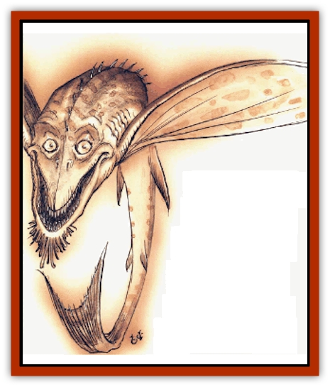

# Terlen

| Statistic | **Terlen** |
| --- | --- |
| **Activity Cycle:** | Day |
| **Alignment:** | Neutral (evil) |
| **Armor Class:** | 5 |
| **Climate/Terrain:** | Carceri, Gehenna, Gray Waste |
| **Damage/Attack:** | 2d8 |
| **Diet:** | Carnivore |
| **Frequency:** | Uncommon |
| **Hit Dice:** | 4+3 |
| **Intelligence:** | Animal (1) |
| **Magic Resistance:** | 10% |
| **Morale:** | Elite (13-14) |
| **Movement:** | 3, Sw 15, Fl 15 (C) |
| **No. Appearing:** | 1-8 |
| **No. of Attacks:** | 1 |
| **Organization:** | School |
| **Size:** | M (7' long) |
| **Special Attacks:** | None |
| **Special Defenses:** | Camouflage |
| **THAC0:** | 17 |
| **Treasure:** | None |
| **XP Value:** | 975 |

Some bashers think that the Lower Planes're nothing but wastelands of burning rock, searing desert, or poisonous bogs. They're wrong. The Lower Planes support surprisingly tough food chains of both natural and supernatural creatures. There's no dark to the fact that there are places on the Lower Planes where nothing lives, but there's just as much territory where a cutter in the know can get along just fine. See, life adapts to its surroundings - including surroundings that a body'd think nothing could live in. It might be tougher, meaner, or scarcer than life elsewhere, but it's still there. 'Course, it's probably plane-touched or twisted by the fiends who share its kip.

The terlen's a good example of this principle. Chances are, the terlen came from the seas of some prime world, where it flourished without any supernatural influence at all. Some wizard or arch-fiend brought a few back as pets or curiosities, and the terlens proved strong and fierce enough to survive in the acidic watcrs of Othrys or Porphatys, in the Red Prison (that's Carceri, berk). Maybe the planes themselves warped the creatures, or maybe an [[Yugoloth_Greater_Arcanaloth|arcanaloth]] or [[Gehreleth|shator gehreleth]] decided to improve the stock, but the final result was a mostly natural predator savage enough to survive on the Lower Planes.

The terlen's original form's forgotten, although it was probably [[Shark|shark]]- or [[Snake|snake]]like. It's an amphibian, equally agile in or out or the water. The terlen's about the size of a fullgrown man, with a flattened sharklike body and a long, powerful tail. Its pectoral fins're greatly lengthened and support a translucent gray membrane, suitable for sustaining flight. The terlen can fold its wing-fins beside its body and wriggle along the ground snake-style, but it's far more comfortable swimming or flying. Its oversized maw is filled with triple razor-sharp ridges of cartilage. The terlen's natural coloration is a dull, sandy gray, but it can change the color of its skin to match its surroundings.

**Combat:** Terlens're always hungry and never pass up a chance for a possible meal. They're skilled hunters in the water or in the air. Terlens normally cover great distances every day, gliding silently along in the hope of surprising prey out in the open. The creature's a very silent flier, almost as quiet as an [[Owl|owl]], and it glides only a few feet above the ground using the land's contours and foliage as cover. Terlens often strike with a quiet approach from behind their victim, giving the unfortunate sod a -2 penalty to her surprise check unless she's careful to keep a close eye on her back trail.

Terlens attack with a rending snap of their fearsome jaws, inflicting 2d8 points of damage. They use hit-and-run tactics, circling at a range of 30 or 40 yards and making sudden rushes at their prey. A terlen's content to bleed a victim slowly, letting its prey wear itself out trying to escape before closing in for the kill. From time to time, terlens even pretend to lose interest and leave, only to return with another surprise attack ten or fifteen minutes later. When the victim finally collapses, the creature lands beside the sod and approaches on the ground to devour its meal. Interestingly enough, the terlen uses nearly identical tactics when hunting aquatic prey.

Motionless terlens're 75% likely to escape being spotted due to their excellent natural camouflage. They're only 50% likely to be spotted while flying in dark, hazy, or smoky areas, and 25% likely to escape detection while moving in good visibility. Of course, the terlen's spotted as soon as it attacks; a basher might miss the terlen at first glance, but he won't lose track of it once the fight starts unless the terlen leaves and comes back.

**Habitat/Society:** Terlens usually run in small groups called schools or flights. They're not cooperative hunters, but when one terlen finds a potential meal its fellows're very likely to show up with the hope of muscling in on the kill. Packs of up to 40 strong've been reported, and only an addle-cove'll want to be anywhere near that many terlens when a feeding frenzy starts.

On occasion, very hungry terlens'll fight each other to the death in the attempt to claim a potential meal. There's about a 5% chance per terlen encountered that one-quarter to one-half the monsters begin the encounter sparring with each other instead of directly attacking the prey.

Terlens don't make lairs and don't even stay long in a particular area. They're almost constantly on the move. They show a slight preference for remaining in water when it's available, but can exist indefinitely in arid environments if need be. This ability accounts for the terlens' spread from the relatively watery layers of Carceri into the far less hospitable planes of the Gray Waste and Gehenna.

**Ecology:** Terlens mostly feed on normal creatures where they can be found. Hardy fish, birds, and small reptiles or mammals make up most of a terlen's diet. Terlens've grown bold enough to attack [[Larva|larvae]], petitioners, or minor fiends if they're encountered in small numbers or particularly desolate areas. In some regions of Carceri, terlens've become enough of a danger for [[Gehreleth|gehreleths]] to organize hunting parties.

Terlens mate once per year, and lay clutches of 50 to 100 eggs in sandy or muddy pits. They don't wait around for the young to hatch, and consequently a great number of the young creatures fall victim to all manner of predators. A terlen grows to full size in about a year, and can live as long as 30 years. Most die long before this due to the violent nature of their home and the power of the occasional greater fiends terlens unknowingly try to make a meal of.

---
## Discovery & Documentation

**Source Publication:** Planescape II (1996)
**Campaign Setting:** Planescape
**Author(s):** Rich Baker, Karen S. Boomgarden

### Other Creatures Found in This Source Book
   * [[Aasimar|Aasimar]]
   * [[Abrian|Abrian]]
   * [[Arcane|Arcane]]
   * [[Balaena|Balaena]]
   * [[Beholder-kin_Observer|Beholder-kin, Observer]]
   * [[Bloodthorn|Bloodthorn]]
   * [[Bonespear|Bonespear]]
   * [[Darkweaver|Darkweaver]]
   * [[Demarax|Demarax]]
   * [[Dhour|Dhour]]
   * [[Eater_of_Knowledge|Eater of Knowledge]]
   * [[Eladrin_Greater_Firre|Eladrin, Greater, Firre]]
   * [[Eladrin_Greater_Ghaele|Eladrin, Greater, Ghaele]]
   * [[Eladrin_Greater_Tulani|Eladrin, Greater, Tulani]]
   * [[Eladrin_Lesser_Bralani|Eladrin, Lesser, Bralani]]
   * [[Eladrin_Lesser_Coure|Eladrin, Lesser, Coure]]
   * [[Eladrin_Lesser_Noviere|Eladrin, Lesser, Noviere]]
   * [[Eladrin_Lesser_Shiere|Eladrin, Lesser, Shiere]]
   * [[Fhorge|Fhorge]]
   * [[Ghostlight|Ghostlight]]
   * [[Guardinal_Avoral|Guardinal, Avoral]]
   * [[Guardinal_Cervidal|Guardinal, Cervidal]]
   * [[Guardinal_General_Information|Guardinal, General Information]]
   * [[Guardinal_Equinal|Guardinal, Equinal]]
   * [[Guardinal_Leonal|Guardinal, Leonal]]
   * [[Guardinal_Lupinal|Guardinal, Lupinal]]
   * [[Guardinal_Ursinal|Guardinal, Ursinal]]
   * [[Hollyphant|Hollyphant]]
   * [[Incantifer|Incantifer]]
   * [[Ironmaw|Ironmaw]]
   * [[Keeper|Keeper]]
   * [[Khaasta|Khaasta]]
   * [[Leomarh|Leomarh]]
   * [[Monster_of_Legend|Monster of Legend]]
   * [[Mortai|Mortai]]
   * [[Noctral|Noctral]]
   * [[Quill|Quill]]
   * [[Razorvine|Razorvine]]
   * [[Reave|Reave]]
   * [[Retriever|Retriever]]
   * [[Rilmani_Abiorach|Rilmani, Abiorach]]
   * [[Rilmani_General_Information|Rilmani, General Information]]
   * [[Rilmani_Argenach|Rilmani, Argenach]]
   * [[Rilmani_Aurumach|Rilmani, Aurumach]]
   * [[Rilmani_Cuprilach|Rilmani, Cuprilach]]
   * [[Rilmani_Ferrumach|Rilmani, Ferrumach]]
   * [[Rilmani_Plumach|Rilmani, Plumach]]
   * [[Shadowdrake|Shadowdrake]]
   * [[Spellhaunt|Spellhaunt]]
   * [[Spider_Hook|Spider, Hook]]
   * [[Sunfly|Sunfly]]
   * [[Sword_Spirit|Sword Spirit]]
   * [[Tanar'ri_Lesser_Bulezau|Tanar'ri, Lesser, Bulezau]]
   * [[Tanar'ri_Lesser_Maurezhi|Tanar'ri, Lesser, Maurezhi]]
   * [[Tanar'ri_Lesser_Yochlol|Tanar'ri, Lesser, Yochlol]]
   * [[Tanar'ri_General_Information|Tanar'ri, General Information]]
   * [[Tanar'ri_True_Alkilith|Tanar'ri, True, Alkilith]]
   * [[Tso|Tso]]
   * [[T'uen-rin|T'uen-rin]]
   * [[Vaporighu|Vaporighu]]
   * [[Vorr|Vorr]]
   * [[Wastrel|Wastrel]]
   * [[Wraithworm|Wraithworm]]
   * [[Yugoloth_Lesser_Canoloth|Yugoloth, Lesser, Canoloth]]
   * [[Zoveri|Zoveri]]
