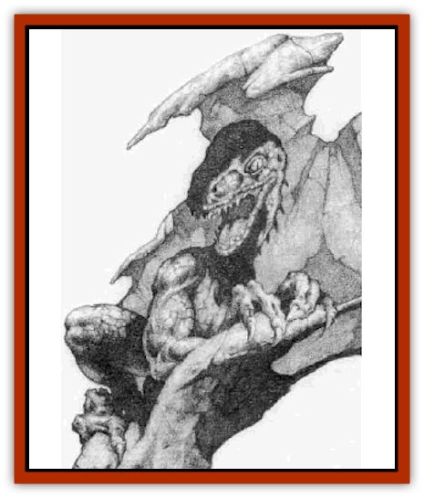
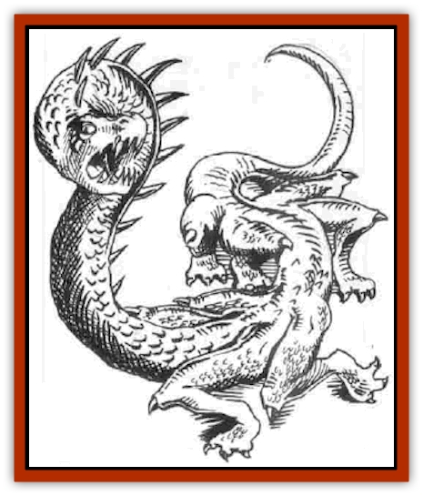

# Tether Beast

| Statistic | **Tether Beast** |
| --- | --- |
| **Activity Cycle:** | Any |
| **Alignment:** | Neutral evil |
| **Armor Class:** | 0 |
| **Climate/Terrain:** | Demiplane of Time |
| **Damage/Attack:** | 2d6/2d6/2d6/2d6/2d4 |
| **Diet:** | Omnivorous |
| **Frequency:** | Rare |
| **Hit Dice:** | 10+2 |
| **Intelligence:** | Very (11) |
| **Magic Resistance:** | 25% |
| **Morale:** | Average (10) |
| **Movement:** | 12 |
| **No. Appearing:** | 1-3 |
| **No. of Attacks:** | 5 (four claws, one bite) |
| **Organization:** | Family |
| **Size:** | H (20' long) |
| **Special Attacks:** | Breath weapon |
| **Special Defenses:** | Hit only by +1 or better magical weapon |
| **THAC0:** | 11 |
| **Treasure:** | I |
| **XP Value:** | 15,000 |

The tether beast is often referred to as the [[Dragon_General_Information|dragon]] of the Demiplane of Time, but in fact, it more closely resembles a [[Behir|behir]]. It is long and snake-like, with four pairs of legs unevenly spaced along its body. The legs are much longer than a behir's, but they are normally kept tucked up close to the body, giving the (sometimes fatal) illusion of the beast having a short reach. Its back and legs are covered with iridescent scales, and its underside features a softer, black skin. The head is reptilian with a short snout filled with dagger-like teeth. These creatures exist only on the Demiplane of Time.

**Combat:** Tether beasts prefer to attack their intended victims from ambush if possible, but they attack even if they are the ones surprised - or if they're wounded, or being offered an appeasement, or if they're hungry or full. Basically, they are happy to attack anyone at any time for any reason - or even no reason at all.

In combat, the creature continues to hold on to nearby lifelines with at least four claws while attacking with all of its other four limbs, plus its savage bite. It can attack in any direction it wishes with its claws, and the long reach of its arms puts it into melee range even against opponents armed with polearms. For opponents who devise an attack method just out of reach, the tether beast grabs hold of the lifeline tightly with its back four claws and whips the entire upper half of its body out toward its intended victim, raking with all five attacks. A creature may try to force one of the beast's four lifeline claws away from the lifeline. Whether or not it is successful, the only result is that the tether beast turns on that creature with every attack, including an extra claw attack from the limb that the victim just freed.

Anytime after the first combat round, if the tether beast does not seem to be winning the engagement, it uses a breath weapon attack that has a range of 30 feet and can be directed against one creature only. The breath weapon appears to be composed of the mist-smoke of Demiplane of Time, but any creature it hits must save vs. death magic. A failnre results in the character rapidly aging to the point that he crumbles into dust. A success means that the adventurer only ages 20 years (check the maximum lifespan of the race to determine the effects).

Tether beasts are smart enough to know that humans are excellent targets for this breath weapon. and they do not mind using it against them when possible, since the tether beasts seemingly can gain almost as much nourishment from the leftover pile of dust. This breath weapnn can be uses once every 10 rounds.

**Habitat/Society:** A tether beast has no lair. It is always on the move. These beasts frequently travel in pairs, and if a third beast is present, it is usually a young offspring of the two larger ones. The offspring has 6+1 Hit Dice and proportionately weaker abilities.

The tether beast (or the largest of the group) stores treasure within several hidden pouches that can be found within the softer area of its underside. Large itens of obvious value, or any magical item it might have, are dragged along in one claw. Tether beasts have a 10% chance of being able to use a magical item. Otherwise that claw is considered nonuseful for attacks or movement.

Though it is assumed that the tether beast can travel like other creatures on the Demiplane of Time (by walking or floating along, it always crawls along the lifelines with at least four of its claws wrapped about onr of the silver cables. Now and then, it seizes a lifeline in its mouth and gnaws at it with its vicious teeth, but no damage is known to be caused to the lifeline's possessor. Some adventurers that have been contacted by chronomancers about these incidents have reported that, at the time in question, they sensed a chilling effect, similar to the old saying of someone walking across the grave, but no apparent physical harm was done to them or their lifeline.

**Ecology:** The tether beast is far and away the fiercest hunter on the Demiplane of Time. It attacks and eats anything it happens to come across, from tempsynth to [[Temporal_Glider|temporal gliders]], and apparently chronomanrers rank high on the top of the list of their favorite foods. Nothing is known to attack it except adventurers. A tether beast that finds the silver mist trail of a Demiplane of Time traveler follows it until the trail disappears or the adventurer is found.

---
## Discovery & Documentation

**Source Publication:** Monstrous Compendium, 1996 Annual, Volume 3 (1995)
**Campaign Setting:** Advanced Dungeons & Dragons 2nd Edition
**Author(s):** Jon Pickens

### Other Creatures Found in This Source Book
   * [[Alaghi|Alaghi]]
   * [[Alhoon|Alhoon]]
   * [[Aranea_Savage_Coast|Aranea (Savage Coast)]]
   * [[Arcane_Head|Arcane Head]]
   * [[Banedead|Banedead]]
   * [[Banelich|Banelich]]
   * [[Bat_Bonebat|Bat, Bonebat]]
   * [[Beetle|Beetle]]
   * [[Belgoi|Belgoi]]
   * [[Bladeling|Bladeling]]
   * [[Braxat|Braxat]]
   * [[Bunyip|Bunyip]]
   * [[Burbur|Burbur]]
   * [[Bvanen|Bvanen]]
   * [[Cat_Great_Snow_Tiger|Cat, Great, Snow Tiger]]
   * [[Chosen_One|Chosen One]]
   * [[Chronovoid|Chronovoid]]
   * [[Cildabrin|Cildabrin]]
   * [[Coffer_Corpse|Coffer Corpse]]
   * [[Disenchanter|Disenchanter]]
   * [[Dog_Temporal|Dog, Temporal]]
   * [[Dragon_Cerilia|Dragon (Cerilia)]]
   * [[Dragon_Ghost|Dragon, Ghost]]
   * [[Dragon_Lesser_Undead|Dragon, Lesser Undead]]
   * [[Dragon_Neutral_Amber|Dragon, Neutral, Amber]]
   * [[Dread_Warrior|Dread Warrior]]
   * [[Dreamweaver|Dreamweaver]]
   * [[Dream_Spawn_Greater_Ennui|Dream Spawn, Greater, Ennui]]
   * [[Dream_Spawn_Lesser_Morph|Dream Spawn, Lesser, Morph]]
   * [[Dwarf_Arctic|Dwarf, Arctic]]
   * [[Dwarf_Urdunnir|Dwarf, Urdunnir]]
   * [[Eel_Giant_Moray|Eel, Giant Moray]]
   * [[Elemental_Fire_Kin_Tome_Guardian|Elemental, Fire Kin, Tome Guardian]]
   * [[Elf_Rockseer|Elf, Rockseer]]
   * [[Ethyk|Ethyk]]
   * [[Faerie_Faerie_Fiddler|Faerie, Faerie Fiddler]]
   * [[Faerie_Petty_Bramble|Faerie, Petty, Bramble]]
   * [[Faerie_Petty_Gorse|Faerie, Petty, Gorse]]
   * [[Faerie_Petty|Faerie, Petty]]
   * [[Firenewt|Firenewt]]
   * [[Formian|Formian]]
   * [[Gargoyle_II|Gargoyle II]]
   * [[Giant_Cerilia|Giant (Cerilia)]]
   * [[Goblin_Cerilia|Goblin (Cerilia)]]
   * [[Golem_Magic|Golem, Magic]]
   * [[Golem_Shaboath|Golem, Shaboath]]
   * [[Hag_Bheur|Hag, Bheur]]
   * [[Hamadryad|Hamadryad]]
   * [[Hound_of_Ill-Omen|Hound of Ill-Omen]]
   * [[Human_Cerilia|Human (Cerilia)]]
   * [[Hybsil|Hybsil]]
   * [[Ibrandlin|Ibrandlin]]
   * [[Imp_Chaos|Imp, Chaos]]
   * [[Ixitxachitl_Ixzan|Ixitxachitl, Ixzan]]
   * [[Jabberwock|Jabberwock]]
   * [[Kyton|Kyton]]
   * [[Kyuss_Son_of|Kyuss, Son of]]
   * [[Lillend|Lillend]]
   * [[Life-Shaped_Creation_Guardian|Life-Shaped Creation, Guardian]]
   * [[Life-Shaped_Creation_Transport|Life-Shaped Creation, Transport]]
   * [[Lycanthrope_Werecrocodile|Lycanthrope, Werecrocodile]]
   * [[Lycanthrope_Werespider|Lycanthrope, Werespider]]
   * [[Magedoom|Magedoom]]
   * [[Manotaur|Manotaur]]
   * [[Mastiff_Shadow|Mastiff, Shadow]]
   * [[Meazel|Meazel]]
   * [[Mist_Scarlet_Dancer|Mist, Scarlet Dancer]]
   * [[Needleman|Needleman]]
   * [[Orc_Neo-Orog|Orc, Neo-Orog]]
   * [[Orc_Ondonti|Orc, Ondonti]]
   * [[Owlbear_II|Owlbear II]]
   * [[Pegataur|Pegataur]]
   * [[Phaerimm|Phaerimm]]
   * [[Reggelid|Reggelid]]
   * [[Render|Render]]
   * [[Saurial|Saurial]]
   * [[Scalamagdrion|Scalamagdrion]]
   * [[Sharn|Sharn]]
   * [[Snake_Messenger|Snake, Messenger]]
   * [[Spirit_Forest_Uthraki|Spirit, Forest, Uthraki]]
   * [[Spirit_Forest_Wood_Man|Spirit, Forest, Wood Man]]
   * [[Spirit_Ice_Orglash|Spirit, Ice, Orglash]]
   * [[Spirit_Rock_Thomil|Spirit, Rock, Thomil]]
   * [[Strider_Giant|Strider, Giant]]
   * [[Tembo|Tembo]]
   * [[Temporal_Glider|Temporal Glider]]
   * [[Temporal_Stalker|Temporal Stalker]]
   * [[Thessalmonster|Thessalmonster]]
   * [[Time_Dimensional|Time Dimensional]]
   * [[Tomb_Tapper|Tomb Tapper]]
   * [[Undead_Dragon_Slayer|Undead Dragon Slayer]]
   * [[Unicorn_Black_Toril|Unicorn, Black (Toril)]]
   * [[Vaath|Vaath]]
   * [[Vortex_Spider|Vortex Spider]]
   * [[Weredragon|Weredragon]]
   * [[Zhentarim_Spirit|Zhentarim Spirit]]
