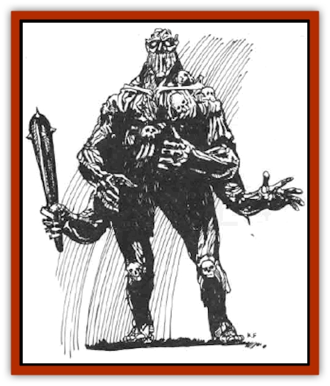

# Thassaloss

| Statistic | **Greater** | **Lesser** |
| --- | --- | --- |
| **Activity Cycle:** | Any | Any |
| **Alignment:** | Neutral Evil | Neutral (Evil) |
| **Armor Class:** | Base 0 | Base 2 |
| **Climate/Terrain:** | Any | Any |
| **Damage/Attack:** | 1d8+4 (&times;4) | 1d6+1 (&times;4) |
| **Diet:** | Nil | Nil |
| **Frequency:** | Very rare | Very rare |
| **Hit Dice:** | 10+20 | 6 |
| **Intelligence:** | Average (8) | Non- (0) |
| **Magic Resistance:** | 25% | 5% |
| **Morale:** | Fearless (19-20) | Fearless (19-20) |
| **Movement:** | 9 | 6 |
| **No. Appearing:** | 1 | 1 |
| **No. of Attacks:** | 4 | 4 |
| **Organization:** | Solitary | Solitary |
| **Size:** | M (7') | M (6') |
| **Special Attacks:** | Feebleminding | Paralyzation |
| **Special Defenses:** | See below | See below |
| **THAC0:** | 9 | 15 |
| **Treasure:** | Nil | Nil |
| **XP Value:** | 9,000 | 2,000 |

The thassaloss is a four-armed, [[Golem_General_Information|golem]]like automaton made of bone by priests of luz. The greater and lesser forms have a major difference, that of sentience (possessed only by the greater form). Both forms look alike and share many special defenses; both may sometimes use weapons rather than their claws (especially for the lesser thassaloss). The thassaloss usually has a blackened appearance created by Iuz's priests, and from the eye sockets, a sickly emerald glow emanates.

## Greater Thassaloss

**Combat:** The greater thassaloss is semi-sentient. It can follow instructions with some degree of flexibility and cunning, and is able to improvise solutions to problems. However, it is not capable of formulating its own motivations and goals, and is not truly intelligent (use its intelligence rating for situations in which an problem-solving situation faces the creature).

A greater thassaloss fights with its taloned claws or with weapons. It is emotionless in combat, but it can obey fairly sophisticated combat orders (being able to comprehend precise instructions as to when to break off combat, to return from combat, when to pursue and not to pursue, etc.) The greater thassaloss has an effective Strength of 18/76 for purposes of lifting, throwing, and breaking down doors and barriers.

The greater thassaloss has one special attack of deadly effect: once per round, up to a maximum range of 10 yards, it can direct its gaze at one enemy (in addition to melee attack routine). If that enemy fails to save versus spell, it is affected as if by a *feeblemind* spell (the usual modifiers apply) for 2d10 turns. A greater thassaloss has the intelligence to attack other enemies within melee range, leaving such a *feebleminded* target for later disposal while it sees to more immediate threats. The greater thassaloss is also intelligent enough to direct this attack against spellcasters in order to negate the danger of their attacks.

A greater thassaloss is immune to all illusions and mind-affecting spells (*charm*, *hypnotism*, *magic jar*, etc.), and also to *hold* and *sleep* spells. It cannot he poisoned or paralyzed, and it is immune to gaseous attacks. It suffers half or quarter damage from cold-based attacks (due to saving throw), and only half normal damage from edged weapons of all kinds, save for hewing weapons such as axes. A greater thassaloss that has its head severed (e.g., by a *vorpal sword*) cannot use its gaze attack, and its intelligence is reduced tn 0, but it can still fight as an automaton.

**Habitat/Society:** The greater thassaloss is an artificial creation under the control of its creator (a senior priest of Iuz), although it is capable of some independent decision-implementation strategy. It has no society and is associated with no habitat. Iuz's priests use these creations to guard major treasures and unholy places, and also for marauding forays into foreign lands (especially into the Vesve Forest). The greater thassaloss is sometimes used to parade through conquered towns and cities to terrify the local populace into submission. It makes a better servant than most golems because of its cunning and the fact that there is no chance of it escaping the control of its creator, unlike other golems.

**Ecology:** The greater thassaloss plays no role in any natural ecology. It does not eat or sleep, and "lives" until destroyed, usually in combat.

## Lesser Thassaloss

The lesser thassaloss is physically similar to the greater, although it is usually slightly smaller. It is equipped with weaponry more often than the larger creation.

**Combat:** The lesser thassaloss usually attacks with two weapons in addition to its talons, or four weapons instead of its talons. Its gaze weapon *paralyzes* one enemy within 10 yards (saving throw versus spell to avoid) for 2d4 rounds. The lesser thassaloss has no intelligence, however, and will attack melee opponents randomly unless commanded tn do otherwise. Its special defenses are the same as those of the greater thassaloss. Finally, it has an effective Strength of 17 for the purposes of lifting, bending bars, etc.

**Habitat/Society:** Identical to that of the greater thassaloss except for its lack of intelligence. The lesser thassaloss is most often used as a guard for less important treasures and locations.

**Ecology:** Identical to that of the greater thassaloss.

---
## Discovery & Documentation

**Source Publication:** From the Ashes (1992)
**Campaign Setting:** Greyhawk
**Author(s):** Carl Sargent

### Other Creatures Found in This Source Book
   * [[Animus|Animus]]
   * [[Dwarf_Derro|Dwarf, Derro]]
   * [[Losel|Losel]]
   * [[Lyrannikin|Lyrannikin]]
   * [[Varrangoin|Varrangoin]]
