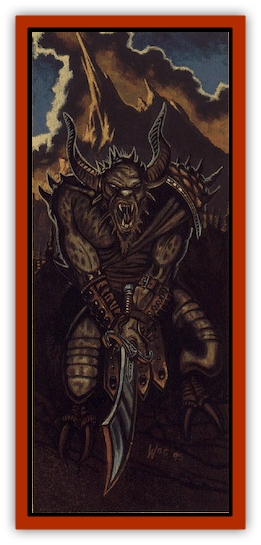

# The Gorgon

| Statistic | **The Gorgon** |
| --- | --- |
| **Activity Cycle:** | Any |
| **Alignment:** | Lawful evil |
| **Armor Class:** | 0 (base); -10 in armor |
| **Blood:** | True (Azrai): 100+ |
| **Blood Abilities:** | Alertness (minor), Bloodform (great), Divine aura (great), Heightened ability (great), Long life (great), Poison sense (minor), Regeneration-Std & Major (great) |
| **Climate/Terrain:** | The Gorgon's Crown/Anuire |
| **Damage/Attack:** | 1d8 (fist) or by weapon; +8 Strength bonus. |
| **Diet:** | Carnivorous |
| **Frequency:** | Unique |
| **Hit Points:** | 170 |
| **Intelligence:** | Supra-genius (19) |
| **Magic Resistance:** | 40% |
| **Morale:** | Fearless (20) |
| **Movement:** | 9 |
| **No. Appearing:** | 1 |
| **No. of Attacks:** | 2 (fists); 5/2 (specialized weapon); 2/1 (ordinary weapon) |
| **Organization:** | Solitary/Regent |
| **Size:** | L (10' ) |
| **Special Attacks:** | Kick, gaze attack, weapon specialization |
| **Special Defenses:** | +2 or better weapon to hit, immune to gaze attacks |
| **THAC0:** | -4 (base) * ; 8 (Strength plus spec.) |
| **Treasure:** | Domain Treasure (over 100 GB) |
| **XP Value:** | 32,000 |

The Gorgon began life as Raesene, the oldest child of his father, the Lord of the First House of the Andu. From an early age, it seemed clear that he would help to shape the future of Cerilia. However, as a bastard child, the glory a nd attention went to his two legitimate half-brothers, Haelyn and Roele. Though his outward demeanor never betrayed him, Raesene envied them this attention and coveted it.

Nonetheless, he taught them what he knew of swordplay and horsemanship, and his tutoring gave them an excellent grasp of the fundamentals of warfare- fundamentals that would prepare them well and earn them praise. Raesene did not remain their teacher for long; as a man seven years Roele's senior, he hungered to see the world. On his sixteenth birthday, he left home to explore Cerilia.

When be returned, battle-hardened and scarred, his father gave him the title "the Black Prince" to reflect the bleakness inside Raesene. Still, Raesene served his father nobly, as well as bis brother Roele when the Lord Andu passed away. But none could guess what lay in nis heart.

Then Azrai came to Cerilia, He studied Raesene and saw the kind of heart that bis lieutenant would need, so the two made a pact. While Haelyn and Roele gathered the armies of the Andu, Raesene began his betrayal, drawing aside conspirators to aid him in his plan. As the Andu retreated to Deismaar, Raesene sprang his betrayal. His loyal followers slaughtered thousands of the Andu and their allies, then joined the armies of Azrai. The rest, as they say, is history.

Raesene was in the height of battle with Roele when the gods destroyed themselves atop Deismaar. Raesene absorbed much of Azrai's essence-nearly as much as the Vos Kriesha and Belinik did. Raesene was the first to discover bloodtheft, and later the first of the awnsbegh to discover that the abominations could grow more powerful through the rule of land.

Not long after Deismaar, he estabJjshed his kingdom north of Anuire and began bis generational harvest of the new bloodlines. He had spent many of the years since Deismaar cultivating and then destroying bloodlines, as well as raising army after army to sweep across Anuire. No one could know Raesene's mind, and those who have tried to learn have been destroyed, as are those who try to challenge him.

Though it has been said that the Gorgon (as be came to be called) stole the bloodline of Roele when he slew Michael Roele, this is not known to be true. Some regents of Anuire have whispered that Michael somehow managed to foil the Gorgon, sapping his strength, thus preventing the Gorgon from dominating Anuire.

The Gorgon most recently appears as a stony skinned humanoid with horns atop his massive head. Hooves and goatlike legs adorn his lower half, and giantish strength allows him to carry his heavy frame. Little trace of humanity is revealed in his features; he has become almost entirely a creature of evil.

Some say that Daen Roesone, the founder of modem Roesone, is distantly descended from this most fearsome of awnshegblein.

**Combat:** The Gorgon was an excellent warrior as a human, skilled with most weapons and specialized in a few. Now, with a thousand and more years of practice, he has become specialized with nearly every weapon found in Cerilia. The DM must decide which few weapons the Gorgon has *not* specialized in.

As if his physical prowess were not enough, the Gorgon also has a potent gaze attack, effective to a range of 60 feet, which he can activate at will. By taking one round to concentrate on an opponent, he can either tum the opponent to stone or cause him to fall dead. The first application is allowed a saving throw vs. petrification with a -2 penalty, while the second requires a save vs. death magic. If a victim meets the Gorgon's gaze, he suffers an additional -2 penalty. If the victim is within 10 feet of the Gorgon, the save suffers another -2 penalty.

The Gorgon's legs can deliver a powerful kick to those foolish enough to stand behind him. He can deliver this attack while making an ordinary attack with a weapon, although his AC decreases by 2 points for that round. The kick causes 2d6 damage.

His defenses are as formidable as his offense. His stony skin gives him a base AC of 0. His giant-sized suit of *plate mail +5* (called Kingstopper), his *shield +5* (called A Gentle Word), and his magic resistance make him nearly invulnerable. In addition, he can be hit only by weapons of +2 or greater enchantment.

**Habitat/Society:** The Gorgon rules a huge expanse of land northeast of Anuire called the Gorgon's Crown. He also controls a goblin kingdom and the neighboring dwarves. A few decades ago, his hordes overran the Brecht realm of Kiergard, devastating it and leaving it desolate.

The Gorgon's Crown is a wasteland of mountains, valleys, and sheer cliffs that rain boulders down on the heads of unwary travelers. At the center of this land is a forest of pines that stays green no matter how noisome the fumes from the nearby volcanoes, and that stays firmly planted despite mild earthquakes that occasionally rock the region.

At the center of this pine forest sits Kal-Saitharak, the Gorgon's castle. From here he commands his hordes; from here, death wings forth to sweep across the lands of Anuire. The castle, made of black obsidian, is a mammoth affair, with towers rising into the clouds and dungeons extending deep into the heart of the earth. The throne room of the Gorgon is well appointed, with several tigbmaevril weapons hanging within easy reach of the throne. Rumors tell (although this is impossible to verify) that the Sword of the Anuirean Empire hangs among them.

The Gorgon has ordered some of the mercenaries who serve him to kidnap miners and smelters, so that the iron mined in the Crown can be smelted into weapons. The lurid glow of these smelters mixes into the hazy air that constantly hangs over the Gorgon's Crown.

**Ecology:** As a singular creature, the Gorgon does not have a niche in the ecology, and no one knows what sort of uses might be derived from his hide. It is known that the creature is becoming more and more stony as the years pass, reflecting the granite hardness of his heart. Perhaps one day he will become a statue entirely, and thus remove this potent menace from Anuire.

---
## Discovery & Documentation

**Source Publication:** Birthright Campaign Setting Box Set (1995)
**Campaign Setting:** Birthright
**Author(s):** L. Richard Baker III, Colin McComb, Walter Velez, Tony Szczudlo, William O'Connor, Eric Hotz, Carrie Bebris, Roger E. Moore, Sue Weinlein, Peggy Cooper

### Other Creatures Found in This Source Book
   * [[Dragon_Cerilia|Dragon (Cerilia)]]
   * [[Giant_Cerilia|Giant (Cerilia)]]
   * [[Goblin_Cerilia|Goblin (Cerilia)]]
   * [[Orog_Cerilia|Orog (Cerilia)]]
   * [[Rhuobhe_Manslayer|Rhuobhe Manslayer]]
   * [[The_Seadrake|The Seadrake]]
   * [[The_Spider|The Spider]]
